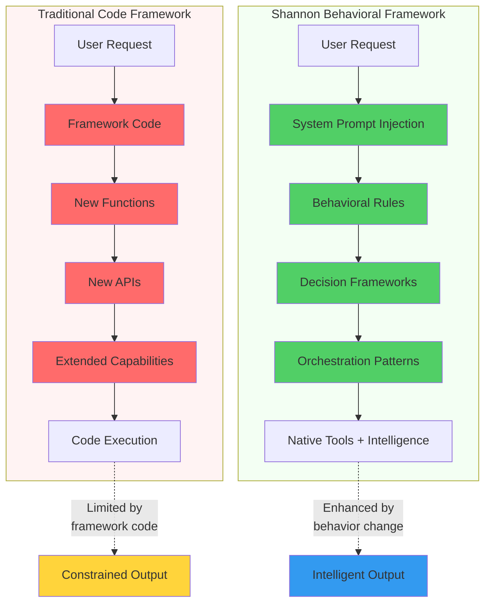
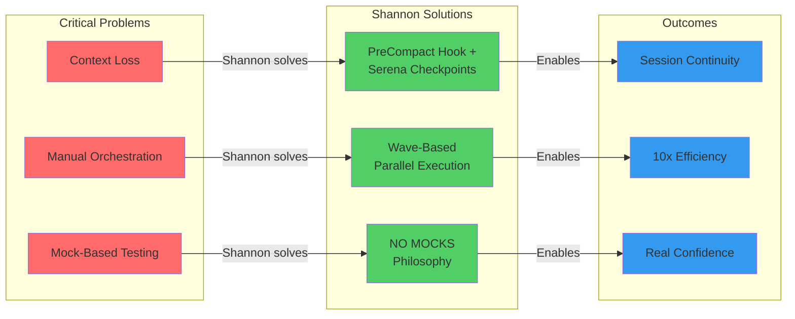
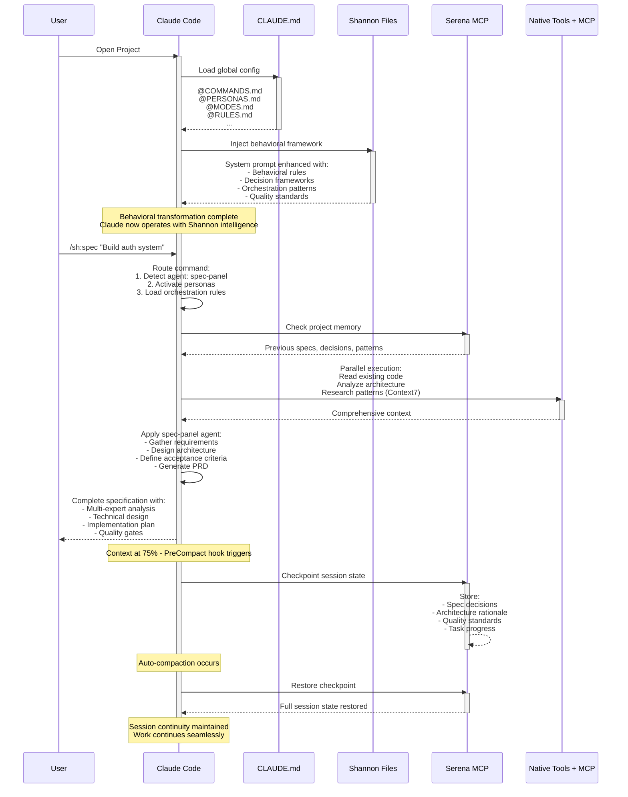

# What Shannon Actually Is

## The Paradigm Shift: Behavioral Programming Through System Prompts

**Shannon is not a code framework. It's a behavioral framework.**

When developers first encounter Shannon, the immediate reaction is often: "Where's the code?" This confusion is understandable—we've been conditioned to believe that frameworks must be implemented in code. But Shannon operates on a fundamentally different principle: **behavioral programming through system prompt injection**.

Here's the key insight: Claude Code already has all the capabilities Shannon needs—parallel tool execution, MCP server orchestration, intelligent reasoning, context management. The bottleneck isn't missing functionality. **The bottleneck is behavior.**

Claude doesn't naturally:
- Batch independent operations in parallel
- Coordinate multiple MCP servers systematically
- Preserve context across auto-compaction events
- Apply domain expertise consistently
- Execute complex multi-stage workflows

Shannon solves this by **changing how Claude thinks**, not by adding new code it can execute.



## System Prompt Injection: The Core Mechanism

Shannon works by **injecting carefully crafted markdown files into Claude's system prompt** when you open a project. These files don't add new capabilities—they modify decision-making, priorities, and execution patterns.

Think of it this way:

**Shannon is to Claude what `.bashrc` is to Bash.**

Your `.bashrc` doesn't add new commands to Bash. It configures behavior: aliases, environment variables, default options, prompt appearance. When you type `ls`, you might actually be running `ls -lah --color=auto` because your `.bashrc` aliased it. The `ls` command hasn't changed—your Bash session's behavior has.

Shannon works identically:
- No new tools or capabilities are added to Claude
- Existing native tools + MCP servers are orchestrated differently
- Decision frameworks guide tool selection and execution patterns
- Context management protocols preserve state across operations
- Behavioral rules ensure consistent quality and approach

### What Gets Injected

When Shannon activates, Claude's system prompt is enhanced with:

1. **COMMANDS.md** - Command execution framework and routing logic
2. **PERSONAS.md** - Domain-specific expertise and decision frameworks
3. **MODES.md** - Operational modes (task management, introspection, token efficiency)
4. **RULES.md** - Behavioral rules and quality standards
5. **PRINCIPLES.md** - Engineering principles and philosophy
6. **ORCHESTRATOR.md** - Intelligent routing and tool selection
7. **MCP.md** - MCP server coordination strategies
8. **Agent Specifications** - Specialized agent behaviors and workflows

These files are **pure behavioral instructions**. They tell Claude:
- How to think about problems
- When to activate specific expertise
- How to coordinate tools optimally
- What quality standards to maintain
- How to preserve context across sessions

### Why Markdown Over Code

Traditional frameworks require implementation in executable code because they're adding new functionality. Shannon doesn't need executable code because **it's not adding functionality—it's optimizing existing intelligence**.

Markdown is the optimal format because:

**1. Natural Language is Claude's Native Interface**
- Code frameworks force Claude to execute logic it didn't design
- Markdown frameworks let Claude understand intent and adapt intelligently
- Claude can reason about "when to parallelize operations" more effectively than executing `if (operations.independent) { parallelize() }`

**2. Behavioral Nuance Requires Context**
- Code is binary: function executes or doesn't
- Markdown provides context, rationale, examples, edge cases
- Claude can make judgment calls that rigid code cannot

**3. Flexibility and Adaptation**
- Code frameworks are brittle: changing behavior requires code changes
- Markdown frameworks are adaptive: Claude interprets based on context
- Same behavioral rule applies differently in different situations

**4. Transparency and Debuggability**
- Code execution is opaque unless you read implementation
- Markdown behavior is explicit and human-readable
- You can see exactly what's influencing Claude's decisions

**5. Evolution Without Breaking Changes**
- Code frameworks require versioning and migration
- Markdown frameworks evolve continuously without breaking
- Adding new behavioral patterns doesn't invalidate existing ones

## A Concrete Example: Parallel Execution

Let's illustrate the difference with a real scenario: editing 5 independent files.

### Traditional Code Framework Approach

```javascript
// framework.js
async function editFiles(files) {
  for (const file of files) {
    await editFile(file);  // Sequential bottleneck
  }
}
```

Claude executes this code. The framework author decided these operations happen sequentially. Claude has no choice—it's locked into the implementation.

### Shannon Behavioral Approach

```markdown
## RULES.md - Tool Optimization

**Priority**: 🟢 RECOMMENDED

- **Parallel Everything**: Execute independent operations in parallel, never sequentially
- **Tool Optimization**: Use MultiEdit for 3+ file changes, parallel Read calls
- **Efficiency First**: Choose speed and power over familiarity

✅ **Right**: Use MultiEdit for 3+ file changes, parallel Read calls
❌ **Wrong**: Sequential Edit calls, bash grep instead of Grep tool
```

Claude **understands** the principle. When faced with 5 independent file edits:
- It recognizes they're independent (no tool can do that through code alone)
- It knows parallel execution is the behavioral standard
- It uses MultiEdit tool or parallel Edit operations
- It makes the intelligent choice based on context

The behavioral framework is **smarter** because Claude applies intelligence, not just execution logic.

## Why This Matters

The Shannon approach enables capabilities that code frameworks cannot match:

**1. Contextual Intelligence**
- Shannon doesn't just execute—it **understands**
- Behavioral rules adapt to specific situations
- Claude applies judgment, not just logic

**2. Self-Optimization**
- Claude recognizes optimization opportunities
- Behavioral patterns compound over time
- System gets smarter without code changes

**3. Transparent Decision-Making**
- You see why Claude made choices (introspection mode)
- Behavioral rules are explicit and traceable
- No hidden implementation details

**4. Human-AI Collaboration**
- You can read and understand the behavior
- You can modify behavioral rules directly
- No programming required to customize

**5. Future-Proof Architecture**
- As Claude improves, Shannon benefits automatically
- Behavioral rules leverage increasing intelligence
- No refactoring required for new capabilities

## The "No Code" Confusion Addressed

When developers ask "where's the code?", they're asking the wrong question. The right question is: **"How does this change Claude's behavior?"**

Shannon doesn't need code because:
- **It's not adding features** - it's optimizing existing capabilities
- **It's not executing logic** - it's guiding intelligent decisions
- **It's not implementing algorithms** - it's establishing behavioral patterns

The power isn't in code execution. **The power is in behavioral transformation.**

Think about the best engineering teams you've worked with. What made them effective wasn't that they had proprietary tools. It was that they had:
- Shared principles and values
- Consistent practices and patterns
- Clear communication and coordination
- Domain expertise and judgment

Shannon provides these same advantages to Claude. Not through code, but through **behavioral programming**.

## The Mental Model Shift

Traditional Framework Thinking:
```
Problem → Write code → Add functionality → Execute logic → Get result
```

Shannon Thinking:
```
Problem → Define behavior → Guide intelligence → Orchestrate existing tools → Get optimized result
```

In traditional frameworks, **you're constrained by what the code implements**.

In Shannon, **Claude is empowered by behavioral guidance to use its full intelligence**.

The paradigm shift is this: **Stop trying to control execution. Start guiding intelligence.**

Shannon is the first framework designed for the AI-native era, where **behavioral programming > imperative programming** for intelligent systems.

---

# The Problems Shannon Solves

Shannon addresses three fundamental problems that plague AI-assisted development workflows. These aren't theoretical issues—they're daily frustrations that kill productivity and create false confidence.



## Problem 1: Context Loss (The Session Continuity Crisis)

### The Problem

Claude Code implements automatic context compaction when approaching token limits. This is necessary for performance, but it creates a critical problem: **session state evaporates**.

Here's what happens:

**Scenario**: You're deep into a complex refactoring session:
- 45 minutes of work analyzing a legacy codebase
- You've built up understanding of architectural patterns
- Claude knows which files are critical, which are legacy, which are risky
- You've established coding standards and quality gates for this specific task
- TodoList has 12 tasks, 7 completed, 5 in progress

**Then auto-compaction triggers.**

Claude's context window hits 80% capacity. Auto-compaction runs. The conversation is summarized to free up tokens.

**What gets lost**:
- Task progress and todo state
- Architectural understanding built over 45 minutes
- Quality standards established for this session
- File criticality assessments
- Risk awareness for specific modules
- The mental model of what you're trying to achieve

**What survives**:
- A generic summary: "User is refactoring authentication system"
- Recent messages (but not the reasoning behind them)
- No actionable state

You continue the conversation, but Claude is now **partially amnesiac**. It doesn't remember:
- Which architectural decisions were already made
- Why certain approaches were rejected
- What quality standards were established
- Which files have hidden dependencies
- What the overall plan was

**The result**: You waste 20 minutes re-establishing context, or worse—Claude makes decisions inconsistent with earlier work.

### The Shannon Solution: PreCompact Hook + Serena Checkpoints

Shannon implements a **PreCompact hook** that triggers BEFORE auto-compaction occurs. This hook:

1. **Detects Impending Compaction**
   - Monitors context usage in real-time
   - Triggers at 75% capacity (before emergency compaction)
   - Provides time for graceful checkpoint creation

2. **Captures Critical Session State**
   - Current task list and completion status
   - Architectural decisions and rationale
   - Quality standards and constraints
   - File criticality and risk assessments
   - Established patterns and conventions
   - The "why" behind choices, not just the "what"

3. **Persists to Serena MCP**
   - Serena provides project-level memory across sessions
   - Structured checkpoint format optimized for retrieval
   - Semantic indexing for intelligent context restoration
   - Genealogy tracking for decision evolution

4. **Restoration Protocol**
   - Post-compaction: Serena checkpoint is automatically restored
   - Context rebuilt with full reasoning chains intact
   - Task state and progress preserved exactly
   - Architectural understanding maintained

**Real Example**:

```
[Context at 75%]
Shannon PreCompact Hook triggers:

1. Capture session state:
   - "Refactoring auth system: passport.js → modern JWT"
   - "Architectural decision: Keep Express middleware pattern for compatibility"
   - "Quality gate: All auth changes require integration tests"
   - "Risk assessment: session.js has undocumented Redis dependency"
   - "TodoList: 7/12 completed, currently implementing token refresh"

2. Persist to Serena:
   - Checkpoint ID: refactor_auth_20250930_143022
   - Session context: [structured state above]
   - Decision genealogy: [why JWT over OAuth, why middleware pattern]

3. Auto-compaction occurs (conversation summarized)

4. Restoration:
   - Serena checkpoint restored automatically
   - Claude remembers: architectural decisions, quality standards, risks, progress
   - Work continues seamlessly with full context
```

**The Difference**:

Without Shannon:
- 45 minutes of context → compaction → 5 minutes of generic summary
- State loss: 90%+
- Recovery time: 15-20 minutes of re-explanation

With Shannon:
- 45 minutes of context → PreCompact checkpoint → compaction → restoration
- State loss: <5%
- Recovery time: <30 seconds (automatic)

**Why This Matters**:

Context loss isn't just annoying—it's **dangerous**. When Claude loses architectural understanding:
- Inconsistent decisions get made
- Established quality standards get violated
- Risky code patterns get reintroduced
- You don't notice until something breaks

Shannon's PreCompact hook + Serena checkpoints ensure **session continuity** even through context limitations.

## Problem 2: Manual Orchestration (The Sequential Bottleneck)

### The Problem

Claude Code has powerful capabilities: native tools, MCP servers, parallel execution support. But by default, **it operates sequentially** unless you explicitly instruct otherwise.

**Real Scenario**: Analyzing a 50-file codebase for security vulnerabilities.

**Default Claude behavior**:
```
1. Read file1.js → analyze
2. Read file2.js → analyze
3. Read file3.js → analyze
...
50. Read file50.js → analyze
51. Synthesize findings
```

**Time**: 15-20 minutes
**Efficiency**: 5-10% (only 1 operation active at a time)

**What you want**:
```
1. Read [file1.js, file2.js, file3.js, file4.js, file5.js] in parallel
2. Read [file6.js, file7.js, file8.js, file9.js, file10.js] in parallel
...
10. Analyze all results in parallel where possible
11. Synthesize findings
```

**Time**: 2-3 minutes
**Efficiency**: 80-90% (5-10 parallel operations)

But achieving this requires **manual orchestration**:
- "Please read these files in parallel"
- "Batch these operations"
- "Use parallel tool calls for independent tasks"

**And you have to say this every time.** Claude doesn't learn this pattern. Every new task starts sequential by default.

### The Shannon Solution: Wave-Based Parallel Execution

Shannon implements **Wave Orchestration** — a behavioral framework that automatically detects parallelization opportunities and executes operations in intelligent phases ("waves").

**How Waves Work**:

1. **Automatic Complexity Assessment**
   - Shannon analyzes the task for independent operations
   - Scores complexity: simple (0.0-0.3), moderate (0.3-0.7), complex (0.7-1.0)
   - Identifies parallelization opportunities

2. **Wave Planning**
   - Groups independent operations into waves
   - Sequences dependent operations appropriately
   - Optimizes for maximum parallelism while respecting dependencies

3. **Intelligent Execution**
   - Wave 1: All independent initial operations (parallel)
   - Wave 2: Operations dependent on Wave 1 (parallel within wave)
   - Wave N: Final synthesis and validation

4. **Adaptive Coordination**
   - Dynamic wave sizing based on system resources
   - Intelligent batching to avoid overwhelming APIs
   - Automatic fallback to sequential if errors occur

**Real Example: Security Audit**

```
Without Shannon:
/analyze --security @src/

Sequential execution:
1. Read src/auth.js
2. Read src/session.js
3. Read src/api.js
...
50. Read src/utils/crypto.js
51. Security analysis per file
52. Synthesize findings

Time: 18 minutes
```

```
With Shannon:
/analyze --security @src/

Wave orchestration automatically activates:

Wave 1 (Discovery - Parallel):
- Read [5 files in parallel]
- Read [5 files in parallel]
...
- Read [5 files in parallel]

Wave 2 (Analysis - Parallel):
- Security analysis [batch 1: auth files]
- Security analysis [batch 2: API files]
- Security analysis [batch 3: utility files]

Wave 3 (Synthesis - Sequential, depends on Wave 2):
- Aggregate findings
- Identify patterns
- Prioritize vulnerabilities

Wave 4 (Validation - Parallel):
- Cross-reference vulnerabilities
- Verify with Sequential MCP
- Generate remediation plan

Time: 2.5 minutes
Efficiency gain: 7x faster
```

**The Behavioral Difference**:

Shannon doesn't require you to orchestrate manually. It **automatically recognizes**:
- Operations are independent (file reads)
- Parallelization is safe and beneficial
- Optimal wave structure for this task
- When to sequence (synthesis depends on analysis)

**Wave Triggers**:

Shannon activates waves when:
- Complexity score ≥ 0.7
- File count > 20
- Multiple operation types detected (read, analyze, validate)
- Multi-domain operations (frontend + backend + database)

**Manual Override**:
```bash
# Force single-pass execution
/analyze --security @src/ --single-wave

# Force wave mode even for simple tasks
/analyze --security @src/ --wave-mode

# Custom wave configuration
/analyze --security @src/ --wave-count 3 --wave-threshold 0.5
```

**Why This Matters**:

Manual orchestration is:
- **Tedious**: You shouldn't have to micromanage parallelization
- **Error-prone**: Easy to forget to parallelize, wasting time
- **Inconsistent**: Different users get different performance
- **Bottlenecked**: Sequential execution is 5-10x slower

Wave-based execution is:
- **Automatic**: Shannon handles orchestration
- **Intelligent**: Adapts to task complexity
- **Consistent**: Every user gets optimal performance
- **Fast**: 5-10x efficiency gains are standard

The difference between **"Please parallelize these operations"** (manual) and **operations just execute optimally** (Shannon) is the difference between driving manual and automatic transmission. Shannon shifts gears for you.

## Problem 3: Mock-Based Testing (The False Confidence Trap)

### The Problem

AI-assisted development has made it trivially easy to generate tests. Claude can write comprehensive test suites in seconds. **But there's a dangerous pattern**: mock-heavy testing.

**Real Scenario**: You ask Claude to "add tests for the authentication flow."

**What Claude generates** (without Shannon):

```javascript
// auth.test.js
describe('Authentication', () => {
  it('should authenticate user with valid credentials', async () => {
    const mockUser = { id: 1, email: 'test@example.com' };
    const mockToken = 'mock-jwt-token';

    // Mock database
    db.findUser = jest.fn().mockResolvedValue(mockUser);

    // Mock JWT
    jwt.sign = jest.fn().mockReturnValue(mockToken);

    // Mock bcrypt
    bcrypt.compare = jest.fn().mockResolvedValue(true);

    const result = await authService.login('test@example.com', 'password');

    expect(result.token).toBe(mockToken);
    expect(db.findUser).toHaveBeenCalledWith('test@example.com');
  });
});
```

**What just happened**:
- Database interaction: **mocked**
- JWT generation: **mocked**
- Password hashing: **mocked**
- Actual authentication flow: **never executed**

**The test passes.** ✅

But what did it actually test?
- That mocks return what you told them to return
- That function calls happen in the right order
- **Nothing about whether authentication actually works**

**This creates false confidence**:
- Tests are green ✅
- Coverage is 90%+ ✅
- CI/CD passes ✅
- **Production breaks** ❌

**Real bugs this misses**:
- Database query has SQL syntax error
- JWT secret is misconfigured
- Bcrypt rounds setting is wrong
- Password comparison logic is inverted
- Session management doesn't persist
- Token refresh flow is broken

**Why this happens**: Mocking is easy. Real integration is hard. Claude defaults to the path of least resistance unless guided otherwise.

### The Shannon Solution: NO MOCKS Philosophy

Shannon implements a **strict behavioral rule**: **NO MOCKS for integration testing.**

**The Rule** (from RULES.md):

```markdown
## Failure Investigation
**Priority**: 🔴 CRITICAL

- **Never Skip Tests**: Never disable, comment out, or skip tests to achieve results
- **Never Skip Validation**: Never bypass quality checks or validation to make things work
- **Fix Don't Workaround**: Address underlying issues, not just symptoms
- **Quality Integrity**: Never compromise system integrity to achieve short-term results

❌ **Wrong**: Mock database, JWT, external services for integration tests
❌ **Wrong**: Comment out failing test to make build pass
✅ **Right**: Use real test database, real services, real browsers
✅ **Right**: Fix the actual bug causing test failure
```

**What This Means in Practice**:

**For Backend Testing**:
- Use **real test databases** (Docker containers, test instances)
- Use **real authentication flows** (test JWT secrets, real bcrypt)
- Use **real API calls** (test endpoints, real HTTP)
- Mock only **external third-party services** you don't control

**For Frontend Testing**:
- Use **real browsers** via Playwright MCP
- Use **real user interactions** (clicks, form fills, navigation)
- Use **real DOM rendering** (not JSDOM or shallow rendering)
- Test **actual user journeys**, not component isolation

**For API Testing**:
- Use **real HTTP requests** (not mocked fetch)
- Use **real response parsing** (not mocked JSON)
- Use **real error handling** (trigger actual errors)
- Test **actual network conditions** (timeouts, retries)

**Real Example: Shannon-Guided Test Generation**

```
User: "Add tests for authentication"

Shannon-guided Claude generates:

// auth.integration.test.js
describe('Authentication Integration', () => {
  let testDb;
  let testServer;

  beforeAll(async () => {
    // Real test database
    testDb = await createTestDatabase();
    testServer = await startTestServer();
  });

  afterAll(async () => {
    await cleanupTestDatabase(testDb);
    await stopTestServer(testServer);
  });

  it('should authenticate user with valid credentials', async () => {
    // Real user in test database
    await testDb.users.create({
      email: 'test@example.com',
      passwordHash: await bcrypt.hash('password', 10)  // Real bcrypt
    });

    // Real HTTP request
    const response = await fetch(`${testServer.url}/auth/login`, {
      method: 'POST',
      headers: { 'Content-Type': 'application/json' },
      body: JSON.stringify({
        email: 'test@example.com',
        password: 'password'
      })
    });

    // Real validation
    expect(response.status).toBe(200);
    const data = await response.json();
    expect(data.token).toBeDefined();

    // Verify real token works
    const verifyResponse = await fetch(`${testServer.url}/auth/verify`, {
      headers: { 'Authorization': `Bearer ${data.token}` }
    });
    expect(verifyResponse.status).toBe(200);
  });

  it('should reject invalid credentials', async () => {
    const response = await fetch(`${testServer.url}/auth/login`, {
      method: 'POST',
      headers: { 'Content-Type': 'application/json' },
      body: JSON.stringify({
        email: 'test@example.com',
        password: 'wrong-password'
      })
    });

    expect(response.status).toBe(401);
  });
});
```

**The Difference**:

| Aspect | Mock-Based | Shannon (NO MOCKS) |
|--------|-----------|-------------------|
| Database | Mocked | Real test DB |
| HTTP | Mocked fetch | Real requests |
| Auth | Mocked JWT | Real token generation |
| Validation | Mock returns | Real response parsing |
| Bugs Caught | Function calls only | Integration bugs, config errors, real failures |
| Confidence | False (mocks ≠ reality) | Real (tests ≠ production but close) |
| Maintenance | Brittle (mocks break on refactor) | Resilient (real integration tested) |

**For UI Testing via Playwright**:

Shannon enforces real browser testing:

```javascript
// button.playwright.test.js
test('login button triggers authentication', async ({ page }) => {
  // Real browser navigation
  await page.goto('http://localhost:3000/login');

  // Real user interaction
  await page.fill('input[name="email"]', 'test@example.com');
  await page.fill('input[name="password"]', 'password');
  await page.click('button[type="submit"]');

  // Real DOM validation
  await expect(page.locator('.dashboard')).toBeVisible();

  // Real screenshot for visual regression
  await page.screenshot({ path: 'login-success.png' });
});
```

**No mocking**:
- Real browser rendering
- Real click events
- Real form submission
- Real navigation
- Real visual validation

**Why This Matters**:

Mock-based testing creates **false confidence**:
- Tests pass but code is broken
- Integration bugs slip through
- Production failures come as surprises

NO MOCKS philosophy creates **real confidence**:
- If tests pass, integration actually works
- Real bugs are caught in CI/CD
- Production failures are rare

**The Shannon Behavioral Enforcement**:

Shannon doesn't just suggest avoiding mocks—it **enforces it behaviorally**:

1. **Quality Gate Integration**: Mock detection in test generation
2. **Validation Cycle**: Tests must demonstrate real integration
3. **Playwright MCP Preference**: Default to real browser testing for UI
4. **Docker Integration**: Auto-suggest test database containers
5. **Failure Investigation**: Never mock to make tests pass

**When Mocks Are Acceptable**:

Shannon allows mocks only for:
- **External third-party services** you don't control (Stripe API, SendGrid)
- **Truly non-deterministic behavior** (random number generation for specific tests)
- **Unit tests for pure functions** (but integration tests are required too)

**The Result**:

Tests that give you **real confidence** because they test **real integrations** against **real systems** using **real interactions**.

When Shannon-guided tests pass, you know your code actually works. When mock-based tests pass, you know your mocks work. There's a profound difference.

---

# How Shannon Works

Shannon's architecture is elegantly simple: **system prompt injection orchestrates intelligent behavior through markdown-based programming.** Understanding how this works requires seeing the complete flow from project initialization through command execution to context preservation.



## The Injection Architecture: From Project Open to Behavioral Transformation

### Stage 1: Project Initialization

When you open a Shannon-enabled project in Claude Code:

**1. Claude Code Startup**
```
1. Claude Code launches
2. Scans for configuration files
3. Discovers ~/.claude/CLAUDE.md (global config)
4. Discovers .claude/CLAUDE.md (project-specific config, if present)
```

**2. CLAUDE.md Entry Point**

The `CLAUDE.md` file acts as the **framework manifest**:

```markdown
# SuperClaude Entry Point
@COMMANDS.md
@FLAGS.md
@PRINCIPLES.md
@RULES.md
@MCP.md
@PERSONAS.md
@ORCHESTRATOR.md
@MODES.md

# Agent Specifications
@AGENT_spec_panel.md
@AGENT_deep_research.md
...
```

This `@include` syntax tells Claude Code: **"Inject these files into my system prompt."**

**3. System Prompt Enhancement**

Claude Code processes the includes and **injects the content** into Claude's system prompt. This happens **before any user interaction**.

The result: Claude's system prompt now contains:
- ~50,000 tokens of behavioral programming
- Command execution frameworks
- Persona decision trees
- Orchestration patterns
- Quality standards
- Agent specifications

**4. Behavioral Transformation Complete**

At this point, Claude is no longer "vanilla Claude Code." It's **Shannon-enhanced Claude**:
- Parallel execution is default behavior
- Domain expertise activates contextually
- Quality gates are enforced automatically
- Context preservation protocols are active
- MCP servers are coordinated intelligently

All of this happens **silently and automatically** when you open the project.

### Stage 2: Command Execution Flow

Let's trace what happens when you type `/sh:spec "Build authentication system"`:

**Step 1: Command Recognition**

```
User input: /sh:spec "Build authentication system"

Shannon's COMMANDS.md routing:
1. Prefix /sh: → Shannon command namespace
2. Command :spec → spec-panel agent
3. Argument: "Build authentication system"
```

**Step 2: Agent Activation**

Shannon routes to `AGENT_spec_panel.md`:

```markdown
# Spec Panel Agent

## Purpose
Multi-expert specification development with structured requirements gathering and PRD generation.

## Activation Triggers
- `/sh:spec` command
- Specification request keywords
- PRD development needs

## Behavioral Rules
- Socratic requirements discovery
- Multi-expert validation (architect, frontend, backend, QA)
- Parallel research (Context7 for patterns, Serena for history)
- Structured output (PRD format with acceptance criteria)

## Execution Flow
1. Requirements Discovery → Parallel
2. Architecture Design → Sequential (depends on requirements)
3. Expert Validation → Parallel (each expert reviews independently)
4. PRD Generation → Sequential (synthesis)
```

**Step 3: Intelligent Orchestration**

Shannon's ORCHESTRATOR.md determines execution strategy:

```yaml
Task: "Build authentication system"
Complexity: 0.85 (high - security-critical, multi-component)
Domains: [security, backend, frontend]

Orchestration Decision:
- Activate personas: security, backend, architect, frontend
- Enable MCP servers: Context7 (auth patterns), Serena (project history), Sequential (analysis)
- Execution mode: Wave-based (parallel where possible)
- Quality gates: Security review required, integration tests required
```

**Step 4: Persona Coordination**

Multiple personas activate based on the domain:

```markdown
**Security Persona** (from PERSONAS.md):
- Priority: Security > compliance > convenience
- Focus: Threat modeling, vulnerability assessment
- MCP preference: Sequential (analysis), Context7 (security patterns)

**Backend Persona**:
- Priority: Reliability > security > performance
- Focus: API design, data integrity
- MCP preference: Context7 (backend frameworks), Sequential (system analysis)

**Architect Persona**:
- Priority: Maintainability > scalability > short-term gains
- Focus: System design, long-term implications
- MCP preference: Sequential (architecture analysis), Context7 (design patterns)
```

**Step 5: Parallel Tool Execution**

Shannon's behavioral rules enforce parallel execution:

```
Wave 1 (Discovery - Parallel):
- Read existing auth code (if any)
- Search for auth patterns via Context7 MCP
- Check Serena for previous auth decisions
- Analyze project structure for integration points

Wave 2 (Analysis - Parallel):
- Security persona: Threat model creation
- Backend persona: API design
- Architect persona: System integration design
- Frontend persona: UX flow design

Wave 3 (Synthesis - Sequential, depends on Wave 2):
- Combine expert analyses
- Resolve conflicts
- Create unified architecture

Wave 4 (Validation - Parallel):
- Security review of design
- Scalability assessment
- Compliance check
- Generate acceptance criteria
```

**Step 6: Output Generation**

Spec Panel agent generates structured PRD:

```markdown
# Authentication System Specification

## Executive Summary
[Synthesized from all expert perspectives]

## Requirements
**Functional:**
- User registration with email verification
- JWT-based authentication
- Role-based access control
- Password reset flow

**Security (Security Persona):**
- Bcrypt password hashing (12 rounds minimum)
- JWT with 15-minute access tokens, 7-day refresh tokens
- Rate limiting on auth endpoints
- OWASP Top 10 compliance

**Architecture (Architect Persona):**
- Stateless authentication (horizontal scaling)
- Middleware-based authorization
- Separation of concerns (auth service + user service)

## Technical Design
[Backend, Frontend, Database schemas]

## Acceptance Criteria
- [ ] All auth endpoints secured with rate limiting
- [ ] Password complexity enforced (8+ chars, mixed case, numbers)
- [ ] Integration tests cover full auth flow
- [ ] Security audit passes
- [ ] Playwright tests verify UX flow
```

### Stage 3: Context Preservation Protocol

During this entire process, Shannon monitors context usage:

**Context Monitoring**:
```
Session start: 5K tokens
After Wave 1: 25K tokens
After Wave 2: 48K tokens
After Wave 3: 62K tokens
After Wave 4: 78K tokens (75% threshold!)
```

**PreCompact Hook Triggers** (from MODES.md):

```markdown
## Task Management Mode - Context Preservation

### PreCompact Hook Protocol
When context reaches 75%:
1. Detect impending compaction
2. Capture session state:
   - Current task: "Auth system specification"
   - Expert decisions: [security requirements, architecture choices]
   - Quality standards: [OWASP compliance, integration test coverage]
   - Task progress: Spec complete, implementation pending
3. Persist to Serena MCP
4. Tag checkpoint: spec_auth_20250930_143522
```

**Serena Checkpoint Storage**:
```json
{
  "checkpoint_id": "spec_auth_20250930_143522",
  "session_type": "specification_development",
  "context": {
    "task": "Authentication system specification",
    "expert_decisions": {
      "security": "JWT 15min access, 7day refresh, bcrypt 12 rounds",
      "architect": "Stateless design, middleware auth, service separation",
      "backend": "Express.js middleware pattern, Passport.js integration",
      "frontend": "React Context API for auth state, protected routes"
    },
    "quality_standards": [
      "OWASP Top 10 compliance required",
      "Integration tests for full auth flow",
      "Playwright E2E tests for UX",
      "Security audit before production"
    ],
    "artifacts": {
      "prd": "[full PRD content]",
      "threat_model": "[security analysis]",
      "architecture_diagram": "[system design]"
    }
  },
  "genealogy": {
    "previous_auth_decisions": ["checkpoint_auth_legacy_20250815"],
    "related_specs": ["api_spec_20250920", "user_service_20250901"]
  }
}
```

**Auto-Compaction Occurs**:
```
Context compaction triggered at 78% usage.
Conversation summarized to: "User requested authentication system spec. Specification completed with multi-expert validation."

Critical information PRESERVED via Serena checkpoint.
```

**Checkpoint Restoration**:

When you continue the conversation:
```
User: "Now implement the authentication system"

Shannon restoration protocol:
1. Detect continuation of auth work
2. Query Serena for relevant checkpoints
3. Restore spec_auth_20250930_143522
4. Rebuild context:
   - Full specification details
   - Expert decisions and rationale
   - Quality standards and gates
   - Architectural constraints
5. Implementation proceeds with complete context
```

**The Difference**:

Without Shannon:
```
[After compaction]
User: "Now implement authentication"
Claude: "Sure, I can help with authentication. What approach would you like?"
[All specification work lost - have to re-explain everything]
```

With Shannon:
```
[After compaction + restoration]
User: "Now implement authentication"
Claude: "I'll implement the authentication system according to the specification:
- JWT-based auth with 15min access tokens, 7day refresh
- Bcrypt password hashing (12 rounds)
- Express.js middleware pattern
- Following the architecture we designed

Starting with the authentication middleware..."
[Full context preserved - work continues seamlessly]
```

## The Intelligence Stack: How Shannon Amplifies Claude

Shannon doesn't replace Claude's intelligence—it **structures and amplifies** it:

**Layer 1: Native Claude Intelligence**
- Reasoning, code generation, analysis, communication

**Layer 2: Shannon Behavioral Framework** (injected via system prompt)
- Parallel execution patterns
- Domain expertise activation
- Quality standards enforcement
- Orchestration intelligence

**Layer 3: MCP Server Coordination**
- Context7: Documentation and patterns
- Sequential: Complex reasoning
- Serena: Memory and state management
- Playwright: Real browser testing
- Magic: UI generation

**Layer 4: Agent Specialization**
- Spec Panel: Requirements and PRDs
- Deep Research: Multi-source investigation
- Implementation: Code generation with quality
- Testing: Real integration validation

**The Result**: An intelligence stack that delivers **10x productivity** through:
- Automatic parallelization (5-10x speed)
- Context preservation (eliminates 20min re-explanations)
- Real testing (catches bugs before production)
- Expert-level quality (consistent professional standards)

Shannon transforms Claude from a powerful assistant into a **force multiplier** for engineering teams.
