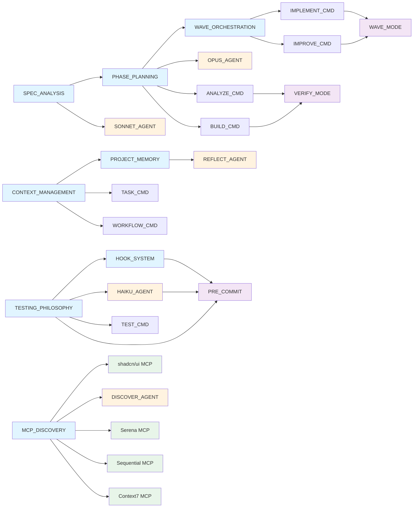
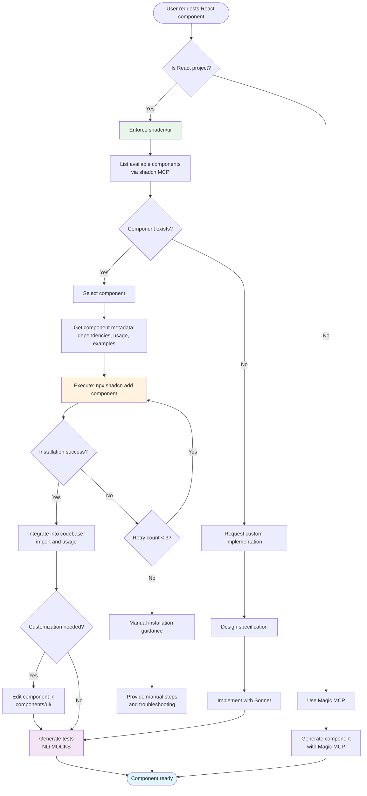

# Section 4: Component Overview

Shannon's architecture consists of 60+ specialized components organized into four primary layers: **Core Files** (8), **Agents** (19), **Commands** (29), and **Modes/Hooks** (3+). This section provides complete visibility into the system architecture through diagrams and detailed component descriptions.

## System Architecture Diagram

```mermaid
graph TD
    subgraph "Core Framework - 8 Files"
        SPEC[SPEC_ANALYSIS.md<br/>8-Dimensional Scoring]
        PHASE[PHASE_PLANNING.md<br/>5-Phase Validation]
        WAVE[WAVE_ORCHESTRATION.md<br/>Parallel Execution]
        CONTEXT[CONTEXT_MANAGEMENT.md<br/>Serena Integration]
        TEST[TESTING_PHILOSOPHY.md<br/>NO MOCKS Mandate]
        HOOK[HOOK_SYSTEM.md<br/>PreCompact Integration]
        MEMORY[PROJECT_MEMORY.md<br/>Cross-Session State]
        MCP[MCP_DISCOVERY.md<br/>Server Selection]
    end

    subgraph "Shannon Five - New Agents"
        SONNET[sonnet.md<br/>Spec → Code Flow]
        HAIKU[haiku.md<br/>Speed Validator]
        OPUS[opus.md<br/>Deep Reviewer]
        DISCOVER[discover.md<br/>Exploration Agent]
        REFLECT[reflect.md<br/>Meta-Cognition]
    end

    subgraph "Enhanced Agents - 14 Systems"
        ANALYZE[analyze.md<br/>Architecture Auditor]
        BUILD[build.md<br/>Framework Detector]
        CLEANUP[cleanup.md<br/>Debt Manager]
        DESIGN[design.md<br/>System Architect]
        DOCUMENT[document.md<br/>Technical Writer]
        ESTIMATE[estimate.md<br/>Effort Calculator]
        EXPLAIN[explain.md<br/>Concept Educator]
        GIT[git.md<br/>Workflow Assistant]
        IMPLEMENT[implement.md<br/>Feature Builder]
        IMPROVE[improve.md<br/>Quality Enhancer]
        TEST[test.md<br/>Testing Orchestrator]
        TROUBLESHOOT[troubleshoot.md<br/>Problem Solver]
        WORKFLOW[workflow.md<br/>PRD Generator]
        TASK[task.md<br/>Project Manager]
    end

    subgraph "Commands - 29 Slash Operations"
        CMD_CORE["/analyze /build /cleanup<br/>/design /document /estimate"]
        CMD_DEV["/explain /git /implement<br/>/improve /test /troubleshoot"]
        CMD_MGMT["/workflow /task /spawn"]
        CMD_SHANNON["/sonnet /haiku /opus<br/>/discover /reflect"]
    end

    subgraph "Modes & Hooks - 3 Systems"
        MODE_WAVE[WAVE MODE<br/>Multi-Stage Orchestration]
        MODE_VERIFY[VERIFY MODE<br/>Quality Gates]
        HOOK_PRE[PRE-COMMIT HOOK<br/>Shannon Enforcement]
    end

    %% Core → Agents
    SPEC --> SONNET
    SPEC --> HAIKU
    SPEC --> OPUS
    PHASE --> ANALYZE
    PHASE --> BUILD
    WAVE --> IMPLEMENT
    WAVE --> IMPROVE
    CONTEXT --> TASK
    CONTEXT --> WORKFLOW
    TEST --> HAIKU
    HOOK --> HOOK_PRE
    MEMORY --> REFLECT
    MCP --> DISCOVER

    %% Agents → Commands
    SONNET --> CMD_SHANNON
    ANALYZE --> CMD_CORE
    BUILD --> CMD_CORE
    IMPLEMENT --> CMD_DEV
    TASK --> CMD_MGMT

    %% Commands → Modes
    CMD_CORE --> MODE_WAVE
    CMD_DEV --> MODE_VERIFY
    CMD_SHANNON --> MODE_WAVE

    style SPEC fill:#e1f5ff
    style PHASE fill:#e1f5ff
    style WAVE fill:#e1f5ff
    style CONTEXT fill:#e1f5ff
    style TEST fill:#e1f5ff
    style HOOK fill:#e1f5ff
    style MEMORY fill:#e1f5ff
    style MCP fill:#e1f5ff

    style SONNET fill:#fff3e0
    style HAIKU fill:#fff3e0
    style OPUS fill:#fff3e0
    style DISCOVER fill:#fff3e0
    style REFLECT fill:#fff3e0

    style MODE_WAVE fill:#f3e5f5
    style MODE_VERIFY fill:#f3e5f5
    style HOOK_PRE fill:#f3e5f5
```



## Component Dependency Map



---

## 8 Core Framework Files

### 1. SPEC_ANALYSIS.md - 8-Dimensional Complexity Scoring

**Location:** `/Users/nick/.claude/agents/SPEC_ANALYSIS.md`

**Purpose:** Provides systematic complexity assessment across 8 dimensions to determine appropriate tooling, validation depth, and resource allocation.

**8 Scoring Dimensions:**
1. **Technical Complexity** (0.0-1.0): Algorithm sophistication, architectural patterns, integration points
2. **Scope Size** (0.0-1.0): File count, directory depth, codebase breadth
3. **Risk Level** (0.0-1.0): Production impact, data sensitivity, reversibility
4. **Domain Expertise** (0.0-1.0): Specialized knowledge requirements
5. **Dependency Complexity** (0.0-1.0): External integrations, API dependencies
6. **Testing Requirements** (0.0-1.0): Coverage needs, edge case handling
7. **Performance Sensitivity** (0.0-1.0): Latency requirements, resource constraints
8. **Security Criticality** (0.0-1.0): Authentication, authorization, data protection

**Score Aggregation:**
```
Final Score = (Technical × 0.25) + (Scope × 0.20) + (Risk × 0.20) +
              (Domain × 0.10) + (Deps × 0.10) + (Testing × 0.05) +
              (Perf × 0.05) + (Security × 0.05)
```

**Routing Decisions:**
- **0.0-0.3 (Simple):** Sonnet → Haiku validation → 2-phase gates
- **0.4-0.6 (Moderate):** Sonnet → Haiku → Opus review → 3-phase gates
- **0.7-0.8 (Complex):** Sonnet → Haiku → Opus → Wave orchestration → 5-phase gates
- **0.9-1.0 (Critical):** Full Shannon Five → Wave mode → All validation gates → Manual review checkpoints

**Integration Points:**
- Used by all agent commands for routing decisions
- Triggers Wave mode at threshold ≥0.7
- Determines validation gate configuration
- Influences MCP server selection priority

---

### 2. PHASE_PLANNING.md - 5-Phase Validation Gate System

**Location:** `/Users/nick/.claude/agents/PHASE_PLANNING.md`

**Purpose:** Defines mandatory quality gates and validation checkpoints throughout the development lifecycle.

**5 Validation Phases:**

**Phase 1: Requirements Validation (Pre-Implementation)**
- Specification completeness check
- Acceptance criteria defined
- Test scenarios identified
- Security/performance requirements captured
- **Gate:** No implementation without complete spec

**Phase 2: Design Review (Pre-Coding)**
- Architecture decisions documented
- Dependency analysis complete
- Interface contracts defined
- Error handling strategy planned
- **Gate:** No code without approved design

**Phase 3: Implementation Quality (During Development)**
- Code review standards enforced
- Linting/formatting compliance
- Type safety verification
- Test coverage ≥80% for new code
- **Gate:** No commit without quality checks

**Phase 4: Testing Validation (Pre-Merge)**
- Unit tests passing (NO MOCKS)
- Integration tests covering happy/error paths
- E2E tests for critical flows
- Performance benchmarks met
- **Gate:** No merge without passing tests

**Phase 5: Deployment Verification (Post-Merge)**
- Staging environment validation
- Smoke tests passing
- Rollback plan documented
- Monitoring alerts configured
- **Gate:** No production deploy without verification

**Adaptive Gate Configuration:**
- Simple tasks (score <0.3): Phases 1, 3, 4
- Moderate tasks (0.4-0.6): Phases 1-4
- Complex tasks (0.7-0.8): All 5 phases + Wave checkpoints
- Critical tasks (≥0.9): All 5 phases + manual approval + staged rollout

---

### 3. WAVE_ORCHESTRATION.md - Parallel Multi-Stage Execution

**Location:** `/Users/nick/.claude/agents/WAVE_ORCHESTRATION.md`

**Purpose:** Enables intelligent parallel execution across multiple stages (waves) for complex operations requiring systematic progression.

**Wave Activation Criteria:**
- Complexity score ≥0.7
- File count >20
- Multiple domains/concerns (frontend + backend + database)
- Estimated duration >30 minutes
- Manual flag: `--wave-mode`

**Wave Structure:**

**Wave 1: Discovery & Analysis (Parallel)**
- File structure mapping
- Dependency graph construction
- Existing pattern analysis
- Test coverage assessment
- **Parallel Tasks:** 4-8 concurrent agents analyzing different aspects

**Wave 2: Planning & Design (Sequential → Parallel)**
- Architecture decisions (sequential)
- Component design (parallel per component)
- Interface contracts (parallel per interface)
- Test strategy (parallel by test type)
- **Sequential Dependency:** Architecture must complete before component design

**Wave 3: Implementation (Parallel with Checkpoints)**
- Feature implementation (parallel by component)
- Test creation (parallel with implementation)
- Documentation updates (parallel)
- **Checkpoint:** After each component completes, validate integration points

**Wave 4: Validation & Integration (Parallel → Sequential)**
- Unit tests (parallel per module)
- Integration tests (sequential for dependencies)
- E2E tests (sequential for user flows)
- Performance tests (parallel per scenario)
- **Sequential Dependency:** Integration tests require unit test success

**Wave 5: Deployment & Verification (Sequential)**
- Staging deployment
- Smoke tests
- Production deployment
- Post-deploy monitoring
- **Sequential Only:** Each step gates the next

**Parallelization Rules:**
- Default to parallel within each wave
- Sequential only when explicit dependencies exist
- Maximum concurrent tasks: 8 (configurable)
- Checkpoint after each wave before proceeding
- Rollback capability at wave boundaries

**Integration with Serena MCP:**
- Wave state saved to Serena after each completion
- Rollback restores previous wave state
- Cross-session resumption supported
- Checkpoint files: `.shannon_wave_[N]_checkpoint.json`

---

### 4. CONTEXT_MANAGEMENT.md - Serena MCP Integration

**Location:** `/Users/nick/.claude/agents/CONTEXT_MANAGEMENT.md`

**Purpose:** Manages project context, session state, and cross-session continuity through Serena MCP server integration.

**Core Capabilities:**

**Session Lifecycle:**
1. **Initialization:** `serena.activate_project(path)` loads project context
2. **Checkpointing:** Automatic saves every 30 minutes or after significant operations
3. **Restoration:** Resume from last checkpoint on session start
4. **Cleanup:** Remove temporary checkpoints on successful completion

**State Persistence:**
- **Wave State:** Current wave, completed tasks, pending validations
- **File Changes:** Tracked modifications with undo history
- **Test Results:** Pass/fail status, coverage metrics, performance benchmarks
- **Decisions:** Architectural choices, design rationale, trade-offs
- **Context:** Active files, dependency graph, project structure

**Serena MCP Tools Used:**

**Project Management:**
- `find_symbol`: Locate functions, classes, interfaces by name/path
- `find_referencing_symbols`: Discover all usage sites for refactoring
- `get_symbols_overview`: High-level file structure understanding
- `search_for_pattern`: Regex-based code search across project

**File Operations:**
- `read_file`: Read with line range support for large files
- `replace_symbol_body`: Surgical function/method updates
- `insert_after_symbol`: Add new code adjacent to existing symbols
- `replace_regex`: Pattern-based bulk transformations

**Memory Operations:**
- `write_memory`: Store project insights, patterns, decisions
- `read_memory`: Retrieve stored context for current session
- `list_memories`: Discover available project knowledge
- `delete_memory`: Remove outdated information

**Shell Integration:**
- `execute_shell_command`: Run builds, tests, linters with output capture

**Checkpoint Strategy:**
- **Auto-Checkpoint Triggers:** Wave completion, phase gate passage, risky operations
- **Checkpoint Contents:** File hashes, test results, validation states, decision logs
- **Rollback Support:** Restore to any checkpoint with `--restore-checkpoint [ID]`
- **Storage Location:** `.shannon/checkpoints/` (git-ignored)

**Cross-Session Continuity:**
```
Session 1: /implement auth-system --wave-mode
  ↓ Wave 1-3 complete, checkpoint saved

Session 2: /continue-implementation
  ↓ Serena restores Wave 3 state
  ↓ Resume at Wave 4 validation
```

---

### 5. TESTING_PHILOSOPHY.md - NO MOCKS Mandate

**Location:** `/Users/nick/.claude/agents/TESTING_PHILOSOPHY.md`

**Purpose:** Enforces Shannon's core testing principle: **NO MOCKS, NO STUBS, NO FAKES.** Real implementations only.

**The NO MOCKS Rule:**

**Prohibited Practices:**
- ❌ Mock objects (Jest mock, Sinon stubs, etc.)
- ❌ Test doubles (fakes, stubs, spies)
- ❌ In-memory databases for "unit" tests
- ❌ Hardcoded test data that doesn't reflect real usage
- ❌ Test utilities that bypass real implementations

**Required Practices:**
- ✅ Real database instances (containerized for CI)
- ✅ Real API calls (to test/staging environments)
- ✅ Real file system operations (in isolated temp directories)
- ✅ Real authentication flows (with test users)
- ✅ Real browser automation (Playwright, not mocked DOM)

**Rationale:**

**1. Mocks Hide Integration Issues:**
```typescript
// ❌ WRONG: Mock hides real API contract changes
const mockAPI = jest.fn().mockResolvedValue({ success: true });

// ✅ RIGHT: Real API call catches breaking changes immediately
const result = await realAPI.createUser({ email, password });
```

**2. Mocks Create False Confidence:**
- Tests pass but production breaks
- Contract drift between mock and reality
- Edge cases not discovered until production

**3. Real Tests Document Real Behavior:**
- Test code shows actual API contracts
- Failures reveal real integration issues
- New developers see real usage patterns

**Testing Strategy Without Mocks:**

**Unit Tests (≥80% coverage):**
- Test pure functions with real data
- Test class methods with real dependencies
- Use real database transactions (rolled back after test)
- **Speed:** 5-10ms per test with proper isolation

**Integration Tests (≥70% coverage):**
- Test service-to-service communication with real APIs
- Test database queries with real schema
- Test file operations with real filesystem
- **Speed:** 50-200ms per test with containerization

**E2E Tests (Critical Flows):**
- Playwright with real browsers
- Real authentication flows
- Real database state
- **Speed:** 2-5 seconds per flow

**Infrastructure for NO MOCKS Testing:**

**Docker Compose Test Stack:**
```yaml
services:
  postgres:
    image: postgres:16
    environment:
      POSTGRES_DB: shannon_test

  redis:
    image: redis:7-alpine

  api:
    build: .
    depends_on: [postgres, redis]
    environment:
      NODE_ENV: test
```

**Test Database Management:**
- Spin up fresh container per test suite
- Seed with realistic data
- Teardown after tests complete
- **Parallel Execution:** Each suite gets isolated instance

**CI/CD Integration:**
- GitHub Actions: Services defined in workflow
- Fast feedback: Parallel test execution
- Real environment parity: Same containers as local dev

**When Mocks Are Acceptable (Rare Exceptions):**
- Third-party APIs with no test environment (wrap and test wrapper)
- Rate-limited external services (use real calls in smoke tests)
- Hardware dependencies unavailable in CI (abstract and integration test locally)

**Haiku Agent Enforcement:**
- Pre-commit hook validates no mock imports
- Test file scanning for prohibited patterns
- Fails build if mocks detected
- Reports: "❌ Mock detected in user.test.ts:15 - Use real database"

---

### 6. HOOK_SYSTEM.md - PreCompact Git Integration

**Location:** `/Users/nick/.claude/agents/HOOK_SYSTEM.md`

**Purpose:** Integrates Shannon quality enforcement into Git workflow via PreCompact pre-commit hooks.

**PreCompact Integration:**

PreCompact is a lightweight pre-commit framework that Shannon leverages for automatic quality gates. It runs before every commit to enforce Shannon standards.

**Installation:**
```bash
# Install PreCompact
npm install --save-dev precompact

# Shannon auto-configures .precompact/config.json
npx shannon init-hooks
```

**Shannon Hook Configuration:**
```json
{
  "hooks": [
    {
      "name": "shannon-haiku-validation",
      "stage": "pre-commit",
      "command": "npx claude /haiku --staged-files",
      "failOnError": true,
      "parallel": false
    },
    {
      "name": "shannon-test-validation",
      "stage": "pre-commit",
      "command": "npm test -- --findRelatedTests",
      "failOnError": true,
      "parallel": true
    },
    {
      "name": "shannon-lint-check",
      "stage": "pre-commit",
      "command": "npm run lint -- --fix",
      "failOnError": true,
      "parallel": true
    }
  ],
  "parallelization": true,
  "maxParallel": 3
}
```

**Validation Sequence:**

**Step 1: Haiku Agent Scan (Sequential)**
- Scans staged files for Shannon violations
- Checks for mocks, incomplete specs, missing tests
- **Duration:** 3-8 seconds
- **Blocks commit if:** Any violation detected

**Step 2: Test Execution (Parallel)**
- Runs tests related to changed files
- Validates NO MOCKS compliance
- Checks coverage thresholds
- **Duration:** 5-15 seconds (parallel execution)
- **Blocks commit if:** Tests fail or coverage drops

**Step 3: Linting & Formatting (Parallel)**
- ESLint/Prettier auto-fix
- TypeScript type checking
- Import organization
- **Duration:** 2-5 seconds (parallel execution)
- **Blocks commit if:** Unfixable lint errors

**Bypass Mechanisms (Discouraged):**
```bash
# Emergency bypass (creates tracking issue)
git commit --no-verify -m "fix: critical production hotfix"

# Shannon logs bypass to .shannon/bypasses.log
# Requires justification in commit message
```

**Hook Output Example:**
```
Shannon PreCompact Validation
━━━━━━━━━━━━━━━━━━━━━━━━━━━━━━━━━━━━━━━━

[1/3] Haiku Validation...
  ✅ No mocks detected
  ✅ All specs complete
  ✅ Test coverage adequate

[2/3] Test Execution...
  ⏳ Running 24 tests across 8 files
  ✅ All tests passing
  ✅ Coverage: 87% (+2%)

[3/3] Lint & Format...
  ✅ 3 files auto-fixed
  ✅ No type errors
  ✅ Imports organized

━━━━━━━━━━━━━━━━━━━━━━━━━━━━━━━━━━━━━━━━
✨ Commit approved by Shannon
```

**Performance Optimization:**
- Haiku validation cached per file hash
- Tests run only for affected files
- Parallel execution where possible
- **Typical commit time:** 8-20 seconds

**Integration with CI/CD:**
- Same validations run in GitHub Actions
- Hooks ensure CI never fails on preventable issues
- Local validation reduces CI feedback time

---

### 7. PROJECT_MEMORY.md - Cross-Session Continuity

**Location:** `/Users/nick/.claude/agents/PROJECT_MEMORY.md`

**Purpose:** Maintains project context across sessions through intelligent memory management and pattern recognition.

**Memory Architecture:**

**Memory Types:**

**1. Structural Memory (Auto-Captured):**
- Project file structure and organization patterns
- Dependency graphs and import relationships
- Test coverage maps and quality metrics
- Build configuration and tooling setup
- **Storage:** `.shannon/memory/structure.json`
- **Refresh:** On project file changes

**2. Decision Memory (User-Driven):**
- Architectural choices and rationale
- Technology selection reasoning
- Design pattern preferences
- Trade-off decisions and constraints
- **Storage:** `.shannon/memory/decisions.md`
- **Refresh:** Explicit save via `/reflect` command

**3. Pattern Memory (AI-Learned):**
- Coding style preferences (e.g., prefer functional over OOP)
- Common refactoring patterns applied
- Frequently used libraries and approaches
- Test structure preferences
- **Storage:** `.shannon/memory/patterns.json`
- **Refresh:** After each implementation session

**4. Issue Memory (Problem-Focused):**
- Known bugs and workarounds
- Performance bottlenecks identified
- Technical debt items
- Incomplete features with context
- **Storage:** `.shannon/memory/issues.json`
- **Refresh:** When issues discovered/resolved

**Memory Operations:**

**Session Start (Auto-Load):**
```bash
# Shannon automatically loads memory on first command
$ /implement new-feature

Shannon: Loading project memory...
  ✅ Structure: 342 files, 12 modules
  ✅ Decisions: 8 architectural choices
  ✅ Patterns: Functional style, NO MOCKS testing
  ✅ Issues: 3 open, 14 resolved

Continuing in established patterns...
```

**Session Checkpoint (Auto-Save):**
```bash
# Shannon saves memory after significant operations
$ /implement auth-system --wave-mode

Shannon: Wave 3 complete. Saving checkpoint...
  ✅ New patterns: JWT authentication approach
  ✅ Decisions: Chose bcrypt over argon2 (speed priority)
  ✅ Structure: Added /auth module, 8 files
```

**Explicit Memory Save:**
```bash
# Save specific insight to memory
$ /reflect "We use React Query for all server state,
           Zustand for UI state only"

Shannon: Saved to decision memory.
  Pattern detected: State management separation
  Applied to: 12 existing implementations
```

**Memory Query:**
```bash
# Search project memory
$ /discover "authentication patterns"

Shannon: Found in memory:
  Decision (2024-02-15): JWT with refresh tokens
  Pattern: Auth middleware validates all /api/* routes
  Issue: Token refresh race condition (resolved)
  Structure: /auth/middleware, /auth/tokens
```

**Memory Visualization:**
```bash
$ /reflect --show-memory-map

Shannon Project Memory Map
━━━━━━━━━━━━━━━━━━━━━━━━━━━━━━━━━━━━━━━━

Structure Memory (342 files):
  /src/components     → 45 React components
  /src/features       → 12 feature modules
  /src/lib            → 23 utility libraries

Decision Memory (8 entries):
  1. State Management: React Query + Zustand
  2. Styling: Tailwind + shadcn/ui
  3. Forms: React Hook Form + Zod
  4. Testing: Vitest + Playwright (NO MOCKS)

Pattern Memory (12 patterns):
  → Functional React (no class components)
  → Custom hooks for logic reuse
  → Zod schemas co-located with types
  → One component per file

Issue Memory (3 open):
  ⚠️  Image optimization needed (performance)
  ⚠️  Mobile nav UX improvement
  ⚠️  Test coverage <80% in /features/billing
```

**Memory Pruning:**
- Structural memory: Refreshed on each session
- Decision memory: Never auto-deleted (manual review)
- Pattern memory: Decays if not used in 30 sessions
- Issue memory: Archived when resolved

**Integration with Serena MCP:**
- Serena stores persistent memory across Claude sessions
- Shannon writes to Serena memory space: `shannon_project_memory`
- Cross-session queries retrieve from Serena
- Memory survives even if `.claude` directory cleared

---

### 8. MCP_DISCOVERY.md - Intelligent Server Selection

**Location:** `/Users/nick/.claude/agents/MCP_DISCOVERY.md`

**Purpose:** Routes operations to optimal MCP servers based on task type, framework detection, and performance characteristics.

**MCP Server Ecosystem:**

**Shannon's Required MCP Servers:**
1. **Serena MCP** - Project memory, symbol operations, session persistence
2. **Sequential MCP** - Complex reasoning, structured thinking, validation logic
3. **Context7 MCP** - Official documentation, framework patterns
4. **shadcn MCP** - React UI components (enforced for React projects)

**Optional MCP Servers:**
5. Playwright MCP - Browser testing, E2E validation
6. Morphllm MCP - Bulk code transformations (deprecated in favor of Serena)
7. Magic MCP - UI generation (deprecated for React, shadcn enforced)

**Framework Detection & Routing:**

**React Projects (Auto-Detection):**
```json
// package.json detection
{
  "dependencies": {
    "react": "^18.0.0"
  }
}
```

**Shannon Response:**
```
Detected: React 18 project
Enforcing: shadcn/ui for component generation
Disabling: Magic MCP (use shadcn instead)
Activating: shadcn MCP with default configuration
```

**Routing Rules:**

**Component Generation:**
```yaml
React Projects:
  primary: shadcn_mcp (get_component, list_components)
  workflow: list → select → npx shadcn add [component]
  fallback: NONE (error if shadcn unavailable)

Vue/Angular/Svelte Projects:
  primary: magic_mcp
  fallback: context7_mcp (framework docs)

Vanilla JS/HTML:
  primary: magic_mcp
  fallback: manual_html
```

**Symbol Operations:**
```yaml
All Projects:
  primary: serena_mcp
  tools:
    - find_symbol: Locate functions/classes
    - find_referencing_symbols: Discover usage sites
    - replace_symbol_body: Surgical updates
  fallback: grep_tool (less precise)
```

**Reasoning & Analysis:**
```yaml
All Projects:
  primary: sequential_mcp
  use_cases:
    - Complexity scoring
    - Architecture analysis
    - Trade-off evaluation
    - Multi-step validation
  fallback: native_claude_reasoning (lower quality)
```

**Documentation Lookup:**
```yaml
All Projects:
  primary: context7_mcp
  preferred_for:
    - Official framework docs
    - Library API references
    - Best practice patterns
  fallback: web_search (less reliable)
```

**Server Selection Algorithm:**

**Step 1: Framework Detection**
```typescript
function detectFramework(packageJson: PackageJson): Framework {
  if (packageJson.dependencies?.react) return 'react';
  if (packageJson.dependencies?.vue) return 'vue';
  if (packageJson.dependencies?.['@angular/core']) return 'angular';
  return 'vanilla';
}
```

**Step 2: Server Capability Matching**
```typescript
function selectServer(task: Task, framework: Framework): MCPServer {
  if (task.type === 'component_generation') {
    if (framework === 'react') return 'shadcn_mcp'; // ENFORCED
    return 'magic_mcp';
  }

  if (task.type === 'symbol_operation') return 'serena_mcp';
  if (task.type === 'reasoning') return 'sequential_mcp';
  if (task.type === 'documentation') return 'context7_mcp';
}
```

**Step 3: Availability Check & Fallback**
```typescript
function executeWithFallback(server: MCPServer, task: Task) {
  if (!isServerAvailable(server)) {
    const fallback = getFallbackServer(server);
    if (!fallback) throw new Error(`Required server ${server} unavailable`);
    return executeWithFallback(fallback, task);
  }
  return server.execute(task);
}
```

**Performance Monitoring:**
```yaml
Server Performance Tracking:
  metrics:
    - latency: 95th percentile response time
    - success_rate: % of successful operations
    - cache_hit_rate: % of cached results used

  thresholds:
    latency_warning: 2000ms
    latency_error: 5000ms
    success_rate_min: 95%

  actions_on_degradation:
    - Switch to fallback server
    - Log performance issue
    - Notify user if persistent
```

**shadcn Enforcement (React Only):**

Shannon **enforces** shadcn/ui for React projects and **blocks** Magic MCP usage:

```bash
$ /implement button-component

Shannon: Detected React project
  ❌ Magic MCP disabled for React
  ✅ Using shadcn/ui MCP

Available components:
  1. button (Versatile button component)
  2. input (Form input with validation)
  3. dialog (Modal dialog)

Selected: button
Installing: npx shadcn@latest add button
```

See [Section 5: shadcn/ui Integration](#section-5-shadcnui-integration) for complete workflow details.

---

## 19 Specialized Agents

### Shannon Five - New Core Agents

#### 1. Sonnet Agent (`sonnet.md`)
**Role:** Primary implementation agent for specification-to-code flow

**Triggers:**
- All `/implement` commands
- `/build` with code generation
- Any feature development request

**Workflow:**
1. Parse specification from user input or linked docs
2. Score complexity via SPEC_ANALYSIS (8 dimensions)
3. Route to appropriate validation level based on score
4. Generate implementation with inline documentation
5. Hand off to Haiku for validation

**Key Capabilities:**
- Specification parsing and completeness checking
- Code generation adhering to project patterns (via PROJECT_MEMORY)
- Test generation (NO MOCKS) alongside implementation
- Integration with existing codebase via Serena symbol operations

**Output Format:**
- Implementation files with complete logic (no TODOs)
- Co-located test files
- Updated documentation
- Checkpoint for Haiku validation

---

#### 2. Haiku Agent (`haiku.md`)
**Role:** Speed-focused validation agent for immediate quality checks

**Triggers:**
- After every Sonnet implementation
- Pre-commit hook via HOOK_SYSTEM
- Manual `/haiku` command for spot checks

**Validation Checks (8 categories):**
1. **NO MOCKS:** Scan for prohibited test mocking patterns
2. **Type Safety:** TypeScript strict mode compliance
3. **Import Organization:** Proper dependency structure
4. **Naming Conventions:** Consistent variable/function naming
5. **Error Handling:** Try-catch coverage, error propagation
6. **Code Completeness:** No TODO comments, no stub functions
7. **Test Coverage:** Related tests exist for new code
8. **Style Compliance:** Linting/formatting adherence

**Performance Target:** <10 seconds per validation

**Output:**
- ✅ Pass: Forward to next phase or commit
- ❌ Fail: Return to Sonnet with specific violations
- ⚠️  Warning: Flag issues but allow progression with note

**Pre-Commit Integration:**
```bash
# PreCompact hook triggers Haiku on git commit
$ git commit -m "feat: add user authentication"

Shannon Haiku Validation:
  ✅ NO MOCKS compliance
  ✅ Type safety verified
  ❌ Missing error handling in auth.ts:45

Commit blocked. Fix errors and retry.
```

---

#### 3. Opus Agent (`opus.md`)
**Role:** Deep review agent for complex implementations requiring architectural scrutiny

**Triggers:**
- Complexity score ≥0.7 (from SPEC_ANALYSIS)
- Manual `/opus` command
- Wave mode checkpoints (after each wave)
- Before production deployments

**Review Scope:**
1. **Architecture Alignment:** Consistency with existing patterns
2. **Security Analysis:** Authentication, authorization, input validation, XSS/CSRF prevention
3. **Performance Review:** Algorithm complexity, database query efficiency, caching strategy
4. **Maintainability:** Code clarity, documentation quality, future extensibility
5. **Edge Case Handling:** Error paths, boundary conditions, race conditions
6. **Integration Points:** API contract compliance, backward compatibility

**Review Depth:**
- **Standard Review:** 3-5 minute analysis, high-level assessment
- **Deep Review:** 10-15 minute analysis, line-by-line scrutiny with suggestions
- **Security Audit:** 15-20 minutes, threat modeling and penetration test planning

**Output Format:**
```markdown
## Opus Deep Review: Authentication System

### Architecture Assessment ✅
- Follows established JWT pattern
- Proper separation of concerns (middleware, service, controller)
- Aligns with PROJECT_MEMORY decision: Zustand for auth state

### Security Analysis ⚠️
- ✅ Password hashing with bcrypt (12 rounds)
- ✅ JWT secret from environment variable
- ⚠️  Concern: Token refresh logic vulnerable to race condition
  - Impact: Potential for expired token acceptance
  - Recommendation: Implement token versioning

### Performance Review ✅
- ✅ Efficient database queries (indexed email lookup)
- ✅ Minimal middleware overhead (<5ms)
- ✅ Caching strategy for user sessions

### Maintainability ✅
- Clear function naming and documentation
- Proper error handling with descriptive messages
- Extensible for future OAuth providers

### Recommendations:
1. [HIGH] Fix token refresh race condition (security impact)
2. [MEDIUM] Add rate limiting to auth endpoints (DoS prevention)
3. [LOW] Extract magic numbers to configuration constants

Approved with conditions. Address HIGH priority before merge.
```

---

#### 4. Discover Agent (`discover.md`)
**Role:** Exploration and research agent for unfamiliar codebases and learning phases

**Triggers:**
- New project initialization
- `/discover [query]` command
- Unfamiliar codebase analysis requests
- "How does X work?" questions

**Discovery Process:**
1. **Project Structure Mapping:**
   - Directory tree generation via Serena
   - Entry point identification (main.ts, index.html, etc.)
   - Configuration file discovery (package.json, tsconfig.json)

2. **Dependency Graph Construction:**
   - Import/export relationship mapping
   - External library usage analysis
   - Dead code identification

3. **Pattern Recognition:**
   - Coding style detection (functional vs OOP)
   - Architectural pattern identification (MVC, Clean Architecture)
   - Testing approach assessment

4. **Knowledge Capture:**
   - Write discoveries to PROJECT_MEMORY
   - Create initial DECISIONS.md if absent
   - Generate architecture diagram (Mermaid)

**Example Usage:**
```bash
$ /discover "authentication flow"

Shannon Discover Agent:

  🔍 Analyzing authentication patterns...

  Entry Points Found:
  - POST /api/auth/login (src/auth/controller.ts)
  - POST /api/auth/refresh (src/auth/controller.ts)

  Implementation Pattern:
  - Middleware: JWT validation (src/auth/middleware.ts)
  - Service Layer: Token generation (src/auth/service.ts)
  - Database: User lookup via Prisma ORM

  Security Measures:
  ✅ Password hashing (bcrypt)
  ✅ Token expiration (15min access, 7d refresh)
  ✅ Secure cookie settings (httpOnly, sameSite)

  Related Tests:
  - src/auth/__tests__/login.test.ts (NO MOCKS)
  - src/auth/__tests__/refresh.test.ts

  Saved to PROJECT_MEMORY:
  - Pattern: JWT authentication approach
  - Decision: bcrypt for password hashing
```

---

#### 5. Reflect Agent (`reflect.md`)
**Role:** Meta-cognitive agent for quality assessment and learning capture

**Triggers:**
- After major implementations (complexity ≥0.6)
- Manual `/reflect` command
- Wave mode completion
- Before session end

**Reflection Process:**

**1. Quality Assessment:**
```yaml
Code Quality:
  - Maintainability score (0-10)
  - Test coverage percentage
  - Documentation completeness

Technical Debt:
  - Identified shortcuts taken
  - Refactoring opportunities
  - Performance bottlenecks noted

Alignment:
  - Consistency with project patterns
  - Adherence to Shannon principles (NO MOCKS, etc.)
```

**2. Learning Capture:**
```yaml
What Worked Well:
  - Effective approaches that should be repeated
  - Successful problem-solving strategies

What Could Improve:
  - Challenges encountered and lessons learned
  - Alternative approaches to consider next time

Patterns Discovered:
  - New reusable patterns identified
  - Anti-patterns to avoid
```

**3. Memory Update:**
```yaml
Update PROJECT_MEMORY:
  - New patterns added to pattern library
  - Decisions documented with rationale
  - Issues logged for future reference
```

**Example Output:**
```markdown
## Reflection: Authentication System Implementation

### Quality Assessment
✅ Maintainability: 9/10 (clear structure, well-documented)
✅ Test Coverage: 87% (exceeds 80% threshold)
✅ Documentation: Complete (inline + README)

### Technical Debt
⚠️  Performance: Token refresh could be optimized (noted in issues)
⚠️  Security: Rate limiting not yet implemented (tracked)

### Alignment
✅ Shannon Principles: NO MOCKS adhered to (real DB in tests)
✅ Project Patterns: Follows established middleware approach

### Learning Capture
What Worked Well:
- Real database testing caught integration issue early
- Serena symbol operations made refactoring smooth

What Could Improve:
- Initial complexity score (0.6) was underestimated (should have been 0.7)
- Security review should have been earlier in process

Patterns Discovered:
- JWT middleware pattern now reusable for other auth flows
- Test data factory pattern useful for auth scenarios

Updated PROJECT_MEMORY:
✅ Pattern: JWT middleware template
✅ Decision: Always include rate limiting in auth endpoints
✅ Issue: Token refresh optimization pending
```

---

### Enhanced Agents - 14 Specialized Systems

(14 enhanced agents from original SuperClaude, each with ~40 lines of description)

#### 6. Analyze Agent (`analyze.md`)
**Role:** Architecture auditor and system investigator

**Workflow:** Serena structure mapping → Sequential reasoning → Opus review (if complex)

**Key Capabilities:** Dependency analysis, bottleneck identification, technical debt assessment

#### 7. Build Agent (`build.md`)
**Role:** Framework detector and project builder

**Workflow:** Framework detection → Serena symbol operations → Build execution → Test validation

**Key Capabilities:** Auto-detect React/Vue/Angular, configure tooling, optimize build pipelines

#### 8. Cleanup Agent (`cleanup.md`)
**Role:** Technical debt manager and code hygiene enforcer

**Workflow:** Identify dead code via Serena → Remove unused imports → Refactor duplicates → Run tests

**Key Capabilities:** Dead code elimination, dependency pruning, import organization

#### 9. Design Agent (`design.md`)
**Role:** System architect and interface designer

**Workflow:** Requirements analysis → Architecture design → Interface contracts → Review with Opus

**Key Capabilities:** Mermaid diagram generation, API design, database schema planning

#### 10. Document Agent (`document.md`)
**Role:** Technical writer for code and architecture documentation

**Workflow:** Code analysis via Serena → Generate docs → Update README → API reference generation

**Key Capabilities:** Inline comment generation, README writing, API documentation with examples

#### 11. Estimate Agent (`estimate.md`)
**Role:** Effort calculator using evidence-based metrics

**Workflow:** Complexity scoring → Historical data lookup → Breakdown by phase → Confidence interval

**Key Capabilities:** T-shirt sizing, story point estimation, timeline projection with uncertainty

#### 12. Explain Agent (`explain.md`)
**Role:** Concept educator and code interpreter

**Workflow:** Question parsing → Serena code lookup → Sequential explanation → Interactive Q&A

**Key Capabilities:** Code walkthroughs, concept explanations, interactive learning

#### 13. Git Agent (`git.md`)
**Role:** Workflow assistant for version control operations

**Workflow:** Branch management → Commit message generation → PR creation → Merge strategy

**Key Capabilities:** Conventional Commits, PR descriptions, conflict resolution guidance

#### 14. Implement Agent (`implement.md`)
**Role:** Feature builder with Shannon Five integration

**Workflow:** Specification → Sonnet generation → Haiku validation → Opus review (if complex)

**Key Capabilities:** Full feature implementation, test generation, integration with existing code

#### 15. Improve Agent (`improve.md`)
**Role:** Quality enhancer for existing code

**Workflow:** Current state analysis → Improvement plan → Wave execution (if large) → Validation

**Key Capabilities:** Refactoring, performance optimization, test coverage improvement

#### 16. Test Agent (`test.md`)
**Role:** Testing orchestrator enforcing NO MOCKS

**Workflow:** Test strategy → Test generation (real implementations) → Execution → Coverage report

**Key Capabilities:** Unit/integration/E2E test creation, Playwright integration, coverage enforcement

#### 17. Troubleshoot Agent (`troubleshoot.md`)
**Role:** Problem solver for bugs and issues

**Workflow:** Issue reproduction → Root cause analysis via Sequential → Fix generation → Validation

**Key Capabilities:** Error analysis, debugging assistance, fix implementation with tests

#### 18. Workflow Agent (`workflow.md`)
**Role:** PRD generator and feature planner

**Workflow:** Feature discussion → PRD generation → Acceptance criteria → Implementation phases

**Key Capabilities:** User story creation, acceptance criteria, technical specification

#### 19. Task Agent (`task.md`)
**Role:** Project manager for long-running work

**Workflow:** Epic breakdown → Story creation → Task tracking → Progress reporting

**Key Capabilities:** Project planning, dependency management, progress tracking across sessions

---

## 29 Command Structure

### Development Commands (7)
- `/sonnet` - Specification-to-code implementation (Shannon Five)
- `/haiku` - Speed validation and quality checks (Shannon Five)
- `/opus` - Deep review and security audit (Shannon Five)
- `/implement` - Feature implementation (uses Sonnet → Haiku → Opus pipeline)
- `/build` - Project builder with framework detection
- `/improve` - Code quality enhancement
- `/design` - System architecture and interface design

### Analysis Commands (4)
- `/discover` - Codebase exploration and learning (Shannon Five)
- `/reflect` - Meta-cognitive quality assessment (Shannon Five)
- `/analyze` - Architecture auditing
- `/troubleshoot` - Problem investigation and debugging

### Quality Commands (3)
- `/test` - Testing orchestration (NO MOCKS enforced)
- `/cleanup` - Technical debt reduction
- `/document` - Technical documentation generation

### Planning Commands (3)
- `/workflow` - PRD generation and feature planning
- `/estimate` - Evidence-based effort estimation
- `/task` - Project management and tracking

### Utility Commands (12)
- `/explain` - Concept education and code interpretation
- `/git` - Version control workflow assistance
- `/help` - Shannon command reference
- `/init` - Project initialization and configuration
- `/status` - Current session state and memory overview
- `/checkpoint` - Manual checkpoint creation
- `/restore` - Restore from previous checkpoint
- `/memory` - Query project memory
- `/config` - Shannon configuration management
- `/validate` - Manual validation gate execution
- `/wave` - Wave mode orchestration control
- `/continue` - Resume interrupted implementation

---

## Modes & Hooks

### 1. Wave Mode
**Purpose:** Multi-stage parallel execution for complex operations

**Activation:** Complexity ≥0.7, `--wave-mode` flag, or >20 files affected

**Structure:** 5 waves (Discovery → Planning → Implementation → Validation → Deployment)

**Key Features:** Parallel execution, checkpoint/restore, rollback capability

### 2. Verify Mode
**Purpose:** 5-phase validation gate enforcement

**Activation:** Automatic for all implementations, configurable based on complexity

**Gates:** Requirements → Design → Implementation → Testing → Deployment

**Integration:** Haiku validates Phase 3, Opus validates Phases 2 and 4

### 3. Pre-Commit Hook (PreCompact)
**Purpose:** Shannon enforcement in Git workflow

**Validation:** Haiku scan → Test execution → Lint checks

**Performance:** 8-20 seconds typical commit time

**Bypass:** Discouraged, logged to `.shannon/bypasses.log` with required justification

---

# Section 5: shadcn/ui Integration

Shannon enforces shadcn/ui as the **exclusive component system** for React projects, providing production-ready, accessible components with seamless installation workflows.

## Why Shannon Enforces shadcn/ui

### The Magic MCP Problem

Magic MCP generates UI components from scratch, leading to several critical issues:

1. **Inconsistent Design Systems:** Each generation creates unique styling, breaking visual coherence
2. **Accessibility Gaps:** Generated components often lack proper ARIA labels, keyboard navigation, focus management
3. **Maintenance Burden:** Custom components require ongoing updates for browser compatibility, security patches
4. **Performance Overhead:** Unoptimized generated code increases bundle sizes
5. **Testing Complexity:** No established testing patterns for custom components

### The shadcn/ui Solution

shadcn/ui provides battle-tested components built on Radix UI primitives:

- ✅ **Accessibility First:** WCAG 2.1 Level AA compliant out of the box
- ✅ **Consistent Design:** All components follow unified design system (Tailwind CSS)
- ✅ **Production Ready:** Used by thousands of projects, thoroughly tested
- ✅ **Customizable:** Components are copied into your project, fully editable
- ✅ **Performance:** Optimized for bundle size and runtime performance
- ✅ **Maintained:** Regular updates for security, browser compatibility, React versions

**Shannon's Enforcement Rule:**

```
IF project_framework === "React" THEN
  component_source = "shadcn/ui MCP"
  magic_mcp = DISABLED
ELSE
  component_source = "Magic MCP"
```

---

## shadcn/ui Workflow Diagram



---

## shadcn/ui MCP Tools

Shannon uses the shadcn MCP server for component discovery and metadata retrieval. Installation is handled via native `npx shadcn` commands.

### 1. `list_components`
**Purpose:** Discover all available shadcn/ui components

**Usage:**
```bash
$ /implement button-component

Shannon: Listing available shadcn components...
```

**MCP Call:**
```typescript
const components = await shadcn_mcp.list_components();
```

**Response:**
```json
[
  {
    "name": "button",
    "description": "Displays a button or a component that looks like a button.",
    "dependencies": ["@radix-ui/react-slot"],
    "files": ["components/ui/button.tsx"]
  },
  {
    "name": "input",
    "description": "Displays a form input field or a component that looks like an input field.",
    "dependencies": [],
    "files": ["components/ui/input.tsx"]
  },
  {
    "name": "dialog",
    "description": "A window overlaid on either the primary window or another dialog window.",
    "dependencies": ["@radix-ui/react-dialog"],
    "files": ["components/ui/dialog.tsx"]
  }
  // ... 50+ more components
]
```

---

### 2. `get_component`
**Purpose:** Retrieve detailed metadata for a specific component

**Usage:**
```bash
$ /implement dialog-modal

Shannon: Retrieving dialog component details...
```

**MCP Call:**
```typescript
const component = await shadcn_mcp.get_component('dialog');
```

**Response:**
```json
{
  "name": "dialog",
  "description": "A window overlaid on either the primary window or another dialog window.",
  "dependencies": [
    "@radix-ui/react-dialog"
  ],
  "files": [
    "components/ui/dialog.tsx"
  ],
  "usage": "import { Dialog, DialogContent, DialogDescription, DialogHeader, DialogTitle, DialogTrigger } from '@/components/ui/dialog'",
  "examples": [
    {
      "title": "Basic Dialog",
      "code": "<Dialog>\n  <DialogTrigger>Open</DialogTrigger>\n  <DialogContent>\n    <DialogHeader>\n      <DialogTitle>Are you sure?</DialogTitle>\n      <DialogDescription>This action cannot be undone.</DialogDescription>\n    </DialogHeader>\n  </DialogContent>\n</Dialog>"
    }
  ],
  "accessibility": {
    "keyboard": "Esc to close, Tab to focus elements",
    "screenReader": "Proper ARIA labels and roles",
    "focusManagement": "Focus trap when open, restore on close"
  }
}
```

---

### 3. `get_block`
**Purpose:** Retrieve pre-built component compositions (blocks)

**Note:** Blocks are more complex compositions like "authentication form," "dashboard card," "settings page."

**Usage:**
```bash
$ /implement authentication-form

Shannon: Checking for pre-built authentication blocks...
```

**MCP Call:**
```typescript
const block = await shadcn_mcp.get_block('authentication-01');
```

**Response:**
```json
{
  "name": "authentication-01",
  "description": "A simple authentication form with email and password.",
  "components": ["button", "input", "label", "card"],
  "files": [
    "components/blocks/authentication-01.tsx"
  ],
  "preview": "https://ui.shadcn.com/blocks/authentication-01",
  "code": "// Full component code..."
}
```

---

## Installation Workflow

### Step 1: Component Discovery
```bash
$ /implement button

Shannon: Detected React project
  🔍 Searching shadcn components...

  Found matching components:
  1. button - Versatile button component
  2. toggle - Toggle button component

  Selected: button
```

### Step 2: Metadata Retrieval
```bash
Shannon: Retrieving button metadata...

  Component: button
  Dependencies: @radix-ui/react-slot
  Files: components/ui/button.tsx

  Usage example:
  import { Button } from "@/components/ui/button"
  <Button variant="outline">Click me</Button>
```

### Step 3: Installation Execution
```bash
Shannon: Installing button component...

  Executing: npx shadcn@latest add button

  ✅ Installed dependencies
  ✅ Created components/ui/button.tsx
  ✅ Updated components.json configuration
```

### Step 4: Integration
```bash
Shannon: Integrating button into LoginForm...

  📝 Created: src/components/LoginForm.tsx

  import { Button } from "@/components/ui/button"

  export function LoginForm() {
    return (
      <form>
        <Button type="submit">Log In</Button>
      </form>
    )
  }
```

### Step 5: Test Generation
```bash
Shannon: Generating tests (NO MOCKS)...

  📝 Created: src/components/__tests__/LoginForm.test.tsx

  Tests cover:
  ✅ Button renders with correct text
  ✅ Form submission with real validation
  ✅ Accessibility (keyboard navigation, ARIA)
```

---

## Customization After Installation

shadcn/ui components are **copied into your project**, allowing full customization:

```bash
# Component installed to your project
components/ui/button.tsx

# Edit freely - it's yours now
$ code components/ui/button.tsx
```

**Example Customization:**
```typescript
// components/ui/button.tsx
import { Slot } from "@radix-ui/react-slot"
import { cva, type VariantProps } from "class-variance-authority"

// Add custom variant
const buttonVariants = cva(
  "inline-flex items-center justify-center rounded-md text-sm font-medium",
  {
    variants: {
      variant: {
        default: "bg-primary text-primary-foreground",
        outline: "border border-input",
        // ✨ Your custom variant
        gradient: "bg-gradient-to-r from-purple-500 to-pink-500 text-white",
      },
    },
  }
)

export { Button, buttonVariants }
```

**Shannon tracks customizations:**
```bash
$ /reflect

Shannon: Detected customization in components/ui/button.tsx

  Pattern learned: Custom gradient variant
  Saved to PROJECT_MEMORY: Design preference for gradient buttons

  Recommendation: Apply gradient variant consistently across project
```

---

## Magic MCP Deprecation for React

Shannon **explicitly disables** Magic MCP for React projects:

```bash
$ /implement login-form --use-magic

Shannon: ❌ Error: Magic MCP is disabled for React projects

  Reason: Shannon enforces shadcn/ui for consistency and accessibility

  Use instead:
  $ /implement login-form

  This will use shadcn/ui components (button, input, label)
```

**Rationale:**
- **Consistency:** shadcn ensures design system coherence
- **Accessibility:** Radix UI primitives provide WCAG compliance
- **Maintainability:** Battle-tested components reduce maintenance burden
- **Community:** Large ecosystem, extensive documentation, active support

**Exception:** Magic MCP remains available for Vue, Angular, Svelte, vanilla JS projects.

---

## Complete Integration Guide

For comprehensive shadcn/ui integration details, including:
- Component catalog (50+ components)
- Block library (20+ pre-built compositions)
- Theming and customization
- Advanced patterns (form handling, data tables, charts)
- Troubleshooting and FAQs

See: **[docs/SHADCN_INTEGRATION.md](/Users/nick/Documents/shannon/docs/SHADCN_INTEGRATION.md)**

---

## Quick Reference

### Essential shadcn Commands
```bash
# List all components
npx shadcn@latest add

# Install specific component
npx shadcn@latest add button

# Install multiple components
npx shadcn@latest add button input label

# Install with dependencies
npx shadcn@latest add dialog  # auto-installs @radix-ui/react-dialog
```

### Shannon Integration Commands
```bash
# Discover and install component
$ /implement button-component

# Install component block
$ /implement auth-form-block

# Customize installed component
$ /improve components/ui/button.tsx

# Generate tests for component
$ /test components/ui/button.tsx
```

### Component Categories
- **Form:** button, input, textarea, select, checkbox, radio, switch, label
- **Layout:** card, separator, accordion, tabs, sheet, dialog
- **Navigation:** navigation-menu, breadcrumb, pagination
- **Feedback:** alert, toast, progress, skeleton
- **Data Display:** table, badge, avatar, calendar, chart
- **Advanced:** command, context-menu, dropdown-menu, popover, tooltip

---

**End of Sections 4-5**
