# Section 6: Installation & Setup

## Prerequisites

Shannon V3 requires specific components to function properly. This section details all prerequisites and their installation.

### Required Components

#### 1. Claude Code

**Description**: AI assistant that reads Shannon's behavioral instructions from `~/.claude/` directory.

**Installation**:
- Download from [Anthropic](https://www.anthropic.com/claude-code)
- Follow platform-specific installation instructions
- Verify: Open Claude Code and check version

**Version**: Latest stable release recommended

#### 2. Python Environment

**Description**: Python 3.8+ for Shannon installer and PreCompact hook.

**Installation**:
```bash
# macOS
brew install python3

# Linux (Ubuntu/Debian)
sudo apt-get install python3 python3-pip

# Linux (RHEL/CentOS)
sudo yum install python3 python3-pip

# Windows
# Download from https://www.python.org/downloads/
# Ensure "Add Python to PATH" is checked during installation
```

**Verification**:
```bash
python3 --version  # Should show 3.8 or higher
pip3 --version     # Should be present
```

#### 3. Serena MCP (MANDATORY)

**Description**: Project memory and semantic understanding server. **Required** for Shannon's core features.

**Critical For**:
- Context preservation across sessions
- Wave orchestration and cross-wave learning
- Checkpoint/restore functionality
- Project memory persistence
- PreCompact hook operation

**Installation**:
```bash
# Install Serena MCP (follow Serena documentation)
# Example for typical installation:
npm install -g @serena/mcp-server
serena-mcp start --port 3001
```

**Configuration in Claude Code** (`settings.json`):
```json
{
  "mcpServers": {
    "serena": {
      "url": "http://localhost:3001",
      "enabled": true
    }
  }
}
```

**Verification**:
```bash
# Test Serena connection
curl http://localhost:3001/health
# Should return: {"status":"healthy"}
```

**Without Serena**: Shannon will operate in degraded mode:
- ❌ No checkpoint/restore capability
- ❌ No cross-wave context sharing
- ❌ No project memory persistence
- ❌ PreCompact hook will fail silently
- ✅ Spec analysis still works
- ✅ Basic commands functional

#### 4. shadcn MCP (MANDATORY for React/Next.js)

**Description**: React/Next.js component library with 50+ accessible components. **Required** for all React frontend work.

**Critical For**:
- React/Next.js UI component generation
- Accessible component patterns (Radix UI primitives)
- Production-ready component blocks
- Form validation and data display
- WCAG-compliant UI development

**Installation**:
```bash
# Install shadcn MCP
npm install -g @jpisnice/shadcn-ui-mcp-server

# Generate GitHub Personal Access Token
# 1. Go to https://github.com/settings/tokens
# 2. Generate new token (classic)
# 3. Select scopes: repo (all)
# 4. Copy token for configuration
```

**Configuration in Claude Code** (`settings.json`):
```json
{
  "mcpServers": {
    "shadcn-ui": {
      "command": "npx",
      "args": ["@jpisnice/shadcn-ui-mcp-server"],
      "env": {
        "GITHUB_PERSONAL_ACCESS_TOKEN": "ghp_your_token_here"
      }
    }
  }
}
```

**Verification**:
```bash
# In Claude Code, test shadcn availability
/sc:help shadcn
# Should show shadcn component listing
```

**Available Components** (50+):
- **Forms**: Button, Input, Form, Select, Checkbox, Radio, Switch, Slider
- **Data**: Table, DataTable, Card, Badge, Avatar, Separator
- **Overlays**: Dialog, Sheet, Dropdown, Popover, Tooltip, Context Menu
- **Navigation**: Tabs, Accordion, Command, Navigation Menu, Breadcrumb
- **Feedback**: Alert, Toast, Progress, Skeleton

**Available Blocks**:
- Authentication flows (login, signup, password reset)
- Dashboard layouts with charts
- Settings pages and forms
- Data tables with filtering/sorting
- Sidebar navigation patterns

**Without shadcn**: React/Next.js projects severely limited:
- ❌ Cannot generate production-ready React components
- ❌ No accessible UI patterns (Radix UI)
- ❌ No pre-built authentication/dashboard blocks
- ⚠️ Shannon will ERROR on React component requests
- ℹ️ Magic MCP is DEPRECATED for React (use shadcn)

### Recommended MCP Servers

#### 5. Sequential MCP (Highly Recommended)

**Description**: Complex multi-step reasoning and systematic analysis engine.

**Used For**:
- Spec analysis deep reasoning
- Architectural planning
- Root cause debugging
- Multi-component investigations

**Installation**: Follow [Sequential MCP documentation](https://github.com/modelcontextprotocol/servers/tree/main/src/sequentialthinking)

**Configuration**:
```json
{
  "mcpServers": {
    "sequential": {
      "command": "npx",
      "args": ["-y", "@modelcontextprotocol/server-sequential-thinking"]
    }
  }
}
```

**Without Sequential**: Limited analysis depth:
- ⚠️ Spec analysis less comprehensive
- ⚠️ Debugging less systematic
- ✅ Basic functionality intact

#### 6. Puppeteer MCP (Recommended for Testing)

**Description**: Browser automation for E2E testing and visual validation.

**Used For**:
- NO MOCKS testing enforcement
- Cross-browser E2E tests
- Visual regression testing
- Accessibility validation (WCAG)
- Performance monitoring

**Installation**: Follow [Puppeteer MCP documentation](https://github.com/modelcontextprotocol/servers/tree/main/src/puppeteer)

**Configuration**:
```json
{
  "mcpServers": {
    "puppeteer": {
      "command": "npx",
      "args": ["-y", "@modelcontextprotocol/server-puppeteer"]
    }
  }
}
```

**Testing Integration**:
- Shannon enforces NO MOCKS philosophy
- Puppeteer provides real browser testing
- Required for shadcn component validation
- Tests accessibility, behavior, visual states

### Optional MCP Servers

#### 7. Context7 MCP

**Purpose**: Official library documentation and framework patterns
**Use Case**: Documentation lookup, best practices
**Without**: Fallback to WebSearch for documentation

#### 8. Magic MCP

**Purpose**: UI component generation for Vue/Angular/other frameworks
**Use Case**: Non-React frontend development only
**Note**: DEPRECATED for React/Next.js (use shadcn instead)

#### 9. Morphllm MCP

**Purpose**: Pattern-based code transformations
**Use Case**: Bulk refactoring, style enforcement
**Without**: Use native editing tools

### System Requirements

**Operating System**:
- macOS 10.15+
- Linux (Ubuntu 18.04+, RHEL 8+)
- Windows 10/11

**Disk Space**:
- Shannon files: ~50 MB
- MCP servers: ~200 MB
- Total: ~250 MB

**Memory**:
- Shannon operation: minimal
- MCP servers: 100-500 MB each

**Network**:
- Internet required for MCP server installation
- MCP servers typically run on localhost
- Some MCPs may require API keys

---



```mermaid
flowchart TD
    A[Installation Start] --> B{Python 3.8+ Installed?}
    B -->|No| C[Install Python]
    B -->|Yes| D{Claude Code Installed?}
    C --> D
    D -->|No| E[Install Claude Code]
    D -->|Yes| F[Install Shannon Framework]
    E --> F

    F --> G[pip install shannon-framework]
    G --> H[shannon install]
    H --> I{Serena MCP Required?}

    I -->|Yes| J[Install Serena MCP]
    J --> K[Configure Serena in settings.json]
    K --> L{React/Next.js Project?}

    I -->|No| M[⚠️ Degraded Mode Warning]
    M --> L

    L -->|Yes| N[Install shadcn MCP]
    N --> O[Configure shadcn with GitHub token]
    O --> P{Need Testing?}

    L -->|No| Q{Vue/Angular/Other?}
    Q -->|Yes| R[Install Magic MCP]
    R --> P
    Q -->|No| P

    P -->|Yes| S[Install Puppeteer MCP]
    S --> T[Install Optional MCPs]
    P -->|No| T

    T --> U[Configure settings.json]
    U --> V[Register PreCompact Hook]
    V --> W[Restart Claude Code]
    W --> X[Verify Installation]
    X --> Y{Verification Passed?}

    Y -->|Yes| Z[✅ Ready to Use]
    Y -->|No| AA[🔧 Troubleshoot Issues]
    AA --> X

    style A fill:#e1f5ff
    style Z fill:#c8e6c9
    style M fill:#fff3cd
    style AA fill:#f8d7da
    style J fill:#d4edda
    style N fill:#d4edda
```

**Diagram 7**: Installation Flow - Complete setup process with decision points and validation

---

## Quick Start Installation

### Three-Command Setup

Shannon can be installed and verified in three commands:

```bash
# 1. Install Shannon framework
pip install shannon-framework

# 2. Deploy Shannon files to ~/.claude/
shannon install

# 3. Verify installation
shannon verify
```

**Expected Timeline**: 2-5 minutes total installation time

### Step-by-Step Installation

#### Step 1: Install Shannon Package

```bash
# Standard installation (from PyPI when published)
pip install shannon-framework

# Development installation (from source)
git clone https://github.com/shannon-framework/shannon.git
cd shannon
pip install -e .
```

**What This Installs**:
- Shannon CLI tool (`shannon` command)
- Installer script for deploying .md files
- Verification utilities
- PreCompact hook script

#### Step 2: Deploy Shannon Files

```bash
# Deploy all Shannon files to ~/.claude/
shannon install
```

**What This Does**:
1. Creates `~/.claude/` directory if needed
2. Copies 8 core behavioral pattern files
3. Installs 19 agent definitions
4. Deploys 29 command implementations
5. Configures 9 operational modes
6. Installs PreCompact hook to `~/.claude/hooks/`
7. Sets proper file permissions

**Expected Output**:
```
Shannon V3 Installation
=======================

✓ Checking prerequisites...
  ✓ Python 3.9.7 detected
  ✓ Claude Code configuration directory: ~/.claude/
  ✓ Write permissions verified

✓ Installing Shannon components...
  ✓ Core patterns (8 files)
  ✓ Commands (29 files)
  ✓ Agents (19 files)
  ✓ Modes (9 files)
  ✓ PreCompact hook (1 file)

✓ Setting file permissions...
  ✓ All .md files readable
  ✓ Hook script executable

Installation complete! 🎉

Next steps:
1. Configure MCP servers in Claude Code settings
2. Register PreCompact hook in settings.json
3. Restart Claude Code
4. Run: shannon verify
```

#### Step 3: Configure MCP Servers

Edit Claude Code `settings.json`:

**File Location**:
- **macOS**: `~/Library/Application Support/Claude/settings.json`
- **Linux**: `~/.config/Claude/settings.json`
- **Windows**: `%APPDATA%\Claude\settings.json`

**Minimal Configuration** (Serena only):
```json
{
  "mcpServers": {
    "serena": {
      "url": "http://localhost:3001",
      "enabled": true
    }
  },
  "hooks": {
    "preCompact": {
      "command": "python3",
      "args": ["~/.claude/hooks/precompact.py"],
      "enabled": true
    }
  }
}
```

**Full Configuration** (All recommended MCPs):
```json
{
  "mcpServers": {
    "serena": {
      "url": "http://localhost:3001",
      "enabled": true
    },
    "shadcn-ui": {
      "command": "npx",
      "args": ["@jpisnice/shadcn-ui-mcp-server"],
      "env": {
        "GITHUB_PERSONAL_ACCESS_TOKEN": "ghp_your_token_here"
      }
    },
    "sequential": {
      "command": "npx",
      "args": ["-y", "@modelcontextprotocol/server-sequential-thinking"]
    },
    "puppeteer": {
      "command": "npx",
      "args": ["-y", "@modelcontextprotocol/server-puppeteer"]
    }
  },
  "hooks": {
    "preCompact": {
      "command": "python3",
      "args": ["~/.claude/hooks/precompact.py"],
      "enabled": true
    }
  }
}
```

#### Step 4: Restart Claude Code

**Important**: Complete application restart required.

```bash
# macOS/Linux
killall Claude  # Or quit via application menu
open -a Claude  # Relaunch

# Windows
# Close Claude Code completely
# Relaunch from Start Menu
```

**Why Restart Required**: Claude Code loads behavioral instructions from `~/.claude/` at startup. Changes take effect on next launch.

#### Step 5: Verify Installation

```bash
# Run Shannon verification
shannon verify
```

**Expected Output**:
```
Shannon V3 Verification
=======================

✓ Checking installation...
  ✓ ~/.claude/ directory exists
  ✓ Core patterns: 8/8 files present
  ✓ Commands: 29/29 files present
  ✓ Agents: 19/19 files present
  ✓ Modes: 9/9 files present
  ✓ PreCompact hook: installed and executable

✓ Checking file integrity...
  ✓ All markdown files have valid frontmatter
  ✓ All files readable by Claude Code
  ✓ No syntax errors detected

✓ Checking MCP servers...
  ✓ Serena MCP: connected
  ✓ shadcn MCP: connected
  ✓ Sequential MCP: connected
  ⚠ Context7 MCP: not configured (optional)
  ⚠ Puppeteer MCP: not configured (optional)

✓ Testing Shannon commands...
  ✓ /sh:help responds
  ✓ Spec analysis available
  ✓ Wave orchestration available
  ✓ Checkpoint/restore available

Verification complete!
Status: READY TO USE ✅

Shannon V3 is fully operational.
```

**Verification Failures**: See [INSTALLATION.md Troubleshooting](./docs/INSTALLATION.md#troubleshooting) for solutions.

---

## Configuration Details

### PreCompact Hook Registration

The PreCompact hook prevents context loss during Claude Code compaction events.

**Hook Function**: Before Claude compacts context, hook saves state to Serena MCP memory.

**Registration Steps**:

1. Locate `settings.json` (see paths above)

2. Add `hooks` section:
```json
{
  "hooks": {
    "preCompact": {
      "command": "python3",
      "args": ["~/.claude/hooks/precompact.py"],
      "enabled": true
    }
  }
}
```

3. Verify Python path:
```bash
which python3  # macOS/Linux
where python3  # Windows

# Use full path if needed:
# macOS example: "/usr/local/bin/python3"
# Windows example: "C:/Python39/python.exe"
```

4. Restart Claude Code

**Hook Behavior**:
- Automatically triggers before context compaction
- Saves current state to Serena memory
- Creates checkpoint with timestamp
- Allows seamless restoration after compaction
- No user interaction required

**Testing Hook**:
```bash
# Manual test
echo '{"trigger":"manual"}' | python3 ~/.claude/hooks/precompact.py

# Expected output: JSON with hookSpecificOutput
```

### Directory Structure

After installation, `~/.claude/` contains:

```
~/.claude/
├── Core/                           # 8 behavioral pattern files
│   ├── SPEC_ANALYSIS.md           # 8-dimensional analysis
│   ├── PHASE_PLANNING.md          # 5-phase framework
│   ├── WAVE_ORCHESTRATION.md      # Wave execution
│   ├── CONTEXT_PRESERVATION.md    # Checkpoint system
│   ├── TESTING_PATTERNS.md        # NO MOCKS enforcement
│   ├── MCP_DISCOVERY.md           # MCP suggestions
│   ├── SHANNON_INTEGRATION.md     # SuperClaude coordination
│   └── QUALITY_GATES.md           # Validation gates
│
├── Commands/                       # 29 command definitions
│   ├── sh_analyze_spec.md         # Spec analysis
│   ├── sh_create_waves.md         # Wave generation
│   ├── sh_checkpoint.md           # Manual checkpoint
│   ├── sh_restore.md              # State restoration
│   └── [25 enhanced /sc: commands]
│
├── Agents/                         # 19 agent definitions
│   ├── spec_analyzer_agent.md
│   ├── wave_coordinator_agent.md
│   ├── context_manager_agent.md
│   ├── testing_enforcer_agent.md
│   ├── mcp_discovery_agent.md
│   └── [14 enhanced SuperClaude agents]
│
├── Modes/                          # 9 operational modes
│   ├── MODE_WaveOrchestration.md
│   ├── MODE_SpecAnalysis.md
│   └── [7 SuperClaude modes]
│
└── hooks/                          # 1 PreCompact hook
    └── precompact.py               # Python hook script
```

### File Permissions

Shannon requires specific permissions:

```bash
# Core and mode files: readable
chmod 644 ~/.claude/Core/*.md
chmod 644 ~/.claude/Modes/*.md

# Command and agent files: readable
chmod 644 ~/.claude/Commands/*.md
chmod 644 ~/.claude/Agents/*.md

# Hook script: executable
chmod +x ~/.claude/hooks/precompact.py
```

**Verification**:
```bash
ls -la ~/.claude/hooks/precompact.py
# Should show: -rwxr-xr-x (executable)
```

---

## Verification Checklist

Use this checklist to ensure complete installation:

### ✅ Shannon Installation
- [ ] Python 3.8+ installed (`python3 --version`)
- [ ] Shannon package installed (`pip list | grep shannon`)
- [ ] Shannon CLI available (`shannon --version`)
- [ ] `~/.claude/` directory exists
- [ ] 8 core files in `~/.claude/Core/`
- [ ] 29 command files in `~/.claude/Commands/`
- [ ] 19 agent files in `~/.claude/Agents/`
- [ ] 9 mode files in `~/.claude/Modes/`
- [ ] PreCompact hook in `~/.claude/hooks/`
- [ ] Hook is executable (`ls -la ~/.claude/hooks/precompact.py`)

### ✅ MCP Configuration
- [ ] Serena MCP installed and running
- [ ] Serena configured in `settings.json`
- [ ] Serena connection verified (`curl localhost:3001/health`)
- [ ] shadcn MCP installed (if React/Next.js)
- [ ] shadcn configured with GitHub token
- [ ] Sequential MCP configured (recommended)
- [ ] Puppeteer MCP configured (recommended)

### ✅ Hook Registration
- [ ] `settings.json` located
- [ ] PreCompact hook registered in `settings.json`
- [ ] Python path correct in hook configuration
- [ ] Hook `enabled: true` in settings
- [ ] Hook tested manually
- [ ] Claude Code restarted after hook registration

### ✅ Functional Testing
- [ ] Claude Code opens without errors
- [ ] `/sh:help` command works
- [ ] Spec analysis command available
- [ ] Wave commands available
- [ ] Checkpoint/restore commands available
- [ ] MCP discovery suggestions appear
- [ ] No error messages in Claude Code logs

---

## Next Steps

After successful installation:

1. **Quick Start**: Try your first spec analysis
   ```
   /sh:analyze-spec "Build a todo application with React"
   ```

2. **First Project**: See [Usage Examples](#section-7-usage-examples) below

3. **Documentation**: Read [INSTALLATION.md](./docs/INSTALLATION.md) for troubleshooting

4. **Community**: Join Shannon Framework discussions

---

# Section 7: Usage Examples

This section provides comprehensive examples demonstrating Shannon's capabilities from basic spec analysis to advanced wave orchestration.

---



```mermaid
sequenceDiagram
    actor User
    participant Claude as Claude Code
    participant Shannon as Shannon Framework
    participant Serena as Serena MCP
    participant shadcn as shadcn MCP
    participant Puppeteer as Puppeteer MCP

    User->>Claude: /sh:analyze-spec "Build todo app"
    Claude->>Shannon: Activate spec analysis
    Shannon->>Shannon: 8-dimensional analysis
    Shannon-->>Claude: Complexity scores, MCP suggestions
    Claude-->>User: Analysis results

    User->>Claude: /sh:create-waves --count 3
    Claude->>Shannon: Generate wave plan
    Shannon->>Serena: Check project context
    Serena-->>Shannon: Historical patterns
    Shannon-->>Claude: Wave execution plan
    Claude-->>User: Wave strategy

    Note over Claude,Shannon: Wave 1: Core Implementation

    Claude->>Shannon: Execute Wave 1
    Shannon->>Serena: Create checkpoint
    Shannon->>shadcn: Query React components
    shadcn-->>Shannon: Available components
    Shannon->>Claude: Generate component code
    Claude->>Serena: Store Wave 1 results

    Note over Claude,Shannon: Wave 2: Testing & Validation

    Claude->>Shannon: Execute Wave 2
    Shannon->>Serena: Retrieve Wave 1 context
    Shannon->>Puppeteer: E2E test setup
    Puppeteer-->>Shannon: Test results
    Shannon->>Serena: Store Wave 2 results

    Note over Claude,Shannon: Wave 3: Polish & Documentation

    Claude->>Shannon: Execute Wave 3
    Shannon->>Serena: Retrieve all wave context
    Shannon->>Shannon: Synthesis and polish
    Shannon->>Serena: Final checkpoint
    Shannon-->>Claude: Complete results
    Claude-->>User: ✅ Project complete

    User->>Claude: /sh:checkpoint "final-state"
    Claude->>Serena: Manual checkpoint
    Serena-->>Claude: Checkpoint saved
    Claude-->>User: State preserved
```

**Diagram 8**: Complete Workflow - End-to-end Shannon operation with MCP coordination

---

## Example 1: Specification Analysis

### Basic Spec Analysis

**Command**:
```
/sh:analyze-spec "Build a todo application with user authentication and real-time collaboration"
```

**Shannon's Analysis Process**:

1. **Complexity Scoring** (8 dimensions):
   - Technical complexity
   - Functional scope
   - Integration requirements
   - Testing needs
   - Documentation requirements
   - Architecture decisions
   - Risk factors
   - Timeline considerations

2. **Domain Classification**:
   - Identifies domains involved
   - Calculates domain percentages
   - Maps to MCP servers

3. **MCP Recommendations**:
   - Suggests 6-15 relevant MCPs
   - Explains why each is needed
   - Provides configuration guidance

**Expected Output**:

```markdown
## 📊 Specification Analysis

### Complexity Scores (0.0-1.0 scale)

**Technical Complexity: 0.72**
- Real-time collaboration requires WebSocket infrastructure
- State synchronization across multiple clients
- Conflict resolution algorithms needed
- User authentication with secure session management

**Functional Scope: 0.65**
- CRUD operations for todos
- User registration and login flows
- Real-time updates and notifications
- Collaboration features (sharing, permissions)
- Data persistence and validation

**Integration Requirements: 0.58**
- WebSocket server integration
- Database (user data, todo items)
- Authentication service (JWT/session management)
- Real-time synchronization service
- Frontend-backend API integration

**Testing Needs: 0.70**
- E2E tests for collaboration scenarios
- Authentication flow testing
- Real-time update validation
- Multi-user concurrency testing
- Performance testing under load

**Documentation Requirements: 0.45**
- API documentation
- Setup and deployment guides
- User guide for collaboration features
- Security documentation

**Architecture Decisions: 0.68**
- Frontend framework selection (React recommended)
- Backend architecture (Node.js/WebSocket)
- Database choice (PostgreSQL/MongoDB)
- Real-time architecture (Socket.io/WebSockets)
- State management strategy

**Risk Factors: 0.62**
- Real-time sync complexity
- Concurrent editing conflicts
- Authentication security
- Scalability concerns
- Data consistency

**Timeline Considerations: 0.55**
- Core todo functionality: 2-3 weeks
- Authentication system: 1-2 weeks
- Real-time collaboration: 3-4 weeks
- Testing and polish: 1-2 weeks
- **Total estimate**: 7-11 weeks

---

### 🎯 Domain Analysis

**Frontend: 35%**
- React UI components
- State management
- Real-time updates display
- User authentication UI

**Backend: 40%**
- WebSocket server
- REST API endpoints
- Authentication logic
- Database operations

**Testing: 15%**
- E2E collaboration tests
- Authentication tests
- Load testing

**DevOps: 10%**
- Deployment configuration
- WebSocket infrastructure
- Database setup

---

### 🔧 MCP Server Recommendations

**MANDATORY MCPs** (Must Install):

1. **Serena MCP** - Project Memory
   - **Why**: Multi-session development context
   - **Usage**: Cross-wave collaboration context, state persistence
   - **Impact**: Critical for wave orchestration

2. **shadcn MCP** - React Components
   - **Why**: Production-ready accessible UI components
   - **Usage**: Todo list UI, authentication forms, real-time indicators
   - **Components**: Form, Input, Button, Card, Badge, Toast, Dialog
   - **Impact**: 60% faster UI development, built-in accessibility

**HIGHLY RECOMMENDED MCPs**:

3. **Sequential MCP** - Complex Reasoning
   - **Why**: Real-time architecture analysis, conflict resolution design
   - **Usage**: WebSocket architecture planning, state sync algorithms
   - **Impact**: Better architectural decisions

4. **Puppeteer MCP** - E2E Testing
   - **Why**: Multi-user collaboration testing, real-time validation
   - **Usage**: Concurrent editing tests, authentication flows
   - **Impact**: NO MOCKS testing compliance

**OPTIONAL MCPs**:

5. **Context7 MCP** - Documentation
   - **Why**: React, WebSocket, authentication patterns
   - **Usage**: Best practice lookup, framework guidance

6. **Morphllm MCP** - Refactoring
   - **Why**: Code consistency, pattern enforcement
   - **Usage**: Style guide application, bulk updates

---

### 📈 Wave Orchestration Recommendation

**Recommended Wave Count**: 4 waves
**Strategy**: Progressive (incremental enhancement)

**Wave 1: Core Todo Functionality**
- Basic CRUD operations
- UI components (shadcn)
- Local state management
- **Estimated effort**: 25% of total

**Wave 2: User Authentication**
- Registration/login flows
- Session management
- Protected routes
- **Estimated effort**: 20% of total

**Wave 3: Real-time Collaboration**
- WebSocket integration
- State synchronization
- Conflict resolution
- **Estimated effort**: 35% of total

**Wave 4: Testing & Polish**
- E2E tests (Puppeteer)
- Performance optimization
- Documentation
- **Estimated effort**: 20% of total

---

### ⚠️ Risk Mitigation

**High Risk Areas**:
1. **Real-time sync conflicts**: Use operational transformation or CRDT
2. **Authentication security**: Implement JWT with refresh tokens
3. **WebSocket scaling**: Consider horizontal scaling strategies

**Recommended Approach**:
- Start with Wave 1 to establish foundation
- Add authentication in Wave 2 before collaboration
- Implement real-time features incrementally in Wave 3
- Comprehensive testing in Wave 4

---

### 📝 Next Steps

1. Review complexity analysis and domain breakdown
2. Install recommended MCP servers
3. Execute: `/sh:create-waves --count 4 --strategy progressive`
4. Begin Wave 1 development with checkpoint before each wave
```

**Key Features Demonstrated**:
- ✅ 8-dimensional complexity scoring
- ✅ Domain classification with percentages
- ✅ Specific MCP recommendations with rationale
- ✅ Wave count and strategy suggestion
- ✅ Risk identification and mitigation
- ✅ Timeline estimation
- ✅ Actionable next steps

---

## Example 2: Context Preservation

### Manual Checkpoint Creation

Context preservation prevents loss of work during context compaction or risky operations.

**Scenario**: About to perform major refactoring

**Command**:
```
/sh:checkpoint "pre-refactoring-stable-state"
```

**Shannon's Process**:

1. Captures current state
2. Serializes to Serena memory
3. Creates timestamped checkpoint
4. Confirms preservation

**Expected Output**:

```markdown
## 💾 Checkpoint Created

**Checkpoint ID**: `pre-refactoring-stable-state`
**Timestamp**: `2024-01-15T14:30:25Z`
**Status**: ✅ Saved to Serena MCP

### Preserved State

**Project Context**:
- Working directory: `/Users/nick/Documents/my-project`
- Active branch: `feature/refactor-auth`
- Modified files: 12 files
- Current task: "Refactor authentication to use JWT"

**Conversation State**:
- Messages preserved: 45 messages
- Code snippets: 8 snippets
- Decisions documented: 5 decisions
- Open questions: 2 questions

**Shannon State**:
- Active wave: None (checkpoint before wave execution)
- Complexity analysis: Cached
- MCP connections: 4 servers active
- Test results: Last run passed

**Memory Structure** (Serena):
```json
{
  "checkpoint_id": "pre-refactoring-stable-state",
  "timestamp": "2024-01-15T14:30:25Z",
  "project": {
    "path": "/Users/nick/Documents/my-project",
    "branch": "feature/refactor-auth",
    "modified_files": ["src/auth.js", "src/middleware.js", ...],
    "git_status": "..."
  },
  "conversation": {
    "message_count": 45,
    "code_snippets": [...],
    "decisions": [...],
    "questions": [...]
  },
  "shannon_state": {
    "wave_context": null,
    "complexity_cache": {...},
    "mcp_status": {...}
  }
}
```

### Restoration Instructions

To restore this checkpoint:
```
/sh:restore "pre-refactoring-stable-state"
```

Or if checkpoint ID unknown:
```
/sh:restore --list  # List all checkpoints
/sh:restore --latest  # Restore most recent
```

---

Checkpoint saved successfully! ✅
You can now proceed with refactoring safely.
```

### Performing Risky Operation

**User proceeds with refactoring**:
```
/sc:refactor @src/auth --aggressive --pattern "class-to-functional"
```

**If issues occur**, restore previous state:

**Command**:
```
/sh:restore "pre-refactoring-stable-state"
```

**Shannon's Restoration Process**:

1. Queries Serena for checkpoint
2. Retrieves serialized state
3. Restores project context
4. Rebuilds conversation history
5. Reactivates Shannon state

**Expected Output**:

```markdown
## 🔄 Restoring Checkpoint

**Checkpoint ID**: `pre-refactoring-stable-state`
**Created**: `2024-01-15T14:30:25Z` (15 minutes ago)

### Restoration Progress

✓ Retrieving checkpoint from Serena MCP
✓ Validating checkpoint integrity
✓ Restoring project context
  - Working directory: `/Users/nick/Documents/my-project`
  - Branch: `feature/refactor-auth`
  - Modified files: 12 files restored

✓ Restoring conversation state
  - Messages: 45 restored
  - Code snippets: 8 restored
  - Decisions: 5 documented
  - Questions: 2 open

✓ Restoring Shannon state
  - Wave context: None (as saved)
  - Complexity cache: Restored
  - MCP connections: Re-established
  - Test results: Last run passed

### Comparison

**Before Refactoring**:
- Files: 12 modified
- Authentication: Class-based
- Test status: All passing

**After Refactoring** (not restored):
- Files: 18 modified
- Authentication: Attempted functional conversion
- Test status: 3 failures detected

**Now Restored**:
- Files: 12 modified (original state)
- Authentication: Class-based (stable)
- Test status: All passing ✅

---

Checkpoint restored successfully! ✅

You're back to the stable state before refactoring.
Previous refactoring attempt has been discarded.
You can now try a different approach or proceed cautiously.
```

**Key Features Demonstrated**:
- ✅ Manual checkpoint creation
- ✅ Comprehensive state preservation
- ✅ Serena memory structure
- ✅ Complete restoration capability
- ✅ State comparison after restore
- ✅ Safety net for risky operations

---

## Example 3: React UI Development with shadcn

### Building Accessible Login Form

**Command**:
```
/sc:implement "User login form with email validation and password strength indicator"
```

**Shannon Detection**:
- Detects React project (package.json analysis)
- Identifies UI component request
- **Mandates shadcn MCP** (not Magic)
- Activates Puppeteer for testing

**Shannon's Implementation Process**:

**Step 1: shadcn Component Query**
```markdown
## 🔍 Querying shadcn Components

Available components for login form:
- ✅ Form (with react-hook-form integration)
- ✅ Input (with validation states)
- ✅ Button (with loading states)
- ✅ Label (accessible form labels)
- ✅ Card (container styling)
- ✅ Alert (error message display)

Available blocks:
- ✅ Authentication block (pre-built login pattern)
```

**Step 2: Component Installation**
```markdown
## 📦 Installing shadcn Components

Installing required components:

```bash
npx shadcn@latest add form input button label card alert
```

**Installation result**:
```
✓ Form component added to components/ui/form.tsx
✓ Input component added to components/ui/input.tsx
✓ Button component added to components/ui/button.tsx
✓ Label component added to components/ui/label.tsx
✓ Card component added to components/ui/card.tsx
✓ Alert component added to components/ui/alert.tsx

Dependencies installed:
- react-hook-form
- @hookform/resolvers
- zod (for validation schema)
- @radix-ui/react-label
- @radix-ui/react-alert
```
```

**Step 3: Component Generation**

Shannon creates **production-ready** login form:

**File Created**: `src/components/LoginForm.tsx`

```typescript
"use client"

import * as React from "react"
import { useForm } from "react-hook-form"
import { zodResolver } from "@hookform/resolvers/zod"
import * as z from "zod"

import { Button } from "@/components/ui/button"
import {
  Form,
  FormControl,
  FormDescription,
  FormField,
  FormItem,
  FormLabel,
  FormMessage,
} from "@/components/ui/form"
import { Input } from "@/components/ui/input"
import { Card, CardContent, CardDescription, CardHeader, CardTitle } from "@/components/ui/card"
import { Alert, AlertDescription } from "@/components/ui/alert"

// Validation schema with email and password strength
const loginSchema = z.object({
  email: z.string().email("Please enter a valid email address"),
  password: z.string()
    .min(8, "Password must be at least 8 characters")
    .regex(/[A-Z]/, "Password must contain at least one uppercase letter")
    .regex(/[a-z]/, "Password must contain at least one lowercase letter")
    .regex(/[0-9]/, "Password must contain at least one number")
    .regex(/[^A-Za-z0-9]/, "Password must contain at least one special character"),
})

type LoginFormValues = z.infer<typeof loginSchema>

export function LoginForm() {
  const [isLoading, setIsLoading] = React.useState(false)
  const [error, setError] = React.useState<string | null>(null)

  const form = useForm<LoginFormValues>({
    resolver: zodResolver(loginSchema),
    defaultValues: {
      email: "",
      password: "",
    },
  })

  // Password strength indicator
  const passwordStrength = React.useMemo(() => {
    const password = form.watch("password")
    if (!password) return { strength: 0, label: "None", color: "bg-gray-200" }

    let strength = 0
    if (password.length >= 8) strength++
    if (/[A-Z]/.test(password)) strength++
    if (/[a-z]/.test(password)) strength++
    if (/[0-9]/.test(password)) strength++
    if (/[^A-Za-z0-9]/.test(password)) strength++

    const labels = ["Weak", "Fair", "Good", "Strong", "Very Strong"]
    const colors = ["bg-red-500", "bg-orange-500", "bg-yellow-500", "bg-green-500", "bg-green-600"]

    return {
      strength: (strength / 5) * 100,
      label: labels[strength - 1] || "None",
      color: colors[strength - 1] || "bg-gray-200",
    }
  }, [form.watch("password")])

  async function onSubmit(data: LoginFormValues) {
    setIsLoading(true)
    setError(null)

    try {
      // TODO: Replace with actual authentication API call
      const response = await fetch("/api/auth/login", {
        method: "POST",
        headers: { "Content-Type": "application/json" },
        body: JSON.stringify(data),
      })

      if (!response.ok) {
        throw new Error("Invalid credentials")
      }

      const result = await response.json()
      // Handle successful login (redirect, store token, etc.)
      console.log("Login successful:", result)
    } catch (err) {
      setError(err instanceof Error ? err.message : "An error occurred during login")
    } finally {
      setIsLoading(false)
    }
  }

  return (
    <Card className="w-full max-w-md">
      <CardHeader>
        <CardTitle>Login</CardTitle>
        <CardDescription>
          Enter your credentials to access your account
        </CardDescription>
      </CardHeader>
      <CardContent>
        {error && (
          <Alert variant="destructive" className="mb-4">
            <AlertDescription>{error}</AlertDescription>
          </Alert>
        )}

        <Form {...form}>
          <form onSubmit={form.handleSubmit(onSubmit)} className="space-y-4">
            <FormField
              control={form.control}
              name="email"
              render={({ field }) => (
                <FormItem>
                  <FormLabel>Email</FormLabel>
                  <FormControl>
                    <Input
                      type="email"
                      placeholder="you@example.com"
                      autoComplete="email"
                      {...field}
                    />
                  </FormControl>
                  <FormMessage />
                </FormItem>
              )}
            />

            <FormField
              control={form.control}
              name="password"
              render={({ field }) => (
                <FormItem>
                  <FormLabel>Password</FormLabel>
                  <FormControl>
                    <Input
                      type="password"
                      placeholder="••••••••"
                      autoComplete="current-password"
                      {...field}
                    />
                  </FormControl>
                  <FormDescription>
                    <div className="mt-2">
                      <div className="flex items-center justify-between text-sm mb-1">
                        <span>Password strength:</span>
                        <span className="font-medium">{passwordStrength.label}</span>
                      </div>
                      <div className="h-2 w-full bg-gray-200 rounded-full overflow-hidden">
                        <div
                          className={`h-full transition-all duration-300 ${passwordStrength.color}`}
                          style={{ width: `${passwordStrength.strength}%` }}
                        />
                      </div>
                    </div>
                  </FormDescription>
                  <FormMessage />
                </FormItem>
              )}
            />

            <Button type="submit" className="w-full" disabled={isLoading}>
              {isLoading ? "Logging in..." : "Login"}
            </Button>
          </form>
        </Form>
      </CardContent>
    </Card>
  )
}
```

**Step 4: Puppeteer Testing (NO MOCKS)**

Shannon automatically tests with **real browser** via Puppeteer MCP:

```markdown
## 🧪 Testing with Puppeteer (NO MOCKS)

### Accessibility Testing (WCAG 2.1 AA)

**Test 1: Keyboard Navigation**
```
✓ Tab order: Email → Password → Submit button
✓ Focus indicators visible on all interactive elements
✓ Enter key submits form from any field
✓ Escape key clears validation errors
```

**Test 2: Screen Reader Compatibility**
```
✓ Form has accessible name: "Login"
✓ Email input has label association
✓ Password input has label association
✓ Error messages announced on validation
✓ Loading state announced during submission
✓ aria-invalid set on fields with errors
✓ aria-describedby links to error messages
```

**Test 3: Form Validation**
```
✓ Email validation triggers on blur
✓ Invalid email shows error: "Please enter a valid email"
✓ Password strength indicator updates in real-time
✓ Weak password: "test" → Shows "Weak" (red indicator)
✓ Strong password: "Test123!@#" → Shows "Very Strong" (green indicator)
✓ Submit disabled during loading state
✓ Error alert displayed on API failure
```

**Test 4: Visual Regression**
```
✓ Default state: Clean, accessible form
✓ Focus state: Blue outline on active field
✓ Error state: Red border and error message
✓ Loading state: Disabled button with loading text
✓ Responsive design: Mobile (375px) and desktop (1920px)
```

**Test 5: User Interaction Flow**
```
✓ User types invalid email → Error shown
✓ User corrects email → Error clears
✓ User types weak password → Strength indicator: "Weak"
✓ User strengthens password → Indicator updates to "Strong"
✓ User submits form → Loading state shown
✓ API returns error → Alert displayed with message
✓ User retries → Previous error cleared
```

### Performance Testing
```
✓ Component mount time: 42ms
✓ Form validation latency: <5ms per field
✓ Password strength calculation: <2ms
✓ Re-render performance: 60fps maintained
```

---

All tests passed! ✅

**Accessibility**: WCAG 2.1 AA compliant
**Functionality**: All user flows working
**Performance**: Meets performance budgets
**NO MOCKS**: Real browser testing complete
```
```

**Key Features Demonstrated**:
- ✅ Mandatory shadcn MCP for React projects
- ✅ Production-ready accessible components (Radix UI)
- ✅ Complete component installation
- ✅ Real TypeScript implementation
- ✅ Form validation with Zod
- ✅ Password strength indicator
- ✅ Puppeteer E2E testing (NO MOCKS)
- ✅ WCAG 2.1 AA accessibility compliance
- ✅ Keyboard navigation testing
- ✅ Screen reader compatibility
- ✅ Visual regression testing
- ✅ Performance validation

**NO MOCK TESTING Philosophy**:
- Puppeteer provides **real browser** environment
- Tests **actual user interactions**, not mock objects
- Validates **accessibility** with real assistive technologies
- Ensures **visual consistency** across devices
- Measures **real performance** metrics

---

## Example 4: Wave Orchestration

### Multi-Agent Parallel Execution

**Scenario**: Large refactoring project requiring systematic improvement

**Command**:
```
/sh:create-waves --count 4 --strategy systematic "Refactor authentication system to use JWT with refresh tokens"
```

**Shannon's Wave Planning**:

```markdown
## 🌊 Wave Execution Plan

**Project**: Authentication System Refactoring
**Strategy**: Systematic (methodical, comprehensive)
**Wave Count**: 4 waves
**Estimated Duration**: 6-8 hours total

---

### Wave 1: Analysis & Planning
**Duration**: 1-2 hours
**Dependencies**: None
**Sub-Agents**: 3 parallel

**Objectives**:
1. Analyze current authentication implementation
2. Design JWT architecture with refresh tokens
3. Identify breaking changes and migration path

**Sub-Agent Assignments**:

**Agent 1: Code Analyzer** (Serena MCP primary)
- Map current authentication flow
- Identify all authentication touchpoints
- Document dependencies and side effects
- **Deliverable**: Current state analysis document

**Agent 2: Architecture Designer** (Sequential MCP primary)
- Design JWT token structure (access + refresh)
- Plan refresh token rotation strategy
- Design secure storage mechanisms
- **Deliverable**: Architecture design document

**Agent 3: Risk Assessor** (Sequential MCP primary)
- Identify security implications
- Plan backwards compatibility
- Design migration strategy
- **Deliverable**: Risk mitigation plan

**Wave 1 Success Criteria**:
- ✅ Complete understanding of current system
- ✅ Validated JWT architecture design
- ✅ Approved migration strategy

---

### Wave 2: Core Implementation
**Duration**: 2-3 hours
**Dependencies**: Wave 1 complete
**Sub-Agents**: 4 parallel

**Objectives**:
1. Implement JWT generation and validation
2. Build refresh token mechanism
3. Update authentication middleware
4. Implement secure token storage

**Sub-Agent Assignments**:

**Agent 1: JWT Service** (Serena MCP for refactoring)
- Implement token generation (access + refresh)
- Build token validation logic
- Add token expiration handling
- **Deliverable**: JWT service module

**Agent 2: Refresh Logic** (Serena + Sequential)
- Implement refresh token rotation
- Build refresh endpoint
- Add refresh token revocation
- **Deliverable**: Token refresh system

**Agent 3: Middleware Update** (Morphllm for pattern changes)
- Refactor authentication middleware
- Update session management
- Implement token extraction
- **Deliverable**: Updated middleware

**Agent 4: Storage Layer** (Context7 for best practices)
- Implement secure token storage (HttpOnly cookies)
- Add token blacklisting (Redis)
- Build cleanup mechanisms
- **Deliverable**: Storage infrastructure

**Cross-Agent Context Sharing** (via Serena):
- JWT service shares token structure → All agents use same format
- Refresh logic shares rotation strategy → Middleware implements consistently
- Storage layer shares security config → All agents follow standards

**Wave 2 Success Criteria**:
- ✅ JWT generation and validation working
- ✅ Refresh token rotation functional
- ✅ Middleware properly updated
- ✅ Secure storage implemented

---

### Wave 3: Integration & Testing
**Duration**: 2-3 hours
**Dependencies**: Wave 2 complete
**Sub-Agents**: 3 parallel

**Objectives**:
1. Integrate new auth system
2. Build comprehensive test suite
3. Test security scenarios
4. Validate performance

**Sub-Agent Assignments**:

**Agent 1: Integration** (Serena for semantic understanding)
- Connect all authentication components
- Update login/logout endpoints
- Implement token refresh flows
- **Deliverable**: Integrated authentication system

**Agent 2: Testing Engineer** (Puppeteer MCP primary)
- Build E2E authentication tests (NO MOCKS)
- Test token expiration scenarios
- Test refresh token rotation
- Test security edge cases
- **Deliverable**: Comprehensive test suite

**Agent 3: Security Validator** (Sequential for analysis)
- Perform security audit
- Test JWT vulnerabilities
- Validate token storage security
- Check for common attacks (CSRF, XSS)
- **Deliverable**: Security validation report

**Cross-Agent Context**:
- Integration exposes endpoints → Testing validates flows
- Testing finds issues → Integration fixes immediately
- Security finds vulnerabilities → Both address concerns

**Wave 3 Success Criteria**:
- ✅ All components integrated successfully
- ✅ Test suite passing (100% core flows)
- ✅ Security audit passed
- ✅ Performance within targets

---

### Wave 4: Migration & Documentation
**Duration**: 1-2 hours
**Dependencies**: Wave 3 complete
**Sub-Agents**: 2 parallel

**Objectives**:
1. Migrate existing users to new system
2. Create comprehensive documentation
3. Build deployment guide
4. Final validation

**Sub-Agent Assignments**:

**Agent 1: Migration Engineer** (Serena + Morphllm)
- Build migration scripts for existing sessions
- Implement backwards compatibility layer
- Plan gradual rollout strategy
- **Deliverable**: Migration tooling and strategy

**Agent 2: Documentation Specialist** (Context7 for patterns)
- Document JWT architecture
- Create API documentation
- Write deployment guide
- Document security considerations
- **Deliverable**: Complete documentation set

**Wave 4 Success Criteria**:
- ✅ Migration strategy validated
- ✅ Documentation complete and reviewed
- ✅ Deployment guide tested
- ✅ System ready for production

---

### Wave Execution Settings

**Checkpoint Strategy**:
- Before Wave 1: Initial checkpoint
- After each wave: Automatic checkpoint
- Before risky operations: Manual checkpoints
- **Restore capability**: Any wave can rollback

**Context Preservation** (Serena MCP):
- Each wave stores results in shared memory
- Agents access previous wave findings
- Progressive knowledge accumulation
- Cross-wave learning enabled

**Parallel Execution**:
- Within each wave: Sub-agents run concurrently
- Between waves: Sequential execution
- **Expected speedup**: 2.5-3.5x vs sequential

**Quality Gates**:
- Wave 1: Architecture review required
- Wave 2: Code review before Wave 3
- Wave 3: All tests must pass
- Wave 4: Documentation review required

---

### Execution Command

Ready to execute this plan?

**Auto-execute**:
```
/sh:execute-waves --auto
```

**Review and approve each wave**:
```
/sh:execute-waves --interactive
```

**Dry-run (show what would happen)**:
```
/sh:execute-waves --dry-run
```
```

**Shannon Executes Waves**:

When user approves, Shannon automatically:

1. **Creates checkpoint** before Wave 1
2. **Launches 3 parallel sub-agents** for Wave 1
3. **Stores results** in Serena memory
4. **Creates checkpoint** after Wave 1
5. **Validates success criteria**
6. **Proceeds to Wave 2** with 4 parallel sub-agents
7. **Shares context** via Serena between agents
8. **Continues through Waves 3-4**
9. **Creates final checkpoint**
10. **Synthesizes complete results**

**Context Sharing Example**:

```markdown
## 🔗 Cross-Wave Context Sharing

**Wave 1 → Wave 2**:
```
Agent 1 (Code Analyzer) analyzed:
- 45 authentication touchpoints found
- 12 middleware functions to update
- 8 API endpoints require changes

Agent 2 (Architecture) shared design:
{
  "access_token": { "ttl": "15m", "algorithm": "RS256" },
  "refresh_token": { "ttl": "7d", "rotation": "on_use" }
}

→ Wave 2 agents automatically use this structure
```

**Wave 2 → Wave 3**:
```
All Wave 2 agents shared implemented code:
- JWT service with RS256 signing
- Refresh rotation implemented
- Middleware updated (12 functions)
- HttpOnly cookie storage with Redis blacklist

→ Wave 3 testing agent tests these exact implementations
```

**Wave 3 → Wave 4**:
```
Testing results shared:
- All 45 touchpoints validated ✅
- Security audit passed ✅
- Performance: Token generation <5ms ✅

→ Wave 4 documents validated architecture and test results
```
```

**Final Synthesis**:

```markdown
## ✅ Wave Orchestration Complete

**Project**: JWT Authentication Refactoring
**Total Duration**: 6.5 hours (estimated 6-8 hours)
**Waves Completed**: 4/4
**Sub-Agents Deployed**: 12 total
**Checkpoints Created**: 5 checkpoints

---

### Results Summary

**Wave 1: Analysis & Planning**
- ✅ Current system fully mapped (45 touchpoints)
- ✅ JWT architecture designed and validated
- ✅ Migration strategy approved
- **Duration**: 1.5 hours

**Wave 2: Core Implementation**
- ✅ JWT service implemented (RS256, 15m/7d TTL)
- ✅ Refresh token rotation working
- ✅ 12 middleware functions updated
- ✅ Secure storage (HttpOnly + Redis)
- **Duration**: 2.5 hours

**Wave 3: Integration & Testing**
- ✅ All components integrated
- ✅ E2E test suite: 98% coverage
- ✅ Security audit: All checks passed
- ✅ Performance: <5ms token operations
- **Duration**: 2 hours

**Wave 4: Migration & Documentation**
- ✅ Migration scripts ready
- ✅ Complete API documentation
- ✅ Deployment guide validated
- ✅ Security considerations documented
- **Duration**: 0.5 hours

---

### Key Achievements

**Parallel Efficiency**:
- Sequential estimate: ~18 hours
- Wave orchestration: 6.5 hours
- **Speedup**: 2.77x faster

**Quality Metrics**:
- Code coverage: 98%
- Security audit: Passed
- Performance targets: Met
- Documentation: Complete

**Context Preservation**:
- 5 checkpoints created
- Cross-wave learning: 100%
- Agent coordination: Seamless
- Rollback capability: Available

**MCP Utilization**:
- Serena MCP: 45 operations (context sharing)
- Sequential MCP: 18 operations (analysis)
- Puppeteer MCP: 12 test runs (NO MOCKS)
- Context7 MCP: 8 lookups (best practices)

---

### Deliverables

**Code**:
- JWT service module (`src/services/jwt.service.ts`)
- Token refresh system (`src/services/refresh.service.ts`)
- Updated middleware (`src/middleware/auth.middleware.ts`)
- Storage layer (`src/services/token-storage.service.ts`)
- Migration scripts (`migrations/jwt-migration.ts`)

**Tests**:
- E2E authentication tests (`tests/e2e/auth.spec.ts`)
- Security test suite (`tests/security/jwt-security.spec.ts`)
- Performance benchmarks (`tests/performance/token-perf.spec.ts`)

**Documentation**:
- Architecture design (`docs/architecture/jwt-design.md`)
- API documentation (`docs/api/authentication.md`)
- Deployment guide (`docs/deployment/jwt-migration.md`)
- Security considerations (`docs/security/jwt-security.md`)

**Checkpoints**:
- `pre-wave-1` - Initial state
- `post-wave-1` - Analysis complete
- `post-wave-2` - Implementation complete
- `post-wave-3` - Testing complete
- `post-wave-4` - Final state

---

### Next Steps

1. **Review deliverables**: Check code, tests, documentation
2. **Deploy to staging**: Test migration in non-production
3. **Monitor performance**: Validate real-world metrics
4. **Gradual rollout**: Use feature flags for controlled deployment

**Restore point available**: Use `/sh:restore` if issues arise

Project complete! 🎉
```

**Key Features Demonstrated**:
- ✅ 4-wave systematic strategy
- ✅ 12 parallel sub-agents deployed
- ✅ Cross-wave context sharing via Serena
- ✅ Automatic checkpoint creation
- ✅ 2.77x speedup vs sequential execution
- ✅ NO MOCKS testing with Puppeteer
- ✅ Complete deliverables (code, tests, docs)
- ✅ Quality metrics tracking
- ✅ MCP utilization statistics
- ✅ Rollback capability at each wave

---

## Summary

These examples demonstrate Shannon V3's complete capabilities:

1. **Spec Analysis**: 8-dimensional complexity scoring with MCP recommendations
2. **Context Preservation**: Checkpoint/restore for safe operations
3. **React Development**: Mandatory shadcn MCP with Puppeteer validation
4. **Wave Orchestration**: Multi-agent parallel execution with context sharing

**Core Principles Demonstrated**:
- Evidence-based complexity analysis
- Automatic MCP discovery and suggestion
- NO MOCKS testing philosophy (Puppeteer)
- Production-ready components (shadcn for React)
- Cross-wave learning via Serena
- Parallel execution for efficiency
- Comprehensive quality gates

Shannon transforms Claude Code into a sophisticated development orchestrator capable of managing complex projects with systematic planning, parallel execution, and intelligent context preservation.
