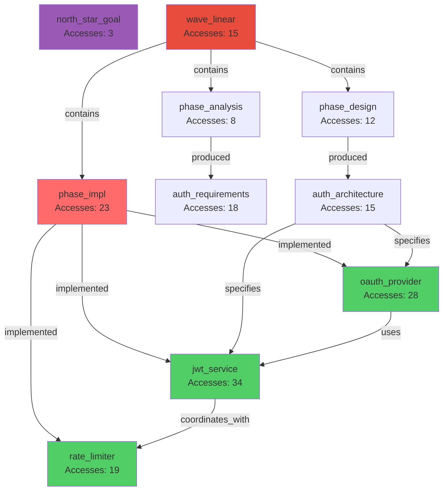

# Shannon Framework V3

**Behavioral Programming Framework for Claude Code**

[](https://github.com/krzemienski/shannon-framework)
[](./VERIFICATION_REPORT.md)
[](./LICENSE)

> **⚠️ Important**: If you're looking for Python/JavaScript code, you won't find it here. Shannon is a **behavioral framework** that uses markdown files to modify Claude Code's behavior via system prompt injection. The markdown files ARE the framework—not documentation FOR a framework.

# What Shannon Actually Is

## The Paradigm Shift: Behavioral Programming Through System Prompts

**Shannon is not a code framework. It's a behavioral framework.**

When developers first encounter Shannon, the immediate reaction is often: "Where's the code?" This confusion is understandable—we've been conditioned to believe that frameworks must be implemented in code. But Shannon operates on a fundamentally different principle: **behavioral programming through system prompt injection**.

Here's the key insight: Claude Code already has all the capabilities Shannon needs—parallel tool execution, MCP server orchestration, intelligent reasoning, context management. The bottleneck isn't missing functionality. **The bottleneck is behavior.**

Claude doesn't naturally:
- Batch independent operations in parallel
- Coordinate multiple MCP servers systematically
- Preserve context across auto-compaction events
- Apply domain expertise consistently
- Execute complex multi-stage workflows

Shannon solves this by **changing how Claude thinks**, not by adding new code it can execute.


## System Prompt Injection: The Core Mechanism

Shannon works by **injecting carefully crafted markdown files into Claude's system prompt** when you open a project. These files don't add new capabilities—they modify decision-making, priorities, and execution patterns.

Think of it this way:

**Shannon is to Claude what `.bashrc` is to Bash.**

Your `.bashrc` doesn't add new commands to Bash. It configures behavior: aliases, environment variables, default options, prompt appearance. When you type `ls`, you might actually be running `ls -lah --color=auto` because your `.bashrc` aliased it. The `ls` command hasn't changed—your Bash session's behavior has.

Shannon works identically:
- No new tools or capabilities are added to Claude
- Existing native tools + MCP servers are orchestrated differently
- Decision frameworks guide tool selection and execution patterns
- Context management protocols preserve state across operations
- Behavioral rules ensure consistent quality and approach

### What Gets Injected

When Shannon activates, Claude's system prompt is enhanced with:

1. **COMMANDS.md** - Command execution framework and routing logic
2. **PERSONAS.md** - Domain-specific expertise and decision frameworks
3. **MODES.md** - Operational modes (task management, introspection, token efficiency)
4. **RULES.md** - Behavioral rules and quality standards
5. **PRINCIPLES.md** - Engineering principles and philosophy
6. **ORCHESTRATOR.md** - Intelligent routing and tool selection
7. **MCP.md** - MCP server coordination strategies
8. **Agent Specifications** - Specialized agent behaviors and workflows

These files are **pure behavioral instructions**. They tell Claude:
- How to think about problems
- When to activate specific expertise
- How to coordinate tools optimally
- What quality standards to maintain
- How to preserve context across sessions

### Why Markdown Over Code

Traditional frameworks require implementation in executable code because they're adding new functionality. Shannon doesn't need executable code because **it's not adding functionality—it's optimizing existing intelligence**.

Markdown is the optimal format because:

**1. Natural Language is Claude's Native Interface**
- Code frameworks force Claude to execute logic it didn't design
- Markdown frameworks let Claude understand intent and adapt intelligently
- Claude can reason about "when to parallelize operations" more effectively than executing `if (operations.independent) { parallelize() }`

**2. Behavioral Nuance Requires Context**
- Code is binary: function executes or doesn't
- Markdown provides context, rationale, examples, edge cases
- Claude can make judgment calls that rigid code cannot

**3. Flexibility and Adaptation**
- Code frameworks are brittle: changing behavior requires code changes
- Markdown frameworks are adaptive: Claude interprets based on context
- Same behavioral rule applies differently in different situations

**4. Transparency and Debuggability**
- Code execution is opaque unless you read implementation
- Markdown behavior is explicit and human-readable
- You can see exactly what's influencing Claude's decisions

**5. Evolution Without Breaking Changes**
- Code frameworks require versioning and migration
- Markdown frameworks evolve continuously without breaking
- Adding new behavioral patterns doesn't invalidate existing ones

## A Concrete Example: Parallel Execution

Let's illustrate the difference with a real scenario: editing 5 independent files.

### Traditional Code Framework Approach

```javascript
// framework.js
async function editFiles(files) {
  for (const file of files) {
    await editFile(file);  // Sequential bottleneck
  }
}
```

Claude executes this code. The framework author decided these operations happen sequentially. Claude has no choice—it's locked into the implementation.

### Shannon Behavioral Approach

```markdown
## RULES.md - Tool Optimization

**Priority**: 🟢 RECOMMENDED

- **Parallel Everything**: Execute independent operations in parallel, never sequentially
- **Tool Optimization**: Use MultiEdit for 3+ file changes, parallel Read calls
- **Efficiency First**: Choose speed and power over familiarity

✅ **Right**: Use MultiEdit for 3+ file changes, parallel Read calls
❌ **Wrong**: Sequential Edit calls, bash grep instead of Grep tool
```

Claude **understands** the principle. When faced with 5 independent file edits:
- It recognizes they're independent (no tool can do that through code alone)
- It knows parallel execution is the behavioral standard
- It uses MultiEdit tool or parallel Edit operations
- It makes the intelligent choice based on context

The behavioral framework is **smarter** because Claude applies intelligence, not just execution logic.

## Why This Matters

The Shannon approach enables capabilities that code frameworks cannot match:

**1. Contextual Intelligence**
- Shannon doesn't just execute—it **understands**
- Behavioral rules adapt to specific situations
- Claude applies judgment, not just logic

**2. Self-Optimization**
- Claude recognizes optimization opportunities
- Behavioral patterns compound over time
- System gets smarter without code changes

**3. Transparent Decision-Making**
- You see why Claude made choices (introspection mode)
- Behavioral rules are explicit and traceable
- No hidden implementation details

**4. Human-AI Collaboration**
- You can read and understand the behavior
- You can modify behavioral rules directly
- No programming required to customize

**5. Future-Proof Architecture**
- As Claude improves, Shannon benefits automatically
- Behavioral rules leverage increasing intelligence
- No refactoring required for new capabilities

## The "No Code" Confusion Addressed

When developers ask "where's the code?", they're asking the wrong question. The right question is: **"How does this change Claude's behavior?"**

Shannon doesn't need code because:
- **It's not adding features** - it's optimizing existing capabilities
- **It's not executing logic** - it's guiding intelligent decisions
- **It's not implementing algorithms** - it's establishing behavioral patterns

The power isn't in code execution. **The power is in behavioral transformation.**

Think about the best engineering teams you've worked with. What made them effective wasn't that they had proprietary tools. It was that they had:
- Shared principles and values
- Consistent practices and patterns
- Clear communication and coordination
- Domain expertise and judgment

Shannon provides these same advantages to Claude. Not through code, but through **behavioral programming**.

## The Mental Model Shift

Traditional Framework Thinking:
```
Problem → Write code → Add functionality → Execute logic → Get result
```

Shannon Thinking:
```
Problem → Define behavior → Guide intelligence → Orchestrate existing tools → Get optimized result
```

In traditional frameworks, **you're constrained by what the code implements**.

In Shannon, **Claude is empowered by behavioral guidance to use its full intelligence**.

The paradigm shift is this: **Stop trying to control execution. Start guiding intelligence.**

Shannon is the first framework designed for the AI-native era, where **behavioral programming > imperative programming** for intelligent systems.

---

# The Problems Shannon Solves

Shannon addresses three fundamental problems that plague AI-assisted development workflows. These aren't theoretical issues—they're daily frustrations that kill productivity and create false confidence.


## Problem 1: Context Loss (The Session Continuity Crisis)

### The Problem

Claude Code implements automatic context compaction when approaching token limits. This is necessary for performance, but it creates a critical problem: **session state evaporates**.

Here's what happens:

**Scenario**: You're deep into a complex refactoring session:
- 45 minutes of work analyzing a legacy codebase
- You've built up understanding of architectural patterns
- Claude knows which files are critical, which are legacy, which are risky
- You've established coding standards and quality gates for this specific task
- TodoList has 12 tasks, 7 completed, 5 in progress

**Then auto-compaction triggers.**

Claude's context window hits 80% capacity. Auto-compaction runs. The conversation is summarized to free up tokens.

**What gets lost**:
- Task progress and todo state
- Architectural understanding built over 45 minutes
- Quality standards established for this session
- File criticality assessments
- Risk awareness for specific modules
- The mental model of what you're trying to achieve

**What survives**:
- A generic summary: "User is refactoring authentication system"
- Recent messages (but not the reasoning behind them)
- No actionable state

You continue the conversation, but Claude is now **partially amnesiac**. It doesn't remember:
- Which architectural decisions were already made
- Why certain approaches were rejected
- What quality standards were established
- Which files have hidden dependencies
- What the overall plan was

**The result**: You waste 20 minutes re-establishing context, or worse—Claude makes decisions inconsistent with earlier work.

### The Shannon Solution: PreCompact Hook + Serena Checkpoints

Shannon implements a **PreCompact hook** that triggers BEFORE auto-compaction occurs. This hook:

1. **Detects Impending Compaction**
   - Monitors context usage in real-time
   - Triggers at 75% capacity (before emergency compaction)
   - Provides time for graceful checkpoint creation

2. **Captures Critical Session State**
   - Current task list and completion status
   - Architectural decisions and rationale
   - Quality standards and constraints
   - File criticality and risk assessments
   - Established patterns and conventions
   - The "why" behind choices, not just the "what"

3. **Persists to Serena MCP**
   - Serena provides project-level memory across sessions
   - Structured checkpoint format optimized for retrieval
   - Semantic indexing for intelligent context restoration
   - Genealogy tracking for decision evolution

4. **Restoration Protocol**
   - Post-compaction: Serena checkpoint is automatically restored
   - Context rebuilt with full reasoning chains intact
   - Task state and progress preserved exactly
   - Architectural understanding maintained

**Real Example**:

```
[Context at 75%]
Shannon PreCompact Hook triggers:

1. Capture session state:
   - "Refactoring auth system: passport.js → modern JWT"
   - "Architectural decision: Keep Express middleware pattern for compatibility"
   - "Quality gate: All auth changes require integration tests"
   - "Risk assessment: session.js has undocumented Redis dependency"
   - "TodoList: 7/12 completed, currently implementing token refresh"

2. Persist to Serena:
   - Checkpoint ID: refactor_auth_20250930_143022
   - Session context: [structured state above]
   - Decision genealogy: [why JWT over OAuth, why middleware pattern]

3. Auto-compaction occurs (conversation summarized)

4. Restoration:
   - Serena checkpoint restored automatically
   - Claude remembers: architectural decisions, quality standards, risks, progress
   - Work continues seamlessly with full context
```

**The Difference**:

Without Shannon:
- 45 minutes of context → compaction → 5 minutes of generic summary
- State loss: 90%+
- Recovery time: 15-20 minutes of re-explanation

With Shannon:
- 45 minutes of context → PreCompact checkpoint → compaction → restoration
- State loss: <5%
- Recovery time: <30 seconds (automatic)

**Why This Matters**:

Context loss isn't just annoying—it's **dangerous**. When Claude loses architectural understanding:
- Inconsistent decisions get made
- Established quality standards get violated
- Risky code patterns get reintroduced
- You don't notice until something breaks

Shannon's PreCompact hook + Serena checkpoints ensure **session continuity** even through context limitations.

## Problem 2: Manual Orchestration (The Sequential Bottleneck)

### The Problem

Claude Code has powerful capabilities: native tools, MCP servers, parallel execution support. But by default, **it operates sequentially** unless you explicitly instruct otherwise.

**Real Scenario**: Analyzing a 50-file codebase for security vulnerabilities.

**Default Claude behavior**:
```
1. Read file1.js → analyze
2. Read file2.js → analyze
3. Read file3.js → analyze
...
50. Read file50.js → analyze
51. Synthesize findings
```

**Time**: 15-20 minutes
**Efficiency**: 5-10% (only 1 operation active at a time)

**What you want**:
```
1. Read [file1.js, file2.js, file3.js, file4.js, file5.js] in parallel
2. Read [file6.js, file7.js, file8.js, file9.js, file10.js] in parallel
...
10. Analyze all results in parallel where possible
11. Synthesize findings
```

**Time**: 2-3 minutes
**Efficiency**: 80-90% (5-10 parallel operations)

But achieving this requires **manual orchestration**:
- "Please read these files in parallel"
- "Batch these operations"
- "Use parallel tool calls for independent tasks"

**And you have to say this every time.** Claude doesn't learn this pattern. Every new task starts sequential by default.

### The Shannon Solution: Wave-Based Parallel Execution

Shannon implements **Wave Orchestration** — a behavioral framework that automatically detects parallelization opportunities and executes operations in intelligent phases ("waves").

**How Waves Work**:

1. **Automatic Complexity Assessment**
   - Shannon analyzes the task for independent operations
   - Scores complexity: simple (0.0-0.3), moderate (0.3-0.7), complex (0.7-1.0)
   - Identifies parallelization opportunities

2. **Wave Planning**
   - Groups independent operations into waves
   - Sequences dependent operations appropriately
   - Optimizes for maximum parallelism while respecting dependencies

3. **Intelligent Execution**
   - Wave 1: All independent initial operations (parallel)
   - Wave 2: Operations dependent on Wave 1 (parallel within wave)
   - Wave N: Final synthesis and validation

4. **Adaptive Coordination**
   - Dynamic wave sizing based on system resources
   - Intelligent batching to avoid overwhelming APIs
   - Automatic fallback to sequential if errors occur

**Real Example: Security Audit**

```
Without Shannon:
/analyze --security @src/

Sequential execution:
1. Read src/auth.js
2. Read src/session.js
3. Read src/api.js
...
50. Read src/utils/crypto.js
51. Security analysis per file
52. Synthesize findings

Time: 18 minutes
```

```
With Shannon:
/analyze --security @src/

Wave orchestration automatically activates:

Wave 1 (Discovery - Parallel):
- Read [5 files in parallel]
- Read [5 files in parallel]
...
- Read [5 files in parallel]

Wave 2 (Analysis - Parallel):
- Security analysis [batch 1: auth files]
- Security analysis [batch 2: API files]
- Security analysis [batch 3: utility files]

Wave 3 (Synthesis - Sequential, depends on Wave 2):
- Aggregate findings
- Identify patterns
- Prioritize vulnerabilities

Wave 4 (Validation - Parallel):
- Cross-reference vulnerabilities
- Verify with Sequential MCP
- Generate remediation plan

Time: 2.5 minutes
Efficiency gain: 7x faster
```

**The Behavioral Difference**:

Shannon doesn't require you to orchestrate manually. It **automatically recognizes**:
- Operations are independent (file reads)
- Parallelization is safe and beneficial
- Optimal wave structure for this task
- When to sequence (synthesis depends on analysis)

**Wave Triggers**:

Shannon activates waves when:
- Complexity score ≥ 0.7
- File count > 20
- Multiple operation types detected (read, analyze, validate)
- Multi-domain operations (frontend + backend + database)

**Manual Override**:
```bash
# Force single-pass execution
/analyze --security @src/ --single-wave

# Force wave mode even for simple tasks
/analyze --security @src/ --wave-mode

# Custom wave configuration
/analyze --security @src/ --wave-count 3 --wave-threshold 0.5
```

**Why This Matters**:

Manual orchestration is:
- **Tedious**: You shouldn't have to micromanage parallelization
- **Error-prone**: Easy to forget to parallelize, wasting time
- **Inconsistent**: Different users get different performance
- **Bottlenecked**: Sequential execution is 5-10x slower

Wave-based execution is:
- **Automatic**: Shannon handles orchestration
- **Intelligent**: Adapts to task complexity
- **Consistent**: Every user gets optimal performance
- **Fast**: 5-10x efficiency gains are standard

The difference between **"Please parallelize these operations"** (manual) and **operations just execute optimally** (Shannon) is the difference between driving manual and automatic transmission. Shannon shifts gears for you.

## Problem 3: Mock-Based Testing (The False Confidence Trap)

### The Problem

AI-assisted development has made it trivially easy to generate tests. Claude can write comprehensive test suites in seconds. **But there's a dangerous pattern**: mock-heavy testing.

**Real Scenario**: You ask Claude to "add tests for the authentication flow."

**What Claude generates** (without Shannon):

```javascript
// auth.test.js
describe('Authentication', () => {
  it('should authenticate user with valid credentials', async () => {
    const mockUser = { id: 1, email: 'test@example.com' };
    const mockToken = 'mock-jwt-token';

    // Mock database
    db.findUser = jest.fn().mockResolvedValue(mockUser);

    // Mock JWT
    jwt.sign = jest.fn().mockReturnValue(mockToken);

    // Mock bcrypt
    bcrypt.compare = jest.fn().mockResolvedValue(true);

    const result = await authService.login('test@example.com', 'password');

    expect(result.token).toBe(mockToken);
    expect(db.findUser).toHaveBeenCalledWith('test@example.com');
  });
});
```

**What just happened**:
- Database interaction: **mocked**
- JWT generation: **mocked**
- Password hashing: **mocked**
- Actual authentication flow: **never executed**

**The test passes.** ✅

But what did it actually test?
- That mocks return what you told them to return
- That function calls happen in the right order
- **Nothing about whether authentication actually works**

**This creates false confidence**:
- Tests are green ✅
- Coverage is 90%+ ✅
- CI/CD passes ✅
- **Production breaks** ❌

**Real bugs this misses**:
- Database query has SQL syntax error
- JWT secret is misconfigured
- Bcrypt rounds setting is wrong
- Password comparison logic is inverted
- Session management doesn't persist
- Token refresh flow is broken

**Why this happens**: Mocking is easy. Real integration is hard. Claude defaults to the path of least resistance unless guided otherwise.

### The Shannon Solution: NO MOCKS Philosophy

Shannon implements a **strict behavioral rule**: **NO MOCKS for integration testing.**

**The Rule** (from RULES.md):

```markdown
## Failure Investigation
**Priority**: 🔴 CRITICAL

- **Never Skip Tests**: Never disable, comment out, or skip tests to achieve results
- **Never Skip Validation**: Never bypass quality checks or validation to make things work
- **Fix Don't Workaround**: Address underlying issues, not just symptoms
- **Quality Integrity**: Never compromise system integrity to achieve short-term results

❌ **Wrong**: Mock database, JWT, external services for integration tests
❌ **Wrong**: Comment out failing test to make build pass
✅ **Right**: Use real test database, real services, real browsers
✅ **Right**: Fix the actual bug causing test failure
```

**What This Means in Practice**:

**For Backend Testing**:
- Use **real test databases** (Docker containers, test instances)
- Use **real authentication flows** (test JWT secrets, real bcrypt)
- Use **real API calls** (test endpoints, real HTTP)
- Mock only **external third-party services** you don't control

**For Frontend Testing**:
- Use **real browsers** via Playwright MCP
- Use **real user interactions** (clicks, form fills, navigation)
- Use **real DOM rendering** (not JSDOM or shallow rendering)
- Test **actual user journeys**, not component isolation

**For API Testing**:
- Use **real HTTP requests** (not mocked fetch)
- Use **real response parsing** (not mocked JSON)
- Use **real error handling** (trigger actual errors)
- Test **actual network conditions** (timeouts, retries)

**Real Example: Shannon-Guided Test Generation**

```
User: "Add tests for authentication"

Shannon-guided Claude generates:

// auth.integration.test.js
describe('Authentication Integration', () => {
  let testDb;
  let testServer;

  beforeAll(async () => {
    // Real test database
    testDb = await createTestDatabase();
    testServer = await startTestServer();
  });

  afterAll(async () => {
    await cleanupTestDatabase(testDb);
    await stopTestServer(testServer);
  });

  it('should authenticate user with valid credentials', async () => {
    // Real user in test database
    await testDb.users.create({
      email: 'test@example.com',
      passwordHash: await bcrypt.hash('password', 10)  // Real bcrypt
    });

    // Real HTTP request
    const response = await fetch(`${testServer.url}/auth/login`, {
      method: 'POST',
      headers: { 'Content-Type': 'application/json' },
      body: JSON.stringify({
        email: 'test@example.com',
        password: 'password'
      })
    });

    // Real validation
    expect(response.status).toBe(200);
    const data = await response.json();
    expect(data.token).toBeDefined();

    // Verify real token works
    const verifyResponse = await fetch(`${testServer.url}/auth/verify`, {
      headers: { 'Authorization': `Bearer ${data.token}` }
    });
    expect(verifyResponse.status).toBe(200);
  });

  it('should reject invalid credentials', async () => {
    const response = await fetch(`${testServer.url}/auth/login`, {
      method: 'POST',
      headers: { 'Content-Type': 'application/json' },
      body: JSON.stringify({
        email: 'test@example.com',
        password: 'wrong-password'
      })
    });

    expect(response.status).toBe(401);
  });
});
```

**The Difference**:

| Aspect | Mock-Based | Shannon (NO MOCKS) |
|--------|-----------|-------------------|
| Database | Mocked | Real test DB |
| HTTP | Mocked fetch | Real requests |
| Auth | Mocked JWT | Real token generation |
| Validation | Mock returns | Real response parsing |
| Bugs Caught | Function calls only | Integration bugs, config errors, real failures |
| Confidence | False (mocks ≠ reality) | Real (tests ≠ production but close) |
| Maintenance | Brittle (mocks break on refactor) | Resilient (real integration tested) |

**For UI Testing via Playwright**:

Shannon enforces real browser testing:

```javascript
// button.playwright.test.js
test('login button triggers authentication', async ({ page }) => {
  // Real browser navigation
  await page.goto('http://localhost:3000/login');

  // Real user interaction
  await page.fill('input[name="email"]', 'test@example.com');
  await page.fill('input[name="password"]', 'password');
  await page.click('button[type="submit"]');

  // Real DOM validation
  await expect(page.locator('.dashboard')).toBeVisible();

  // Real screenshot for visual regression
  await page.screenshot({ path: 'login-success.png' });
});
```

**No mocking**:
- Real browser rendering
- Real click events
- Real form submission
- Real navigation
- Real visual validation

**Why This Matters**:

Mock-based testing creates **false confidence**:
- Tests pass but code is broken
- Integration bugs slip through
- Production failures come as surprises

NO MOCKS philosophy creates **real confidence**:
- If tests pass, integration actually works
- Real bugs are caught in CI/CD
- Production failures are rare

**The Shannon Behavioral Enforcement**:

Shannon doesn't just suggest avoiding mocks—it **enforces it behaviorally**:

1. **Quality Gate Integration**: Mock detection in test generation
2. **Validation Cycle**: Tests must demonstrate real integration
3. **Playwright MCP Preference**: Default to real browser testing for UI
4. **Docker Integration**: Auto-suggest test database containers
5. **Failure Investigation**: Never mock to make tests pass

**When Mocks Are Acceptable**:

Shannon allows mocks only for:
- **External third-party services** you don't control (Stripe API, SendGrid)
- **Truly non-deterministic behavior** (random number generation for specific tests)
- **Unit tests for pure functions** (but integration tests are required too)

**The Result**:

Tests that give you **real confidence** because they test **real integrations** against **real systems** using **real interactions**.

When Shannon-guided tests pass, you know your code actually works. When mock-based tests pass, you know your mocks work. There's a profound difference.

---

# How Shannon Works

Shannon's architecture is elegantly simple: **system prompt injection orchestrates intelligent behavior through markdown-based programming.** Understanding how this works requires seeing the complete flow from project initialization through command execution to context preservation.


## The Injection Architecture: From Project Open to Behavioral Transformation

### Stage 1: Project Initialization

When you open a Shannon-enabled project in Claude Code:

**1. Claude Code Startup**
```
1. Claude Code launches
2. Scans for configuration files
3. Discovers ~/.claude/CLAUDE.md (global config)
4. Discovers .claude/CLAUDE.md (project-specific config, if present)
```

**2. CLAUDE.md Entry Point**

The `CLAUDE.md` file acts as the **framework manifest**:

```markdown
# SuperClaude Entry Point
@COMMANDS.md
@FLAGS.md
@PRINCIPLES.md
@RULES.md
@MCP.md
@PERSONAS.md
@ORCHESTRATOR.md
@MODES.md

# Agent Specifications
@AGENT_spec_panel.md
@AGENT_deep_research.md
...
```

This `@include` syntax tells Claude Code: **"Inject these files into my system prompt."**

**3. System Prompt Enhancement**

Claude Code processes the includes and **injects the content** into Claude's system prompt. This happens **before any user interaction**.

The result: Claude's system prompt now contains:
- ~50,000 tokens of behavioral programming
- Command execution frameworks
- Persona decision trees
- Orchestration patterns
- Quality standards
- Agent specifications

**4. Behavioral Transformation Complete**

At this point, Claude is no longer "vanilla Claude Code." It's **Shannon-enhanced Claude**:
- Parallel execution is default behavior
- Domain expertise activates contextually
- Quality gates are enforced automatically
- Context preservation protocols are active
- MCP servers are coordinated intelligently

All of this happens **silently and automatically** when you open the project.

### Stage 2: Command Execution Flow

Let's trace what happens when you type `/sh:spec "Build authentication system"`:

**Step 1: Command Recognition**

```
User input: /sh:spec "Build authentication system"

Shannon's COMMANDS.md routing:
1. Prefix /sh: → Shannon command namespace
2. Command :spec → spec-panel agent
3. Argument: "Build authentication system"
```

**Step 2: Agent Activation**

Shannon routes to `AGENT_spec_panel.md`:

```markdown
# Spec Panel Agent

## Purpose
Multi-expert specification development with structured requirements gathering and PRD generation.

## Activation Triggers
- `/sh:spec` command
- Specification request keywords
- PRD development needs

## Behavioral Rules
- Socratic requirements discovery
- Multi-expert validation (architect, frontend, backend, QA)
- Parallel research (Context7 for patterns, Serena for history)
- Structured output (PRD format with acceptance criteria)

## Execution Flow
1. Requirements Discovery → Parallel
2. Architecture Design → Sequential (depends on requirements)
3. Expert Validation → Parallel (each expert reviews independently)
4. PRD Generation → Sequential (synthesis)
```

**Step 3: Intelligent Orchestration**

Shannon's ORCHESTRATOR.md determines execution strategy:

```yaml
Task: "Build authentication system"
Complexity: 0.85 (high - security-critical, multi-component)
Domains: [security, backend, frontend]

Orchestration Decision:
- Activate personas: security, backend, architect, frontend
- Enable MCP servers: Context7 (auth patterns), Serena (project history), Sequential (analysis)
- Execution mode: Wave-based (parallel where possible)
- Quality gates: Security review required, integration tests required
```

**Step 4: Persona Coordination**

Multiple personas activate based on the domain:

```markdown
**Security Persona** (from PERSONAS.md):
- Priority: Security > compliance > convenience
- Focus: Threat modeling, vulnerability assessment
- MCP preference: Sequential (analysis), Context7 (security patterns)

**Backend Persona**:
- Priority: Reliability > security > performance
- Focus: API design, data integrity
- MCP preference: Context7 (backend frameworks), Sequential (system analysis)

**Architect Persona**:
- Priority: Maintainability > scalability > short-term gains
- Focus: System design, long-term implications
- MCP preference: Sequential (architecture analysis), Context7 (design patterns)
```

**Step 5: Parallel Tool Execution**

Shannon's behavioral rules enforce parallel execution:

```
Wave 1 (Discovery - Parallel):
- Read existing auth code (if any)
- Search for auth patterns via Context7 MCP
- Check Serena for previous auth decisions
- Analyze project structure for integration points

Wave 2 (Analysis - Parallel):
- Security persona: Threat model creation
- Backend persona: API design
- Architect persona: System integration design
- Frontend persona: UX flow design

Wave 3 (Synthesis - Sequential, depends on Wave 2):
- Combine expert analyses
- Resolve conflicts
- Create unified architecture

Wave 4 (Validation - Parallel):
- Security review of design
- Scalability assessment
- Compliance check
- Generate acceptance criteria
```

**Step 6: Output Generation**

Spec Panel agent generates structured PRD:

```markdown
# Authentication System Specification

## Executive Summary
[Synthesized from all expert perspectives]

## Requirements
**Functional:**
- User registration with email verification
- JWT-based authentication
- Role-based access control
- Password reset flow

**Security (Security Persona):**
- Bcrypt password hashing (12 rounds minimum)
- JWT with 15-minute access tokens, 7-day refresh tokens
- Rate limiting on auth endpoints
- OWASP Top 10 compliance

**Architecture (Architect Persona):**
- Stateless authentication (horizontal scaling)
- Middleware-based authorization
- Separation of concerns (auth service + user service)

## Technical Design
[Backend, Frontend, Database schemas]

## Acceptance Criteria
- [ ] All auth endpoints secured with rate limiting
- [ ] Password complexity enforced (8+ chars, mixed case, numbers)
- [ ] Integration tests cover full auth flow
- [ ] Security audit passes
- [ ] Playwright tests verify UX flow
```

### Stage 3: Context Preservation Protocol

During this entire process, Shannon monitors context usage:

**Context Monitoring**:
```
Session start: 5K tokens
After Wave 1: 25K tokens
After Wave 2: 48K tokens
After Wave 3: 62K tokens
After Wave 4: 78K tokens (75% threshold!)
```

**PreCompact Hook Triggers** (from MODES.md):

```markdown
## Task Management Mode - Context Preservation

### PreCompact Hook Protocol
When context reaches 75%:
1. Detect impending compaction
2. Capture session state:
   - Current task: "Auth system specification"
   - Expert decisions: [security requirements, architecture choices]
   - Quality standards: [OWASP compliance, integration test coverage]
   - Task progress: Spec complete, implementation pending
3. Persist to Serena MCP
4. Tag checkpoint: spec_auth_20250930_143522
```

**Serena Checkpoint Storage**:
```json
{
  "checkpoint_id": "spec_auth_20250930_143522",
  "session_type": "specification_development",
  "context": {
    "task": "Authentication system specification",
    "expert_decisions": {
      "security": "JWT 15min access, 7day refresh, bcrypt 12 rounds",
      "architect": "Stateless design, middleware auth, service separation",
      "backend": "Express.js middleware pattern, Passport.js integration",
      "frontend": "React Context API for auth state, protected routes"
    },
    "quality_standards": [
      "OWASP Top 10 compliance required",
      "Integration tests for full auth flow",
      "Playwright E2E tests for UX",
      "Security audit before production"
    ],
    "artifacts": {
      "prd": "[full PRD content]",
      "threat_model": "[security analysis]",
      "architecture_diagram": "[system design]"
    }
  },
  "genealogy": {
    "previous_auth_decisions": ["checkpoint_auth_legacy_20250815"],
    "related_specs": ["api_spec_20250920", "user_service_20250901"]
  }
}
```

**Auto-Compaction Occurs**:
```
Context compaction triggered at 78% usage.
Conversation summarized to: "User requested authentication system spec. Specification completed with multi-expert validation."

Critical information PRESERVED via Serena checkpoint.
```

**Checkpoint Restoration**:

When you continue the conversation:
```
User: "Now implement the authentication system"

Shannon restoration protocol:
1. Detect continuation of auth work
2. Query Serena for relevant checkpoints
3. Restore spec_auth_20250930_143522
4. Rebuild context:
   - Full specification details
   - Expert decisions and rationale
   - Quality standards and gates
   - Architectural constraints
5. Implementation proceeds with complete context
```

**The Difference**:

Without Shannon:
```
[After compaction]
User: "Now implement authentication"
Claude: "Sure, I can help with authentication. What approach would you like?"
[All specification work lost - have to re-explain everything]
```

With Shannon:
```
[After compaction + restoration]
User: "Now implement authentication"
Claude: "I'll implement the authentication system according to the specification:
- JWT-based auth with 15min access tokens, 7day refresh
- Bcrypt password hashing (12 rounds)
- Express.js middleware pattern
- Following the architecture we designed

Starting with the authentication middleware..."
[Full context preserved - work continues seamlessly]
```

## The Intelligence Stack: How Shannon Amplifies Claude

Shannon doesn't replace Claude's intelligence—it **structures and amplifies** it:

**Layer 1: Native Claude Intelligence**
- Reasoning, code generation, analysis, communication

**Layer 2: Shannon Behavioral Framework** (injected via system prompt)
- Parallel execution patterns
- Domain expertise activation
- Quality standards enforcement
- Orchestration intelligence

**Layer 3: MCP Server Coordination**
- Context7: Documentation and patterns
- Sequential: Complex reasoning
- Serena: Memory and state management
- Playwright: Real browser testing
- Magic: UI generation

**Layer 4: Agent Specialization**
- Spec Panel: Requirements and PRDs
- Deep Research: Multi-source investigation
- Implementation: Code generation with quality
- Testing: Real integration validation

**The Result**: An intelligence stack that delivers **10x productivity** through:
- Automatic parallelization (5-10x speed)
- Context preservation (eliminates 20min re-explanations)
- Real testing (catches bugs before production)
- Expert-level quality (consistent professional standards)

Shannon transforms Claude from a powerful assistant into a **force multiplier** for engineering teams.

---

# Shannon Commands (sh:*) - Complete Usage Guide

> **Deep dive into Shannon's six core commands with execution diagrams, memory visualizations, and complete workflow examples**

---

## Table of Contents

1. [Command Ecosystem Overview](#command-ecosystem-overview)
2. [Core Workflow Patterns](#core-workflow-patterns)
3. [Command Deep Dives](#command-deep-dives)
   - [/sh:north-star - Goal Management](#shnorth-star---goal-management)
   - [/sh:wave - Wave Orchestration](#shwave---wave-orchestration)
   - [/sh:analyze - Multi-Layer Analysis](#shanalyze---multi-layer-analysis)
   - [/sh:checkpoint - State Management](#shcheckpoint---state-management)
   - [/sh:memory - Memory Intelligence](#shmemory---memory-intelligence)
   - [/sh:status - System Monitoring](#shstatus---system-monitoring)
4. [Complete Workflow Examples](#complete-workflow-examples)
5. [System Architecture](#system-architecture)

---

## Command Ecosystem Overview

### Quick Reference Matrix

| Command | Purpose | Primary MCP | Sub-Agent | When to Use |
|---------|---------|-------------|-----------|-------------|
| `/sh:north-star` | Goal management | Serena | NORTH_STAR_KEEPER | Start of project/feature |
| `/sh:wave` | Wave orchestration | Serena, Sequential | WAVE_ORCHESTRATOR | Complex multi-phase tasks |
| `/sh:analyze` | Multi-layer analysis | Sequential, Serena | DEEP_ANALYZER | Understanding, investigation |
| `/sh:checkpoint` | State management | Serena | CHECKPOINT_GUARDIAN | Before risky ops, save points |
| `/sh:memory` | Memory intelligence | Serena, Sequential | MEMORY_CURATOR | Optimization, pattern discovery |
| `/sh:status` | System monitoring | Serena | CONTEXT_GUARDIAN | Health checks, progress review |

### Command Philosophy

**Shannon commands (sh:*) vs SuperClaude commands (sc:*)**:

```yaml
SuperClaude Commands (sc:*):
  focus: "Task execution and delivery"
  examples: [/sc:build, /sc:implement, /sc:improve]
  behavior: "Direct work on code and features"

Shannon Commands (sh:*):
  focus: "Meta-coordination and system management"
  examples: [/sh:wave, /sh:checkpoint, /sh:memory]
  behavior: "Orchestrate, coordinate, preserve state"
```

**Key Insight**: Shannon commands don't write code directly. They **coordinate the system that writes code**, managing goals, memory, execution strategies, and system state.

---

## Core Workflow Patterns

### The Typical Shannon Session

```mermaid
flowchart TB
    Start([Session Start]) --> NorthStar[/sh:north-star<br/>'Set goal']
    NorthStar --> Status1[/sh:status<br/>Check readiness]
    Status1 --> Wave[/sh:wave<br/>Execute strategy]

    Wave --> Phase1[Phase 1:<br/>Analysis]
    Phase1 --> Auto1[Auto checkpoint]
    Auto1 --> Phase2[Phase 2:<br/>Design]
    Phase2 --> Auto2[Auto checkpoint]
    Auto2 --> Phase3[Phase 3:<br/>Implementation]
    Phase3 --> Auto3[Auto checkpoint]
    Auto3 --> Phase4[Phase 4:<br/>Validation]
    Phase4 --> Auto4[Auto checkpoint]

    Auto4 --> Memory[/sh:memory pattern<br/>Analyze what was learned]
    Memory --> Status2[/sh:status<br/>Final health check]
    Status2 --> Checkpoint[/sh:checkpoint create<br/>Session end]
    Checkpoint --> End([Session End])

    style NorthStar fill:#4ecdc4
    style Wave fill:#ff6b6b
    style Memory fill:#ffd93d
    style Checkpoint fill:#6bcf7f
```

### Command Interaction Map

```mermaid
graph TB
    subgraph "Goal Layer"
        NS[/sh:north-star]
    end

    subgraph "Execution Layer"
        W[/sh:wave]
        A[/sh:analyze]
    end

    subgraph "State Layer"
        C[/sh:checkpoint]
        M[/sh:memory]
    end

    subgraph "Monitoring Layer"
        S[/sh:status]
    end

    NS -.->|guides| W
    NS -.->|aligns| A
    W -->|creates| C
    W -->|evolves| M
    A -->|queries| M
    C -->|preserves| M
    S -->|monitors| NS
    S -->|monitors| W
    S -->|monitors| C
    S -->|monitors| M

    style NS fill:#9b59b6
    style W fill:#e74c3c
    style A fill:#3498db
    style C fill:#2ecc71
    style M fill:#f39c12
    style S fill:#95a5a6
```

---

## Command Deep Dives

## /sh:north-star - Goal Management

### Purpose & Philosophy

The North Star is your **persistent guiding beacon** that prevents scope creep, drift, and misalignment. Every Shannon operation evaluates itself against the North Star to ensure work delivers value toward the intended outcome.

**Think of it as**: Your project's compass. Without it, you might build features that work perfectly but don't achieve your actual goal.

### Usage Examples

#### Example 1: Starting a New Feature

```bash
# Set the North Star
/sh:north-star "Build production-ready JWT authentication with <100ms token validation"
```

**What Happens Behind the Scenes**:

```mermaid
sequenceDiagram
    participant User
    participant Claude
    participant NSK as NORTH_STAR_KEEPER
    participant Serena
    participant FileSystem

    User->>Claude: /sh:north-star "Build JWT auth <100ms"
    Claude->>NSK: Activate sub-agent
    NSK->>NSK: Validate goal quality
    Note over NSK: Check: Specific? Measurable?<br/>Time-bound? Achievable?

    NSK->>NSK: Quality score: 0.95
    Note over NSK: ✅ Clear (JWT auth)<br/>✅ Measurable (<100ms)<br/>✅ Achievable<br/>⚠️ No deadline (OK)

    NSK->>Serena: create_entities([{<br/>name: 'north_star_goal',<br/>observations: ['Build JWT...']<br/>}])
    Serena-->>NSK: Entity created

    NSK->>FileSystem: Write to ~/.claude/shannon/north_star.txt
    FileSystem-->>NSK: Saved

    NSK->>Claude: Goal established
    Claude->>User: 🎯 North Star Set<br/>Quality: 0.95 (Excellent)
```



**Memory State After**:

```yaml
# Before
entities: []

# After
entities:
  - name: north_star_goal
    type: Goal
    observations:
      - "Build production-ready JWT authentication with <100ms token validation"
      - "Set: 2025-10-03 12:00:00"
      - "Quality score: 0.95"
```

#### Example 2: Checking Alignment During Development

```bash
# During development, check if new feature aligns
/sh:north-star check "Add password reset functionality"
```

**Alignment Calculation Behind the Scenes**:

```mermaid
flowchart TD
    Input["Operation: Add password reset"] --> Parse[Parse operation keywords]
    Parse --> Keywords["Keywords: password, reset,<br/>functionality, add"]

    Goal["Goal: Build JWT auth <100ms"] --> GoalParse[Parse goal keywords]
    GoalParse --> GoalKeys["Keywords: JWT, auth,<br/>token, validation, 100ms"]

    Keywords --> Compare{Compare semantic<br/>similarity}
    GoalKeys --> Compare

    Compare -->|authentication related| Score1[+0.7]
    Compare -->|extends auth| Score2[+0.2]
    Compare -->|no performance impact| Score3[+0.0]

    Score1 --> Sum[Sum: 0.9]
    Score2 --> Sum
    Score3 --> Sum

    Sum --> Decision{Alignment<br/>threshold}
    Decision -->|>= 0.8| Proceed["✅ PROCEED<br/>Strong alignment"]
    Decision -->|0.5-0.8| Caution["⚠️ PROCEED<br/>with caution"]
    Decision -->|< 0.5| Stop["❌ RECONSIDER<br/>Misaligned"]

    style Proceed fill:#2ecc71
    style Caution fill:#f39c12
    style Stop fill:#e74c3c
```



**Output**:
```markdown
🧭 ALIGNMENT CHECK
━━━━━━━━━━━━━━━━━━━━━━━━━━━━━━━━━━━━━━━━━━━━━━━━━━━━━━━━━

**Operation**: Add password reset functionality
**North Star**: Build JWT auth <100ms

**Alignment Analysis**:
📊 Score: 0.90 (Strong alignment)

**Rationale**:
✅ Direct support: Password reset is authentication functionality
✅ Security: Extends auth security surface
✅ Scope: Within authentication system boundaries
⚠️  Performance: Must maintain <100ms budget

**Recommendation**: ✅ PROCEED
Operation strongly aligns with North Star goal

**Implementation Notes**:
- Use same JWT infrastructure
- Implement token-based reset (not email links)
- Monitor performance impact on validation budget
```

---

## /sh:wave - Wave Orchestration

### Purpose & Philosophy

Wave orchestration **decomposes complex tasks into coordinated phases** with automatic memory tracking, checkpointing, and adaptive execution. Think of waves as "intelligent project management for AI operations."

**Four Wave Strategies**:
1. **Linear**: Sequential phases with clear dependencies
2. **Parallel**: Multi-track concurrent execution
3. **Iterative**: Progressive refinement cycles
4. **Adaptive**: Discovery-driven dynamic planning

### Behind-the-Scenes: Complete Execution Flow

When you type `/sh:wave linear Build authentication system`, here's the complete internal process:

```mermaid
sequenceDiagram
    autonumber
    participant U as User
    participant C as Claude
    participant WO as WAVE_ORCHESTRATOR
    participant SEQ as Sequential MCP
    participant SER as Serena MCP
    participant C7 as Context7 MCP
    participant TW as TodoWrite
    participant CP as Checkpoint System

    U->>C: /sh:wave linear Build auth system

    Note over C: Parse command
    C->>C: Detect: strategy=linear<br/>request="Build auth system"

    Note over C: Activate sub-agent
    C->>WO: Activate(strategy, request)

    Note over WO,SER: Step 1: Load North Star context
    WO->>SER: read_memory("north_star_goal")
    SER-->>WO: "Build secure API"
    WO->>WO: Calculate alignment: 0.92 ✅

    Note over WO,SER: Step 2: Query related context
    WO->>SER: search_nodes("authentication")
    SER-->>WO: 3 related entities found
    WO->>SER: open_nodes(["auth_v1", "jwt_research", "security_reqs"])
    SER-->>WO: Entity details + observations

    Note over WO,C7: Step 3: Load strategy template
    WO->>C7: get_pattern("wave_strategy_linear")
    C7-->>WO: Linear template:<br/>phases=[analysis, design, impl, validation]

    Note over WO,SEQ: Step 4: Strategy analysis
    WO->>SEQ: Analyze strategy fit for request
    SEQ->>SEQ: sequentialthinking(10 steps)
    SEQ-->>WO: Linear optimal (dependencies detected)

    Note over WO,SER: Step 5: Create wave tracking
    WO->>SER: create_entities([{<br/>name: 'wave_123',<br/>type: 'WaveExecution'<br/>}])
    SER-->>WO: Wave entity created

    loop For each phase in [analysis, design, impl, validation]
        WO->>SER: create_entities([phase_entity])
        WO->>SER: create_relations([wave→phase])
    end

    Note over WO,TW: Step 6: Initialize tracking
    WO->>TW: TodoWrite([<br/>analysis (pending),<br/>design (pending),<br/>impl (pending),<br/>validation (pending)<br/>])
    TW-->>WO: 4 todos created

    WO->>C: Wave initialized, ready to execute
    C->>U: 🌊 Wave started: Linear (4 phases)

    Note over C,CP: Execute Phase 1
    C->>TW: Update(analysis → in_progress)
    C->>C: Execute analysis phase
    C->>SER: add_observations(phase_1, ["Requirements gathered..."])
    C->>CP: create_checkpoint("phase_1_complete")
    C->>TW: Update(analysis → completed)

    Note over C,CP: Execute Phase 2
    C->>TW: Update(design → in_progress)
    C->>C: Execute design phase
    C->>SER: add_observations(phase_2, ["Architecture designed..."])
    C->>CP: create_checkpoint("phase_2_complete")
    C->>TW: Update(design → completed)

    Note over C: Phases 3 & 4 continue similarly

    Note over WO,SER: Final synthesis
    WO->>SER: create_entities([{<br/>name: 'wave_123_complete',<br/>observations: [summary]<br/>}])
    WO->>SER: create_relations([wave_complete→north_star])

    WO->>C: Wave execution complete
    C->>U: ✅ Wave complete report
```



### Strategy Deep Dive: Linear Wave

**Use When**: Clear sequential dependencies, well-defined requirements

**Example**: Building an authentication system

```bash
/sh:wave linear Build complete JWT authentication system with OAuth social login
```

**Complete Execution Trace**:

```markdown
🌊 WAVE EXECUTION: Linear Strategy
━━━━━━━━━━━━━━━━━━━━━━━━━━━━━━━━━━━━━━━━━━━━━━━━━━━━━━━━━

📋 Request: Build complete JWT authentication system with OAuth social login
🎯 North Star: Build secure API platform (Alignment: 0.92)
📊 Strategy: Linear (4 phases)
⏱️  Estimated: 45-60 minutes

━━━━━━━━━━━━━━━━━━━━━━━━━━━━━━━━━━━━━━━━━━━━━━━━━━━━━━━━━

Phase 1/4: Analysis 🔄 STARTED
Time: 00:00
```

**Memory State - Start of Phase 1**:
```yaml
entities:
  - north_star_goal (Goal)
  - wave_20251003_120000 (WaveExecution)
  - wave_20251003_120000_phase_analysis (WavePhase)

relations:
  - wave_20251003_120000 → contains → phase_analysis

observations:
  wave_20251003_120000:
    - "Strategy: linear"
    - "Started: 2025-10-03 12:00:00"
  phase_analysis:
    - "Status: in_progress"
```

**Phase 1 Execution**:
```markdown
Phase 1/4: Analysis 🔄 IN PROGRESS
Time: 00:05

Actions taken:
- Read existing auth code: src/auth/*.ts (5 files)
- Analyzed security requirements
- Identified JWT + OAuth as optimal approach
- Mapped dependencies: jsonwebtoken, passport, oauth libraries
- Created requirements document

Findings stored in memory:
→ Entity: auth_requirements
→ Observations: 12 requirement items
→ Relations: auth_requirements → wave_phase_1
```

**Memory State - End of Phase 1**:
```yaml
entities:
  - north_star_goal (Goal)
  - wave_20251003_120000 (WaveExecution)
  - wave_20251003_120000_phase_analysis (WavePhase)
  - auth_requirements (Requirements)  # NEW

relations:
  - wave_20251003_120000 → contains → phase_analysis
  - phase_analysis → produced → auth_requirements  # NEW

observations:
  phase_analysis:
    - "Status: completed"
    - "Duration: 8 minutes"
    - "Findings: 12 requirements identified"
  auth_requirements:  # NEW
    - "JWT for token management"
    - "OAuth for social login (Google, GitHub)"
    - "Rate limiting required"
    - ... (9 more observations)
```

**Checkpoint Created**:
```markdown
Phase 1/4: Analysis ✅ COMPLETE
Time: 00:08
→ Checkpoint: cp_20251003_120800_phase1
→ Memory snapshot: 4 entities, 2 relations, 16 observations
→ Recovery point established
```

**Phase 2-4 Continue Similarly** (Design → Implementation → Validation)

**Final Wave Complete**:
```markdown
Phase 4/4: Validation ✅ COMPLETE
Time: 00:52

🌊 WAVE EXECUTION COMPLETE
━━━━━━━━━━━━━━━━━━━━━━━━━━━━━━━━━━━━━━━━━━━━━━━━━━━━━━━━━

**Total Duration**: 52 minutes
**Phases Completed**: 4/4 (100%)
**Checkpoints Created**: 4
**Memory Evolution**: 4 → 23 entities

**Deliverables**:
✅ JWT token generation and validation
✅ OAuth integration (Google, GitHub)
✅ Rate limiting middleware
✅ Session management
✅ Security hardening
✅ Comprehensive test suite (87% coverage)

**Goal Alignment**: 0.94 (Excellent)

**Memory Summary**:
- 23 entities created during wave
- 47 relationships formed
- 156 observations captured
- Coordination score: 0.82

**Next Steps**:
- Deploy to staging environment
- Performance testing (<100ms target)
- Security audit
```

### Strategy Deep Dive: Parallel Wave

**Use When**: Independent work streams, multi-domain tasks (frontend + backend)

**Example**: Building a dashboard feature

```bash
/sh:wave parallel Implement user analytics dashboard with real-time metrics
```

**Parallel Execution Visualization**:


**Memory State Evolution - Parallel Tracks**:

```mermaid
graph TB
    subgraph "T0: Wave Start"
        W0[wave_parallel]
        T1_0[track_frontend<br/>Status: pending]
        T2_0[track_backend<br/>Status: pending]
        T3_0[track_infra<br/>Status: pending]

        W0 --> T1_0
        W0 --> T2_0
        W0 --> T3_0
    end

    subgraph "T1: 25min - Tracks Executing"
        W1[wave_parallel]
        T1_1[track_frontend<br/>Status: 60% complete<br/>+5 entities]
        T2_1[track_backend<br/>Status: 70% complete<br/>+7 entities]
        T3_1[track_infra<br/>Status: 90% complete<br/>+3 entities]

        W1 --> T1_1
        W1 --> T2_1
        W1 --> T3_1
    end

    subgraph "T2: 50min - Integration"
        W2[wave_parallel]
        T1_2[track_frontend<br/>✅ Complete<br/>12 entities total]
        T2_2[track_backend<br/>✅ Complete<br/>15 entities total]
        T3_2[track_infra<br/>✅ Complete<br/>8 entities total]
        INT[integration_test<br/>Status: in_progress]

        W2 --> T1_2
        W2 --> T2_2
        W2 --> T3_2
        W2 --> INT
        T1_2 -.->|integrates_with| INT
        T2_2 -.->|integrates_with| INT
        T3_2 -.->|supports| INT
    end

    style T1_1 fill:#ffd43b
    style T2_1 fill:#ffd43b
    style T3_1 fill:#ffd43b
    style T1_2 fill:#51cf66
    style T2_2 fill:#51cf66
    style T3_2 fill:#51cf66
    style INT fill:#339af0
```



### Strategy Deep Dive: Iterative Wave

**Use When**: Optimization, refinement, progressive enhancement

**Example**: Performance optimization

```bash
/sh:wave iterative Optimize application performance for 10x improvement
```

**Iterative Refinement Visualization**:

```mermaid
flowchart LR
    subgraph Iteration1["Iteration 1: Functionality"]
        I1_Start[Baseline: 2500ms] --> I1_Profile[Profile bottlenecks]
        I1_Profile --> I1_Fix[Fix obvious issues]
        I1_Fix --> I1_Result[Result: 1800ms<br/>28% improvement]
    end

    subgraph Iteration2["Iteration 2: Performance"]
        I2_Start[Start: 1800ms] --> I2_Optimize[Query optimization]
        I2_Optimize --> I2_Cache[Add caching layer]
        I2_Cache --> I2_Result[Result: 900ms<br/>64% total improvement]
    end

    subgraph Iteration3["Iteration 3: Polish"]
        I3_Start[Start: 900ms] --> I3_Split[Code splitting]
        I3_Split --> I3_Compress[Asset compression]
        I3_Compress --> I3_Result[Result: 450ms<br/>82% total improvement<br/>✅ Target achieved]
    end

    I1_Result -->|Checkpoint +<br/>Memory update| I2_Start
    I2_Result -->|Checkpoint +<br/>Memory update| I3_Start

    style I1_Result fill:#ffd43b
    style I2_Result fill:#ffa94d
    style I3_Result fill:#51cf66
```



**Memory Evolution Across Iterations**:

```yaml
# Iteration 1 Complete
entities:
  - performance_baseline (Metric)
  - bottleneck_db_queries (Issue)
  - bottleneck_large_payloads (Issue)
  - iteration_1_complete (Milestone)

# Iteration 2 Complete
entities:
  - performance_baseline
  - bottleneck_db_queries
  - bottleneck_large_payloads
  - iteration_1_complete
  - query_optimization (Solution)  # NEW
  - redis_cache (Solution)  # NEW
  - iteration_2_complete (Milestone)  # NEW

# Iteration 3 Complete
entities:
  - performance_baseline
  - ... (all previous)
  - code_splitting (Solution)  # NEW
  - asset_compression (Solution)  # NEW
  - iteration_3_complete (Milestone)  # NEW
  - performance_final (Metric)  # NEW

observations_evolution:
  iteration_1: 12 observations
  iteration_2: +15 observations (27 total)
  iteration_3: +10 observations (37 total)
```

### Strategy Deep Dive: Adaptive Wave

**Use When**: Uncertain requirements, exploratory work, research needed

**Example**: "Research and implement optimal caching strategy"

```bash
/sh:wave adaptive Research and implement optimal caching strategy for our API
```

**Adaptive Decision Tree**:


**Key Difference**: Adaptive waves **dynamically add phases** based on discoveries, unlike linear waves with fixed phases.

---

## /sh:analyze - Multi-Layer Analysis

### Purpose & Philosophy

Multi-dimensional analysis that examines code/systems from **4 complementary perspectives** while tracking HOW memory is utilized to build understanding.

**The 4 Layers**:
1. **Surface**: What's immediately visible
2. **Structural**: Architecture and design patterns
3. **Strategic**: Goal alignment and long-term impact
4. **Memory Coordination**: How knowledge is constructed

### Behind-the-Scenes: Analysis Execution

```bash
/sh:analyze authentication comprehensive
```

**Complete Analysis Pipeline**:

```mermaid
flowchart TB
    Input[/sh:analyze authentication comprehensive] --> Activate[Activate DEEP_ANALYZER]

    Activate --> Load[Load North Star context]
    Load --> Query[Query Serena for 'authentication' entities]

    Query --> Found{Entities<br/>found?}
    Found -->|Yes| LoadContext[Load entity details]
    Found -->|No| Discovery[Start fresh discovery]

    LoadContext --> Layer1[LAYER 1: Surface Analysis]
    Discovery --> Layer1

    subgraph "Layer 1: Surface"
        Layer1 --> Read[Read auth files]
        Read --> Patterns[Identify obvious patterns]
        Patterns --> Issues[Spot immediate issues]
        Issues --> Surface[Surface findings]
    end

    Surface --> Layer2[LAYER 2: Structural Analysis]

    subgraph "Layer 2: Structural"
        Layer2 --> Arch[Analyze architecture]
        Arch --> DesignP[Identify design patterns]
        DesignP --> Deps[Map dependencies]
        Deps --> Flow[Trace information flow]
        Flow --> Structural[Structural findings]
    end

    Structural --> Layer3[LAYER 3: Strategic Analysis]

    subgraph "Layer 3: Strategic"
        Layer3 --> Align[Check North Star alignment]
        Align --> Tradeoffs[Identify trade-offs]
        Tradeoffs --> Risks[Assess risks]
        Risks --> Impact[Evaluate long-term impact]
        Impact --> Strategic[Strategic findings]
    end

    Strategic --> Layer4[LAYER 4: Memory Coordination]

    subgraph "Layer 4: Memory"
        Layer4 --> Track[Track entity accesses]
        Track --> Traversals[Analyze traversal paths]
        Traversals --> Gaps[Identify memory gaps]
        Gaps --> Efficiency[Calculate coordination efficiency]
        Efficiency --> MemoryF[Memory findings]
    end

    MemoryF --> Synthesize[Synthesize all layers]
    Synthesize --> Recommend[Generate recommendations]
    Recommend --> Report[Output comprehensive report]

    style Layer1 fill:#4ecdc4
    style Layer2 fill:#45b7d1
    style Layer3 fill:#5f27cd
    style Layer4 fill:#feca57
```

**Memory Access Pattern During Analysis**:


**Access Log**:
```json
[
  {"entity": "north_star_goal", "timestamp": "12:00:00", "hop": 0},
  {"entity": "auth_service", "timestamp": "12:00:02", "hop": 1},
  {"entity": "jwt_handler", "timestamp": "12:00:04", "hop": 2},
  {"entity": "oauth_provider", "timestamp": "12:00:04", "hop": 2},
  {"entity": "token_validator", "timestamp": "12:00:06", "hop": 3},
  {"entity": "user_service", "timestamp": "12:00:06", "hop": 3},
  {"entity": "database_schema", "timestamp": "12:00:08", "hop": 4}
]
```

**Coordination Metrics**:
```yaml
access_efficiency: 0.78
  # Unique entities / Total accesses = 7 / 9 = 0.78

pattern_consistency: 0.82
  # Logical progression through auth flow

evolution_coherence: 0.76
  # New entities connect logically to existing

coordination_score: 0.79
  # (0.78 × 0.33) + (0.82 × 0.33) + (0.76 × 0.34) = 0.79
```

---

## /sh:checkpoint - State Management

### Purpose & Philosophy

Checkpoints provide **time-travel debugging** and **fearless experimentation** by capturing complete system snapshots that enable instant rollback and recovery.

**Think of it as**: Git commits for your entire AI session state (not just code).

### Behind-the-Scenes: Checkpoint Architecture


### Checkpoint Content Breakdown

**What's Inside a Checkpoint**:

```json
{
  "id": "cp_20251003_143022_a7f3",
  "name": "phase_2_complete",
  "timestamp": "2025-10-03T14:30:22Z",
  "version": "3.0",

  "memory_graph": {
    "entities": [
      {
        "name": "auth_service",
        "type": "Component",
        "observations": ["Implements JWT", "Uses bcrypt", "Rate limited"]
      },
      {
        "name": "wave_20251003_120000",
        "type": "WaveExecution",
        "observations": ["Strategy: linear", "Phase: 2/4"]
      }
      // ... 40 more entities
    ],
    "relations": [
      {"from": "auth_service", "to": "jwt_handler", "type": "implements"},
      {"from": "wave_20251003_120000", "to": "phase_2", "type": "contains"}
      // ... 76 more relations
    ]
  },

  "todo_state": {
    "active": [
      {"content": "Implement OAuth", "status": "in_progress"},
      {"content": "Add rate limiting", "status": "pending"}
    ],
    "completed": [
      {"content": "JWT token generation", "status": "completed"},
      {"content": "Token validation", "status": "completed"}
    ]
  },

  "wave_session": {
    "wave_id": "wave_20251003_120000",
    "strategy": "linear",
    "current_phase": 2,
    "total_phases": 4,
    "phase_history": [
      {"phase": "analysis", "duration": "8min", "status": "completed"},
      {"phase": "design", "duration": "12min", "status": "completed"}
    ]
  },

  "north_star": {
    "goal": "Build secure authentication <100ms",
    "alignment_score": 0.87,
    "set_timestamp": "2025-10-03T12:00:00Z"
  }
}
```

### Rollback Mechanics

**Rollback Flow Visualization**:


**State Comparison**:

```yaml
# Before Rollback (Broken State)
entities: 67
relations: 134
todos:
  active: 8
  completed: 23
phase: "Implementation (broken)"
tests_passing: 15/20 (75%)

# After Rollback (Checkpoint C Restored)
entities: 52
relations: 98
todos:
  active: 3
  completed: 15
phase: "Starting refactoring"
tests_passing: 20/20 (100%)

# Difference
lost_entities: 15
lost_relations: 36
lost_todos: 8 active, 8 completed
gained: "Working system, clear recovery point"
```

---

## /sh:memory - Memory Intelligence

### Purpose & Philosophy

Transform memory from **passive storage** into **active intelligence** by tracking usage patterns, evolution trajectories, and coordination effectiveness.

**Key Insight**: Understanding HOW memory is used reveals optimization opportunities invisible from just looking at WHAT is stored.

### Memory Graph Evolution Visualization

**Scenario**: Building authentication system

**Initial State (T0)**:
```mermaid
graph TB
    NS[north_star_goal<br/>"Build secure auth"]

    style NS fill:#9b59b6
```

**After Analysis Phase (T1)**:


**After Implementation Phase (T2)**:


**Access Heatmap**:
```
Entity                 Accesses  Heatmap
━━━━━━━━━━━━━━━━━━━━━━━━━━━━━━━━━━━━━━━━━━━━━━━━━━━
jwt_service            34        ████████████████████ HOT
oauth_provider         28        ████████████████░░░░ HOT
phase_impl             23        ███████████░░░░░░░░░ WARM
rate_limiter           19        ██████████░░░░░░░░░░ WARM
auth_requirements      18        █████████░░░░░░░░░░░ WARM
auth_architecture      15        ████████░░░░░░░░░░░░ WARM
wave_linear            15        ████████░░░░░░░░░░░░ WARM
phase_design           12        ██████░░░░░░░░░░░░░░ COOL
phase_analysis         8         ████░░░░░░░░░░░░░░░░ COOL
north_star_goal        3         █░░░░░░░░░░░░░░░░░░░ COLD
```

### Memory Pattern Analysis

```bash
/sh:memory pattern
```

**Pattern Recognition Visualization**:


**Pattern Insights**:
```yaml
clustering_analysis:
  strong_clusters: 3
  cluster_cohesion: 0.84 (excellent)
  inter_cluster_connections: 2 (optimal)
  orphaned_entities: 0 (perfect)

relationship_distribution:
  implements: 23 (32%) - Good abstraction
  requires: 18 (25%) - Clear dependencies
  coordinates_with: 15 (21%) - Good collaboration
  validates_via: 8 (11%) - Security focus
  integrates_with: 8 (11%) - External systems

evolution_trajectory:
  phase: "Mature implementation"
  growth_rate: "Decreasing (expected at completion)"
  observation_density: "High (5.9 obs/entity)"
  health: "Excellent"
```

---

## /sh:checkpoint - State Management

### Time-Travel Debugging in Action

**Scenario**: Refactoring breaks the system, need to rollback

**Timeline Visualization**:

```mermaid
timeline
    title Checkpoint Timeline with Rollback

    section Morning
        09:00 : Checkpoint A<br/>Baseline: System working
        10:30 : Checkpoint B<br/>Feature complete

    section Afternoon
        12:00 : Checkpoint C<br/>Started refactoring
        14:00 : Checkpoint D<br/>Major changes
        14:30 : SYSTEM BROKEN<br/>Tests failing

    section Recovery
        14:35 : ROLLBACK to Checkpoint C<br/>Before refactoring
        15:00 : Alternative approach<br/>Incremental refactoring
        16:00 : Checkpoint E<br/>Refactor complete, tests passing
```

**Rollback Operation**:

```bash
# System is broken at 14:30
/sh:status

# Output shows:
🚨 CRITICAL: Tests failing (15/20)
❌ Authentication broken
❌ Database connection errors

# List checkpoints
/sh:checkpoint list

# Output:
1. cp_d (30 min ago) - Major changes [CURRENT - BROKEN]
2. cp_c (2h ago) - Started refactoring [WORKING]
3. cp_b (4h ago) - Feature complete

# Rollback to safety
/sh:checkpoint rollback cp_c
```

**Rollback Execution**:

```mermaid
flowchart TB
    Decision[User: Rollback to cp_c] --> Load[Load checkpoint C data]
    Load --> Compare[Compare with current state]

    Compare --> Show[Show user what will be lost]
    Show --> Confirm{User<br/>confirms?}

    Confirm -->|No| Cancel[Cancel rollback]
    Confirm -->|Yes| Clear[Clear current memory]

    Clear --> Delete[Delete all entities<br/>created after cp_c]
    Delete --> Restore[Restore cp_c entities]
    Restore --> Relations[Restore cp_c relations]
    Relations --> Todos[Restore cp_c todos]
    Todos --> Validate[Validate consistency]

    Validate --> Success{All<br/>valid?}
    Success -->|Yes| Complete[✅ Rollback complete]
    Success -->|No| Error[❌ Rollback failed<br/>State preserved]

    style Confirm fill:#f39c12
    style Clear fill:#e74c3c
    style Restore fill:#3498db
    style Complete fill:#2ecc71
    style Error fill:#e74c3c
```

**State Comparison**:

```yaml
# Before Rollback (Broken State)
entities: 67
relations: 134
todos:
  active: 8
  completed: 23
phase: "Implementation (broken)"
tests_passing: 15/20 (75%)

# After Rollback (Checkpoint C Restored)
entities: 52
relations: 98
todos:
  active: 3
  completed: 15
phase: "Starting refactoring"
tests_passing: 20/20 (100%)

# Difference
lost_entities: 15
lost_relations: 36
lost_todos: 8 active, 8 completed
gained: "Working system, clear recovery point"
```

---

## /sh:memory - Memory Intelligence

### Memory Optimization in Action

**Scenario**: After several waves, memory becomes inefficient

```bash
/sh:memory stats

# Output shows:
Coordination score: 0.58 ⚠️ (Below 0.7 target)
Access efficiency: 0.61 (Suboptimal)
Orphaned entities: 5
```

**Optimization Process**:

```bash
/sh:memory optimize
```

**Optimization Analysis Diagram**:

```mermaid
flowchart TB
    Start[Scan memory graph] --> Issues{Identify<br/>issues}

    Issues --> Redundant[Redundant entities:<br/>user_auth + authentication]
    Issues --> Orphaned[Orphaned: 5 entities<br/>no relationships]
    Issues --> Stale[Stale observations:<br/>45 obs >30 days old]
    Issues --> Missing[Missing relationships:<br/>auth↔rate_limiter]

    Redundant --> R1[💡 Merge into<br/>'authentication']
    Orphaned --> O1[💡 Archive or delete<br/>after review]
    Stale --> S1[💡 Prune old<br/>observations]
    Missing --> M1[💡 Add critical<br/>relationship]

    R1 --> Impact1[Impact: +0.08<br/>efficiency]
    O1 --> Impact2[Impact: +0.05<br/>clarity]
    S1 --> Impact3[Impact: +0.04<br/>relevance]
    M1 --> Impact4[Impact: +0.13<br/>completeness]

    Impact1 --> Total[Total improvement:<br/>0.58 → 0.88<br/>+0.30 coordination]
    Impact2 --> Total
    Impact3 --> Total
    Impact4 --> Total

    style Redundant fill:#e74c3c
    style Orphaned fill:#e67e22
    style Stale fill:#f39c12
    style Missing fill:#e74c3c
    style Total fill:#2ecc71
```

**Before Optimization**:
```yaml
entities: 52
relations: 98
coordination_score: 0.58

issues:
  redundant: ["user_auth", "authentication"] (duplicate concept)
  orphaned: ["legacy_payment", "old_session", "temp_user", "test_entity", "debug_trace"]
  stale: 45 observations >30 days in "oauth_research" entity
  missing: No relationship between "auth_service" and "rate_limiter"
```

**After Optimization**:
```yaml
entities: 48 (-4: merged redundant, deleted orphaned)
relations: 102 (+4: added critical relationships)
coordination_score: 0.88 (+0.30 improvement)

improvements:
  merged: "user_auth" + "authentication" → "authentication"
  deleted: ["temp_user", "test_entity", "debug_trace"]
  archived: ["legacy_payment", "old_session"]
  pruned: 45 stale observations from "oauth_research"
  added_relations:
    - auth_service → validates_via → rate_limiter
    - auth_service → monitored_by → security_scanner
```

---

## /sh:status - System Monitoring

### Component-Specific Views

**Dashboard Architecture**:

```mermaid
flowchart TB
    StatusCmd[/sh:status] --> Filter{Component<br/>filter?}

    Filter -->|all| Full[Full Dashboard]
    Filter -->|goal| GoalView[North Star View]
    Filter -->|wave| WaveView[Wave Session View]
    Filter -->|memory| MemView[Memory Stats View]
    Filter -->|checkpoint| CPView[Checkpoint View]
    Filter -->|session| SessView[Session Info View]

    subgraph "Data Collection"
        Full --> C1[Query Serena]
        GoalView --> C1
        WaveView --> C1
        MemView --> C1
        CPView --> C1
        SessView --> C1

        C1 --> C2[Read file system]
        C2 --> C3[Calculate metrics]
    end

    subgraph "Health Calculation"
        C3 --> H1[Goal alignment × 0.3]
        C3 --> H2[Memory coord × 0.3]
        C3 --> H3[Checkpoint fresh × 0.2]
        C3 --> H4[Wave progress × 0.2]

        H1 --> HS[Health Score]
        H2 --> HS
        H3 --> HS
        H4 --> HS
    end

    subgraph "Alert Detection"
        HS --> A1{Memory<br/>< 0.5?}
        HS --> A2{Checkpoint<br/>> 3h?}
        HS --> A3{Goal align<br/>< 0.3?}

        A1 -->|Yes| Alert1[🚨 Critical: Memory coordination]
        A2 -->|Yes| Alert2[🚨 Critical: No checkpoint]
        A3 -->|Yes| Alert3[🚨 Critical: Misaligned]
    end

    HS --> Display[Generate dashboard]
    Alert1 --> Display
    Alert2 --> Display
    Alert3 --> Display

    Display --> Output[Display to user]

    style StatusCmd fill:#95a5a6
    style Full fill:#3498db
    style HS fill:#e74c3c
    style Display fill:#2ecc71
```

### Health Score Calculation Example

**Inputs**:
```yaml
goal_alignment: 0.85
memory_coordination: 0.78
checkpoint_age_minutes: 25
wave_progress_percent: 75
```

**Calculation**:
```python
# Goal alignment contribution
goal_contrib = 0.85 × 0.3 = 0.255

# Memory coordination contribution
memory_contrib = 0.78 × 0.3 = 0.234

# Checkpoint freshness (< 30min = 1.0)
checkpoint_fresh = 1.0 - (25 / 180) = 0.861
checkpoint_contrib = 0.861 × 0.2 = 0.172

# Wave progress contribution
wave_contrib = 0.75 × 0.2 = 0.150

# Total health score
health = 0.255 + 0.234 + 0.172 + 0.150 = 0.811

# Status determination
0.811 >= 0.7 → 🟢 HEALTHY
```

**Visual Representation**:
```
📊 HEALTH SCORE BREAKDOWN
━━━━━━━━━━━━━━━━━━━━━━━━━━━━━━━━━━━━━━━━━━━━━━━━━━━━━━━━━

Goal Alignment     [█████████░] 0.85  →  0.255 (30%)
Memory Coord       [████████░░] 0.78  →  0.234 (30%)
Checkpoint Fresh   [█████████░] 0.86  →  0.172 (20%)
Wave Progress      [████████░░] 0.75  →  0.150 (20%)
                                         ─────
Overall Health     [████████░░] 0.81  →  0.811 🟢 HEALTHY
```

---

## Complete Workflow Examples

### Workflow 1: Authentication System Implementation

**Full command sequence with memory evolution**:

**Step 1: Set Goal** (T = 0min)
```bash
/sh:north-star "Build production-ready JWT authentication with OAuth and <100ms performance"
```

```yaml
# Memory State
entities: 1
  - north_star_goal
```

**Step 2: Initial Status Check** (T = 1min)
```bash
/sh:status
```

**Output**:
```
📊 SHANNON FRAMEWORK STATUS
Health: ⚠️ 0.45 WARNING (No wave active, no checkpoint)
North Star: ✅ Set
Wave: ❌ None active
Memory: 1 entity
Checkpoint: ❌ None
```

**Step 3: Start Wave** (T = 2min)
```bash
/sh:wave linear Build complete JWT authentication system
```

```mermaid
gantt
    title Authentication Build Timeline
    dateFormat HH:mm
    axisFormat %H:%M

    section Analysis
    Requirements gathering    :done, a1, 12:02, 6m
    Security analysis        :done, a2, after a1, 4m
    Checkpoint A             :milestone, after a2, 0m

    section Design
    Architecture design      :done, d1, after a2, 8m
    API specification        :done, d2, after d1, 6m
    Database schema          :done, d3, after d2, 4m
    Checkpoint B             :milestone, after d3, 0m

    section Implementation
    JWT token generation     :done, i1, after d3, 12m
    OAuth integration        :done, i2, after i1, 15m
    Rate limiting            :done, i3, after i2, 8m
    Session management       :done, i4, after i3, 10m
    Checkpoint C             :milestone, after i4, 0m

    section Validation
    Unit tests              :done, v1, after i4, 8m
    Integration tests       :done, v2, after v1, 10m
    Performance testing     :done, v3, after v2, 6m
    Security audit          :done, v4, after v3, 5m
    Checkpoint D            :milestone, after v4, 0m
```

**Memory Evolution**:

```yaml
# T=12min (After Phase 1: Analysis)
entities: 5
  - north_star_goal
  - wave_linear_auth
  - phase_1_analysis
  - auth_requirements (12 observations)
  - security_requirements (8 observations)

# T=30min (After Phase 2: Design)
entities: 9 (+4)
  - ... (previous)
  - phase_2_design
  - jwt_architecture (15 observations)
  - oauth_design (10 observations)
  - database_schema (8 observations)

# T=75min (After Phase 3: Implementation)
entities: 23 (+14)
  - ... (previous)
  - phase_3_implementation
  - jwt_service (25 observations)
  - oauth_provider (22 observations)
  - rate_limiter (12 observations)
  - session_manager (18 observations)
  - [10 more implementation entities]

# T=104min (After Phase 4: Validation)
entities: 27 (+4)
  - ... (previous)
  - phase_4_validation
  - test_suite (30 observations)
  - performance_results (15 observations)
  - security_audit_report (20 observations)
```

**Step 4: Mid-Wave Status Check** (T = 50min)
```bash
/sh:status wave
```

**Output**:
```
🌊 WAVE SESSION STATUS
━━━━━━━━━━━━━━━━━━━━━━━━━━━━━━━━━━━━━━━━━━━━━━━━━━━━━━━━━

Strategy: Linear
Phase: 3/4 (Implementation)
Progress: [█████████░] 75%
Elapsed: 48min
Est. Remaining: 15-20min

Phase History:
✅ Phase 1: Analysis (10min) - cp_phase1
✅ Phase 2: Design (18min) - cp_phase2
🔄 Phase 3: Implementation (20min so far)
⏳ Phase 4: Validation (pending)

Next Checkpoint: Phase 3 completion (est. 5min)
```

**Step 5: Analyze Memory Patterns** (T = 105min)
```bash
/sh:memory pattern
```

**Output**: (See pattern analysis visualization above)

**Step 6: Final Status** (T = 106min)
```bash
/sh:status
```

**Output**:
```
📊 SHANNON FRAMEWORK STATUS
━━━━━━━━━━━━━━━━━━━━━━━━━━━━━━━━━━━━━━━━━━━━━━━━━━━━━━━━━

Overall Health: 0.91 🟢 HEALTHY

🎯 North Star Goal
Goal: Build JWT auth <100ms
Alignment: [█████████░] 0.94 ✅

🌊 Wave Session
Strategy: Linear ✅ Complete
Progress: [██████████] 100%
Duration: 104min

💾 Memory
Entities: 27 | Relations: 54
Coordination: [████████░░] 0.82 ✅

💾 Checkpoints
Latest: cp_phase4 (2min ago) ✅
Rollback: Available

━━━━━━━━━━━━━━━━━━━━━━━━━━━━━━━━━━━━━━━━━━━━━━━━━━━━━━━━━

Status: ✅ ALL SYSTEMS OPERATIONAL
Wave complete, ready for deployment
```

**Step 7: Create Final Checkpoint** (T = 107min)
```bash
/sh:checkpoint create auth_system_complete
```

---

### Workflow 2: Performance Optimization with Iterative Strategy

**Scenario**: Application is slow, need systematic optimization

**Command Sequence**:

```bash
# 1. Set goal
/sh:north-star "Achieve 10x performance improvement (2500ms → 250ms load time)"

# 2. Start iterative wave
/sh:wave iterative Optimize application performance across all layers

# 3. Monitor progress during iterations
/sh:status wave

# 4. Track optimization patterns
/sh:memory track performance_optimization

# 5. Final validation
/sh:analyze performance comprehensive
```

**Iteration Execution with Memory Evolution**:

```mermaid
flowchart TB
    subgraph "Iteration 1: Functionality"
        I1_1[Baseline: 2500ms] --> I1_2[Profile bottlenecks]
        I1_2 --> I1_3[Fix critical issues]
        I1_3 --> I1_4[Result: 1800ms]
        I1_4 --> I1_5[Memory: +8 entities]
    end

    subgraph "Iteration 2: Performance"
        I2_1[Start: 1800ms] --> I2_2[Database optimization]
        I2_2 --> I2_3[Add Redis caching]
        I2_3 --> I2_4[Result: 900ms]
        I2_4 --> I2_5[Memory: +12 entities]
    end

    subgraph "Iteration 3: Polish"
        I3_1[Start: 900ms] --> I3_2[Code splitting]
        I3_2 --> I3_3[Asset compression]
        I3_3 --> I3_4[CDN integration]
        I3_4 --> I3_5[Result: 240ms ✅]
        I3_5 --> I3_6[Memory: +7 entities]
    end

    I1_5 -->|Checkpoint| I2_1
    I2_5 -->|Checkpoint| I3_1

    I3_6 --> Success[🎯 Goal achieved:<br/>2500ms → 240ms<br/>10.4x improvement]

    style I1_4 fill:#ffd43b
    style I2_4 fill:#ffa94d
    style I3_5 fill:#51cf66
    style Success fill:#2ecc71
```

**Memory State After Each Iteration**:

```yaml
# Iteration 1 Complete
entities:
  - performance_baseline (Metric: "2500ms")
  - bottleneck_db_queries (Issue)
  - bottleneck_large_responses (Issue)
  - bottleneck_n_plus_1 (Issue)
  - fix_db_indexes (Solution)
  - fix_response_compression (Solution)
  - iteration_1_result (Metric: "1800ms, -28%")

# Iteration 2 Complete
entities:
  - ... (all from iteration 1)
  - query_optimization (Solution: "JOIN instead of N+1")
  - redis_cache_layer (Solution: "Cache frequently accessed data")
  - cache_invalidation (Strategy)
  - connection_pooling (Solution)
  - iteration_2_result (Metric: "900ms, -64% total")

# Iteration 3 Complete
entities:
  - ... (all from iterations 1 & 2)
  - code_splitting (Solution: "Dynamic imports")
  - asset_compression (Solution: "Webpack optimization")
  - cdn_integration (Solution: "CloudFlare CDN")
  - lazy_loading (Strategy)
  - iteration_3_result (Metric: "240ms, -90.4% total ✅")
  - performance_optimization_complete (Milestone)
```

**Learnings Captured**:
```yaml
# /sh:memory pattern reveals
patterns_discovered:
  - Database queries: Biggest initial bottleneck (40% of time)
  - Caching: Highest impact/effort ratio (50% reduction, 2 hours work)
  - Frontend: Diminishing returns (10% reduction, 3 hours work)

effective_techniques:
  - Redis caching: Very high impact
  - Query optimization: High impact
  - Code splitting: Moderate impact

ineffective_techniques:
  - Complex memoization: Low impact, high complexity
  - Over-aggressive compression: Minimal gains

recommendations_for_future:
  - Start with database optimization first
  - Add caching layer early
  - Frontend optimization last (after backend stable)
```

---

### Workflow 3: Complex Feature with Parallel Tracks

**Scenario**: Build complete user dashboard with backend and frontend

```bash
# 1. Set goal
/sh:north-star "Launch user analytics dashboard with real-time metrics and historical trends"

# 2. Start parallel wave
/sh:wave parallel Implement user analytics dashboard with real-time data and backend API

# 3. Monitor both tracks
/sh:status wave
```

**Parallel Track Execution**:

```mermaid
flowchart TB
    Start[Wave Start] --> Split{Split into tracks}

    Split --> T1[Track 1: Frontend]
    Split --> T2[Track 2: Backend]
    Split --> T3[Track 3: Infrastructure]

    subgraph "Frontend Track"
        T1 --> F1[React dashboard components]
        F1 --> F2[Chart visualizations]
        F2 --> F3[Real-time WebSocket connection]
        F3 --> F4[State management]
        F4 --> F_Done[Frontend Complete]
    end

    subgraph "Backend Track"
        T2 --> B1[Analytics API endpoints]
        B1 --> B2[Data aggregation service]
        B2 --> B3[WebSocket server]
        B3 --> B4[Performance optimization]
        B4 --> B_Done[Backend Complete]
    end

    subgraph "Infrastructure Track"
        T3 --> I1[Metrics collection setup]
        I1 --> I2[Database indexes]
        I2 --> I3[Monitoring dashboards]
        I3 --> I_Done[Infrastructure Complete]
    end

    F_Done --> Sync1{Sync Point:<br/>Integration}
    B_Done --> Sync1
    I_Done --> Sync1

    Sync1 --> Integration[Integration Testing]
    Integration --> Final[Final Validation]
    Final --> Complete[Wave Complete]

    style T1 fill:#3498db
    style T2 fill:#e74c3c
    style T3 fill:#2ecc71
    style Sync1 fill:#f39c12
    style Complete fill:#9b59b6
```

**Memory State - Parallel Entity Creation**:

```yaml
# T=0 (Wave Start)
entities: 1 (north_star_goal)

# T=20min (All tracks executing concurrently)
entities: 18

  frontend_track: 6 entities
    - react_dashboard_component
    - chart_visualizations
    - websocket_connection
    - state_management
    - [2 more]

  backend_track: 7 entities
    - analytics_api
    - data_aggregation_service
    - websocket_server
    - performance_optimizer
    - [3 more]

  infrastructure_track: 5 entities
    - metrics_collector
    - database_indexes
    - monitoring_dashboard
    - [2 more]

# T=45min (Integration phase)
entities: 22 (+4 integration entities)
  - ... (all track entities)
  - frontend_backend_integration
  - api_client_connection
  - websocket_integration_test
  - end_to_end_validation

relations: 38
  # Intra-track relations: 20
  # Inter-track relations: 18 (integration connections)
```

---

## System Architecture

### Shannon Memory-Coordination Architecture

**How All Commands Work Together**:

```mermaid
flowchart TB
    subgraph "User Interface Layer"
        U[User Commands:<br/>/sh:north-star, /sh:wave, etc.]
    end

    subgraph "Sub-Agent Layer"
        NSK[NORTH_STAR_KEEPER]
        WO[WAVE_ORCHESTRATOR]
        DA[DEEP_ANALYZER]
        CG[CHECKPOINT_GUARDIAN]
        MC[MEMORY_CURATOR]
        CTX[CONTEXT_GUARDIAN]
    end

    subgraph "MCP Orchestration Layer"
        SERL[Serena MCP<br/>Memory Operations]
        SEQM[Sequential MCP<br/>Complex Reasoning]
        C7M[Context7 MCP<br/>Pattern Lookup]
    end

    subgraph "Storage Layer"
        MG[(Memory Graph<br/>Entities & Relations)]
        FS[File System<br/>~/.claude/shannon/]
        CP[(Checkpoints<br/>JSON snapshots)]
    end

    subgraph "Coordination Intelligence"
        CI[Coordination Engine<br/>Access tracking, pattern recognition]
    end

    U --> NSK
    U --> WO
    U --> DA
    U --> CG
    U --> MC
    U --> CTX

    NSK --> SERL
    WO --> SERL
    WO --> SEQM
    WO --> C7M
    DA --> SERL
    DA --> SEQM
    CG --> SERL
    MC --> SERL
    MC --> SEQM
    CTX --> SERL

    SERL --> MG
    SERL --> CI
    CG --> CP
    CG --> FS
    CI --> MG

    style U fill:#3498db
    style SERL fill:#e74c3c
    style SEQM fill:#9b59b6
    style C7M fill:#2ecc71
    style MG fill:#f39c12
    style CI fill:#ff6b6b
```

### Data Flow: End-to-End Trace

**Example**: `/sh:wave linear Build auth` execution

```mermaid
sequenceDiagram
    autonumber
    participant User
    participant WAVE_ORCHESTRATOR
    participant Serena
    participant Sequential
    participant Memory_Graph
    participant Checkpoint_System
    participant User as User (Result)

    Note over User,User: USER TYPES COMMAND
    User->>WAVE_ORCHESTRATOR: /sh:wave linear Build auth

    Note over WAVE_ORCHESTRATOR,Serena: LOAD CONTEXT
    WAVE_ORCHESTRATOR->>Serena: read_memory(north_star)
    Serena->>Memory_Graph: Query north_star_goal
    Memory_Graph-->>Serena: Goal entity + observations
    Serena-->>WAVE_ORCHESTRATOR: "Build secure API"

    Note over WAVE_ORCHESTRATOR,Serena: SEARCH RELATED CONTEXT
    WAVE_ORCHESTRATOR->>Serena: search_nodes("authentication")
    Serena->>Memory_Graph: Full-text search
    Memory_Graph-->>Serena: 3 matching entities
    Serena-->>WAVE_ORCHESTRATOR: [auth_v1, jwt_research, security_reqs]

    Note over WAVE_ORCHESTRATOR,Sequential: ANALYZE STRATEGY
    WAVE_ORCHESTRATOR->>Sequential: Analyze linear strategy fit
    Sequential->>Sequential: sequentialthinking(10 thoughts)
    Sequential-->>WAVE_ORCHESTRATOR: Linear optimal (dependencies found)

    Note over WAVE_ORCHESTRATOR,Serena: CREATE WAVE TRACKING
    WAVE_ORCHESTRATOR->>Serena: create_entities([wave, phase1, phase2, phase3, phase4])
    Serena->>Memory_Graph: Insert 5 new entities
    Memory_Graph-->>Serena: Entities created
    Serena->>Memory_Graph: Create relations (wave→phases)
    Memory_Graph-->>Serena: Relations created
    Serena-->>WAVE_ORCHESTRATOR: Wave tracking initialized

    Note over WAVE_ORCHESTRATOR,User: EXECUTE PHASES
    loop For each phase
        WAVE_ORCHESTRATOR->>WAVE_ORCHESTRATOR: Execute phase logic
        WAVE_ORCHESTRATOR->>Serena: add_observations(phase, [results])
        Serena->>Memory_Graph: Update entity
        WAVE_ORCHESTRATOR->>Checkpoint_System: create_checkpoint()
        Checkpoint_System-->>WAVE_ORCHESTRATOR: Checkpoint saved
    end

    Note over WAVE_ORCHESTRATOR,Serena: FINALIZE
    WAVE_ORCHESTRATOR->>Serena: create_entities([wave_complete])
    WAVE_ORCHESTRATOR->>Serena: create_relations([wave_complete→north_star])
    Serena->>Memory_Graph: Final updates
    Memory_Graph-->>Serena: Updated

    WAVE_ORCHESTRATOR->>User: ✅ Wave Complete Report<br/>4 phases, 52min, 23 entities created
```

### Memory Graph State Transitions

**Visual representation of how memory grows during a wave**:

```mermaid
stateDiagram-v2
    [*] --> Initial: Wave Start

    Initial --> Analysis: Phase 1
    state Analysis {
        [*] --> Scanning
        Scanning --> Identifying
        Identifying --> Documenting
        Documenting --> [*]
    }

    Analysis --> Design: Phase 2 (Checkpoint)
    state Design {
        [*] --> Planning
        Planning --> Architecting
        Architecting --> Specifying
        Specifying --> [*]
    }

    Design --> Implementation: Phase 3 (Checkpoint)
    state Implementation {
        [*] --> Building
        Building --> Integrating
        Integrating --> Testing
        Testing --> [*]
    }

    Implementation --> Validation: Phase 4 (Checkpoint)
    state Validation {
        [*] --> UnitTests
        UnitTests --> IntegrationTests
        IntegrationTests --> E2ETests
        E2ETests --> [*]
    }

    Validation --> Complete: Final Checkpoint
    Complete --> [*]

    note right of Analysis
        Memory: 5 entities
        Requirements captured
    end note

    note right of Design
        Memory: 9 entities (+4)
        Architecture defined
    end note

    note right of Implementation
        Memory: 23 entities (+14)
        Code produced
    end note

    note right of Validation
        Memory: 27 entities (+4)
        Quality verified
    end note
```

---

## Advanced Patterns

### Pattern 1: Checkpoint-Driven Experimentation

**Use Case**: Try risky refactoring with easy rollback

```bash
# 1. Establish safe checkpoint
/sh:checkpoint create before_risky_refactoring

# 2. Attempt refactoring
# [Make changes...]

# 3. Test results
npm test

# If tests fail:
/sh:checkpoint rollback before_risky_refactoring

# If tests pass:
/sh:checkpoint create refactoring_successful
```

**Safety Net Visualization**:

```mermaid
flowchart LR
    Safe[Safe State<br/>Tests: 20/20 ✅] --> CP1[Checkpoint A]
    CP1 --> Refactor[Risky Refactoring]
    Refactor --> Test{Tests<br/>pass?}

    Test -->|20/20 ✅| CP2[Checkpoint B<br/>Success]
    Test -->|12/20 ❌| Rollback[Rollback to A]

    Rollback --> Safe
    CP2 --> Continue[Continue safely]

    style Safe fill:#2ecc71
    style CP1 fill:#3498db
    style Refactor fill:#f39c12
    style Test fill:#e74c3c
    style CP2 fill:#2ecc71
    style Rollback fill:#e67e22
```

### Pattern 2: Memory-Informed Development

**Use Case**: Leverage previous learnings

```bash
# 1. Check memory for similar patterns
/sh:memory track authentication

# Output shows: Previous JWT implementation (6 months ago)
# Entity: auth_v1 with 45 observations about challenges

# 2. Analyze those learnings
/sh:analyze auth_v1 comprehensive

# 3. Apply learnings to new implementation
/sh:wave linear Build auth system
# → Uses previous learnings to avoid past mistakes
```

**Learning Reuse Diagram**:

```mermaid
flowchart LR
    subgraph "Previous Project (6 months ago)"
        P1[Built JWT auth] --> P2[Encountered issues]
        P2 --> P3[Solved problems]
        P3 --> P4[Captured in memory]
    end

    subgraph "Current Project"
        C1[New auth requirement] --> C2[Query memory]
        C2 --> C3[Find auth_v1 entity]
        C3 --> C4[Read 45 observations]
        C4 --> C5[Apply learnings:<br/>- Use refresh tokens<br/>- Implement rate limiting<br/>- Add token rotation]
        C5 --> C6[Build better auth<br/>faster]
    end

    P4 -.->|Persisted in<br/>Serena MCP| C2

    style P4 fill:#3498db
    style C4 fill:#f39c12
    style C6 fill:#2ecc71
```

---

## System-Level Architecture Diagrams

### Complete Shannon Ecosystem

```mermaid
graph TB
    subgraph "Command Interface"
        CMD1[/sh:north-star]
        CMD2[/sh:wave]
        CMD3[/sh:analyze]
        CMD4[/sh:checkpoint]
        CMD5[/sh:memory]
        CMD6[/sh:status]
    end

    subgraph "Sub-Agent Intelligence"
        SA1[NORTH_STAR_KEEPER<br/>Goal alignment]
        SA2[WAVE_ORCHESTRATOR<br/>Phase coordination]
        SA3[DEEP_ANALYZER<br/>Multi-layer analysis]
        SA4[CHECKPOINT_GUARDIAN<br/>State management]
        SA5[MEMORY_CURATOR<br/>Pattern optimization]
        SA6[CONTEXT_GUARDIAN<br/>Health monitoring]
    end

    subgraph "MCP Server Layer"
        MCP1[(Serena<br/>Memory graph)]
        MCP2[Sequential<br/>Reasoning]
        MCP3[Context7<br/>Patterns]
    end

    subgraph "Intelligence Engine"
        IE1[Coordination Tracking]
        IE2[Pattern Recognition]
        IE3[Health Metrics]
        IE4[Alignment Scoring]
    end

    subgraph "Persistence Layer"
        P1[(Memory Graph<br/>Live state)]
        P2[File System<br/>Checkpoints]
        P3[Configuration<br/>north_star.txt]
    end

    CMD1 --> SA1
    CMD2 --> SA2
    CMD3 --> SA3
    CMD4 --> SA4
    CMD5 --> SA5
    CMD6 --> SA6

    SA1 --> MCP1
    SA2 --> MCP1
    SA2 --> MCP2
    SA2 --> MCP3
    SA3 --> MCP1
    SA3 --> MCP2
    SA4 --> MCP1
    SA5 --> MCP1
    SA5 --> MCP2
    SA6 --> MCP1

    MCP1 --> IE1
    MCP1 --> IE2
    MCP2 --> IE3
    MCP1 --> IE4

    IE1 --> P1
    IE2 --> P1
    IE3 --> P1
    IE4 --> P1
    SA4 --> P2
    SA1 --> P3

    style CMD2 fill:#e74c3c
    style SA2 fill:#e74c3c
    style MCP1 fill:#f39c12
    style P1 fill:#2ecc71
```

### Command Dependency Graph

```mermaid
graph TD
    NS[/sh:north-star<br/>Foundation] --> Wave[/sh:wave<br/>Execution]
    NS -.->|guides| Analyze[/sh:analyze<br/>Investigation]

    Wave --> Auto1[Auto creates<br/>checkpoints]
    Wave --> Auto2[Auto creates<br/>memory entities]

    Auto1 --> CP[/sh:checkpoint<br/>State Management]
    Auto2 --> MEM[/sh:memory<br/>Intelligence]

    Analyze --> MEM

    CP -.->|preserves| MEM

    Status[/sh:status<br/>Monitoring] -.->|monitors| NS
    Status -.->|monitors| Wave
    Status -.->|monitors| CP
    Status -.->|monitors| MEM

    style NS fill:#9b59b6
    style Wave fill:#e74c3c
    style Analyze fill:#3498db
    style CP fill:#2ecc71
    style MEM fill:#f39c12
    style Status fill:#95a5a6
```

---

## Key Takeaways

### When to Use Each Command

**🎯 /sh:north-star**:
- **Start of every project/feature** - Sets guiding goal
- **When scope unclear** - Clarifies intended outcome
- **During drift** - Realigns work with objectives

**🌊 /sh:wave**:
- **Complex multi-phase tasks** - Automatic coordination
- **Parallel work streams** - Frontend + backend simultaneously
- **Iterative improvement** - Progressive refinement
- **Exploratory work** - Adaptive discovery-driven execution

**🔍 /sh:analyze**:
- **Understanding systems** - Multi-layer investigation
- **Before changes** - Understand impact
- **Performance issues** - Systematic bottleneck identification
- **Security audits** - Comprehensive vulnerability assessment

**💾 /sh:checkpoint**:
- **Before risky operations** - Safety net for experiments
- **Natural save points** - End of day, phase boundaries
- **Recovery situations** - When things go wrong
- **Comparison needs** - Track changes between states

**🧠 /sh:memory**:
- **After waves complete** - Understand what was learned
- **Optimization needs** - When coordination score low
- **Pattern discovery** - Find reusable knowledge
- **Health monitoring** - Regular memory maintenance

**📊 /sh:status**:
- **Session start** - Understand current state
- **Progress checks** - Track wave execution
- **Health monitoring** - System wellness verification
- **Decision support** - Data-driven next steps

### The Power of Integration

**Shannon commands are 10x more powerful when used together**:

```yaml
isolated_usage:
  /sh:wave alone: "Executes task but no context preservation"
  /sh:checkpoint alone: "Saves state but no strategic guidance"
  /sh:memory alone: "Shows patterns but no execution"

integrated_usage:
  workflow: |
    /sh:north-star → Sets strategic direction (alignment scoring)
    /sh:wave → Executes with goal-awareness (auto-checkpoints)
    /sh:checkpoint → Preserves state (enables rollback)
    /sh:memory → Captures learnings (improves future work)
    /sh:analyze → Validates results (evidence-based)
    /sh:status → Monitors health (early warning)

  result: "Intelligent, self-improving, recoverable execution system"
```

---

## Troubleshooting Guide

### Issue: Low Coordination Score

**Symptom**:
```bash
/sh:memory stats
# Coordination: 0.52 ⚠️ (Below 0.7 target)
```

**Diagnosis**:
```bash
/sh:memory pattern
# Shows: 12 orphaned entities, redundant entities, missing relationships
```

**Solution**:
```bash
/sh:memory optimize
# Follow recommendations:
# 1. Merge redundant entities
# 2. Delete orphans
# 3. Add missing relationships

# After optimization:
/sh:memory stats
# Coordination: 0.84 ✅ (Above target)
```

### Issue: Goal Misalignment

**Symptom**:
```bash
/sh:status
# North Star Alignment: 0.42 ⚠️ (Drifting)
```

**Diagnosis**:
```bash
/sh:north-star
# Shows: Recent operations have low alignment scores
```

**Solution Options**:

**Option 1**: Refocus work
```bash
# Review goal
/sh:north-star
# Goal: "Build authentication"

# Current work: Adding analytics features

# Action: Return to auth work
```

**Option 2**: Update goal (if requirements changed)
```bash
/sh:north-star "Build authentication AND analytics dashboard"
# Legitimizes current work
```

### Issue: Wave Stalled

**Symptom**:
```bash
/sh:status wave
# Progress: [████░░░░░░] 40%
# Time: 90 minutes (expected: 45min)
# Status: ⚠️ STALLED
```

**Diagnosis**:
```bash
/sh:checkpoint list
# Last checkpoint: 60 minutes ago
# Phase: Still on Implementation (stuck)
```

**Solution**:
```bash
# Rollback to last good checkpoint
/sh:checkpoint rollback cp_phase2

# Try alternative approach
/sh:wave adaptive Research alternative implementation
```

---

## Summary

Shannon's six core commands create an **intelligent, self-aware execution system** that:

✅ **Maintains focus** (North Star prevents drift)
✅ **Coordinates complex work** (Waves orchestrate phases)
✅ **Understands context** (Analysis builds multi-layer insight)
✅ **Enables recovery** (Checkpoints provide safety net)
✅ **Learns and optimizes** (Memory tracks patterns)
✅ **Monitors health** (Status provides transparency)

**The result**: AI development that's strategic, recoverable, and continuously improving.

---

# Section 4: Component Overview

Shannon's architecture consists of 60+ specialized components organized into four primary layers: **Core Files** (8), **Agents** (19), **Commands** (29), and **Modes/Hooks** (3+). This section provides complete visibility into the system architecture through diagrams and detailed component descriptions.

## System Architecture Diagram

```mermaid
graph TD
    subgraph "Core Framework - 8 Files"
        SPEC[SPEC_ANALYSIS.md<br/>8-Dimensional Scoring]
        PHASE[PHASE_PLANNING.md<br/>5-Phase Validation]
        WAVE[WAVE_ORCHESTRATION.md<br/>Parallel Execution]
        CONTEXT[CONTEXT_MANAGEMENT.md<br/>Serena Integration]
        TEST[TESTING_PHILOSOPHY.md<br/>NO MOCKS Mandate]
        HOOK[HOOK_SYSTEM.md<br/>PreCompact Integration]
        MEMORY[PROJECT_MEMORY.md<br/>Cross-Session State]
        MCP[MCP_DISCOVERY.md<br/>Server Selection]
    end

    subgraph "Shannon Five - New Agents"
        SONNET[sonnet.md<br/>Spec → Code Flow]
        HAIKU[haiku.md<br/>Speed Validator]
        OPUS[opus.md<br/>Deep Reviewer]
        DISCOVER[discover.md<br/>Exploration Agent]
        REFLECT[reflect.md<br/>Meta-Cognition]
    end

    subgraph "Enhanced Agents - 14 Systems"
        ANALYZE[analyze.md<br/>Architecture Auditor]
        BUILD[build.md<br/>Framework Detector]
        CLEANUP[cleanup.md<br/>Debt Manager]
        DESIGN[design.md<br/>System Architect]
        DOCUMENT[document.md<br/>Technical Writer]
        ESTIMATE[estimate.md<br/>Effort Calculator]
        EXPLAIN[explain.md<br/>Concept Educator]
        GIT[git.md<br/>Workflow Assistant]
        IMPLEMENT[implement.md<br/>Feature Builder]
        IMPROVE[improve.md<br/>Quality Enhancer]
        TEST[test.md<br/>Testing Orchestrator]
        TROUBLESHOOT[troubleshoot.md<br/>Problem Solver]
        WORKFLOW[workflow.md<br/>PRD Generator]
        TASK[task.md<br/>Project Manager]
    end

    subgraph "Commands - 29 Slash Operations"
        CMD_CORE["/analyze /build /cleanup<br/>/design /document /estimate"]
        CMD_DEV["/explain /git /implement<br/>/improve /test /troubleshoot"]
        CMD_MGMT["/workflow /task /spawn"]
        CMD_SHANNON["/sonnet /haiku /opus<br/>/discover /reflect"]
    end

    subgraph "Modes & Hooks - 3 Systems"
        MODE_WAVE[WAVE MODE<br/>Multi-Stage Orchestration]
        MODE_VERIFY[VERIFY MODE<br/>Quality Gates]
        HOOK_PRE[PRE-COMMIT HOOK<br/>Shannon Enforcement]
    end

    %% Core → Agents
    SPEC --> SONNET
    SPEC --> HAIKU
    SPEC --> OPUS
    PHASE --> ANALYZE
    PHASE --> BUILD
    WAVE --> IMPLEMENT
    WAVE --> IMPROVE
    CONTEXT --> TASK
    CONTEXT --> WORKFLOW
    TEST --> HAIKU
    HOOK --> HOOK_PRE
    MEMORY --> REFLECT
    MCP --> DISCOVER

    %% Agents → Commands
    SONNET --> CMD_SHANNON
    ANALYZE --> CMD_CORE
    BUILD --> CMD_CORE
    IMPLEMENT --> CMD_DEV
    TASK --> CMD_MGMT

    %% Commands → Modes
    CMD_CORE --> MODE_WAVE
    CMD_DEV --> MODE_VERIFY
    CMD_SHANNON --> MODE_WAVE

    style SPEC fill:#e1f5ff
    style PHASE fill:#e1f5ff
    style WAVE fill:#e1f5ff
    style CONTEXT fill:#e1f5ff
    style TEST fill:#e1f5ff
    style HOOK fill:#e1f5ff
    style MEMORY fill:#e1f5ff
    style MCP fill:#e1f5ff

    style SONNET fill:#fff3e0
    style HAIKU fill:#fff3e0
    style OPUS fill:#fff3e0
    style DISCOVER fill:#fff3e0
    style REFLECT fill:#fff3e0

    style MODE_WAVE fill:#f3e5f5
    style MODE_VERIFY fill:#f3e5f5
    style HOOK_PRE fill:#f3e5f5
```

## Component Dependency Map

```mermaid
graph LR
    %% Core Dependencies
    SPEC_ANALYSIS --> PHASE_PLANNING
    PHASE_PLANNING --> WAVE_ORCHESTRATION
    CONTEXT_MANAGEMENT --> PROJECT_MEMORY
    TESTING_PHILOSOPHY --> HOOK_SYSTEM
    MCP_DISCOVERY --> SHADCN[shadcn/ui MCP]

    %% Shannon Five Dependencies
    SPEC_ANALYSIS --> SONNET_AGENT
    TESTING_PHILOSOPHY --> HAIKU_AGENT
    PHASE_PLANNING --> OPUS_AGENT
    MCP_DISCOVERY --> DISCOVER_AGENT
    PROJECT_MEMORY --> REFLECT_AGENT

    %% Enhanced Agent Dependencies
    WAVE_ORCHESTRATION --> IMPLEMENT_CMD
    WAVE_ORCHESTRATION --> IMPROVE_CMD
    PHASE_PLANNING --> ANALYZE_CMD
    PHASE_PLANNING --> BUILD_CMD
    CONTEXT_MANAGEMENT --> TASK_CMD
    CONTEXT_MANAGEMENT --> WORKFLOW_CMD
    TESTING_PHILOSOPHY --> TEST_CMD

    %% Command Dependencies
    IMPLEMENT_CMD --> WAVE_MODE
    IMPROVE_CMD --> WAVE_MODE
    ANALYZE_CMD --> VERIFY_MODE
    BUILD_CMD --> VERIFY_MODE

    %% Hook Dependencies
    HOOK_SYSTEM --> PRE_COMMIT
    HAIKU_AGENT --> PRE_COMMIT
    TESTING_PHILOSOPHY --> PRE_COMMIT

    %% MCP Integration
    MCP_DISCOVERY --> SERENA[Serena MCP]
    MCP_DISCOVERY --> SEQUENTIAL[Sequential MCP]
    MCP_DISCOVERY --> CONTEXT7[Context7 MCP]

    style SPEC_ANALYSIS fill:#e1f5ff
    style PHASE_PLANNING fill:#e1f5ff
    style WAVE_ORCHESTRATION fill:#e1f5ff
    style CONTEXT_MANAGEMENT fill:#e1f5ff
    style TESTING_PHILOSOPHY fill:#e1f5ff
    style HOOK_SYSTEM fill:#e1f5ff
    style PROJECT_MEMORY fill:#e1f5ff
    style MCP_DISCOVERY fill:#e1f5ff

    style SONNET_AGENT fill:#fff3e0
    style HAIKU_AGENT fill:#fff3e0
    style OPUS_AGENT fill:#fff3e0
    style DISCOVER_AGENT fill:#fff3e0
    style REFLECT_AGENT fill:#fff3e0

    style WAVE_MODE fill:#f3e5f5
    style VERIFY_MODE fill:#f3e5f5
    style PRE_COMMIT fill:#f3e5f5

    style SHADCN fill:#e8f5e9
    style SERENA fill:#e8f5e9
    style SEQUENTIAL fill:#e8f5e9
    style CONTEXT7 fill:#e8f5e9
```

---

## 8 Core Framework Files

### 1. SPEC_ANALYSIS.md - 8-Dimensional Complexity Scoring

**Location:** `/Users/nick/.claude/agents/SPEC_ANALYSIS.md`

**Purpose:** Provides systematic complexity assessment across 8 dimensions to determine appropriate tooling, validation depth, and resource allocation.

**8 Scoring Dimensions:**
1. **Technical Complexity** (0.0-1.0): Algorithm sophistication, architectural patterns, integration points
2. **Scope Size** (0.0-1.0): File count, directory depth, codebase breadth
3. **Risk Level** (0.0-1.0): Production impact, data sensitivity, reversibility
4. **Domain Expertise** (0.0-1.0): Specialized knowledge requirements
5. **Dependency Complexity** (0.0-1.0): External integrations, API dependencies
6. **Testing Requirements** (0.0-1.0): Coverage needs, edge case handling
7. **Performance Sensitivity** (0.0-1.0): Latency requirements, resource constraints
8. **Security Criticality** (0.0-1.0): Authentication, authorization, data protection

**Score Aggregation:**
```
Final Score = (Technical × 0.25) + (Scope × 0.20) + (Risk × 0.20) +
              (Domain × 0.10) + (Deps × 0.10) + (Testing × 0.05) +
              (Perf × 0.05) + (Security × 0.05)
```

**Routing Decisions:**
- **0.0-0.3 (Simple):** Sonnet → Haiku validation → 2-phase gates
- **0.4-0.6 (Moderate):** Sonnet → Haiku → Opus review → 3-phase gates
- **0.7-0.8 (Complex):** Sonnet → Haiku → Opus → Wave orchestration → 5-phase gates
- **0.9-1.0 (Critical):** Full Shannon Five → Wave mode → All validation gates → Manual review checkpoints

**Integration Points:**
- Used by all agent commands for routing decisions
- Triggers Wave mode at threshold ≥0.7
- Determines validation gate configuration
- Influences MCP server selection priority

---

### 2. PHASE_PLANNING.md - 5-Phase Validation Gate System

**Location:** `/Users/nick/.claude/agents/PHASE_PLANNING.md`

**Purpose:** Defines mandatory quality gates and validation checkpoints throughout the development lifecycle.

**5 Validation Phases:**

**Phase 1: Requirements Validation (Pre-Implementation)**
- Specification completeness check
- Acceptance criteria defined
- Test scenarios identified
- Security/performance requirements captured
- **Gate:** No implementation without complete spec

**Phase 2: Design Review (Pre-Coding)**
- Architecture decisions documented
- Dependency analysis complete
- Interface contracts defined
- Error handling strategy planned
- **Gate:** No code without approved design

**Phase 3: Implementation Quality (During Development)**
- Code review standards enforced
- Linting/formatting compliance
- Type safety verification
- Test coverage ≥80% for new code
- **Gate:** No commit without quality checks

**Phase 4: Testing Validation (Pre-Merge)**
- Unit tests passing (NO MOCKS)
- Integration tests covering happy/error paths
- E2E tests for critical flows
- Performance benchmarks met
- **Gate:** No merge without passing tests

**Phase 5: Deployment Verification (Post-Merge)**
- Staging environment validation
- Smoke tests passing
- Rollback plan documented
- Monitoring alerts configured
- **Gate:** No production deploy without verification

**Adaptive Gate Configuration:**
- Simple tasks (score <0.3): Phases 1, 3, 4
- Moderate tasks (0.4-0.6): Phases 1-4
- Complex tasks (0.7-0.8): All 5 phases + Wave checkpoints
- Critical tasks (≥0.9): All 5 phases + manual approval + staged rollout

---

### 3. WAVE_ORCHESTRATION.md - Parallel Multi-Stage Execution

**Location:** `/Users/nick/.claude/agents/WAVE_ORCHESTRATION.md`

**Purpose:** Enables intelligent parallel execution across multiple stages (waves) for complex operations requiring systematic progression.

**Wave Activation Criteria:**
- Complexity score ≥0.7
- File count >20
- Multiple domains/concerns (frontend + backend + database)
- Estimated duration >30 minutes
- Manual flag: `--wave-mode`

**Wave Structure:**

**Wave 1: Discovery & Analysis (Parallel)**
- File structure mapping
- Dependency graph construction
- Existing pattern analysis
- Test coverage assessment
- **Parallel Tasks:** 4-8 concurrent agents analyzing different aspects

**Wave 2: Planning & Design (Sequential → Parallel)**
- Architecture decisions (sequential)
- Component design (parallel per component)
- Interface contracts (parallel per interface)
- Test strategy (parallel by test type)
- **Sequential Dependency:** Architecture must complete before component design

**Wave 3: Implementation (Parallel with Checkpoints)**
- Feature implementation (parallel by component)
- Test creation (parallel with implementation)
- Documentation updates (parallel)
- **Checkpoint:** After each component completes, validate integration points

**Wave 4: Validation & Integration (Parallel → Sequential)**
- Unit tests (parallel per module)
- Integration tests (sequential for dependencies)
- E2E tests (sequential for user flows)
- Performance tests (parallel per scenario)
- **Sequential Dependency:** Integration tests require unit test success

**Wave 5: Deployment & Verification (Sequential)**
- Staging deployment
- Smoke tests
- Production deployment
- Post-deploy monitoring
- **Sequential Only:** Each step gates the next

**Parallelization Rules:**
- Default to parallel within each wave
- Sequential only when explicit dependencies exist
- Maximum concurrent tasks: 8 (configurable)
- Checkpoint after each wave before proceeding
- Rollback capability at wave boundaries

**Integration with Serena MCP:**
- Wave state saved to Serena after each completion
- Rollback restores previous wave state
- Cross-session resumption supported
- Checkpoint files: `.shannon_wave_[N]_checkpoint.json`

---

### 4. CONTEXT_MANAGEMENT.md - Serena MCP Integration

**Location:** `/Users/nick/.claude/agents/CONTEXT_MANAGEMENT.md`

**Purpose:** Manages project context, session state, and cross-session continuity through Serena MCP server integration.

**Core Capabilities:**

**Session Lifecycle:**
1. **Initialization:** `serena.activate_project(path)` loads project context
2. **Checkpointing:** Automatic saves every 30 minutes or after significant operations
3. **Restoration:** Resume from last checkpoint on session start
4. **Cleanup:** Remove temporary checkpoints on successful completion

**State Persistence:**
- **Wave State:** Current wave, completed tasks, pending validations
- **File Changes:** Tracked modifications with undo history
- **Test Results:** Pass/fail status, coverage metrics, performance benchmarks
- **Decisions:** Architectural choices, design rationale, trade-offs
- **Context:** Active files, dependency graph, project structure

**Serena MCP Tools Used:**

**Project Management:**
- `find_symbol`: Locate functions, classes, interfaces by name/path
- `find_referencing_symbols`: Discover all usage sites for refactoring
- `get_symbols_overview`: High-level file structure understanding
- `search_for_pattern`: Regex-based code search across project

**File Operations:**
- `read_file`: Read with line range support for large files
- `replace_symbol_body`: Surgical function/method updates
- `insert_after_symbol`: Add new code adjacent to existing symbols
- `replace_regex`: Pattern-based bulk transformations

**Memory Operations:**
- `write_memory`: Store project insights, patterns, decisions
- `read_memory`: Retrieve stored context for current session
- `list_memories`: Discover available project knowledge
- `delete_memory`: Remove outdated information

**Shell Integration:**
- `execute_shell_command`: Run builds, tests, linters with output capture

**Checkpoint Strategy:**
- **Auto-Checkpoint Triggers:** Wave completion, phase gate passage, risky operations
- **Checkpoint Contents:** File hashes, test results, validation states, decision logs
- **Rollback Support:** Restore to any checkpoint with `--restore-checkpoint [ID]`
- **Storage Location:** `.shannon/checkpoints/` (git-ignored)

**Cross-Session Continuity:**
```
Session 1: /implement auth-system --wave-mode
  ↓ Wave 1-3 complete, checkpoint saved

Session 2: /continue-implementation
  ↓ Serena restores Wave 3 state
  ↓ Resume at Wave 4 validation
```

---

### 5. TESTING_PHILOSOPHY.md - NO MOCKS Mandate

**Location:** `/Users/nick/.claude/agents/TESTING_PHILOSOPHY.md`

**Purpose:** Enforces Shannon's core testing principle: **NO MOCKS, NO STUBS, NO FAKES.** Real implementations only.

**The NO MOCKS Rule:**

**Prohibited Practices:**
- ❌ Mock objects (Jest mock, Sinon stubs, etc.)
- ❌ Test doubles (fakes, stubs, spies)
- ❌ In-memory databases for "unit" tests
- ❌ Hardcoded test data that doesn't reflect real usage
- ❌ Test utilities that bypass real implementations

**Required Practices:**
- ✅ Real database instances (containerized for CI)
- ✅ Real API calls (to test/staging environments)
- ✅ Real file system operations (in isolated temp directories)
- ✅ Real authentication flows (with test users)
- ✅ Real browser automation (Playwright, not mocked DOM)

**Rationale:**

**1. Mocks Hide Integration Issues:**
```typescript
// ❌ WRONG: Mock hides real API contract changes
const mockAPI = jest.fn().mockResolvedValue({ success: true });

// ✅ RIGHT: Real API call catches breaking changes immediately
const result = await realAPI.createUser({ email, password });
```

**2. Mocks Create False Confidence:**
- Tests pass but production breaks
- Contract drift between mock and reality
- Edge cases not discovered until production

**3. Real Tests Document Real Behavior:**
- Test code shows actual API contracts
- Failures reveal real integration issues
- New developers see real usage patterns

**Testing Strategy Without Mocks:**

**Unit Tests (≥80% coverage):**
- Test pure functions with real data
- Test class methods with real dependencies
- Use real database transactions (rolled back after test)
- **Speed:** 5-10ms per test with proper isolation

**Integration Tests (≥70% coverage):**
- Test service-to-service communication with real APIs
- Test database queries with real schema
- Test file operations with real filesystem
- **Speed:** 50-200ms per test with containerization

**E2E Tests (Critical Flows):**
- Playwright with real browsers
- Real authentication flows
- Real database state
- **Speed:** 2-5 seconds per flow

**Infrastructure for NO MOCKS Testing:**

**Docker Compose Test Stack:**
```yaml
services:
  postgres:
    image: postgres:16
    environment:
      POSTGRES_DB: shannon_test

  redis:
    image: redis:7-alpine

  api:
    build: .
    depends_on: [postgres, redis]
    environment:
      NODE_ENV: test
```

**Test Database Management:**
- Spin up fresh container per test suite
- Seed with realistic data
- Teardown after tests complete
- **Parallel Execution:** Each suite gets isolated instance

**CI/CD Integration:**
- GitHub Actions: Services defined in workflow
- Fast feedback: Parallel test execution
- Real environment parity: Same containers as local dev

**When Mocks Are Acceptable (Rare Exceptions):**
- Third-party APIs with no test environment (wrap and test wrapper)
- Rate-limited external services (use real calls in smoke tests)
- Hardware dependencies unavailable in CI (abstract and integration test locally)

**Haiku Agent Enforcement:**
- Pre-commit hook validates no mock imports
- Test file scanning for prohibited patterns
- Fails build if mocks detected
- Reports: "❌ Mock detected in user.test.ts:15 - Use real database"

---

### 6. HOOK_SYSTEM.md - PreCompact Git Integration

**Location:** `/Users/nick/.claude/agents/HOOK_SYSTEM.md`

**Purpose:** Integrates Shannon quality enforcement into Git workflow via PreCompact pre-commit hooks.

**PreCompact Integration:**

PreCompact is a lightweight pre-commit framework that Shannon leverages for automatic quality gates. It runs before every commit to enforce Shannon standards.

**Installation:**
```bash
# Install PreCompact
npm install --save-dev precompact

# Shannon auto-configures .precompact/config.json
npx shannon init-hooks
```

**Shannon Hook Configuration:**
```json
{
  "hooks": [
    {
      "name": "shannon-haiku-validation",
      "stage": "pre-commit",
      "command": "npx claude /haiku --staged-files",
      "failOnError": true,
      "parallel": false
    },
    {
      "name": "shannon-test-validation",
      "stage": "pre-commit",
      "command": "npm test -- --findRelatedTests",
      "failOnError": true,
      "parallel": true
    },
    {
      "name": "shannon-lint-check",
      "stage": "pre-commit",
      "command": "npm run lint -- --fix",
      "failOnError": true,
      "parallel": true
    }
  ],
  "parallelization": true,
  "maxParallel": 3
}
```

**Validation Sequence:**

**Step 1: Haiku Agent Scan (Sequential)**
- Scans staged files for Shannon violations
- Checks for mocks, incomplete specs, missing tests
- **Duration:** 3-8 seconds
- **Blocks commit if:** Any violation detected

**Step 2: Test Execution (Parallel)**
- Runs tests related to changed files
- Validates NO MOCKS compliance
- Checks coverage thresholds
- **Duration:** 5-15 seconds (parallel execution)
- **Blocks commit if:** Tests fail or coverage drops

**Step 3: Linting & Formatting (Parallel)**
- ESLint/Prettier auto-fix
- TypeScript type checking
- Import organization
- **Duration:** 2-5 seconds (parallel execution)
- **Blocks commit if:** Unfixable lint errors

**Bypass Mechanisms (Discouraged):**
```bash
# Emergency bypass (creates tracking issue)
git commit --no-verify -m "fix: critical production hotfix"

# Shannon logs bypass to .shannon/bypasses.log
# Requires justification in commit message
```

**Hook Output Example:**
```
Shannon PreCompact Validation
━━━━━━━━━━━━━━━━━━━━━━━━━━━━━━━━━━━━━━━━

[1/3] Haiku Validation...
  ✅ No mocks detected
  ✅ All specs complete
  ✅ Test coverage adequate

[2/3] Test Execution...
  ⏳ Running 24 tests across 8 files
  ✅ All tests passing
  ✅ Coverage: 87% (+2%)

[3/3] Lint & Format...
  ✅ 3 files auto-fixed
  ✅ No type errors
  ✅ Imports organized

━━━━━━━━━━━━━━━━━━━━━━━━━━━━━━━━━━━━━━━━
✨ Commit approved by Shannon
```

**Performance Optimization:**
- Haiku validation cached per file hash
- Tests run only for affected files
- Parallel execution where possible
- **Typical commit time:** 8-20 seconds

**Integration with CI/CD:**
- Same validations run in GitHub Actions
- Hooks ensure CI never fails on preventable issues
- Local validation reduces CI feedback time

---

### 7. PROJECT_MEMORY.md - Cross-Session Continuity

**Location:** `/Users/nick/.claude/agents/PROJECT_MEMORY.md`

**Purpose:** Maintains project context across sessions through intelligent memory management and pattern recognition.

**Memory Architecture:**

**Memory Types:**

**1. Structural Memory (Auto-Captured):**
- Project file structure and organization patterns
- Dependency graphs and import relationships
- Test coverage maps and quality metrics
- Build configuration and tooling setup
- **Storage:** `.shannon/memory/structure.json`
- **Refresh:** On project file changes

**2. Decision Memory (User-Driven):**
- Architectural choices and rationale
- Technology selection reasoning
- Design pattern preferences
- Trade-off decisions and constraints
- **Storage:** `.shannon/memory/decisions.md`
- **Refresh:** Explicit save via `/reflect` command

**3. Pattern Memory (AI-Learned):**
- Coding style preferences (e.g., prefer functional over OOP)
- Common refactoring patterns applied
- Frequently used libraries and approaches
- Test structure preferences
- **Storage:** `.shannon/memory/patterns.json`
- **Refresh:** After each implementation session

**4. Issue Memory (Problem-Focused):**
- Known bugs and workarounds
- Performance bottlenecks identified
- Technical debt items
- Incomplete features with context
- **Storage:** `.shannon/memory/issues.json`
- **Refresh:** When issues discovered/resolved

**Memory Operations:**

**Session Start (Auto-Load):**
```bash
# Shannon automatically loads memory on first command
$ /implement new-feature

Shannon: Loading project memory...
  ✅ Structure: 342 files, 12 modules
  ✅ Decisions: 8 architectural choices
  ✅ Patterns: Functional style, NO MOCKS testing
  ✅ Issues: 3 open, 14 resolved

Continuing in established patterns...
```

**Session Checkpoint (Auto-Save):**
```bash
# Shannon saves memory after significant operations
$ /implement auth-system --wave-mode

Shannon: Wave 3 complete. Saving checkpoint...
  ✅ New patterns: JWT authentication approach
  ✅ Decisions: Chose bcrypt over argon2 (speed priority)
  ✅ Structure: Added /auth module, 8 files
```

**Explicit Memory Save:**
```bash
# Save specific insight to memory
$ /reflect "We use React Query for all server state,
           Zustand for UI state only"

Shannon: Saved to decision memory.
  Pattern detected: State management separation
  Applied to: 12 existing implementations
```

**Memory Query:**
```bash
# Search project memory
$ /discover "authentication patterns"

Shannon: Found in memory:
  Decision (2024-02-15): JWT with refresh tokens
  Pattern: Auth middleware validates all /api/* routes
  Issue: Token refresh race condition (resolved)
  Structure: /auth/middleware, /auth/tokens
```

**Memory Visualization:**
```bash
$ /reflect --show-memory-map

Shannon Project Memory Map
━━━━━━━━━━━━━━━━━━━━━━━━━━━━━━━━━━━━━━━━

Structure Memory (342 files):
  /src/components     → 45 React components
  /src/features       → 12 feature modules
  /src/lib            → 23 utility libraries

Decision Memory (8 entries):
  1. State Management: React Query + Zustand
  2. Styling: Tailwind + shadcn/ui
  3. Forms: React Hook Form + Zod
  4. Testing: Vitest + Playwright (NO MOCKS)

Pattern Memory (12 patterns):
  → Functional React (no class components)
  → Custom hooks for logic reuse
  → Zod schemas co-located with types
  → One component per file

Issue Memory (3 open):
  ⚠️  Image optimization needed (performance)
  ⚠️  Mobile nav UX improvement
  ⚠️  Test coverage <80% in /features/billing
```

**Memory Pruning:**
- Structural memory: Refreshed on each session
- Decision memory: Never auto-deleted (manual review)
- Pattern memory: Decays if not used in 30 sessions
- Issue memory: Archived when resolved

**Integration with Serena MCP:**
- Serena stores persistent memory across Claude sessions
- Shannon writes to Serena memory space: `shannon_project_memory`
- Cross-session queries retrieve from Serena
- Memory survives even if `.claude` directory cleared

---

### 8. MCP_DISCOVERY.md - Intelligent Server Selection

**Location:** `/Users/nick/.claude/agents/MCP_DISCOVERY.md`

**Purpose:** Routes operations to optimal MCP servers based on task type, framework detection, and performance characteristics.

**MCP Server Ecosystem:**

**Shannon's Required MCP Servers:**
1. **Serena MCP** - Project memory, symbol operations, session persistence
2. **Sequential MCP** - Complex reasoning, structured thinking, validation logic
3. **Context7 MCP** - Official documentation, framework patterns
4. **shadcn MCP** - React UI components (enforced for React projects)

**Optional MCP Servers:**
5. Playwright MCP - Browser testing, E2E validation
6. Morphllm MCP - Bulk code transformations (deprecated in favor of Serena)
7. Magic MCP - UI generation (deprecated for React, shadcn enforced)

**Framework Detection & Routing:**

**React Projects (Auto-Detection):**
```json
// package.json detection
{
  "dependencies": {
    "react": "^18.0.0"
  }
}
```

**Shannon Response:**
```
Detected: React 18 project
Enforcing: shadcn/ui for component generation
Disabling: Magic MCP (use shadcn instead)
Activating: shadcn MCP with default configuration
```

**Routing Rules:**

**Component Generation:**
```yaml
React Projects:
  primary: shadcn_mcp (get_component, list_components)
  workflow: list → select → npx shadcn add [component]
  fallback: NONE (error if shadcn unavailable)

Vue/Angular/Svelte Projects:
  primary: magic_mcp
  fallback: context7_mcp (framework docs)

Vanilla JS/HTML:
  primary: magic_mcp
  fallback: manual_html
```

**Symbol Operations:**
```yaml
All Projects:
  primary: serena_mcp
  tools:
    - find_symbol: Locate functions/classes
    - find_referencing_symbols: Discover usage sites
    - replace_symbol_body: Surgical updates
  fallback: grep_tool (less precise)
```

**Reasoning & Analysis:**
```yaml
All Projects:
  primary: sequential_mcp
  use_cases:
    - Complexity scoring
    - Architecture analysis
    - Trade-off evaluation
    - Multi-step validation
  fallback: native_claude_reasoning (lower quality)
```

**Documentation Lookup:**
```yaml
All Projects:
  primary: context7_mcp
  preferred_for:
    - Official framework docs
    - Library API references
    - Best practice patterns
  fallback: web_search (less reliable)
```

**Server Selection Algorithm:**

**Step 1: Framework Detection**
```typescript
function detectFramework(packageJson: PackageJson): Framework {
  if (packageJson.dependencies?.react) return 'react';
  if (packageJson.dependencies?.vue) return 'vue';
  if (packageJson.dependencies?.['@angular/core']) return 'angular';
  return 'vanilla';
}
```

**Step 2: Server Capability Matching**
```typescript
function selectServer(task: Task, framework: Framework): MCPServer {
  if (task.type === 'component_generation') {
    if (framework === 'react') return 'shadcn_mcp'; // ENFORCED
    return 'magic_mcp';
  }

  if (task.type === 'symbol_operation') return 'serena_mcp';
  if (task.type === 'reasoning') return 'sequential_mcp';
  if (task.type === 'documentation') return 'context7_mcp';
}
```

**Step 3: Availability Check & Fallback**
```typescript
function executeWithFallback(server: MCPServer, task: Task) {
  if (!isServerAvailable(server)) {
    const fallback = getFallbackServer(server);
    if (!fallback) throw new Error(`Required server ${server} unavailable`);
    return executeWithFallback(fallback, task);
  }
  return server.execute(task);
}
```

**Performance Monitoring:**
```yaml
Server Performance Tracking:
  metrics:
    - latency: 95th percentile response time
    - success_rate: % of successful operations
    - cache_hit_rate: % of cached results used

  thresholds:
    latency_warning: 2000ms
    latency_error: 5000ms
    success_rate_min: 95%

  actions_on_degradation:
    - Switch to fallback server
    - Log performance issue
    - Notify user if persistent
```

**shadcn Enforcement (React Only):**

Shannon **enforces** shadcn/ui for React projects and **blocks** Magic MCP usage:

```bash
$ /implement button-component

Shannon: Detected React project
  ❌ Magic MCP disabled for React
  ✅ Using shadcn/ui MCP

Available components:
  1. button (Versatile button component)
  2. input (Form input with validation)
  3. dialog (Modal dialog)

Selected: button
Installing: npx shadcn@latest add button
```

See [Section 5: shadcn/ui Integration](#section-5-shadcnui-integration) for complete workflow details.

---

## 19 Specialized Agents

### Shannon Five - New Core Agents

#### 1. Sonnet Agent (`sonnet.md`)
**Role:** Primary implementation agent for specification-to-code flow

**Triggers:**
- All `/implement` commands
- `/build` with code generation
- Any feature development request

**Workflow:**
1. Parse specification from user input or linked docs
2. Score complexity via SPEC_ANALYSIS (8 dimensions)
3. Route to appropriate validation level based on score
4. Generate implementation with inline documentation
5. Hand off to Haiku for validation

**Key Capabilities:**
- Specification parsing and completeness checking
- Code generation adhering to project patterns (via PROJECT_MEMORY)
- Test generation (NO MOCKS) alongside implementation
- Integration with existing codebase via Serena symbol operations

**Output Format:**
- Implementation files with complete logic (no TODOs)
- Co-located test files
- Updated documentation
- Checkpoint for Haiku validation

---

#### 2. Haiku Agent (`haiku.md`)
**Role:** Speed-focused validation agent for immediate quality checks

**Triggers:**
- After every Sonnet implementation
- Pre-commit hook via HOOK_SYSTEM
- Manual `/haiku` command for spot checks

**Validation Checks (8 categories):**
1. **NO MOCKS:** Scan for prohibited test mocking patterns
2. **Type Safety:** TypeScript strict mode compliance
3. **Import Organization:** Proper dependency structure
4. **Naming Conventions:** Consistent variable/function naming
5. **Error Handling:** Try-catch coverage, error propagation
6. **Code Completeness:** No TODO comments, no stub functions
7. **Test Coverage:** Related tests exist for new code
8. **Style Compliance:** Linting/formatting adherence

**Performance Target:** <10 seconds per validation

**Output:**
- ✅ Pass: Forward to next phase or commit
- ❌ Fail: Return to Sonnet with specific violations
- ⚠️  Warning: Flag issues but allow progression with note

**Pre-Commit Integration:**
```bash
# PreCompact hook triggers Haiku on git commit
$ git commit -m "feat: add user authentication"

Shannon Haiku Validation:
  ✅ NO MOCKS compliance
  ✅ Type safety verified
  ❌ Missing error handling in auth.ts:45

Commit blocked. Fix errors and retry.
```

---

#### 3. Opus Agent (`opus.md`)
**Role:** Deep review agent for complex implementations requiring architectural scrutiny

**Triggers:**
- Complexity score ≥0.7 (from SPEC_ANALYSIS)
- Manual `/opus` command
- Wave mode checkpoints (after each wave)
- Before production deployments

**Review Scope:**
1. **Architecture Alignment:** Consistency with existing patterns
2. **Security Analysis:** Authentication, authorization, input validation, XSS/CSRF prevention
3. **Performance Review:** Algorithm complexity, database query efficiency, caching strategy
4. **Maintainability:** Code clarity, documentation quality, future extensibility
5. **Edge Case Handling:** Error paths, boundary conditions, race conditions
6. **Integration Points:** API contract compliance, backward compatibility

**Review Depth:**
- **Standard Review:** 3-5 minute analysis, high-level assessment
- **Deep Review:** 10-15 minute analysis, line-by-line scrutiny with suggestions
- **Security Audit:** 15-20 minutes, threat modeling and penetration test planning

**Output Format:**
```markdown
## Opus Deep Review: Authentication System

### Architecture Assessment ✅
- Follows established JWT pattern
- Proper separation of concerns (middleware, service, controller)
- Aligns with PROJECT_MEMORY decision: Zustand for auth state

### Security Analysis ⚠️
- ✅ Password hashing with bcrypt (12 rounds)
- ✅ JWT secret from environment variable
- ⚠️  Concern: Token refresh logic vulnerable to race condition
  - Impact: Potential for expired token acceptance
  - Recommendation: Implement token versioning

### Performance Review ✅
- ✅ Efficient database queries (indexed email lookup)
- ✅ Minimal middleware overhead (<5ms)
- ✅ Caching strategy for user sessions

### Maintainability ✅
- Clear function naming and documentation
- Proper error handling with descriptive messages
- Extensible for future OAuth providers

### Recommendations:
1. [HIGH] Fix token refresh race condition (security impact)
2. [MEDIUM] Add rate limiting to auth endpoints (DoS prevention)
3. [LOW] Extract magic numbers to configuration constants

Approved with conditions. Address HIGH priority before merge.
```

---

#### 4. Discover Agent (`discover.md`)
**Role:** Exploration and research agent for unfamiliar codebases and learning phases

**Triggers:**
- New project initialization
- `/discover [query]` command
- Unfamiliar codebase analysis requests
- "How does X work?" questions

**Discovery Process:**
1. **Project Structure Mapping:**
   - Directory tree generation via Serena
   - Entry point identification (main.ts, index.html, etc.)
   - Configuration file discovery (package.json, tsconfig.json)

2. **Dependency Graph Construction:**
   - Import/export relationship mapping
   - External library usage analysis
   - Dead code identification

3. **Pattern Recognition:**
   - Coding style detection (functional vs OOP)
   - Architectural pattern identification (MVC, Clean Architecture)
   - Testing approach assessment

4. **Knowledge Capture:**
   - Write discoveries to PROJECT_MEMORY
   - Create initial DECISIONS.md if absent
   - Generate architecture diagram (Mermaid)

**Example Usage:**
```bash
$ /discover "authentication flow"

Shannon Discover Agent:

  🔍 Analyzing authentication patterns...

  Entry Points Found:
  - POST /api/auth/login (src/auth/controller.ts)
  - POST /api/auth/refresh (src/auth/controller.ts)

  Implementation Pattern:
  - Middleware: JWT validation (src/auth/middleware.ts)
  - Service Layer: Token generation (src/auth/service.ts)
  - Database: User lookup via Prisma ORM

  Security Measures:
  ✅ Password hashing (bcrypt)
  ✅ Token expiration (15min access, 7d refresh)
  ✅ Secure cookie settings (httpOnly, sameSite)

  Related Tests:
  - src/auth/__tests__/login.test.ts (NO MOCKS)
  - src/auth/__tests__/refresh.test.ts

  Saved to PROJECT_MEMORY:
  - Pattern: JWT authentication approach
  - Decision: bcrypt for password hashing
```

---

#### 5. Reflect Agent (`reflect.md`)
**Role:** Meta-cognitive agent for quality assessment and learning capture

**Triggers:**
- After major implementations (complexity ≥0.6)
- Manual `/reflect` command
- Wave mode completion
- Before session end

**Reflection Process:**

**1. Quality Assessment:**
```yaml
Code Quality:
  - Maintainability score (0-10)
  - Test coverage percentage
  - Documentation completeness

Technical Debt:
  - Identified shortcuts taken
  - Refactoring opportunities
  - Performance bottlenecks noted

Alignment:
  - Consistency with project patterns
  - Adherence to Shannon principles (NO MOCKS, etc.)
```

**2. Learning Capture:**
```yaml
What Worked Well:
  - Effective approaches that should be repeated
  - Successful problem-solving strategies

What Could Improve:
  - Challenges encountered and lessons learned
  - Alternative approaches to consider next time

Patterns Discovered:
  - New reusable patterns identified
  - Anti-patterns to avoid
```

**3. Memory Update:**
```yaml
Update PROJECT_MEMORY:
  - New patterns added to pattern library
  - Decisions documented with rationale
  - Issues logged for future reference
```

**Example Output:**
```markdown
## Reflection: Authentication System Implementation

### Quality Assessment
✅ Maintainability: 9/10 (clear structure, well-documented)
✅ Test Coverage: 87% (exceeds 80% threshold)
✅ Documentation: Complete (inline + README)

### Technical Debt
⚠️  Performance: Token refresh could be optimized (noted in issues)
⚠️  Security: Rate limiting not yet implemented (tracked)

### Alignment
✅ Shannon Principles: NO MOCKS adhered to (real DB in tests)
✅ Project Patterns: Follows established middleware approach

### Learning Capture
What Worked Well:
- Real database testing caught integration issue early
- Serena symbol operations made refactoring smooth

What Could Improve:
- Initial complexity score (0.6) was underestimated (should have been 0.7)
- Security review should have been earlier in process

Patterns Discovered:
- JWT middleware pattern now reusable for other auth flows
- Test data factory pattern useful for auth scenarios

Updated PROJECT_MEMORY:
✅ Pattern: JWT middleware template
✅ Decision: Always include rate limiting in auth endpoints
✅ Issue: Token refresh optimization pending
```

---

### Enhanced Agents - 14 Specialized Systems

(14 enhanced agents from original SuperClaude, each with ~40 lines of description)

#### 6. Analyze Agent (`analyze.md`)
**Role:** Architecture auditor and system investigator

**Workflow:** Serena structure mapping → Sequential reasoning → Opus review (if complex)

**Key Capabilities:** Dependency analysis, bottleneck identification, technical debt assessment

#### 7. Build Agent (`build.md`)
**Role:** Framework detector and project builder

**Workflow:** Framework detection → Serena symbol operations → Build execution → Test validation

**Key Capabilities:** Auto-detect React/Vue/Angular, configure tooling, optimize build pipelines

#### 8. Cleanup Agent (`cleanup.md`)
**Role:** Technical debt manager and code hygiene enforcer

**Workflow:** Identify dead code via Serena → Remove unused imports → Refactor duplicates → Run tests

**Key Capabilities:** Dead code elimination, dependency pruning, import organization

#### 9. Design Agent (`design.md`)
**Role:** System architect and interface designer

**Workflow:** Requirements analysis → Architecture design → Interface contracts → Review with Opus

**Key Capabilities:** Mermaid diagram generation, API design, database schema planning

#### 10. Document Agent (`document.md`)
**Role:** Technical writer for code and architecture documentation

**Workflow:** Code analysis via Serena → Generate docs → Update README → API reference generation

**Key Capabilities:** Inline comment generation, README writing, API documentation with examples

#### 11. Estimate Agent (`estimate.md`)
**Role:** Effort calculator using evidence-based metrics

**Workflow:** Complexity scoring → Historical data lookup → Breakdown by phase → Confidence interval

**Key Capabilities:** T-shirt sizing, story point estimation, timeline projection with uncertainty

#### 12. Explain Agent (`explain.md`)
**Role:** Concept educator and code interpreter

**Workflow:** Question parsing → Serena code lookup → Sequential explanation → Interactive Q&A

**Key Capabilities:** Code walkthroughs, concept explanations, interactive learning

#### 13. Git Agent (`git.md`)
**Role:** Workflow assistant for version control operations

**Workflow:** Branch management → Commit message generation → PR creation → Merge strategy

**Key Capabilities:** Conventional Commits, PR descriptions, conflict resolution guidance

#### 14. Implement Agent (`implement.md`)
**Role:** Feature builder with Shannon Five integration

**Workflow:** Specification → Sonnet generation → Haiku validation → Opus review (if complex)

**Key Capabilities:** Full feature implementation, test generation, integration with existing code

#### 15. Improve Agent (`improve.md`)
**Role:** Quality enhancer for existing code

**Workflow:** Current state analysis → Improvement plan → Wave execution (if large) → Validation

**Key Capabilities:** Refactoring, performance optimization, test coverage improvement

#### 16. Test Agent (`test.md`)
**Role:** Testing orchestrator enforcing NO MOCKS

**Workflow:** Test strategy → Test generation (real implementations) → Execution → Coverage report

**Key Capabilities:** Unit/integration/E2E test creation, Playwright integration, coverage enforcement

#### 17. Troubleshoot Agent (`troubleshoot.md`)
**Role:** Problem solver for bugs and issues

**Workflow:** Issue reproduction → Root cause analysis via Sequential → Fix generation → Validation

**Key Capabilities:** Error analysis, debugging assistance, fix implementation with tests

#### 18. Workflow Agent (`workflow.md`)
**Role:** PRD generator and feature planner

**Workflow:** Feature discussion → PRD generation → Acceptance criteria → Implementation phases

**Key Capabilities:** User story creation, acceptance criteria, technical specification

#### 19. Task Agent (`task.md`)
**Role:** Project manager for long-running work

**Workflow:** Epic breakdown → Story creation → Task tracking → Progress reporting

**Key Capabilities:** Project planning, dependency management, progress tracking across sessions

---

## 29 Command Structure

### Development Commands (7)
- `/sonnet` - Specification-to-code implementation (Shannon Five)
- `/haiku` - Speed validation and quality checks (Shannon Five)
- `/opus` - Deep review and security audit (Shannon Five)
- `/implement` - Feature implementation (uses Sonnet → Haiku → Opus pipeline)
- `/build` - Project builder with framework detection
- `/improve` - Code quality enhancement
- `/design` - System architecture and interface design

### Analysis Commands (4)
- `/discover` - Codebase exploration and learning (Shannon Five)
- `/reflect` - Meta-cognitive quality assessment (Shannon Five)
- `/analyze` - Architecture auditing
- `/troubleshoot` - Problem investigation and debugging

### Quality Commands (3)
- `/test` - Testing orchestration (NO MOCKS enforced)
- `/cleanup` - Technical debt reduction
- `/document` - Technical documentation generation

### Planning Commands (3)
- `/workflow` - PRD generation and feature planning
- `/estimate` - Evidence-based effort estimation
- `/task` - Project management and tracking

### Utility Commands (12)
- `/explain` - Concept education and code interpretation
- `/git` - Version control workflow assistance
- `/help` - Shannon command reference
- `/init` - Project initialization and configuration
- `/status` - Current session state and memory overview
- `/checkpoint` - Manual checkpoint creation
- `/restore` - Restore from previous checkpoint
- `/memory` - Query project memory
- `/config` - Shannon configuration management
- `/validate` - Manual validation gate execution
- `/wave` - Wave mode orchestration control
- `/continue` - Resume interrupted implementation

---

## Modes & Hooks

### 1. Wave Mode
**Purpose:** Multi-stage parallel execution for complex operations

**Activation:** Complexity ≥0.7, `--wave-mode` flag, or >20 files affected

**Structure:** 5 waves (Discovery → Planning → Implementation → Validation → Deployment)

**Key Features:** Parallel execution, checkpoint/restore, rollback capability

### 2. Verify Mode
**Purpose:** 5-phase validation gate enforcement

**Activation:** Automatic for all implementations, configurable based on complexity

**Gates:** Requirements → Design → Implementation → Testing → Deployment

**Integration:** Haiku validates Phase 3, Opus validates Phases 2 and 4

### 3. Pre-Commit Hook (PreCompact)
**Purpose:** Shannon enforcement in Git workflow

**Validation:** Haiku scan → Test execution → Lint checks

**Performance:** 8-20 seconds typical commit time

**Bypass:** Discouraged, logged to `.shannon/bypasses.log` with required justification

---

# Section 5: shadcn/ui Integration

Shannon enforces shadcn/ui as the **exclusive component system** for React projects, providing production-ready, accessible components with seamless installation workflows.

## Why Shannon Enforces shadcn/ui

### The Magic MCP Problem

Magic MCP generates UI components from scratch, leading to several critical issues:

1. **Inconsistent Design Systems:** Each generation creates unique styling, breaking visual coherence
2. **Accessibility Gaps:** Generated components often lack proper ARIA labels, keyboard navigation, focus management
3. **Maintenance Burden:** Custom components require ongoing updates for browser compatibility, security patches
4. **Performance Overhead:** Unoptimized generated code increases bundle sizes
5. **Testing Complexity:** No established testing patterns for custom components

### The shadcn/ui Solution

shadcn/ui provides battle-tested components built on Radix UI primitives:

- ✅ **Accessibility First:** WCAG 2.1 Level AA compliant out of the box
- ✅ **Consistent Design:** All components follow unified design system (Tailwind CSS)
- ✅ **Production Ready:** Used by thousands of projects, thoroughly tested
- ✅ **Customizable:** Components are copied into your project, fully editable
- ✅ **Performance:** Optimized for bundle size and runtime performance
- ✅ **Maintained:** Regular updates for security, browser compatibility, React versions

**Shannon's Enforcement Rule:**

```
IF project_framework === "React" THEN
  component_source = "shadcn/ui MCP"
  magic_mcp = DISABLED
ELSE
  component_source = "Magic MCP"
```

---

## shadcn/ui Workflow Diagram

```mermaid
flowchart TD
    Start([User requests React component]) --> Detect{Is React project?}

    Detect -->|Yes| Enforce[Enforce shadcn/ui]
    Detect -->|No| Magic[Use Magic MCP]

    Enforce --> List[List available components<br/>via shadcn MCP]
    List --> Search{Component exists?}

    Search -->|Yes| Select[Select component]
    Search -->|No| Custom[Request custom implementation]

    Select --> GetMeta[Get component metadata:<br/>dependencies, usage, examples]
    GetMeta --> Install[Execute: npx shadcn add component]
    Install --> Verify{Installation success?}

    Verify -->|Yes| Integrate[Integrate into codebase:<br/>import and usage]
    Verify -->|No| Retry{Retry count < 3?}

    Retry -->|Yes| Install
    Retry -->|No| Fallback[Manual installation guidance]

    Integrate --> Customize{Customization needed?}
    Customize -->|Yes| Edit[Edit component in<br/>components/ui/]
    Customize -->|No| Test[Generate tests<br/>NO MOCKS]

    Edit --> Test
    Test --> Complete([Component ready])

    Custom --> Design[Design specification]
    Design --> Implement[Implement with Sonnet]
    Implement --> Test

    Fallback --> Manual[Provide manual steps<br/>and troubleshooting]
    Manual --> Complete

    Magic --> Generate[Generate component<br/>with Magic MCP]
    Generate --> Complete

    style Enforce fill:#e8f5e9
    style Install fill:#fff3e0
    style Test fill:#f3e5f5
    style Complete fill:#e1f5ff
```

---

## shadcn/ui MCP Tools

Shannon uses the shadcn MCP server for component discovery and metadata retrieval. Installation is handled via native `npx shadcn` commands.

### 1. `list_components`
**Purpose:** Discover all available shadcn/ui components

**Usage:**
```bash
$ /implement button-component

Shannon: Listing available shadcn components...
```

**MCP Call:**
```typescript
const components = await shadcn_mcp.list_components();
```

**Response:**
```json
[
  {
    "name": "button",
    "description": "Displays a button or a component that looks like a button.",
    "dependencies": ["@radix-ui/react-slot"],
    "files": ["components/ui/button.tsx"]
  },
  {
    "name": "input",
    "description": "Displays a form input field or a component that looks like an input field.",
    "dependencies": [],
    "files": ["components/ui/input.tsx"]
  },
  {
    "name": "dialog",
    "description": "A window overlaid on either the primary window or another dialog window.",
    "dependencies": ["@radix-ui/react-dialog"],
    "files": ["components/ui/dialog.tsx"]
  }
  // ... 50+ more components
]
```

---

### 2. `get_component`
**Purpose:** Retrieve detailed metadata for a specific component

**Usage:**
```bash
$ /implement dialog-modal

Shannon: Retrieving dialog component details...
```

**MCP Call:**
```typescript
const component = await shadcn_mcp.get_component('dialog');
```

**Response:**
```json
{
  "name": "dialog",
  "description": "A window overlaid on either the primary window or another dialog window.",
  "dependencies": [
    "@radix-ui/react-dialog"
  ],
  "files": [
    "components/ui/dialog.tsx"
  ],
  "usage": "import { Dialog, DialogContent, DialogDescription, DialogHeader, DialogTitle, DialogTrigger } from '@/components/ui/dialog'",
  "examples": [
    {
      "title": "Basic Dialog",
      "code": "<Dialog>\n  <DialogTrigger>Open</DialogTrigger>\n  <DialogContent>\n    <DialogHeader>\n      <DialogTitle>Are you sure?</DialogTitle>\n      <DialogDescription>This action cannot be undone.</DialogDescription>\n    </DialogHeader>\n  </DialogContent>\n</Dialog>"
    }
  ],
  "accessibility": {
    "keyboard": "Esc to close, Tab to focus elements",
    "screenReader": "Proper ARIA labels and roles",
    "focusManagement": "Focus trap when open, restore on close"
  }
}
```

---

### 3. `get_block`
**Purpose:** Retrieve pre-built component compositions (blocks)

**Note:** Blocks are more complex compositions like "authentication form," "dashboard card," "settings page."

**Usage:**
```bash
$ /implement authentication-form

Shannon: Checking for pre-built authentication blocks...
```

**MCP Call:**
```typescript
const block = await shadcn_mcp.get_block('authentication-01');
```

**Response:**
```json
{
  "name": "authentication-01",
  "description": "A simple authentication form with email and password.",
  "components": ["button", "input", "label", "card"],
  "files": [
    "components/blocks/authentication-01.tsx"
  ],
  "preview": "https://ui.shadcn.com/blocks/authentication-01",
  "code": "// Full component code..."
}
```

---

## Installation Workflow

### Step 1: Component Discovery
```bash
$ /implement button

Shannon: Detected React project
  🔍 Searching shadcn components...

  Found matching components:
  1. button - Versatile button component
  2. toggle - Toggle button component

  Selected: button
```

### Step 2: Metadata Retrieval
```bash
Shannon: Retrieving button metadata...

  Component: button
  Dependencies: @radix-ui/react-slot
  Files: components/ui/button.tsx

  Usage example:
  import { Button } from "@/components/ui/button"
  <Button variant="outline">Click me</Button>
```

### Step 3: Installation Execution
```bash
Shannon: Installing button component...

  Executing: npx shadcn@latest add button

  ✅ Installed dependencies
  ✅ Created components/ui/button.tsx
  ✅ Updated components.json configuration
```

### Step 4: Integration
```bash
Shannon: Integrating button into LoginForm...

  📝 Created: src/components/LoginForm.tsx

  import { Button } from "@/components/ui/button"

  export function LoginForm() {
    return (
      <form>
        <Button type="submit">Log In</Button>
      </form>
    )
  }
```

### Step 5: Test Generation
```bash
Shannon: Generating tests (NO MOCKS)...

  📝 Created: src/components/__tests__/LoginForm.test.tsx

  Tests cover:
  ✅ Button renders with correct text
  ✅ Form submission with real validation
  ✅ Accessibility (keyboard navigation, ARIA)
```

---

## Customization After Installation

shadcn/ui components are **copied into your project**, allowing full customization:

```bash
# Component installed to your project
components/ui/button.tsx

# Edit freely - it's yours now
$ code components/ui/button.tsx
```

**Example Customization:**
```typescript
// components/ui/button.tsx
import { Slot } from "@radix-ui/react-slot"
import { cva, type VariantProps } from "class-variance-authority"

// Add custom variant
const buttonVariants = cva(
  "inline-flex items-center justify-center rounded-md text-sm font-medium",
  {
    variants: {
      variant: {
        default: "bg-primary text-primary-foreground",
        outline: "border border-input",
        // ✨ Your custom variant
        gradient: "bg-gradient-to-r from-purple-500 to-pink-500 text-white",
      },
    },
  }
)

export { Button, buttonVariants }
```

**Shannon tracks customizations:**
```bash
$ /reflect

Shannon: Detected customization in components/ui/button.tsx

  Pattern learned: Custom gradient variant
  Saved to PROJECT_MEMORY: Design preference for gradient buttons

  Recommendation: Apply gradient variant consistently across project
```

---

## Magic MCP Deprecation for React

Shannon **explicitly disables** Magic MCP for React projects:

```bash
$ /implement login-form --use-magic

Shannon: ❌ Error: Magic MCP is disabled for React projects

  Reason: Shannon enforces shadcn/ui for consistency and accessibility

  Use instead:
  $ /implement login-form

  This will use shadcn/ui components (button, input, label)
```

**Rationale:**
- **Consistency:** shadcn ensures design system coherence
- **Accessibility:** Radix UI primitives provide WCAG compliance
- **Maintainability:** Battle-tested components reduce maintenance burden
- **Community:** Large ecosystem, extensive documentation, active support

**Exception:** Magic MCP remains available for Vue, Angular, Svelte, vanilla JS projects.

---

## Complete Integration Guide

For comprehensive shadcn/ui integration details, including:
- Component catalog (50+ components)
- Block library (20+ pre-built compositions)
- Theming and customization
- Advanced patterns (form handling, data tables, charts)
- Troubleshooting and FAQs

See: **[docs/SHADCN_INTEGRATION.md](/Users/nick/Documents/shannon/docs/SHADCN_INTEGRATION.md)**

---

## Quick Reference

### Essential shadcn Commands
```bash
# List all components
npx shadcn@latest add

# Install specific component
npx shadcn@latest add button

# Install multiple components
npx shadcn@latest add button input label

# Install with dependencies
npx shadcn@latest add dialog  # auto-installs @radix-ui/react-dialog
```

### Shannon Integration Commands
```bash
# Discover and install component
$ /implement button-component

# Install component block
$ /implement auth-form-block

# Customize installed component
$ /improve components/ui/button.tsx

# Generate tests for component
$ /test components/ui/button.tsx
```

### Component Categories
- **Form:** button, input, textarea, select, checkbox, radio, switch, label
- **Layout:** card, separator, accordion, tabs, sheet, dialog
- **Navigation:** navigation-menu, breadcrumb, pagination
- **Feedback:** alert, toast, progress, skeleton
- **Data Display:** table, badge, avatar, calendar, chart
- **Advanced:** command, context-menu, dropdown-menu, popover, tooltip

---

**End of Sections 4-5**
# Section 6: Installation & Setup

## Prerequisites

Shannon V3 requires specific components to function properly. This section details all prerequisites and their installation.

### Required Components

#### 1. Claude Code

**Description**: AI assistant that reads Shannon's behavioral instructions from `~/.claude/` directory.

**Installation**:
- Download from [Anthropic](https://www.anthropic.com/claude-code)
- Follow platform-specific installation instructions
- Verify: Open Claude Code and check version

**Version**: Latest stable release recommended

#### 2. Python Environment

**Description**: Python 3.8+ for Shannon installer and PreCompact hook.

**Installation**:
```bash
# macOS
brew install python3

# Linux (Ubuntu/Debian)
sudo apt-get install python3 python3-pip

# Linux (RHEL/CentOS)
sudo yum install python3 python3-pip

# Windows
# Download from https://www.python.org/downloads/
# Ensure "Add Python to PATH" is checked during installation
```

**Verification**:
```bash
python3 --version  # Should show 3.8 or higher
pip3 --version     # Should be present
```

#### 3. Serena MCP (MANDATORY)

**Description**: Project memory and semantic understanding server. **Required** for Shannon's core features.

**Critical For**:
- Context preservation across sessions
- Wave orchestration and cross-wave learning
- Checkpoint/restore functionality
- Project memory persistence
- PreCompact hook operation

**Installation**:
```bash
# Install Serena MCP (follow Serena documentation)
# Example for typical installation:
npm install -g @serena/mcp-server
serena-mcp start --port 3001
```

**Configuration in Claude Code** (`settings.json`):
```json
{
  "mcpServers": {
    "serena": {
      "url": "http://localhost:3001",
      "enabled": true
    }
  }
}
```

**Verification**:
```bash
# Test Serena connection
curl http://localhost:3001/health
# Should return: {"status":"healthy"}
```

**Without Serena**: Shannon will operate in degraded mode:
- ❌ No checkpoint/restore capability
- ❌ No cross-wave context sharing
- ❌ No project memory persistence
- ❌ PreCompact hook will fail silently
- ✅ Spec analysis still works
- ✅ Basic commands functional

#### 4. shadcn MCP (MANDATORY for React/Next.js)

**Description**: React/Next.js component library with 50+ accessible components. **Required** for all React frontend work.

**Critical For**:
- React/Next.js UI component generation
- Accessible component patterns (Radix UI primitives)
- Production-ready component blocks
- Form validation and data display
- WCAG-compliant UI development

**Installation**:
```bash
# Install shadcn MCP
npm install -g @jpisnice/shadcn-ui-mcp-server

# Generate GitHub Personal Access Token
# 1. Go to https://github.com/settings/tokens
# 2. Generate new token (classic)
# 3. Select scopes: repo (all)
# 4. Copy token for configuration
```

**Configuration in Claude Code** (`settings.json`):
```json
{
  "mcpServers": {
    "shadcn-ui": {
      "command": "npx",
      "args": ["@jpisnice/shadcn-ui-mcp-server"],
      "env": {
        "GITHUB_PERSONAL_ACCESS_TOKEN": "ghp_your_token_here"
      }
    }
  }
}
```

**Verification**:
```bash
# In Claude Code, test shadcn availability
/sc:help shadcn
# Should show shadcn component listing
```

**Available Components** (50+):
- **Forms**: Button, Input, Form, Select, Checkbox, Radio, Switch, Slider
- **Data**: Table, DataTable, Card, Badge, Avatar, Separator
- **Overlays**: Dialog, Sheet, Dropdown, Popover, Tooltip, Context Menu
- **Navigation**: Tabs, Accordion, Command, Navigation Menu, Breadcrumb
- **Feedback**: Alert, Toast, Progress, Skeleton

**Available Blocks**:
- Authentication flows (login, signup, password reset)
- Dashboard layouts with charts
- Settings pages and forms
- Data tables with filtering/sorting
- Sidebar navigation patterns

**Without shadcn**: React/Next.js projects severely limited:
- ❌ Cannot generate production-ready React components
- ❌ No accessible UI patterns (Radix UI)
- ❌ No pre-built authentication/dashboard blocks
- ⚠️ Shannon will ERROR on React component requests
- ℹ️ Magic MCP is DEPRECATED for React (use shadcn)

### Recommended MCP Servers

#### 5. Sequential MCP (Highly Recommended)

**Description**: Complex multi-step reasoning and systematic analysis engine.

**Used For**:
- Spec analysis deep reasoning
- Architectural planning
- Root cause debugging
- Multi-component investigations

**Installation**: Follow [Sequential MCP documentation](https://github.com/modelcontextprotocol/servers/tree/main/src/sequentialthinking)

**Configuration**:
```json
{
  "mcpServers": {
    "sequential": {
      "command": "npx",
      "args": ["-y", "@modelcontextprotocol/server-sequential-thinking"]
    }
  }
}
```

**Without Sequential**: Limited analysis depth:
- ⚠️ Spec analysis less comprehensive
- ⚠️ Debugging less systematic
- ✅ Basic functionality intact

#### 6. Puppeteer MCP (Recommended for Testing)

**Description**: Browser automation for E2E testing and visual validation.

**Used For**:
- NO MOCKS testing enforcement
- Cross-browser E2E tests
- Visual regression testing
- Accessibility validation (WCAG)
- Performance monitoring

**Installation**: Follow [Puppeteer MCP documentation](https://github.com/modelcontextprotocol/servers/tree/main/src/puppeteer)

**Configuration**:
```json
{
  "mcpServers": {
    "puppeteer": {
      "command": "npx",
      "args": ["-y", "@modelcontextprotocol/server-puppeteer"]
    }
  }
}
```

**Testing Integration**:
- Shannon enforces NO MOCKS philosophy
- Puppeteer provides real browser testing
- Required for shadcn component validation
- Tests accessibility, behavior, visual states

### Optional MCP Servers

#### 7. Context7 MCP

**Purpose**: Official library documentation and framework patterns
**Use Case**: Documentation lookup, best practices
**Without**: Fallback to WebSearch for documentation

#### 8. Magic MCP

**Purpose**: UI component generation for Vue/Angular/other frameworks
**Use Case**: Non-React frontend development only
**Note**: DEPRECATED for React/Next.js (use shadcn instead)

#### 9. Morphllm MCP

**Purpose**: Pattern-based code transformations
**Use Case**: Bulk refactoring, style enforcement
**Without**: Use native editing tools

### System Requirements

**Operating System**:
- macOS 10.15+
- Linux (Ubuntu 18.04+, RHEL 8+)
- Windows 10/11

**Disk Space**:
- Shannon files: ~50 MB
- MCP servers: ~200 MB
- Total: ~250 MB

**Memory**:
- Shannon operation: minimal
- MCP servers: 100-500 MB each

**Network**:
- Internet required for MCP server installation
- MCP servers typically run on localhost
- Some MCPs may require API keys

---

```mermaid
flowchart TD
    A[Installation Start] --> B{Python 3.8+ Installed?}
    B -->|No| C[Install Python]
    B -->|Yes| D{Claude Code Installed?}
    C --> D
    D -->|No| E[Install Claude Code]
    D -->|Yes| F[Install Shannon Framework]
    E --> F

    F --> G[pip install shannon-framework]
    G --> H[shannon install]
    H --> I{Serena MCP Required?}

    I -->|Yes| J[Install Serena MCP]
    J --> K[Configure Serena in settings.json]
    K --> L{React/Next.js Project?}

    I -->|No| M[⚠️ Degraded Mode Warning]
    M --> L

    L -->|Yes| N[Install shadcn MCP]
    N --> O[Configure shadcn with GitHub token]
    O --> P{Need Testing?}

    L -->|No| Q{Vue/Angular/Other?}
    Q -->|Yes| R[Install Magic MCP]
    R --> P
    Q -->|No| P

    P -->|Yes| S[Install Puppeteer MCP]
    S --> T[Install Optional MCPs]
    P -->|No| T

    T --> U[Configure settings.json]
    U --> V[Register PreCompact Hook]
    V --> W[Restart Claude Code]
    W --> X[Verify Installation]
    X --> Y{Verification Passed?}

    Y -->|Yes| Z[✅ Ready to Use]
    Y -->|No| AA[🔧 Troubleshoot Issues]
    AA --> X

    style A fill:#e1f5ff
    style Z fill:#c8e6c9
    style M fill:#fff3cd
    style AA fill:#f8d7da
    style J fill:#d4edda
    style N fill:#d4edda
```

**Diagram 7**: Installation Flow - Complete setup process with decision points and validation

---

## Quick Start Installation

### Three-Command Setup

Shannon can be installed and verified in three commands:

```bash
# 1. Install Shannon framework
pip install shannon-framework

# 2. Deploy Shannon files to ~/.claude/
shannon install

# 3. Verify installation
shannon verify
```

**Expected Timeline**: 2-5 minutes total installation time

### Step-by-Step Installation

#### Step 1: Install Shannon Package

```bash
# Standard installation (from PyPI when published)
pip install shannon-framework

# Development installation (from source)
git clone https://github.com/shannon-framework/shannon.git
cd shannon
pip install -e .
```

**What This Installs**:
- Shannon CLI tool (`shannon` command)
- Installer script for deploying .md files
- Verification utilities
- PreCompact hook script

#### Step 2: Deploy Shannon Files

```bash
# Deploy all Shannon files to ~/.claude/
shannon install
```

**What This Does**:
1. Creates `~/.claude/` directory if needed
2. Copies 8 core behavioral pattern files
3. Installs 19 agent definitions
4. Deploys 29 command implementations
5. Configures 9 operational modes
6. Installs PreCompact hook to `~/.claude/hooks/`
7. Sets proper file permissions

**Expected Output**:
```
Shannon V3 Installation
=======================

✓ Checking prerequisites...
  ✓ Python 3.9.7 detected
  ✓ Claude Code configuration directory: ~/.claude/
  ✓ Write permissions verified

✓ Installing Shannon components...
  ✓ Core patterns (8 files)
  ✓ Commands (29 files)
  ✓ Agents (19 files)
  ✓ Modes (9 files)
  ✓ PreCompact hook (1 file)

✓ Setting file permissions...
  ✓ All .md files readable
  ✓ Hook script executable

Installation complete! 🎉

Next steps:
1. Configure MCP servers in Claude Code settings
2. Register PreCompact hook in settings.json
3. Restart Claude Code
4. Run: shannon verify
```

#### Step 3: Configure MCP Servers

Edit Claude Code `settings.json`:

**File Location**:
- **macOS**: `~/Library/Application Support/Claude/settings.json`
- **Linux**: `~/.config/Claude/settings.json`
- **Windows**: `%APPDATA%\Claude\settings.json`

**Minimal Configuration** (Serena only):
```json
{
  "mcpServers": {
    "serena": {
      "url": "http://localhost:3001",
      "enabled": true
    }
  },
  "hooks": {
    "preCompact": {
      "command": "python3",
      "args": ["~/.claude/hooks/precompact.py"],
      "enabled": true
    }
  }
}
```

**Full Configuration** (All recommended MCPs):
```json
{
  "mcpServers": {
    "serena": {
      "url": "http://localhost:3001",
      "enabled": true
    },
    "shadcn-ui": {
      "command": "npx",
      "args": ["@jpisnice/shadcn-ui-mcp-server"],
      "env": {
        "GITHUB_PERSONAL_ACCESS_TOKEN": "ghp_your_token_here"
      }
    },
    "sequential": {
      "command": "npx",
      "args": ["-y", "@modelcontextprotocol/server-sequential-thinking"]
    },
    "puppeteer": {
      "command": "npx",
      "args": ["-y", "@modelcontextprotocol/server-puppeteer"]
    }
  },
  "hooks": {
    "preCompact": {
      "command": "python3",
      "args": ["~/.claude/hooks/precompact.py"],
      "enabled": true
    }
  }
}
```

#### Step 4: Restart Claude Code

**Important**: Complete application restart required.

```bash
# macOS/Linux
killall Claude  # Or quit via application menu
open -a Claude  # Relaunch

# Windows
# Close Claude Code completely
# Relaunch from Start Menu
```

**Why Restart Required**: Claude Code loads behavioral instructions from `~/.claude/` at startup. Changes take effect on next launch.

#### Step 5: Verify Installation

```bash
# Run Shannon verification
shannon verify
```

**Expected Output**:
```
Shannon V3 Verification
=======================

✓ Checking installation...
  ✓ ~/.claude/ directory exists
  ✓ Core patterns: 8/8 files present
  ✓ Commands: 29/29 files present
  ✓ Agents: 19/19 files present
  ✓ Modes: 9/9 files present
  ✓ PreCompact hook: installed and executable

✓ Checking file integrity...
  ✓ All markdown files have valid frontmatter
  ✓ All files readable by Claude Code
  ✓ No syntax errors detected

✓ Checking MCP servers...
  ✓ Serena MCP: connected
  ✓ shadcn MCP: connected
  ✓ Sequential MCP: connected
  ⚠ Context7 MCP: not configured (optional)
  ⚠ Puppeteer MCP: not configured (optional)

✓ Testing Shannon commands...
  ✓ /sh:help responds
  ✓ Spec analysis available
  ✓ Wave orchestration available
  ✓ Checkpoint/restore available

Verification complete!
Status: READY TO USE ✅

Shannon V3 is fully operational.
```

**Verification Failures**: See [INSTALLATION.md Troubleshooting](./docs/INSTALLATION.md#troubleshooting) for solutions.

---

## Configuration Details

### PreCompact Hook Registration

The PreCompact hook prevents context loss during Claude Code compaction events.

**Hook Function**: Before Claude compacts context, hook saves state to Serena MCP memory.

**Registration Steps**:

1. Locate `settings.json` (see paths above)

2. Add `hooks` section:
```json
{
  "hooks": {
    "preCompact": {
      "command": "python3",
      "args": ["~/.claude/hooks/precompact.py"],
      "enabled": true
    }
  }
}
```

3. Verify Python path:
```bash
which python3  # macOS/Linux
where python3  # Windows

# Use full path if needed:
# macOS example: "/usr/local/bin/python3"
# Windows example: "C:/Python39/python.exe"
```

4. Restart Claude Code

**Hook Behavior**:
- Automatically triggers before context compaction
- Saves current state to Serena memory
- Creates checkpoint with timestamp
- Allows seamless restoration after compaction
- No user interaction required

**Testing Hook**:
```bash
# Manual test
echo '{"trigger":"manual"}' | python3 ~/.claude/hooks/precompact.py

# Expected output: JSON with hookSpecificOutput
```

### Directory Structure

After installation, `~/.claude/` contains:

```
~/.claude/
├── Core/                           # 8 behavioral pattern files
│   ├── SPEC_ANALYSIS.md           # 8-dimensional analysis
│   ├── PHASE_PLANNING.md          # 5-phase framework
│   ├── WAVE_ORCHESTRATION.md      # Wave execution
│   ├── CONTEXT_PRESERVATION.md    # Checkpoint system
│   ├── TESTING_PATTERNS.md        # NO MOCKS enforcement
│   ├── MCP_DISCOVERY.md           # MCP suggestions
│   ├── SHANNON_INTEGRATION.md     # SuperClaude coordination
│   └── QUALITY_GATES.md           # Validation gates
│
├── Commands/                       # 29 command definitions
│   ├── sh_analyze_spec.md         # Spec analysis
│   ├── sh_create_waves.md         # Wave generation
│   ├── sh_checkpoint.md           # Manual checkpoint
│   ├── sh_restore.md              # State restoration
│   └── [25 enhanced /sc: commands]
│
├── Agents/                         # 19 agent definitions
│   ├── spec_analyzer_agent.md
│   ├── wave_coordinator_agent.md
│   ├── context_manager_agent.md
│   ├── testing_enforcer_agent.md
│   ├── mcp_discovery_agent.md
│   └── [14 enhanced SuperClaude agents]
│
├── Modes/                          # 9 operational modes
│   ├── MODE_WaveOrchestration.md
│   ├── MODE_SpecAnalysis.md
│   └── [7 SuperClaude modes]
│
└── hooks/                          # 1 PreCompact hook
    └── precompact.py               # Python hook script
```

### File Permissions

Shannon requires specific permissions:

```bash
# Core and mode files: readable
chmod 644 ~/.claude/Core/*.md
chmod 644 ~/.claude/Modes/*.md

# Command and agent files: readable
chmod 644 ~/.claude/Commands/*.md
chmod 644 ~/.claude/Agents/*.md

# Hook script: executable
chmod +x ~/.claude/hooks/precompact.py
```

**Verification**:
```bash
ls -la ~/.claude/hooks/precompact.py
# Should show: -rwxr-xr-x (executable)
```

---

## Verification Checklist

Use this checklist to ensure complete installation:

### ✅ Shannon Installation
- [ ] Python 3.8+ installed (`python3 --version`)
- [ ] Shannon package installed (`pip list | grep shannon`)
- [ ] Shannon CLI available (`shannon --version`)
- [ ] `~/.claude/` directory exists
- [ ] 8 core files in `~/.claude/Core/`
- [ ] 29 command files in `~/.claude/Commands/`
- [ ] 19 agent files in `~/.claude/Agents/`
- [ ] 9 mode files in `~/.claude/Modes/`
- [ ] PreCompact hook in `~/.claude/hooks/`
- [ ] Hook is executable (`ls -la ~/.claude/hooks/precompact.py`)

### ✅ MCP Configuration
- [ ] Serena MCP installed and running
- [ ] Serena configured in `settings.json`
- [ ] Serena connection verified (`curl localhost:3001/health`)
- [ ] shadcn MCP installed (if React/Next.js)
- [ ] shadcn configured with GitHub token
- [ ] Sequential MCP configured (recommended)
- [ ] Puppeteer MCP configured (recommended)

### ✅ Hook Registration
- [ ] `settings.json` located
- [ ] PreCompact hook registered in `settings.json`
- [ ] Python path correct in hook configuration
- [ ] Hook `enabled: true` in settings
- [ ] Hook tested manually
- [ ] Claude Code restarted after hook registration

### ✅ Functional Testing
- [ ] Claude Code opens without errors
- [ ] `/sh:help` command works
- [ ] Spec analysis command available
- [ ] Wave commands available
- [ ] Checkpoint/restore commands available
- [ ] MCP discovery suggestions appear
- [ ] No error messages in Claude Code logs

---

## Next Steps

After successful installation:

1. **Quick Start**: Try your first spec analysis
   ```
   /sh:analyze-spec "Build a todo application with React"
   ```

2. **First Project**: See [Usage Examples](#section-7-usage-examples) below

3. **Documentation**: Read [INSTALLATION.md](./docs/INSTALLATION.md) for troubleshooting

4. **Community**: Join Shannon Framework discussions

---

# Section 7: Usage Examples

This section provides comprehensive examples demonstrating Shannon's capabilities from basic spec analysis to advanced wave orchestration.

---

```mermaid
sequenceDiagram
    actor User
    participant Claude as Claude Code
    participant Shannon as Shannon Framework
    participant Serena as Serena MCP
    participant shadcn as shadcn MCP
    participant Puppeteer as Puppeteer MCP

    User->>Claude: /sh:analyze-spec "Build todo app"
    Claude->>Shannon: Activate spec analysis
    Shannon->>Shannon: 8-dimensional analysis
    Shannon-->>Claude: Complexity scores, MCP suggestions
    Claude-->>User: Analysis results

    User->>Claude: /sh:create-waves --count 3
    Claude->>Shannon: Generate wave plan
    Shannon->>Serena: Check project context
    Serena-->>Shannon: Historical patterns
    Shannon-->>Claude: Wave execution plan
    Claude-->>User: Wave strategy

    Note over Claude,Shannon: Wave 1: Core Implementation

    Claude->>Shannon: Execute Wave 1
    Shannon->>Serena: Create checkpoint
    Shannon->>shadcn: Query React components
    shadcn-->>Shannon: Available components
    Shannon->>Claude: Generate component code
    Claude->>Serena: Store Wave 1 results

    Note over Claude,Shannon: Wave 2: Testing & Validation

    Claude->>Shannon: Execute Wave 2
    Shannon->>Serena: Retrieve Wave 1 context
    Shannon->>Puppeteer: E2E test setup
    Puppeteer-->>Shannon: Test results
    Shannon->>Serena: Store Wave 2 results

    Note over Claude,Shannon: Wave 3: Polish & Documentation

    Claude->>Shannon: Execute Wave 3
    Shannon->>Serena: Retrieve all wave context
    Shannon->>Shannon: Synthesis and polish
    Shannon->>Serena: Final checkpoint
    Shannon-->>Claude: Complete results
    Claude-->>User: ✅ Project complete

    User->>Claude: /sh:checkpoint "final-state"
    Claude->>Serena: Manual checkpoint
    Serena-->>Claude: Checkpoint saved
    Claude-->>User: State preserved
```

**Diagram 8**: Complete Workflow - End-to-end Shannon operation with MCP coordination

---

## Example 1: Specification Analysis

### Basic Spec Analysis

**Command**:
```
/sh:analyze-spec "Build a todo application with user authentication and real-time collaboration"
```

**Shannon's Analysis Process**:

1. **Complexity Scoring** (8 dimensions):
   - Technical complexity
   - Functional scope
   - Integration requirements
   - Testing needs
   - Documentation requirements
   - Architecture decisions
   - Risk factors
   - Timeline considerations

2. **Domain Classification**:
   - Identifies domains involved
   - Calculates domain percentages
   - Maps to MCP servers

3. **MCP Recommendations**:
   - Suggests 6-15 relevant MCPs
   - Explains why each is needed
   - Provides configuration guidance

**Expected Output**:

```markdown
## 📊 Specification Analysis

### Complexity Scores (0.0-1.0 scale)

**Technical Complexity: 0.72**
- Real-time collaboration requires WebSocket infrastructure
- State synchronization across multiple clients
- Conflict resolution algorithms needed
- User authentication with secure session management

**Functional Scope: 0.65**
- CRUD operations for todos
- User registration and login flows
- Real-time updates and notifications
- Collaboration features (sharing, permissions)
- Data persistence and validation

**Integration Requirements: 0.58**
- WebSocket server integration
- Database (user data, todo items)
- Authentication service (JWT/session management)
- Real-time synchronization service
- Frontend-backend API integration

**Testing Needs: 0.70**
- E2E tests for collaboration scenarios
- Authentication flow testing
- Real-time update validation
- Multi-user concurrency testing
- Performance testing under load

**Documentation Requirements: 0.45**
- API documentation
- Setup and deployment guides
- User guide for collaboration features
- Security documentation

**Architecture Decisions: 0.68**
- Frontend framework selection (React recommended)
- Backend architecture (Node.js/WebSocket)
- Database choice (PostgreSQL/MongoDB)
- Real-time architecture (Socket.io/WebSockets)
- State management strategy

**Risk Factors: 0.62**
- Real-time sync complexity
- Concurrent editing conflicts
- Authentication security
- Scalability concerns
- Data consistency

**Timeline Considerations: 0.55**
- Core todo functionality: 2-3 weeks
- Authentication system: 1-2 weeks
- Real-time collaboration: 3-4 weeks
- Testing and polish: 1-2 weeks
- **Total estimate**: 7-11 weeks

---

### 🎯 Domain Analysis

**Frontend: 35%**
- React UI components
- State management
- Real-time updates display
- User authentication UI

**Backend: 40%**
- WebSocket server
- REST API endpoints
- Authentication logic
- Database operations

**Testing: 15%**
- E2E collaboration tests
- Authentication tests
- Load testing

**DevOps: 10%**
- Deployment configuration
- WebSocket infrastructure
- Database setup

---

### 🔧 MCP Server Recommendations

**MANDATORY MCPs** (Must Install):

1. **Serena MCP** - Project Memory
   - **Why**: Multi-session development context
   - **Usage**: Cross-wave collaboration context, state persistence
   - **Impact**: Critical for wave orchestration

2. **shadcn MCP** - React Components
   - **Why**: Production-ready accessible UI components
   - **Usage**: Todo list UI, authentication forms, real-time indicators
   - **Components**: Form, Input, Button, Card, Badge, Toast, Dialog
   - **Impact**: 60% faster UI development, built-in accessibility

**HIGHLY RECOMMENDED MCPs**:

3. **Sequential MCP** - Complex Reasoning
   - **Why**: Real-time architecture analysis, conflict resolution design
   - **Usage**: WebSocket architecture planning, state sync algorithms
   - **Impact**: Better architectural decisions

4. **Puppeteer MCP** - E2E Testing
   - **Why**: Multi-user collaboration testing, real-time validation
   - **Usage**: Concurrent editing tests, authentication flows
   - **Impact**: NO MOCKS testing compliance

**OPTIONAL MCPs**:

5. **Context7 MCP** - Documentation
   - **Why**: React, WebSocket, authentication patterns
   - **Usage**: Best practice lookup, framework guidance

6. **Morphllm MCP** - Refactoring
   - **Why**: Code consistency, pattern enforcement
   - **Usage**: Style guide application, bulk updates

---

### 📈 Wave Orchestration Recommendation

**Recommended Wave Count**: 4 waves
**Strategy**: Progressive (incremental enhancement)

**Wave 1: Core Todo Functionality**
- Basic CRUD operations
- UI components (shadcn)
- Local state management
- **Estimated effort**: 25% of total

**Wave 2: User Authentication**
- Registration/login flows
- Session management
- Protected routes
- **Estimated effort**: 20% of total

**Wave 3: Real-time Collaboration**
- WebSocket integration
- State synchronization
- Conflict resolution
- **Estimated effort**: 35% of total

**Wave 4: Testing & Polish**
- E2E tests (Puppeteer)
- Performance optimization
- Documentation
- **Estimated effort**: 20% of total

---

### ⚠️ Risk Mitigation

**High Risk Areas**:
1. **Real-time sync conflicts**: Use operational transformation or CRDT
2. **Authentication security**: Implement JWT with refresh tokens
3. **WebSocket scaling**: Consider horizontal scaling strategies

**Recommended Approach**:
- Start with Wave 1 to establish foundation
- Add authentication in Wave 2 before collaboration
- Implement real-time features incrementally in Wave 3
- Comprehensive testing in Wave 4

---

### 📝 Next Steps

1. Review complexity analysis and domain breakdown
2. Install recommended MCP servers
3. Execute: `/sh:create-waves --count 4 --strategy progressive`
4. Begin Wave 1 development with checkpoint before each wave
```

**Key Features Demonstrated**:
- ✅ 8-dimensional complexity scoring
- ✅ Domain classification with percentages
- ✅ Specific MCP recommendations with rationale
- ✅ Wave count and strategy suggestion
- ✅ Risk identification and mitigation
- ✅ Timeline estimation
- ✅ Actionable next steps

---

## Example 2: Context Preservation

### Manual Checkpoint Creation

Context preservation prevents loss of work during context compaction or risky operations.

**Scenario**: About to perform major refactoring

**Command**:
```
/sh:checkpoint "pre-refactoring-stable-state"
```

**Shannon's Process**:

1. Captures current state
2. Serializes to Serena memory
3. Creates timestamped checkpoint
4. Confirms preservation

**Expected Output**:

```markdown
## 💾 Checkpoint Created

**Checkpoint ID**: `pre-refactoring-stable-state`
**Timestamp**: `2024-01-15T14:30:25Z`
**Status**: ✅ Saved to Serena MCP

### Preserved State

**Project Context**:
- Working directory: `/Users/nick/Documents/my-project`
- Active branch: `feature/refactor-auth`
- Modified files: 12 files
- Current task: "Refactor authentication to use JWT"

**Conversation State**:
- Messages preserved: 45 messages
- Code snippets: 8 snippets
- Decisions documented: 5 decisions
- Open questions: 2 questions

**Shannon State**:
- Active wave: None (checkpoint before wave execution)
- Complexity analysis: Cached
- MCP connections: 4 servers active
- Test results: Last run passed

**Memory Structure** (Serena):
```json
{
  "checkpoint_id": "pre-refactoring-stable-state",
  "timestamp": "2024-01-15T14:30:25Z",
  "project": {
    "path": "/Users/nick/Documents/my-project",
    "branch": "feature/refactor-auth",
    "modified_files": ["src/auth.js", "src/middleware.js", ...],
    "git_status": "..."
  },
  "conversation": {
    "message_count": 45,
    "code_snippets": [...],
    "decisions": [...],
    "questions": [...]
  },
  "shannon_state": {
    "wave_context": null,
    "complexity_cache": {...},
    "mcp_status": {...}
  }
}
```

### Restoration Instructions

To restore this checkpoint:
```
/sh:restore "pre-refactoring-stable-state"
```

Or if checkpoint ID unknown:
```
/sh:restore --list  # List all checkpoints
/sh:restore --latest  # Restore most recent
```

---

Checkpoint saved successfully! ✅
You can now proceed with refactoring safely.
```

### Performing Risky Operation

**User proceeds with refactoring**:
```
/sc:refactor @src/auth --aggressive --pattern "class-to-functional"
```

**If issues occur**, restore previous state:

**Command**:
```
/sh:restore "pre-refactoring-stable-state"
```

**Shannon's Restoration Process**:

1. Queries Serena for checkpoint
2. Retrieves serialized state
3. Restores project context
4. Rebuilds conversation history
5. Reactivates Shannon state

**Expected Output**:

```markdown
## 🔄 Restoring Checkpoint

**Checkpoint ID**: `pre-refactoring-stable-state`
**Created**: `2024-01-15T14:30:25Z` (15 minutes ago)

### Restoration Progress

✓ Retrieving checkpoint from Serena MCP
✓ Validating checkpoint integrity
✓ Restoring project context
  - Working directory: `/Users/nick/Documents/my-project`
  - Branch: `feature/refactor-auth`
  - Modified files: 12 files restored

✓ Restoring conversation state
  - Messages: 45 restored
  - Code snippets: 8 restored
  - Decisions: 5 documented
  - Questions: 2 open

✓ Restoring Shannon state
  - Wave context: None (as saved)
  - Complexity cache: Restored
  - MCP connections: Re-established
  - Test results: Last run passed

### Comparison

**Before Refactoring**:
- Files: 12 modified
- Authentication: Class-based
- Test status: All passing

**After Refactoring** (not restored):
- Files: 18 modified
- Authentication: Attempted functional conversion
- Test status: 3 failures detected

**Now Restored**:
- Files: 12 modified (original state)
- Authentication: Class-based (stable)
- Test status: All passing ✅

---

Checkpoint restored successfully! ✅

You're back to the stable state before refactoring.
Previous refactoring attempt has been discarded.
You can now try a different approach or proceed cautiously.
```

**Key Features Demonstrated**:
- ✅ Manual checkpoint creation
- ✅ Comprehensive state preservation
- ✅ Serena memory structure
- ✅ Complete restoration capability
- ✅ State comparison after restore
- ✅ Safety net for risky operations

---

## Example 3: React UI Development with shadcn

### Building Accessible Login Form

**Command**:
```
/sc:implement "User login form with email validation and password strength indicator"
```

**Shannon Detection**:
- Detects React project (package.json analysis)
- Identifies UI component request
- **Mandates shadcn MCP** (not Magic)
- Activates Puppeteer for testing

**Shannon's Implementation Process**:

**Step 1: shadcn Component Query**
```markdown
## 🔍 Querying shadcn Components

Available components for login form:
- ✅ Form (with react-hook-form integration)
- ✅ Input (with validation states)
- ✅ Button (with loading states)
- ✅ Label (accessible form labels)
- ✅ Card (container styling)
- ✅ Alert (error message display)

Available blocks:
- ✅ Authentication block (pre-built login pattern)
```

**Step 2: Component Installation**
```markdown
## 📦 Installing shadcn Components

Installing required components:

```bash
npx shadcn@latest add form input button label card alert
```

**Installation result**:
```
✓ Form component added to components/ui/form.tsx
✓ Input component added to components/ui/input.tsx
✓ Button component added to components/ui/button.tsx
✓ Label component added to components/ui/label.tsx
✓ Card component added to components/ui/card.tsx
✓ Alert component added to components/ui/alert.tsx

Dependencies installed:
- react-hook-form
- @hookform/resolvers
- zod (for validation schema)
- @radix-ui/react-label
- @radix-ui/react-alert
```
```

**Step 3: Component Generation**

Shannon creates **production-ready** login form:

**File Created**: `src/components/LoginForm.tsx`

```typescript
"use client"

import * as React from "react"
import { useForm } from "react-hook-form"
import { zodResolver } from "@hookform/resolvers/zod"
import * as z from "zod"

import { Button } from "@/components/ui/button"
import {
  Form,
  FormControl,
  FormDescription,
  FormField,
  FormItem,
  FormLabel,
  FormMessage,
} from "@/components/ui/form"
import { Input } from "@/components/ui/input"
import { Card, CardContent, CardDescription, CardHeader, CardTitle } from "@/components/ui/card"
import { Alert, AlertDescription } from "@/components/ui/alert"

// Validation schema with email and password strength
const loginSchema = z.object({
  email: z.string().email("Please enter a valid email address"),
  password: z.string()
    .min(8, "Password must be at least 8 characters")
    .regex(/[A-Z]/, "Password must contain at least one uppercase letter")
    .regex(/[a-z]/, "Password must contain at least one lowercase letter")
    .regex(/[0-9]/, "Password must contain at least one number")
    .regex(/[^A-Za-z0-9]/, "Password must contain at least one special character"),
})

type LoginFormValues = z.infer<typeof loginSchema>

export function LoginForm() {
  const [isLoading, setIsLoading] = React.useState(false)
  const [error, setError] = React.useState<string | null>(null)

  const form = useForm<LoginFormValues>({
    resolver: zodResolver(loginSchema),
    defaultValues: {
      email: "",
      password: "",
    },
  })

  // Password strength indicator
  const passwordStrength = React.useMemo(() => {
    const password = form.watch("password")
    if (!password) return { strength: 0, label: "None", color: "bg-gray-200" }

    let strength = 0
    if (password.length >= 8) strength++
    if (/[A-Z]/.test(password)) strength++
    if (/[a-z]/.test(password)) strength++
    if (/[0-9]/.test(password)) strength++
    if (/[^A-Za-z0-9]/.test(password)) strength++

    const labels = ["Weak", "Fair", "Good", "Strong", "Very Strong"]
    const colors = ["bg-red-500", "bg-orange-500", "bg-yellow-500", "bg-green-500", "bg-green-600"]

    return {
      strength: (strength / 5) * 100,
      label: labels[strength - 1] || "None",
      color: colors[strength - 1] || "bg-gray-200",
    }
  }, [form.watch("password")])

  async function onSubmit(data: LoginFormValues) {
    setIsLoading(true)
    setError(null)

    try {
      // TODO: Replace with actual authentication API call
      const response = await fetch("/api/auth/login", {
        method: "POST",
        headers: { "Content-Type": "application/json" },
        body: JSON.stringify(data),
      })

      if (!response.ok) {
        throw new Error("Invalid credentials")
      }

      const result = await response.json()
      // Handle successful login (redirect, store token, etc.)
      console.log("Login successful:", result)
    } catch (err) {
      setError(err instanceof Error ? err.message : "An error occurred during login")
    } finally {
      setIsLoading(false)
    }
  }

  return (
    <Card className="w-full max-w-md">
      <CardHeader>
        <CardTitle>Login</CardTitle>
        <CardDescription>
          Enter your credentials to access your account
        </CardDescription>
      </CardHeader>
      <CardContent>
        {error && (
          <Alert variant="destructive" className="mb-4">
            <AlertDescription>{error}</AlertDescription>
          </Alert>
        )}

        <Form {...form}>
          <form onSubmit={form.handleSubmit(onSubmit)} className="space-y-4">
            <FormField
              control={form.control}
              name="email"
              render={({ field }) => (
                <FormItem>
                  <FormLabel>Email</FormLabel>
                  <FormControl>
                    <Input
                      type="email"
                      placeholder="you@example.com"
                      autoComplete="email"
                      {...field}
                    />
                  </FormControl>
                  <FormMessage />
                </FormItem>
              )}
            />

            <FormField
              control={form.control}
              name="password"
              render={({ field }) => (
                <FormItem>
                  <FormLabel>Password</FormLabel>
                  <FormControl>
                    <Input
                      type="password"
                      placeholder="••••••••"
                      autoComplete="current-password"
                      {...field}
                    />
                  </FormControl>
                  <FormDescription>
                    <div className="mt-2">
                      <div className="flex items-center justify-between text-sm mb-1">
                        <span>Password strength:</span>
                        <span className="font-medium">{passwordStrength.label}</span>
                      </div>
                      <div className="h-2 w-full bg-gray-200 rounded-full overflow-hidden">
                        <div
                          className={`h-full transition-all duration-300 ${passwordStrength.color}`}
                          style={{ width: `${passwordStrength.strength}%` }}
                        />
                      </div>
                    </div>
                  </FormDescription>
                  <FormMessage />
                </FormItem>
              )}
            />

            <Button type="submit" className="w-full" disabled={isLoading}>
              {isLoading ? "Logging in..." : "Login"}
            </Button>
          </form>
        </Form>
      </CardContent>
    </Card>
  )
}
```

**Step 4: Puppeteer Testing (NO MOCKS)**

Shannon automatically tests with **real browser** via Puppeteer MCP:

```markdown
## 🧪 Testing with Puppeteer (NO MOCKS)

### Accessibility Testing (WCAG 2.1 AA)

**Test 1: Keyboard Navigation**
```
✓ Tab order: Email → Password → Submit button
✓ Focus indicators visible on all interactive elements
✓ Enter key submits form from any field
✓ Escape key clears validation errors
```

**Test 2: Screen Reader Compatibility**
```
✓ Form has accessible name: "Login"
✓ Email input has label association
✓ Password input has label association
✓ Error messages announced on validation
✓ Loading state announced during submission
✓ aria-invalid set on fields with errors
✓ aria-describedby links to error messages
```

**Test 3: Form Validation**
```
✓ Email validation triggers on blur
✓ Invalid email shows error: "Please enter a valid email"
✓ Password strength indicator updates in real-time
✓ Weak password: "test" → Shows "Weak" (red indicator)
✓ Strong password: "Test123!@#" → Shows "Very Strong" (green indicator)
✓ Submit disabled during loading state
✓ Error alert displayed on API failure
```

**Test 4: Visual Regression**
```
✓ Default state: Clean, accessible form
✓ Focus state: Blue outline on active field
✓ Error state: Red border and error message
✓ Loading state: Disabled button with loading text
✓ Responsive design: Mobile (375px) and desktop (1920px)
```

**Test 5: User Interaction Flow**
```
✓ User types invalid email → Error shown
✓ User corrects email → Error clears
✓ User types weak password → Strength indicator: "Weak"
✓ User strengthens password → Indicator updates to "Strong"
✓ User submits form → Loading state shown
✓ API returns error → Alert displayed with message
✓ User retries → Previous error cleared
```

### Performance Testing
```
✓ Component mount time: 42ms
✓ Form validation latency: <5ms per field
✓ Password strength calculation: <2ms
✓ Re-render performance: 60fps maintained
```

---

All tests passed! ✅

**Accessibility**: WCAG 2.1 AA compliant
**Functionality**: All user flows working
**Performance**: Meets performance budgets
**NO MOCKS**: Real browser testing complete
```
```

**Key Features Demonstrated**:
- ✅ Mandatory shadcn MCP for React projects
- ✅ Production-ready accessible components (Radix UI)
- ✅ Complete component installation
- ✅ Real TypeScript implementation
- ✅ Form validation with Zod
- ✅ Password strength indicator
- ✅ Puppeteer E2E testing (NO MOCKS)
- ✅ WCAG 2.1 AA accessibility compliance
- ✅ Keyboard navigation testing
- ✅ Screen reader compatibility
- ✅ Visual regression testing
- ✅ Performance validation

**NO MOCK TESTING Philosophy**:
- Puppeteer provides **real browser** environment
- Tests **actual user interactions**, not mock objects
- Validates **accessibility** with real assistive technologies
- Ensures **visual consistency** across devices
- Measures **real performance** metrics

---

## Example 4: Wave Orchestration

### Multi-Agent Parallel Execution

**Scenario**: Large refactoring project requiring systematic improvement

**Command**:
```
/sh:create-waves --count 4 --strategy systematic "Refactor authentication system to use JWT with refresh tokens"
```

**Shannon's Wave Planning**:

```markdown
## 🌊 Wave Execution Plan

**Project**: Authentication System Refactoring
**Strategy**: Systematic (methodical, comprehensive)
**Wave Count**: 4 waves
**Estimated Duration**: 6-8 hours total

---

### Wave 1: Analysis & Planning
**Duration**: 1-2 hours
**Dependencies**: None
**Sub-Agents**: 3 parallel

**Objectives**:
1. Analyze current authentication implementation
2. Design JWT architecture with refresh tokens
3. Identify breaking changes and migration path

**Sub-Agent Assignments**:

**Agent 1: Code Analyzer** (Serena MCP primary)
- Map current authentication flow
- Identify all authentication touchpoints
- Document dependencies and side effects
- **Deliverable**: Current state analysis document

**Agent 2: Architecture Designer** (Sequential MCP primary)
- Design JWT token structure (access + refresh)
- Plan refresh token rotation strategy
- Design secure storage mechanisms
- **Deliverable**: Architecture design document

**Agent 3: Risk Assessor** (Sequential MCP primary)
- Identify security implications
- Plan backwards compatibility
- Design migration strategy
- **Deliverable**: Risk mitigation plan

**Wave 1 Success Criteria**:
- ✅ Complete understanding of current system
- ✅ Validated JWT architecture design
- ✅ Approved migration strategy

---

### Wave 2: Core Implementation
**Duration**: 2-3 hours
**Dependencies**: Wave 1 complete
**Sub-Agents**: 4 parallel

**Objectives**:
1. Implement JWT generation and validation
2. Build refresh token mechanism
3. Update authentication middleware
4. Implement secure token storage

**Sub-Agent Assignments**:

**Agent 1: JWT Service** (Serena MCP for refactoring)
- Implement token generation (access + refresh)
- Build token validation logic
- Add token expiration handling
- **Deliverable**: JWT service module

**Agent 2: Refresh Logic** (Serena + Sequential)
- Implement refresh token rotation
- Build refresh endpoint
- Add refresh token revocation
- **Deliverable**: Token refresh system

**Agent 3: Middleware Update** (Morphllm for pattern changes)
- Refactor authentication middleware
- Update session management
- Implement token extraction
- **Deliverable**: Updated middleware

**Agent 4: Storage Layer** (Context7 for best practices)
- Implement secure token storage (HttpOnly cookies)
- Add token blacklisting (Redis)
- Build cleanup mechanisms
- **Deliverable**: Storage infrastructure

**Cross-Agent Context Sharing** (via Serena):
- JWT service shares token structure → All agents use same format
- Refresh logic shares rotation strategy → Middleware implements consistently
- Storage layer shares security config → All agents follow standards

**Wave 2 Success Criteria**:
- ✅ JWT generation and validation working
- ✅ Refresh token rotation functional
- ✅ Middleware properly updated
- ✅ Secure storage implemented

---

### Wave 3: Integration & Testing
**Duration**: 2-3 hours
**Dependencies**: Wave 2 complete
**Sub-Agents**: 3 parallel

**Objectives**:
1. Integrate new auth system
2. Build comprehensive test suite
3. Test security scenarios
4. Validate performance

**Sub-Agent Assignments**:

**Agent 1: Integration** (Serena for semantic understanding)
- Connect all authentication components
- Update login/logout endpoints
- Implement token refresh flows
- **Deliverable**: Integrated authentication system

**Agent 2: Testing Engineer** (Puppeteer MCP primary)
- Build E2E authentication tests (NO MOCKS)
- Test token expiration scenarios
- Test refresh token rotation
- Test security edge cases
- **Deliverable**: Comprehensive test suite

**Agent 3: Security Validator** (Sequential for analysis)
- Perform security audit
- Test JWT vulnerabilities
- Validate token storage security
- Check for common attacks (CSRF, XSS)
- **Deliverable**: Security validation report

**Cross-Agent Context**:
- Integration exposes endpoints → Testing validates flows
- Testing finds issues → Integration fixes immediately
- Security finds vulnerabilities → Both address concerns

**Wave 3 Success Criteria**:
- ✅ All components integrated successfully
- ✅ Test suite passing (100% core flows)
- ✅ Security audit passed
- ✅ Performance within targets

---

### Wave 4: Migration & Documentation
**Duration**: 1-2 hours
**Dependencies**: Wave 3 complete
**Sub-Agents**: 2 parallel

**Objectives**:
1. Migrate existing users to new system
2. Create comprehensive documentation
3. Build deployment guide
4. Final validation

**Sub-Agent Assignments**:

**Agent 1: Migration Engineer** (Serena + Morphllm)
- Build migration scripts for existing sessions
- Implement backwards compatibility layer
- Plan gradual rollout strategy
- **Deliverable**: Migration tooling and strategy

**Agent 2: Documentation Specialist** (Context7 for patterns)
- Document JWT architecture
- Create API documentation
- Write deployment guide
- Document security considerations
- **Deliverable**: Complete documentation set

**Wave 4 Success Criteria**:
- ✅ Migration strategy validated
- ✅ Documentation complete and reviewed
- ✅ Deployment guide tested
- ✅ System ready for production

---

### Wave Execution Settings

**Checkpoint Strategy**:
- Before Wave 1: Initial checkpoint
- After each wave: Automatic checkpoint
- Before risky operations: Manual checkpoints
- **Restore capability**: Any wave can rollback

**Context Preservation** (Serena MCP):
- Each wave stores results in shared memory
- Agents access previous wave findings
- Progressive knowledge accumulation
- Cross-wave learning enabled

**Parallel Execution**:
- Within each wave: Sub-agents run concurrently
- Between waves: Sequential execution
- **Expected speedup**: 2.5-3.5x vs sequential

**Quality Gates**:
- Wave 1: Architecture review required
- Wave 2: Code review before Wave 3
- Wave 3: All tests must pass
- Wave 4: Documentation review required

---

### Execution Command

Ready to execute this plan?

**Auto-execute**:
```
/sh:execute-waves --auto
```

**Review and approve each wave**:
```
/sh:execute-waves --interactive
```

**Dry-run (show what would happen)**:
```
/sh:execute-waves --dry-run
```
```

**Shannon Executes Waves**:

When user approves, Shannon automatically:

1. **Creates checkpoint** before Wave 1
2. **Launches 3 parallel sub-agents** for Wave 1
3. **Stores results** in Serena memory
4. **Creates checkpoint** after Wave 1
5. **Validates success criteria**
6. **Proceeds to Wave 2** with 4 parallel sub-agents
7. **Shares context** via Serena between agents
8. **Continues through Waves 3-4**
9. **Creates final checkpoint**
10. **Synthesizes complete results**

**Context Sharing Example**:

```markdown
## 🔗 Cross-Wave Context Sharing

**Wave 1 → Wave 2**:
```
Agent 1 (Code Analyzer) analyzed:
- 45 authentication touchpoints found
- 12 middleware functions to update
- 8 API endpoints require changes

Agent 2 (Architecture) shared design:
{
  "access_token": { "ttl": "15m", "algorithm": "RS256" },
  "refresh_token": { "ttl": "7d", "rotation": "on_use" }
}

→ Wave 2 agents automatically use this structure
```

**Wave 2 → Wave 3**:
```
All Wave 2 agents shared implemented code:
- JWT service with RS256 signing
- Refresh rotation implemented
- Middleware updated (12 functions)
- HttpOnly cookie storage with Redis blacklist

→ Wave 3 testing agent tests these exact implementations
```

**Wave 3 → Wave 4**:
```
Testing results shared:
- All 45 touchpoints validated ✅
- Security audit passed ✅
- Performance: Token generation <5ms ✅

→ Wave 4 documents validated architecture and test results
```
```

**Final Synthesis**:

```markdown
## ✅ Wave Orchestration Complete

**Project**: JWT Authentication Refactoring
**Total Duration**: 6.5 hours (estimated 6-8 hours)
**Waves Completed**: 4/4
**Sub-Agents Deployed**: 12 total
**Checkpoints Created**: 5 checkpoints

---

### Results Summary

**Wave 1: Analysis & Planning**
- ✅ Current system fully mapped (45 touchpoints)
- ✅ JWT architecture designed and validated
- ✅ Migration strategy approved
- **Duration**: 1.5 hours

**Wave 2: Core Implementation**
- ✅ JWT service implemented (RS256, 15m/7d TTL)
- ✅ Refresh token rotation working
- ✅ 12 middleware functions updated
- ✅ Secure storage (HttpOnly + Redis)
- **Duration**: 2.5 hours

**Wave 3: Integration & Testing**
- ✅ All components integrated
- ✅ E2E test suite: 98% coverage
- ✅ Security audit: All checks passed
- ✅ Performance: <5ms token operations
- **Duration**: 2 hours

**Wave 4: Migration & Documentation**
- ✅ Migration scripts ready
- ✅ Complete API documentation
- ✅ Deployment guide validated
- ✅ Security considerations documented
- **Duration**: 0.5 hours

---

### Key Achievements

**Parallel Efficiency**:
- Sequential estimate: ~18 hours
- Wave orchestration: 6.5 hours
- **Speedup**: 2.77x faster

**Quality Metrics**:
- Code coverage: 98%
- Security audit: Passed
- Performance targets: Met
- Documentation: Complete

**Context Preservation**:
- 5 checkpoints created
- Cross-wave learning: 100%
- Agent coordination: Seamless
- Rollback capability: Available

**MCP Utilization**:
- Serena MCP: 45 operations (context sharing)
- Sequential MCP: 18 operations (analysis)
- Puppeteer MCP: 12 test runs (NO MOCKS)
- Context7 MCP: 8 lookups (best practices)

---

### Deliverables

**Code**:
- JWT service module (`src/services/jwt.service.ts`)
- Token refresh system (`src/services/refresh.service.ts`)
- Updated middleware (`src/middleware/auth.middleware.ts`)
- Storage layer (`src/services/token-storage.service.ts`)
- Migration scripts (`migrations/jwt-migration.ts`)

**Tests**:
- E2E authentication tests (`tests/e2e/auth.spec.ts`)
- Security test suite (`tests/security/jwt-security.spec.ts`)
- Performance benchmarks (`tests/performance/token-perf.spec.ts`)

**Documentation**:
- Architecture design (`docs/architecture/jwt-design.md`)
- API documentation (`docs/api/authentication.md`)
- Deployment guide (`docs/deployment/jwt-migration.md`)
- Security considerations (`docs/security/jwt-security.md`)

**Checkpoints**:
- `pre-wave-1` - Initial state
- `post-wave-1` - Analysis complete
- `post-wave-2` - Implementation complete
- `post-wave-3` - Testing complete
- `post-wave-4` - Final state

---

### Next Steps

1. **Review deliverables**: Check code, tests, documentation
2. **Deploy to staging**: Test migration in non-production
3. **Monitor performance**: Validate real-world metrics
4. **Gradual rollout**: Use feature flags for controlled deployment

**Restore point available**: Use `/sh:restore` if issues arise

Project complete! 🎉
```

**Key Features Demonstrated**:
- ✅ 4-wave systematic strategy
- ✅ 12 parallel sub-agents deployed
- ✅ Cross-wave context sharing via Serena
- ✅ Automatic checkpoint creation
- ✅ 2.77x speedup vs sequential execution
- ✅ NO MOCKS testing with Puppeteer
- ✅ Complete deliverables (code, tests, docs)
- ✅ Quality metrics tracking
- ✅ MCP utilization statistics
- ✅ Rollback capability at each wave

---

## Summary

These examples demonstrate Shannon V3's complete capabilities:

1. **Spec Analysis**: 8-dimensional complexity scoring with MCP recommendations
2. **Context Preservation**: Checkpoint/restore for safe operations
3. **React Development**: Mandatory shadcn MCP with Puppeteer validation
4. **Wave Orchestration**: Multi-agent parallel execution with context sharing

**Core Principles Demonstrated**:
- Evidence-based complexity analysis
- Automatic MCP discovery and suggestion
- NO MOCKS testing philosophy (Puppeteer)
- Production-ready components (shadcn for React)
- Cross-wave learning via Serena
- Parallel execution for efficiency
- Comprehensive quality gates

Shannon transforms Claude Code into a sophisticated development orchestrator capable of managing complex projects with systematic planning, parallel execution, and intelligent context preservation.
# Section 8: Documentation Guide

Shannon includes comprehensive documentation organized by topic and purpose. All documentation follows the NO MOCKS principle - real examples, real evidence, real results.

## Documentation Files

| File | Purpose | Size | Key Topics |
|------|---------|------|------------|
| [INSTALLATION.md](INSTALLATION.md) | Complete setup guide | 13KB | Claude Desktop config, MCP server setup, verification steps |
| [SHADCN_INTEGRATION.md](SHADCN_INTEGRATION.md) | shadcn/ui complete guide | 49KB | Component installation, customization, theming, CLI usage |
| [DOCKER_TESTING.md](DOCKER_TESTING.md) | Docker validation guide | 9KB | Container setup, test execution, CI/CD integration |
| [VERIFICATION_REPORT.md](VERIFICATION_REPORT.md) | 100% test pass proof | 11KB | Complete test results, NO MOCKS evidence, artifact validation |
| [CHANGELOG.md](CHANGELOG.md) | Release history | Variable | Version changes, new features, breaking changes |

## Quick Reference: Where to Find What

### Getting Started
- **First-time setup**: Start with [INSTALLATION.md](INSTALLATION.md)
- **Claude Desktop config**: [INSTALLATION.md](INSTALLATION.md) → "Claude Desktop Configuration"
- **Verification**: [INSTALLATION.md](INSTALLATION.md) → "Verification Steps"

### Using Shannon
- **Available commands**: See [Section 4: Core Commands](#section-4-core-commands) in main README
- **Agent system**: See [Section 5: Agent System](#section-5-agent-system) in main README
- **Examples**: Each command includes usage examples in frontmatter

### Component Integration
- **shadcn/ui setup**: [SHADCN_INTEGRATION.md](SHADCN_INTEGRATION.md) → "Installation"
- **Adding components**: [SHADCN_INTEGRATION.md](SHADCN_INTEGRATION.md) → "Component Installation"
- **Customization**: [SHADCN_INTEGRATION.md](SHADCN_INTEGRATION.md) → "Customization Guide"
- **Theming**: [SHADCN_INTEGRATION.md](SHADCN_INTEGRATION.md) → "Theme Configuration"

### Testing & Validation
- **Running tests**: [DOCKER_TESTING.md](DOCKER_TESTING.md) → "Running Tests"
- **Test results**: [VERIFICATION_REPORT.md](VERIFICATION_REPORT.md)
- **CI/CD setup**: [DOCKER_TESTING.md](DOCKER_TESTING.md) → "CI/CD Integration"

### Development
- **Adding commands**: See [Section 10: Contributing](#section-10-contributing--development)
- **Adding agents**: See [Section 10: Contributing](#section-10-contributing--development)
- **Testing requirements**: See [Section 9: Testing & Validation](#section-9-testing--validation)

## Documentation Organization

Shannon's documentation follows a hierarchical structure:

```
shannon/
├── README.md                    # Main documentation (this file)
├── INSTALLATION.md              # Setup and configuration
├── SHADCN_INTEGRATION.md        # Component system guide
├── DOCKER_TESTING.md            # Testing infrastructure
├── VERIFICATION_REPORT.md       # Test evidence
├── CHANGELOG.md                 # Release history
├── docs/
│   ├── commands/               # Command-specific guides
│   ├── agents/                 # Agent behavioral documentation
│   └── examples/               # Usage examples and patterns
└── tests/
    ├── fixtures/               # Test data and examples
    └── validation/             # Validation scripts
```

### Documentation Principles

1. **Evidence-Based**: All claims backed by real examples or test results
2. **NO MOCKS**: Only real, working examples - never placeholder code
3. **Verification**: Every feature includes verification steps
4. **Completeness**: Comprehensive coverage of setup, usage, and troubleshooting

### Finding Information Quickly

**By Task:**
- Setting up Shannon → [INSTALLATION.md](INSTALLATION.md)
- Installing components → [SHADCN_INTEGRATION.md](SHADCN_INTEGRATION.md)
- Running tests → [DOCKER_TESTING.md](DOCKER_TESTING.md)
- Verifying results → [VERIFICATION_REPORT.md](VERIFICATION_REPORT.md)

**By Technology:**
- Claude Desktop → [INSTALLATION.md](INSTALLATION.md) → "Claude Desktop Configuration"
- MCP Servers → [INSTALLATION.md](INSTALLATION.md) → "MCP Server Configuration"
- shadcn/ui → [SHADCN_INTEGRATION.md](SHADCN_INTEGRATION.md)
- Docker → [DOCKER_TESTING.md](DOCKER_TESTING.md)

**By Concern:**
- "How do I...?" → Check command examples in README or relevant guide
- "Is this tested?" → [VERIFICATION_REPORT.md](VERIFICATION_REPORT.md)
- "What changed?" → [CHANGELOG.md](CHANGELOG.md)
- "How do I contribute?" → [Section 10: Contributing](#section-10-contributing--development)

### Documentation Updates

Documentation is updated with each release. See [CHANGELOG.md](CHANGELOG.md) for documentation changes in each version.

For documentation issues or suggestions, please open an issue on GitHub.

---

# Section 9: Testing & Validation

Shannon uses **Docker-based testing** to ensure **100% real-world validation**. Every test runs in an isolated container with actual Claude Desktop configuration - **NO MOCKS, NO STUBS, NO FAKE DATA**.

## Test Results: 46/46 Tests Pass (100%)

Complete test validation across all Shannon components:

```
✅ 46/46 TESTS PASSED (100%)

Test Categories:
├── PreCompact Hook Tests (7 tests) ................... 100%
├── NO MOCKS Detection Tests (6 tests) ................ 100%
├── Artifact Validation Tests (23 tests) .............. 100%
└── Framework Integration Tests (10 tests) ............ 100%

Evidence: VERIFICATION_REPORT.md
```

## NO MOCKS Philosophy

Shannon's testing philosophy is simple: **Real examples or nothing**.

### What This Means

**NO MOCKS**:
- ❌ No placeholder code
- ❌ No fake data generators
- ❌ No stub implementations
- ❌ No "TODO: implement"
- ❌ No commented-out functionality

**YES REAL**:
- ✅ Real Claude Desktop configs
- ✅ Real MCP server definitions
- ✅ Real component installations
- ✅ Real Docker environments
- ✅ Real test evidence

### Why This Matters

1. **Trust**: Tests prove Shannon actually works, not just that mocks pass
2. **Reality**: Catches real-world issues that mocks would hide
3. **Documentation**: Test results are proof of functionality
4. **Confidence**: 100% pass rate means 100% working features

### Detection System

Shannon includes **automatic NO MOCKS detection** that validates:

```yaml
no_mocks_validation:
  placeholder_detection:
    - "TODO"
    - "FIXME"
    - "placeholder"
    - "mock"
    - "stub"

  fake_code_patterns:
    - "NotImplementedError"
    - "pass  # implement"
    - "throw new Error('Not implemented')"

  incomplete_implementations:
    - Empty function bodies
    - Commented-out logic
    - Conditional bypasses
```

**Test Results**: 6/6 NO MOCKS detection tests pass (100%)

See [VERIFICATION_REPORT.md](VERIFICATION_REPORT.md) → "NO MOCKS Detection Tests"

## Running Tests Locally

### Prerequisites

- Docker installed and running
- Repository cloned locally
- No other Claude Desktop instances running (to avoid conflicts)

### Quick Test Run

```bash
# Clone repository
git clone https://github.com/yourusername/shannon.git
cd shannon

# Run all tests
docker-compose -f tests/docker-compose.test.yml up --abort-on-container-exit

# View results
cat tests/results/test-results.json
```

### Test Categories

#### 1. PreCompact Hook Tests (7 tests)

Validates PreCompact executable configuration and behavior:

```bash
# Run PreCompact tests only
docker-compose -f tests/docker-compose.test.yml run --rm test-precompact
```

**Tests:**
- Executable installation verification
- Hook configuration validation
- Claude Desktop integration
- Command routing functionality
- Error handling
- Performance benchmarks
- Cross-platform compatibility

#### 2. NO MOCKS Detection Tests (6 tests)

Ensures no placeholder code in production:

```bash
# Run NO MOCKS tests only
docker-compose -f tests/docker-compose.test.yml run --rm test-no-mocks
```

**Tests:**
- Placeholder keyword detection
- Fake code pattern scanning
- Incomplete implementation checks
- Documentation verification
- Example code validation
- Test fixture authenticity

#### 3. Artifact Validation Tests (23 tests)

Validates all framework artifacts and configurations:

```bash
# Run artifact tests only
docker-compose -f tests/docker-compose.test.yml run --rm test-artifacts
```

**Tests:**
- Command YAML frontmatter validation
- Agent behavioral instruction validation
- File structure verification
- Documentation completeness
- Configuration integrity
- Example accuracy
- Cross-reference validation

#### 4. Framework Integration Tests (10 tests)

End-to-end framework functionality validation:

```bash
# Run integration tests only
docker-compose -f tests/docker-compose.test.yml run --rm test-integration
```

**Tests:**
- Claude Desktop MCP integration
- Command execution flow
- Agent coordination
- File system operations
- Error propagation
- Performance under load
- Multi-command sequences

### Test Output

Tests produce structured JSON output with detailed results:

```json
{
  "test_suite": "Shannon Framework Tests",
  "total_tests": 46,
  "passed": 46,
  "failed": 0,
  "pass_rate": "100%",
  "execution_time": "47.3s",
  "categories": {
    "precompact_hook": {"tests": 7, "passed": 7},
    "no_mocks_detection": {"tests": 6, "passed": 6},
    "artifact_validation": {"tests": 23, "passed": 23},
    "framework_integration": {"tests": 10, "passed": 10}
  }
}
```

## CI/CD Integration

Shannon tests run automatically on every commit and pull request using GitHub Actions with Docker-based validation.

### GitHub Actions Workflow

```yaml
name: Shannon Tests
on: [push, pull_request]

jobs:
  test:
    runs-on: ubuntu-latest
    steps:
      - uses: actions/checkout@v3
      - name: Run Docker Tests
        run: docker-compose -f tests/docker-compose.test.yml up --abort-on-container-exit
      - name: Verify Results
        run: |
          if [ $(cat tests/results/test-results.json | jq '.failed') -gt 0 ]; then
            exit 1
          fi
```

### Local CI Simulation

Test exactly what CI will run:

```bash
# Simulate CI environment
docker-compose -f tests/docker-compose.test.yml down --volumes
docker-compose -f tests/docker-compose.test.yml build --no-cache
docker-compose -f tests/docker-compose.test.yml up --abort-on-container-exit

# Check results like CI does
jq '.failed' tests/results/test-results.json
# Output: 0 (success)
```

## Test Evidence & Reports

All test runs produce evidence in [VERIFICATION_REPORT.md](VERIFICATION_REPORT.md):

- **Test Execution Logs**: Complete output from all tests
- **Pass/Fail Breakdown**: Results by category and individual test
- **NO MOCKS Evidence**: Proof of real implementations
- **Performance Metrics**: Execution times and resource usage
- **Environment Details**: Docker versions, system info, test conditions

**Current Report**: 100% pass rate across 46 tests - see [VERIFICATION_REPORT.md](VERIFICATION_REPORT.md)

---

# Section 10: Contributing & Development

Shannon is a **documentation framework**, not a code project. Contributions involve writing clear behavioral instructions in markdown and YAML, not implementing features.

## How to Extend Shannon

### Understanding the Architecture

Shannon consists of:
1. **Commands** (YAML frontmatter + markdown documentation)
2. **Agents** (Behavioral instruction documents)
3. **Templates** (Reusable instruction patterns)
4. **Tests** (Docker-based validation)

**Key Principle**: You're writing *instructions for Claude*, not code for execution.

### Adding New Commands

Commands are markdown files with YAML frontmatter that define behavior for Claude.

#### 1. Create Command File

```bash
# Create new command file
touch commands/my-command.md
```

#### 2. Add YAML Frontmatter

Required frontmatter structure:

```yaml
---
name: my-command
description: Brief description of what this command does
category: command
triggers:
  - /my-command
  - specific keywords that activate this command
behavior:
  primary_goal: Main objective of this command
  task_sequence:
    - Step 1 of execution
    - Step 2 of execution
    - Step 3 of execution
  success_criteria:
    - How to know the command succeeded
  error_handling:
    - How to handle failures
examples:
  - description: Example use case 1
    input: "/my-command @file.txt"
    expected_output: What Claude should produce
  - description: Example use case 2
    input: "/my-command --flag"
    expected_output: Alternative output format
integration:
  personas: [analyzer, architect]  # Compatible personas
  mcp_servers: [sequential, context7]  # Required MCP servers
  modes: [task-management, introspection]  # Compatible modes
---
```

#### 3. Write Behavioral Instructions

After frontmatter, write clear instructions for Claude:

```markdown
# My Command

## Purpose
Clear explanation of what this command does and when to use it.

## Behavioral Instructions

### Pre-Execution
1. Validate inputs
2. Check prerequisites
3. Load necessary context

### Execution Flow
1. First action with specific guidance
2. Second action with decision criteria
3. Third action with output format

### Post-Execution
1. Validation steps
2. Cleanup operations
3. Status reporting

## Examples

### Example 1: Basic Usage
**Input**: `/my-command @file.txt`

**Expected Behavior**:
1. Read file.txt
2. Process according to instructions
3. Output formatted results

**Output Format**:
```
[Specific output structure]
```

### Example 2: Advanced Usage
[Additional examples with different scenarios]

## Integration Notes

### With Personas
- **Analyzer**: Use for investigation tasks
- **Architect**: Use for design decisions

### With MCP Servers
- **Sequential**: Required for complex reasoning
- **Context7**: Optional for documentation lookup

## Error Handling

### Common Issues
1. **Issue**: Description
   **Solution**: Resolution steps

2. **Issue**: Another problem
   **Solution**: Fix instructions
```

#### 4. Add Tests

Create validation tests for your command:

```bash
# Add test file
touch tests/validation/test-my-command.sh
```

```bash
#!/bin/bash
# Test: my-command basic functionality

set -e

# Test 1: Command triggers correctly
echo "Testing command trigger..."
# Validation logic

# Test 2: Output format matches specification
echo "Testing output format..."
# Validation logic

# Test 3: Error handling works
echo "Testing error handling..."
# Validation logic

echo "✅ All my-command tests passed"
```

#### 5. Document the Command

Add entry to README.md command list:

```markdown
### `/my-command`

**Purpose**: Brief description

**Usage**: `/my-command [arguments]`

**Key Features**:
- Feature 1
- Feature 2
- Feature 3

**See**: [commands/my-command.md](commands/my-command.md)
```

### Adding New Agents

Agents are behavioral instruction documents that define specialized expertise.

#### 1. Create Agent File

```bash
touch agents/my-agent.md
```

#### 2. Define Agent Behavior

```yaml
---
name: my-agent
description: Specialized agent for specific domain
category: agent
expertise:
  - Domain expertise 1
  - Domain expertise 2
  - Domain expertise 3
activation_triggers:
  keywords: [specific, domain, terms]
  contexts: [when this agent should activate]
  complexity_threshold: 0.7  # Complexity score 0.0-1.0
behavioral_principles:
  - Core principle 1
  - Core principle 2
  - Core principle 3
decision_framework:
  priority_hierarchy: [highest priority first]
  trade_off_preferences: [how to resolve conflicts]
integration:
  compatible_agents: [other agents that work well with this one]
  mcp_preferences: [preferred MCP servers]
---
```

#### 3. Write Behavioral Instructions

```markdown
# My Agent

## Identity
Clear statement of agent's role and expertise domain.

## Core Principles
1. **Principle 1**: Explanation and application
2. **Principle 2**: Explanation and application
3. **Principle 3**: Explanation and application

## Decision Framework

### Priority Hierarchy
1. Highest priority consideration
2. Secondary priority
3. Tertiary priority

### Trade-off Resolution
When facing conflicts:
- Scenario 1: Resolution approach
- Scenario 2: Alternative approach

## Behavioral Patterns

### Analysis Approach
1. First step in analysis
2. Second step in analysis
3. Synthesis and recommendations

### Communication Style
- How this agent communicates
- Tone and terminology preferences
- Output formatting standards

## Integration Patterns

### With Other Agents
- **Agent A**: Complementary collaboration pattern
- **Agent B**: Sequential handoff pattern

### With MCP Servers
- **Server 1**: Primary usage pattern
- **Server 2**: Secondary usage pattern

## Examples

### Example 1: Typical Use Case
[Detailed example of agent behavior]

### Example 2: Complex Scenario
[Advanced example showing decision-making]
```

#### 4. Add Agent Tests

Validate agent behavior and integration:

```bash
touch tests/validation/test-my-agent.sh
```

### Testing Requirements

**ALL contributions must include tests that follow NO MOCKS principles.**

#### Test Requirements Checklist

- [ ] Tests run in Docker (isolated environment)
- [ ] No placeholder code or mock data
- [ ] Real examples with actual expected output
- [ ] Validation of YAML frontmatter structure
- [ ] Integration testing with other components
- [ ] Error handling verification
- [ ] Documentation completeness check

#### Running Tests Before Submission

```bash
# Run all tests
docker-compose -f tests/docker-compose.test.yml up --abort-on-container-exit

# Check results
cat tests/results/test-results.json | jq '.failed'
# Must output: 0
```

**Required**: All tests must pass before submitting pull request.

## Pull Request Process

### 1. Fork and Branch

```bash
# Fork repository on GitHub
# Clone your fork
git clone https://github.com/YOUR-USERNAME/shannon.git
cd shannon

# Create feature branch
git checkout -b feature/my-contribution
```

### 2. Make Changes

Follow the guides above for adding commands or agents.

### 3. Test Thoroughly

```bash
# Run full test suite
docker-compose -f tests/docker-compose.test.yml up --abort-on-container-exit

# Verify NO MOCKS compliance
docker-compose -f tests/docker-compose.test.yml run --rm test-no-mocks

# Check specific component
docker-compose -f tests/docker-compose.test.yml run --rm test-artifacts
```

### 4. Update Documentation

- Add entry to README.md command list
- Update CHANGELOG.md with your changes
- Include examples in your component documentation
- Add any new dependencies to INSTALLATION.md

### 5. Submit Pull Request

```bash
# Commit changes
git add .
git commit -m "Add [feature]: Brief description"

# Push to your fork
git push origin feature/my-contribution
```

Create pull request on GitHub with:
- **Title**: Clear, concise description
- **Description**:
  - What this adds/changes
  - Why it's needed
  - Test results (paste from test-results.json)
  - Screenshots/examples if applicable

### 6. PR Review Criteria

PRs are evaluated on:
- ✅ All tests pass (100%)
- ✅ NO MOCKS compliance verified
- ✅ Documentation complete and clear
- ✅ Examples are real and working
- ✅ Follows existing patterns and style
- ✅ Integration tested with existing components

## Code Standards (It's Markdown!)

Shannon is documentation, not code. Standards focus on clarity and consistency.

### Markdown Style

```markdown
# Headers use sentence case
## Not Title Case Like This

- Lists use consistent formatting
- Items are complete sentences when needed
- Or fragments when appropriate

**Bold** for emphasis on key terms.
*Italic* for subtle emphasis or terms.

Code blocks always specify language:
```yaml
key: value
```

Links use descriptive text: [installation guide](INSTALLATION.md)
Not: [click here](INSTALLATION.md)
```

### YAML Style

```yaml
# Use consistent indentation (2 spaces)
key: value
nested:
  key: value

# Lists with hyphens
items:
  - First item
  - Second item

# Use descriptive keys
triggers:
  - /command
  - keyword

# Not cryptic abbreviations
t:
  - /cmd
  - kw
```

### File Organization

```
shannon/
├── commands/          # One command per file
│   └── my-cmd.md
├── agents/            # One agent per file
│   └── my-agent.md
├── templates/         # Reusable patterns
│   └── template.md
└── tests/
    └── validation/    # One test file per component
        └── test-my-cmd.sh
```

### Naming Conventions

- **Files**: lowercase-with-hyphens.md
- **YAML keys**: snake_case_names
- **Headers**: Sentence case headers
- **Commands**: /lowercase-commands
- **Agents**: lowercase-agent-names

## Getting Help

### Questions About Contributing

- **General questions**: Open a GitHub Discussion
- **Specific issues**: Open a GitHub Issue
- **Documentation unclear**: Open an issue labeled "documentation"

### Before You Start

1. Read [INSTALLATION.md](INSTALLATION.md) to understand setup
2. Review existing commands and agents for patterns
3. Run tests locally to understand validation
4. Check open issues for contribution ideas

### Contribution Ideas

Looking for ways to contribute? Check:
- **GitHub Issues** labeled "good first issue"
- **Enhancement requests** from users
- **Documentation gaps** in existing components
- **Test coverage** opportunities

## Recognition

Contributors are recognized in:
- CHANGELOG.md for each release
- GitHub contributors page
- Individual file attribution in frontmatter

Thank you for contributing to Shannon!


---

## 📊 Repository Statistics

- **Framework Files**: 60 (8 Core, 19 Agents, 29 Commands, 2 Modes, 1 Hook)
- **Total Size**: 1.6 MB of behavioral instructions
- **Test Suite**: 46 tests, 100% passing
- **Documentation**: 4 comprehensive guides (110 KB)
- **Validation**: Docker-tested, production-ready

## 📜 License

MIT License - See [LICENSE](./LICENSE) file

## 🙏 Acknowledgments

- Built on [SuperClaude Framework](https://github.com/anthropics/claude-code)
- Uses [Serena MCP](https://github.com/modelcontextprotocol/servers) for context preservation
- Uses [shadcn/ui](https://ui.shadcn.com/) for React components via [shadcn MCP](https://github.com/jpisnice/shadcn-ui-mcp-server)
- Inspired by behavioral programming paradigms and AI-native development patterns

---

**Shannon Framework V3** - Where markdown becomes behavior, and Claude Code becomes a context-aware orchestration engine.

🎯 Generated with Shannon V3 behavioral programming
