# Shannon Commands (sh:*) - Complete Usage Guide

> **Deep dive into Shannon's six core commands with execution diagrams, memory visualizations, and complete workflow examples**

---

## Table of Contents

1. [Command Ecosystem Overview](#command-ecosystem-overview)
2. [Core Workflow Patterns](#core-workflow-patterns)
3. [Command Deep Dives](#command-deep-dives)
   - [/sh:north-star - Goal Management](#shnorth-star---goal-management)
   - [/sh:wave - Wave Orchestration](#shwave---wave-orchestration)
   - [/sh:analyze - Multi-Layer Analysis](#shanalyze---multi-layer-analysis)
   - [/sh:checkpoint - State Management](#shcheckpoint---state-management)
   - [/sh:memory - Memory Intelligence](#shmemory---memory-intelligence)
   - [/sh:status - System Monitoring](#shstatus---system-monitoring)
4. [Complete Workflow Examples](#complete-workflow-examples)
5. [System Architecture](#system-architecture)

---

## Command Ecosystem Overview

### Quick Reference Matrix

| Command | Purpose | Primary MCP | Sub-Agent | When to Use |
|---------|---------|-------------|-----------|-------------|
| `/sh:north-star` | Goal management | Serena | NORTH_STAR_KEEPER | Start of project/feature |
| `/sh:wave` | Wave orchestration | Serena, Sequential | WAVE_ORCHESTRATOR | Complex multi-phase tasks |
| `/sh:analyze` | Multi-layer analysis | Sequential, Serena | DEEP_ANALYZER | Understanding, investigation |
| `/sh:checkpoint` | State management | Serena | CHECKPOINT_GUARDIAN | Before risky ops, save points |
| `/sh:memory` | Memory intelligence | Serena, Sequential | MEMORY_CURATOR | Optimization, pattern discovery |
| `/sh:status` | System monitoring | Serena | CONTEXT_GUARDIAN | Health checks, progress review |

### Command Philosophy

**Shannon commands (sh:*) vs SuperClaude commands (sc:*)**:

```yaml
SuperClaude Commands (sc:*):
  focus: "Task execution and delivery"
  examples: [/sc:build, /sc:implement, /sc:improve]
  behavior: "Direct work on code and features"

Shannon Commands (sh:*):
  focus: "Meta-coordination and system management"
  examples: [/sh:wave, /sh:checkpoint, /sh:memory]
  behavior: "Orchestrate, coordinate, preserve state"
```

**Key Insight**: Shannon commands don't write code directly. They **coordinate the system that writes code**, managing goals, memory, execution strategies, and system state.

---

## Core Workflow Patterns

### The Typical Shannon Session

```mermaid
flowchart TB
    Start([Session Start]) --> NorthStar[/sh:north-star<br/>'Set goal']
    NorthStar --> Status1[/sh:status<br/>Check readiness]
    Status1 --> Wave[/sh:wave<br/>Execute strategy]

    Wave --> Phase1[Phase 1:<br/>Analysis]
    Phase1 --> Auto1[Auto checkpoint]
    Auto1 --> Phase2[Phase 2:<br/>Design]
    Phase2 --> Auto2[Auto checkpoint]
    Auto2 --> Phase3[Phase 3:<br/>Implementation]
    Phase3 --> Auto3[Auto checkpoint]
    Auto3 --> Phase4[Phase 4:<br/>Validation]
    Phase4 --> Auto4[Auto checkpoint]

    Auto4 --> Memory[/sh:memory pattern<br/>Analyze what was learned]
    Memory --> Status2[/sh:status<br/>Final health check]
    Status2 --> Checkpoint[/sh:checkpoint create<br/>Session end]
    Checkpoint --> End([Session End])

    style NorthStar fill:#4ecdc4
    style Wave fill:#ff6b6b
    style Memory fill:#ffd93d
    style Checkpoint fill:#6bcf7f
```

### Command Interaction Map

```mermaid
graph TB
    subgraph "Goal Layer"
        NS[/sh:north-star]
    end

    subgraph "Execution Layer"
        W[/sh:wave]
        A[/sh:analyze]
    end

    subgraph "State Layer"
        C[/sh:checkpoint]
        M[/sh:memory]
    end

    subgraph "Monitoring Layer"
        S[/sh:status]
    end

    NS -.->|guides| W
    NS -.->|aligns| A
    W -->|creates| C
    W -->|evolves| M
    A -->|queries| M
    C -->|preserves| M
    S -->|monitors| NS
    S -->|monitors| W
    S -->|monitors| C
    S -->|monitors| M

    style NS fill:#9b59b6
    style W fill:#e74c3c
    style A fill:#3498db
    style C fill:#2ecc71
    style M fill:#f39c12
    style S fill:#95a5a6
```

---

## Command Deep Dives

## /sh:north-star - Goal Management

### Purpose & Philosophy

The North Star is your **persistent guiding beacon** that prevents scope creep, drift, and misalignment. Every Shannon operation evaluates itself against the North Star to ensure work delivers value toward the intended outcome.

**Think of it as**: Your project's compass. Without it, you might build features that work perfectly but don't achieve your actual goal.

### Usage Examples

#### Example 1: Starting a New Feature

```bash
# Set the North Star
/sh:north-star "Build production-ready JWT authentication with <100ms token validation"
```

**What Happens Behind the Scenes**:

```mermaid
sequenceDiagram
    participant User
    participant Claude
    participant NSK as NORTH_STAR_KEEPER
    participant Serena
    participant FileSystem

    User->>Claude: /sh:north-star "Build JWT auth <100ms"
    Claude->>NSK: Activate sub-agent
    NSK->>NSK: Validate goal quality
    Note over NSK: Check: Specific? Measurable?<br/>Time-bound? Achievable?

    NSK->>NSK: Quality score: 0.95
    Note over NSK: ✅ Clear (JWT auth)<br/>✅ Measurable (<100ms)<br/>✅ Achievable<br/>⚠️ No deadline (OK)

    NSK->>Serena: create_entities([{<br/>name: 'north_star_goal',<br/>observations: ['Build JWT...']<br/>}])
    Serena-->>NSK: Entity created

    NSK->>FileSystem: Write to ~/.claude/shannon/north_star.txt
    FileSystem-->>NSK: Saved

    NSK->>Claude: Goal established
    Claude->>User: 🎯 North Star Set<br/>Quality: 0.95 (Excellent)
```



**Memory State After**:

```yaml
# Before
entities: []

# After
entities:
  - name: north_star_goal
    type: Goal
    observations:
      - "Build production-ready JWT authentication with <100ms token validation"
      - "Set: 2025-10-03 12:00:00"
      - "Quality score: 0.95"
```

#### Example 2: Checking Alignment During Development

```bash
# During development, check if new feature aligns
/sh:north-star check "Add password reset functionality"
```

**Alignment Calculation Behind the Scenes**:

```mermaid
flowchart TD
    Input["Operation: Add password reset"] --> Parse[Parse operation keywords]
    Parse --> Keywords["Keywords: password, reset,<br/>functionality, add"]

    Goal["Goal: Build JWT auth <100ms"] --> GoalParse[Parse goal keywords]
    GoalParse --> GoalKeys["Keywords: JWT, auth,<br/>token, validation, 100ms"]

    Keywords --> Compare{Compare semantic<br/>similarity}
    GoalKeys --> Compare

    Compare -->|authentication related| Score1[+0.7]
    Compare -->|extends auth| Score2[+0.2]
    Compare -->|no performance impact| Score3[+0.0]

    Score1 --> Sum[Sum: 0.9]
    Score2 --> Sum
    Score3 --> Sum

    Sum --> Decision{Alignment<br/>threshold}
    Decision -->|>= 0.8| Proceed["✅ PROCEED<br/>Strong alignment"]
    Decision -->|0.5-0.8| Caution["⚠️ PROCEED<br/>with caution"]
    Decision -->|< 0.5| Stop["❌ RECONSIDER<br/>Misaligned"]

    style Proceed fill:#2ecc71
    style Caution fill:#f39c12
    style Stop fill:#e74c3c
```



**Output**:
```markdown
🧭 ALIGNMENT CHECK
━━━━━━━━━━━━━━━━━━━━━━━━━━━━━━━━━━━━━━━━━━━━━━━━━━━━━━━━━

**Operation**: Add password reset functionality
**North Star**: Build JWT auth <100ms

**Alignment Analysis**:
📊 Score: 0.90 (Strong alignment)

**Rationale**:
✅ Direct support: Password reset is authentication functionality
✅ Security: Extends auth security surface
✅ Scope: Within authentication system boundaries
⚠️  Performance: Must maintain <100ms budget

**Recommendation**: ✅ PROCEED
Operation strongly aligns with North Star goal

**Implementation Notes**:
- Use same JWT infrastructure
- Implement token-based reset (not email links)
- Monitor performance impact on validation budget
```

---

## /sh:wave - Wave Orchestration

### Purpose & Philosophy

Wave orchestration **decomposes complex tasks into coordinated phases** with automatic memory tracking, checkpointing, and adaptive execution. Think of waves as "intelligent project management for AI operations."

**Four Wave Strategies**:
1. **Linear**: Sequential phases with clear dependencies
2. **Parallel**: Multi-track concurrent execution
3. **Iterative**: Progressive refinement cycles
4. **Adaptive**: Discovery-driven dynamic planning

### Behind-the-Scenes: Complete Execution Flow

When you type `/sh:wave linear Build authentication system`, here's the complete internal process:

```mermaid
sequenceDiagram
    autonumber
    participant U as User
    participant C as Claude
    participant WO as WAVE_ORCHESTRATOR
    participant SEQ as Sequential MCP
    participant SER as Serena MCP
    participant C7 as Context7 MCP
    participant TW as TodoWrite
    participant CP as Checkpoint System

    U->>C: /sh:wave linear Build auth system

    Note over C: Parse command
    C->>C: Detect: strategy=linear<br/>request="Build auth system"

    Note over C: Activate sub-agent
    C->>WO: Activate(strategy, request)

    Note over WO,SER: Step 1: Load North Star context
    WO->>SER: read_memory("north_star_goal")
    SER-->>WO: "Build secure API"
    WO->>WO: Calculate alignment: 0.92 ✅

    Note over WO,SER: Step 2: Query related context
    WO->>SER: search_nodes("authentication")
    SER-->>WO: 3 related entities found
    WO->>SER: open_nodes(["auth_v1", "jwt_research", "security_reqs"])
    SER-->>WO: Entity details + observations

    Note over WO,C7: Step 3: Load strategy template
    WO->>C7: get_pattern("wave_strategy_linear")
    C7-->>WO: Linear template:<br/>phases=[analysis, design, impl, validation]

    Note over WO,SEQ: Step 4: Strategy analysis
    WO->>SEQ: Analyze strategy fit for request
    SEQ->>SEQ: sequentialthinking(10 steps)
    SEQ-->>WO: Linear optimal (dependencies detected)

    Note over WO,SER: Step 5: Create wave tracking
    WO->>SER: create_entities([{<br/>name: 'wave_123',<br/>type: 'WaveExecution'<br/>}])
    SER-->>WO: Wave entity created

    loop For each phase in [analysis, design, impl, validation]
        WO->>SER: create_entities([phase_entity])
        WO->>SER: create_relations([wave→phase])
    end

    Note over WO,TW: Step 6: Initialize tracking
    WO->>TW: TodoWrite([<br/>analysis (pending),<br/>design (pending),<br/>impl (pending),<br/>validation (pending)<br/>])
    TW-->>WO: 4 todos created

    WO->>C: Wave initialized, ready to execute
    C->>U: 🌊 Wave started: Linear (4 phases)

    Note over C,CP: Execute Phase 1
    C->>TW: Update(analysis → in_progress)
    C->>C: Execute analysis phase
    C->>SER: add_observations(phase_1, ["Requirements gathered..."])
    C->>CP: create_checkpoint("phase_1_complete")
    C->>TW: Update(analysis → completed)

    Note over C,CP: Execute Phase 2
    C->>TW: Update(design → in_progress)
    C->>C: Execute design phase
    C->>SER: add_observations(phase_2, ["Architecture designed..."])
    C->>CP: create_checkpoint("phase_2_complete")
    C->>TW: Update(design → completed)

    Note over C: Phases 3 & 4 continue similarly

    Note over WO,SER: Final synthesis
    WO->>SER: create_entities([{<br/>name: 'wave_123_complete',<br/>observations: [summary]<br/>}])
    WO->>SER: create_relations([wave_complete→north_star])

    WO->>C: Wave execution complete
    C->>U: ✅ Wave complete report
```



### Strategy Deep Dive: Linear Wave

**Use When**: Clear sequential dependencies, well-defined requirements

**Example**: Building an authentication system

```bash
/sh:wave linear Build complete JWT authentication system with OAuth social login
```

**Complete Execution Trace**:

```markdown
🌊 WAVE EXECUTION: Linear Strategy
━━━━━━━━━━━━━━━━━━━━━━━━━━━━━━━━━━━━━━━━━━━━━━━━━━━━━━━━━

📋 Request: Build complete JWT authentication system with OAuth social login
🎯 North Star: Build secure API platform (Alignment: 0.92)
📊 Strategy: Linear (4 phases)
⏱️  Estimated: 45-60 minutes

━━━━━━━━━━━━━━━━━━━━━━━━━━━━━━━━━━━━━━━━━━━━━━━━━━━━━━━━━

Phase 1/4: Analysis 🔄 STARTED
Time: 00:00
```

**Memory State - Start of Phase 1**:
```yaml
entities:
  - north_star_goal (Goal)
  - wave_20251003_120000 (WaveExecution)
  - wave_20251003_120000_phase_analysis (WavePhase)

relations:
  - wave_20251003_120000 → contains → phase_analysis

observations:
  wave_20251003_120000:
    - "Strategy: linear"
    - "Started: 2025-10-03 12:00:00"
  phase_analysis:
    - "Status: in_progress"
```

**Phase 1 Execution**:
```markdown
Phase 1/4: Analysis 🔄 IN PROGRESS
Time: 00:05

Actions taken:
- Read existing auth code: src/auth/*.ts (5 files)
- Analyzed security requirements
- Identified JWT + OAuth as optimal approach
- Mapped dependencies: jsonwebtoken, passport, oauth libraries
- Created requirements document

Findings stored in memory:
→ Entity: auth_requirements
→ Observations: 12 requirement items
→ Relations: auth_requirements → wave_phase_1
```

**Memory State - End of Phase 1**:
```yaml
entities:
  - north_star_goal (Goal)
  - wave_20251003_120000 (WaveExecution)
  - wave_20251003_120000_phase_analysis (WavePhase)
  - auth_requirements (Requirements)  # NEW

relations:
  - wave_20251003_120000 → contains → phase_analysis
  - phase_analysis → produced → auth_requirements  # NEW

observations:
  phase_analysis:
    - "Status: completed"
    - "Duration: 8 minutes"
    - "Findings: 12 requirements identified"
  auth_requirements:  # NEW
    - "JWT for token management"
    - "OAuth for social login (Google, GitHub)"
    - "Rate limiting required"
    - ... (9 more observations)
```

**Checkpoint Created**:
```markdown
Phase 1/4: Analysis ✅ COMPLETE
Time: 00:08
→ Checkpoint: cp_20251003_120800_phase1
→ Memory snapshot: 4 entities, 2 relations, 16 observations
→ Recovery point established
```

**Phase 2-4 Continue Similarly** (Design → Implementation → Validation)

**Final Wave Complete**:
```markdown
Phase 4/4: Validation ✅ COMPLETE
Time: 00:52

🌊 WAVE EXECUTION COMPLETE
━━━━━━━━━━━━━━━━━━━━━━━━━━━━━━━━━━━━━━━━━━━━━━━━━━━━━━━━━

**Total Duration**: 52 minutes
**Phases Completed**: 4/4 (100%)
**Checkpoints Created**: 4
**Memory Evolution**: 4 → 23 entities

**Deliverables**:
✅ JWT token generation and validation
✅ OAuth integration (Google, GitHub)
✅ Rate limiting middleware
✅ Session management
✅ Security hardening
✅ Comprehensive test suite (87% coverage)

**Goal Alignment**: 0.94 (Excellent)

**Memory Summary**:
- 23 entities created during wave
- 47 relationships formed
- 156 observations captured
- Coordination score: 0.82

**Next Steps**:
- Deploy to staging environment
- Performance testing (<100ms target)
- Security audit
```

### Strategy Deep Dive: Parallel Wave

**Use When**: Independent work streams, multi-domain tasks (frontend + backend)

**Example**: Building a dashboard feature

```bash
/sh:wave parallel Implement user analytics dashboard with real-time metrics
```

**Parallel Execution Visualization**:


**Memory State Evolution - Parallel Tracks**:

```mermaid
graph TB
    subgraph "T0: Wave Start"
        W0[wave_parallel]
        T1_0[track_frontend<br/>Status: pending]
        T2_0[track_backend<br/>Status: pending]
        T3_0[track_infra<br/>Status: pending]

        W0 --> T1_0
        W0 --> T2_0
        W0 --> T3_0
    end

    subgraph "T1: 25min - Tracks Executing"
        W1[wave_parallel]
        T1_1[track_frontend<br/>Status: 60% complete<br/>+5 entities]
        T2_1[track_backend<br/>Status: 70% complete<br/>+7 entities]
        T3_1[track_infra<br/>Status: 90% complete<br/>+3 entities]

        W1 --> T1_1
        W1 --> T2_1
        W1 --> T3_1
    end

    subgraph "T2: 50min - Integration"
        W2[wave_parallel]
        T1_2[track_frontend<br/>✅ Complete<br/>12 entities total]
        T2_2[track_backend<br/>✅ Complete<br/>15 entities total]
        T3_2[track_infra<br/>✅ Complete<br/>8 entities total]
        INT[integration_test<br/>Status: in_progress]

        W2 --> T1_2
        W2 --> T2_2
        W2 --> T3_2
        W2 --> INT
        T1_2 -.->|integrates_with| INT
        T2_2 -.->|integrates_with| INT
        T3_2 -.->|supports| INT
    end

    style T1_1 fill:#ffd43b
    style T2_1 fill:#ffd43b
    style T3_1 fill:#ffd43b
    style T1_2 fill:#51cf66
    style T2_2 fill:#51cf66
    style T3_2 fill:#51cf66
    style INT fill:#339af0
```



### Strategy Deep Dive: Iterative Wave

**Use When**: Optimization, refinement, progressive enhancement

**Example**: Performance optimization

```bash
/sh:wave iterative Optimize application performance for 10x improvement
```

**Iterative Refinement Visualization**:

```mermaid
flowchart LR
    subgraph Iteration1["Iteration 1: Functionality"]
        I1_Start[Baseline: 2500ms] --> I1_Profile[Profile bottlenecks]
        I1_Profile --> I1_Fix[Fix obvious issues]
        I1_Fix --> I1_Result[Result: 1800ms<br/>28% improvement]
    end

    subgraph Iteration2["Iteration 2: Performance"]
        I2_Start[Start: 1800ms] --> I2_Optimize[Query optimization]
        I2_Optimize --> I2_Cache[Add caching layer]
        I2_Cache --> I2_Result[Result: 900ms<br/>64% total improvement]
    end

    subgraph Iteration3["Iteration 3: Polish"]
        I3_Start[Start: 900ms] --> I3_Split[Code splitting]
        I3_Split --> I3_Compress[Asset compression]
        I3_Compress --> I3_Result[Result: 450ms<br/>82% total improvement<br/>✅ Target achieved]
    end

    I1_Result -->|Checkpoint +<br/>Memory update| I2_Start
    I2_Result -->|Checkpoint +<br/>Memory update| I3_Start

    style I1_Result fill:#ffd43b
    style I2_Result fill:#ffa94d
    style I3_Result fill:#51cf66
```



**Memory Evolution Across Iterations**:

```yaml
# Iteration 1 Complete
entities:
  - performance_baseline (Metric)
  - bottleneck_db_queries (Issue)
  - bottleneck_large_payloads (Issue)
  - iteration_1_complete (Milestone)

# Iteration 2 Complete
entities:
  - performance_baseline
  - bottleneck_db_queries
  - bottleneck_large_payloads
  - iteration_1_complete
  - query_optimization (Solution)  # NEW
  - redis_cache (Solution)  # NEW
  - iteration_2_complete (Milestone)  # NEW

# Iteration 3 Complete
entities:
  - performance_baseline
  - ... (all previous)
  - code_splitting (Solution)  # NEW
  - asset_compression (Solution)  # NEW
  - iteration_3_complete (Milestone)  # NEW
  - performance_final (Metric)  # NEW

observations_evolution:
  iteration_1: 12 observations
  iteration_2: +15 observations (27 total)
  iteration_3: +10 observations (37 total)
```

### Strategy Deep Dive: Adaptive Wave

**Use When**: Uncertain requirements, exploratory work, research needed

**Example**: "Research and implement optimal caching strategy"

```bash
/sh:wave adaptive Research and implement optimal caching strategy for our API
```

**Adaptive Decision Tree**:


**Key Difference**: Adaptive waves **dynamically add phases** based on discoveries, unlike linear waves with fixed phases.

---

## /sh:analyze - Multi-Layer Analysis

### Purpose & Philosophy

Multi-dimensional analysis that examines code/systems from **4 complementary perspectives** while tracking HOW memory is utilized to build understanding.

**The 4 Layers**:
1. **Surface**: What's immediately visible
2. **Structural**: Architecture and design patterns
3. **Strategic**: Goal alignment and long-term impact
4. **Memory Coordination**: How knowledge is constructed

### Behind-the-Scenes: Analysis Execution

```bash
/sh:analyze authentication comprehensive
```

**Complete Analysis Pipeline**:

```mermaid
flowchart TB
    Input[/sh:analyze authentication comprehensive] --> Activate[Activate DEEP_ANALYZER]

    Activate --> Load[Load North Star context]
    Load --> Query[Query Serena for 'authentication' entities]

    Query --> Found{Entities<br/>found?}
    Found -->|Yes| LoadContext[Load entity details]
    Found -->|No| Discovery[Start fresh discovery]

    LoadContext --> Layer1[LAYER 1: Surface Analysis]
    Discovery --> Layer1

    subgraph "Layer 1: Surface"
        Layer1 --> Read[Read auth files]
        Read --> Patterns[Identify obvious patterns]
        Patterns --> Issues[Spot immediate issues]
        Issues --> Surface[Surface findings]
    end

    Surface --> Layer2[LAYER 2: Structural Analysis]

    subgraph "Layer 2: Structural"
        Layer2 --> Arch[Analyze architecture]
        Arch --> DesignP[Identify design patterns]
        DesignP --> Deps[Map dependencies]
        Deps --> Flow[Trace information flow]
        Flow --> Structural[Structural findings]
    end

    Structural --> Layer3[LAYER 3: Strategic Analysis]

    subgraph "Layer 3: Strategic"
        Layer3 --> Align[Check North Star alignment]
        Align --> Tradeoffs[Identify trade-offs]
        Tradeoffs --> Risks[Assess risks]
        Risks --> Impact[Evaluate long-term impact]
        Impact --> Strategic[Strategic findings]
    end

    Strategic --> Layer4[LAYER 4: Memory Coordination]

    subgraph "Layer 4: Memory"
        Layer4 --> Track[Track entity accesses]
        Track --> Traversals[Analyze traversal paths]
        Traversals --> Gaps[Identify memory gaps]
        Gaps --> Efficiency[Calculate coordination efficiency]
        Efficiency --> MemoryF[Memory findings]
    end

    MemoryF --> Synthesize[Synthesize all layers]
    Synthesize --> Recommend[Generate recommendations]
    Recommend --> Report[Output comprehensive report]

    style Layer1 fill:#4ecdc4
    style Layer2 fill:#45b7d1
    style Layer3 fill:#5f27cd
    style Layer4 fill:#feca57
```

**Memory Access Pattern During Analysis**:


**Access Log**:
```json
[
  {"entity": "north_star_goal", "timestamp": "12:00:00", "hop": 0},
  {"entity": "auth_service", "timestamp": "12:00:02", "hop": 1},
  {"entity": "jwt_handler", "timestamp": "12:00:04", "hop": 2},
  {"entity": "oauth_provider", "timestamp": "12:00:04", "hop": 2},
  {"entity": "token_validator", "timestamp": "12:00:06", "hop": 3},
  {"entity": "user_service", "timestamp": "12:00:06", "hop": 3},
  {"entity": "database_schema", "timestamp": "12:00:08", "hop": 4}
]
```

**Coordination Metrics**:
```yaml
access_efficiency: 0.78
  # Unique entities / Total accesses = 7 / 9 = 0.78

pattern_consistency: 0.82
  # Logical progression through auth flow

evolution_coherence: 0.76
  # New entities connect logically to existing

coordination_score: 0.79
  # (0.78 × 0.33) + (0.82 × 0.33) + (0.76 × 0.34) = 0.79
```

---

## /sh:checkpoint - State Management

### Purpose & Philosophy

Checkpoints provide **time-travel debugging** and **fearless experimentation** by capturing complete system snapshots that enable instant rollback and recovery.

**Think of it as**: Git commits for your entire AI session state (not just code).

### Behind-the-Scenes: Checkpoint Architecture


### Checkpoint Content Breakdown

**What's Inside a Checkpoint**:

```json
{
  "id": "cp_20251003_143022_a7f3",
  "name": "phase_2_complete",
  "timestamp": "2025-10-03T14:30:22Z",
  "version": "3.0",

  "memory_graph": {
    "entities": [
      {
        "name": "auth_service",
        "type": "Component",
        "observations": ["Implements JWT", "Uses bcrypt", "Rate limited"]
      },
      {
        "name": "wave_20251003_120000",
        "type": "WaveExecution",
        "observations": ["Strategy: linear", "Phase: 2/4"]
      }
      // ... 40 more entities
    ],
    "relations": [
      {"from": "auth_service", "to": "jwt_handler", "type": "implements"},
      {"from": "wave_20251003_120000", "to": "phase_2", "type": "contains"}
      // ... 76 more relations
    ]
  },

  "todo_state": {
    "active": [
      {"content": "Implement OAuth", "status": "in_progress"},
      {"content": "Add rate limiting", "status": "pending"}
    ],
    "completed": [
      {"content": "JWT token generation", "status": "completed"},
      {"content": "Token validation", "status": "completed"}
    ]
  },

  "wave_session": {
    "wave_id": "wave_20251003_120000",
    "strategy": "linear",
    "current_phase": 2,
    "total_phases": 4,
    "phase_history": [
      {"phase": "analysis", "duration": "8min", "status": "completed"},
      {"phase": "design", "duration": "12min", "status": "completed"}
    ]
  },

  "north_star": {
    "goal": "Build secure authentication <100ms",
    "alignment_score": 0.87,
    "set_timestamp": "2025-10-03T12:00:00Z"
  }
}
```

### Rollback Mechanics

**Rollback Flow Visualization**:


---

## /sh:memory - Memory Intelligence

### Purpose & Philosophy

Transform memory from **passive storage** into **active intelligence** by tracking usage patterns, evolution trajectories, and coordination effectiveness.

**Key Insight**: Understanding HOW memory is used reveals optimization opportunities invisible from just looking at WHAT is stored.

### Memory Graph Evolution Visualization

**Scenario**: Building authentication system

**Initial State (T0)**:
```mermaid
graph TB
    NS[north_star_goal<br/>"Build secure auth"]

    style NS fill:#9b59b6
```

**After Analysis Phase (T1)**:


**After Implementation Phase (T2)**:


**Access Heatmap**:
```
Entity                 Accesses  Heatmap
━━━━━━━━━━━━━━━━━━━━━━━━━━━━━━━━━━━━━━━━━━━━━━━━━━━
jwt_service            34        ████████████████████ HOT
oauth_provider         28        ████████████████░░░░ HOT
phase_impl             23        ███████████░░░░░░░░░ WARM
rate_limiter           19        ██████████░░░░░░░░░░ WARM
auth_requirements      18        █████████░░░░░░░░░░░ WARM
auth_architecture      15        ████████░░░░░░░░░░░░ WARM
wave_linear            15        ████████░░░░░░░░░░░░ WARM
phase_design           12        ██████░░░░░░░░░░░░░░ COOL
phase_analysis         8         ████░░░░░░░░░░░░░░░░ COOL
north_star_goal        3         █░░░░░░░░░░░░░░░░░░░ COLD
```

### Memory Pattern Analysis

```bash
/sh:memory pattern
```

**Pattern Recognition Visualization**:


**Pattern Insights**:
```yaml
clustering_analysis:
  strong_clusters: 3
  cluster_cohesion: 0.84 (excellent)
  inter_cluster_connections: 2 (optimal)
  orphaned_entities: 0 (perfect)

relationship_distribution:
  implements: 23 (32%) - Good abstraction
  requires: 18 (25%) - Clear dependencies
  coordinates_with: 15 (21%) - Good collaboration
  validates_via: 8 (11%) - Security focus
  integrates_with: 8 (11%) - External systems

evolution_trajectory:
  phase: "Mature implementation"
  growth_rate: "Decreasing (expected at completion)"
  observation_density: "High (5.9 obs/entity)"
  health: "Excellent"
```

---

## /sh:checkpoint - State Management

### Time-Travel Debugging in Action

**Scenario**: Refactoring breaks the system, need to rollback

**Timeline Visualization**:

```mermaid
timeline
    title Checkpoint Timeline with Rollback

    section Morning
        09:00 : Checkpoint A<br/>Baseline: System working
        10:30 : Checkpoint B<br/>Feature complete

    section Afternoon
        12:00 : Checkpoint C<br/>Started refactoring
        14:00 : Checkpoint D<br/>Major changes
        14:30 : SYSTEM BROKEN<br/>Tests failing

    section Recovery
        14:35 : ROLLBACK to Checkpoint C<br/>Before refactoring
        15:00 : Alternative approach<br/>Incremental refactoring
        16:00 : Checkpoint E<br/>Refactor complete, tests passing
```

**Rollback Operation**:

```bash
# System is broken at 14:30
/sh:status

# Output shows:
🚨 CRITICAL: Tests failing (15/20)
❌ Authentication broken
❌ Database connection errors

# List checkpoints
/sh:checkpoint list

# Output:
1. cp_d (30 min ago) - Major changes [CURRENT - BROKEN]
2. cp_c (2h ago) - Started refactoring [WORKING]
3. cp_b (4h ago) - Feature complete

# Rollback to safety
/sh:checkpoint rollback cp_c
```

**Rollback Execution**:

```mermaid
flowchart TB
    Decision[User: Rollback to cp_c] --> Load[Load checkpoint C data]
    Load --> Compare[Compare with current state]

    Compare --> Show[Show user what will be lost]
    Show --> Confirm{User<br/>confirms?}

    Confirm -->|No| Cancel[Cancel rollback]
    Confirm -->|Yes| Clear[Clear current memory]

    Clear --> Delete[Delete all entities<br/>created after cp_c]
    Delete --> Restore[Restore cp_c entities]
    Restore --> Relations[Restore cp_c relations]
    Relations --> Todos[Restore cp_c todos]
    Todos --> Validate[Validate consistency]

    Validate --> Success{All<br/>valid?}
    Success -->|Yes| Complete[✅ Rollback complete]
    Success -->|No| Error[❌ Rollback failed<br/>State preserved]

    style Confirm fill:#f39c12
    style Clear fill:#e74c3c
    style Restore fill:#3498db
    style Complete fill:#2ecc71
    style Error fill:#e74c3c
```



**State Comparison**:

```yaml
# Before Rollback (Broken State)
entities: 67
relations: 134
todos:
  active: 8
  completed: 23
phase: "Implementation (broken)"
tests_passing: 15/20 (75%)

# After Rollback (Checkpoint C Restored)
entities: 52
relations: 98
todos:
  active: 3
  completed: 15
phase: "Starting refactoring"
tests_passing: 20/20 (100%)

# Difference
lost_entities: 15
lost_relations: 36
lost_todos: 8 active, 8 completed
gained: "Working system, clear recovery point"
```

---

## /sh:memory - Memory Intelligence

### Memory Optimization in Action

**Scenario**: After several waves, memory becomes inefficient

```bash
/sh:memory stats

# Output shows:
Coordination score: 0.58 ⚠️ (Below 0.7 target)
Access efficiency: 0.61 (Suboptimal)
Orphaned entities: 5
```

**Optimization Process**:

```bash
/sh:memory optimize
```

**Optimization Analysis Diagram**:


**Before Optimization**:
```yaml
entities: 52
relations: 98
coordination_score: 0.58

issues:
  redundant: ["user_auth", "authentication"] (duplicate concept)
  orphaned: ["legacy_payment", "old_session", "temp_user", "test_entity", "debug_trace"]
  stale: 45 observations >30 days in "oauth_research" entity
  missing: No relationship between "auth_service" and "rate_limiter"
```

**After Optimization**:
```yaml
entities: 48 (-4: merged redundant, deleted orphaned)
relations: 102 (+4: added critical relationships)
coordination_score: 0.88 (+0.30 improvement)

improvements:
  merged: "user_auth" + "authentication" → "authentication"
  deleted: ["temp_user", "test_entity", "debug_trace"]
  archived: ["legacy_payment", "old_session"]
  pruned: 45 stale observations from "oauth_research"
  added_relations:
    - auth_service → validates_via → rate_limiter
    - auth_service → monitored_by → security_scanner
```

---

## /sh:status - System Monitoring

### Component-Specific Views

**Dashboard Architecture**:

```mermaid
flowchart TB
    StatusCmd[/sh:status] --> Filter{Component<br/>filter?}

    Filter -->|all| Full[Full Dashboard]
    Filter -->|goal| GoalView[North Star View]
    Filter -->|wave| WaveView[Wave Session View]
    Filter -->|memory| MemView[Memory Stats View]
    Filter -->|checkpoint| CPView[Checkpoint View]
    Filter -->|session| SessView[Session Info View]

    subgraph "Data Collection"
        Full --> C1[Query Serena]
        GoalView --> C1
        WaveView --> C1
        MemView --> C1
        CPView --> C1
        SessView --> C1

        C1 --> C2[Read file system]
        C2 --> C3[Calculate metrics]
    end

    subgraph "Health Calculation"
        C3 --> H1[Goal alignment × 0.3]
        C3 --> H2[Memory coord × 0.3]
        C3 --> H3[Checkpoint fresh × 0.2]
        C3 --> H4[Wave progress × 0.2]

        H1 --> HS[Health Score]
        H2 --> HS
        H3 --> HS
        H4 --> HS
    end

    subgraph "Alert Detection"
        HS --> A1{Memory<br/>< 0.5?}
        HS --> A2{Checkpoint<br/>> 3h?}
        HS --> A3{Goal align<br/>< 0.3?}

        A1 -->|Yes| Alert1[🚨 Critical: Memory coordination]
        A2 -->|Yes| Alert2[🚨 Critical: No checkpoint]
        A3 -->|Yes| Alert3[🚨 Critical: Misaligned]
    end

    HS --> Display[Generate dashboard]
    Alert1 --> Display
    Alert2 --> Display
    Alert3 --> Display

    Display --> Output[Display to user]

    style StatusCmd fill:#95a5a6
    style Full fill:#3498db
    style HS fill:#e74c3c
    style Display fill:#2ecc71
```

### Health Score Calculation Example

**Inputs**:
```yaml
goal_alignment: 0.85
memory_coordination: 0.78
checkpoint_age_minutes: 25
wave_progress_percent: 75
```

**Calculation**:
```python
# Goal alignment contribution
goal_contrib = 0.85 × 0.3 = 0.255

# Memory coordination contribution
memory_contrib = 0.78 × 0.3 = 0.234

# Checkpoint freshness (< 30min = 1.0)
checkpoint_fresh = 1.0 - (25 / 180) = 0.861
checkpoint_contrib = 0.861 × 0.2 = 0.172

# Wave progress contribution
wave_contrib = 0.75 × 0.2 = 0.150

# Total health score
health = 0.255 + 0.234 + 0.172 + 0.150 = 0.811

# Status determination
0.811 >= 0.7 → 🟢 HEALTHY
```

**Visual Representation**:
```
📊 HEALTH SCORE BREAKDOWN
━━━━━━━━━━━━━━━━━━━━━━━━━━━━━━━━━━━━━━━━━━━━━━━━━━━━━━━━━

Goal Alignment     [█████████░] 0.85  →  0.255 (30%)
Memory Coord       [████████░░] 0.78  →  0.234 (30%)
Checkpoint Fresh   [█████████░] 0.86  →  0.172 (20%)
Wave Progress      [████████░░] 0.75  →  0.150 (20%)
                                         ─────
Overall Health     [████████░░] 0.81  →  0.811 🟢 HEALTHY
```

---

## Complete Workflow Examples

### Workflow 1: Authentication System Implementation

**Full command sequence with memory evolution**:

**Step 1: Set Goal** (T = 0min)
```bash
/sh:north-star "Build production-ready JWT authentication with OAuth and <100ms performance"
```

```yaml
# Memory State
entities: 1
  - north_star_goal
```

**Step 2: Initial Status Check** (T = 1min)
```bash
/sh:status
```

**Output**:
```
📊 SHANNON FRAMEWORK STATUS
Health: ⚠️ 0.45 WARNING (No wave active, no checkpoint)
North Star: ✅ Set
Wave: ❌ None active
Memory: 1 entity
Checkpoint: ❌ None
```

**Step 3: Start Wave** (T = 2min)
```bash
/sh:wave linear Build complete JWT authentication system
```

```mermaid
gantt
    title Authentication Build Timeline
    dateFormat HH:mm
    axisFormat %H:%M

    section Analysis
    Requirements gathering    :done, a1, 12:02, 6m
    Security analysis        :done, a2, after a1, 4m
    Checkpoint A             :milestone, after a2, 0m

    section Design
    Architecture design      :done, d1, after a2, 8m
    API specification        :done, d2, after d1, 6m
    Database schema          :done, d3, after d2, 4m
    Checkpoint B             :milestone, after d3, 0m

    section Implementation
    JWT token generation     :done, i1, after d3, 12m
    OAuth integration        :done, i2, after i1, 15m
    Rate limiting            :done, i3, after i2, 8m
    Session management       :done, i4, after i3, 10m
    Checkpoint C             :milestone, after i4, 0m

    section Validation
    Unit tests              :done, v1, after i4, 8m
    Integration tests       :done, v2, after v1, 10m
    Performance testing     :done, v3, after v2, 6m
    Security audit          :done, v4, after v3, 5m
    Checkpoint D            :milestone, after v4, 0m
```

**Memory Evolution**:

```yaml
# T=12min (After Phase 1: Analysis)
entities: 5
  - north_star_goal
  - wave_linear_auth
  - phase_1_analysis
  - auth_requirements (12 observations)
  - security_requirements (8 observations)

# T=30min (After Phase 2: Design)
entities: 9 (+4)
  - ... (previous)
  - phase_2_design
  - jwt_architecture (15 observations)
  - oauth_design (10 observations)
  - database_schema (8 observations)

# T=75min (After Phase 3: Implementation)
entities: 23 (+14)
  - ... (previous)
  - phase_3_implementation
  - jwt_service (25 observations)
  - oauth_provider (22 observations)
  - rate_limiter (12 observations)
  - session_manager (18 observations)
  - [10 more implementation entities]

# T=104min (After Phase 4: Validation)
entities: 27 (+4)
  - ... (previous)
  - phase_4_validation
  - test_suite (30 observations)
  - performance_results (15 observations)
  - security_audit_report (20 observations)
```

**Step 4: Mid-Wave Status Check** (T = 50min)
```bash
/sh:status wave
```

**Output**:
```
🌊 WAVE SESSION STATUS
━━━━━━━━━━━━━━━━━━━━━━━━━━━━━━━━━━━━━━━━━━━━━━━━━━━━━━━━━

Strategy: Linear
Phase: 3/4 (Implementation)
Progress: [█████████░] 75%
Elapsed: 48min
Est. Remaining: 15-20min

Phase History:
✅ Phase 1: Analysis (10min) - cp_phase1
✅ Phase 2: Design (18min) - cp_phase2
🔄 Phase 3: Implementation (20min so far)
⏳ Phase 4: Validation (pending)

Next Checkpoint: Phase 3 completion (est. 5min)
```

**Step 5: Analyze Memory Patterns** (T = 105min)
```bash
/sh:memory pattern
```

**Output**: (See pattern analysis visualization above)

**Step 6: Final Status** (T = 106min)
```bash
/sh:status
```

**Output**:
```
📊 SHANNON FRAMEWORK STATUS
━━━━━━━━━━━━━━━━━━━━━━━━━━━━━━━━━━━━━━━━━━━━━━━━━━━━━━━━━

Overall Health: 0.91 🟢 HEALTHY

🎯 North Star Goal
Goal: Build JWT auth <100ms
Alignment: [█████████░] 0.94 ✅

🌊 Wave Session
Strategy: Linear ✅ Complete
Progress: [██████████] 100%
Duration: 104min

💾 Memory
Entities: 27 | Relations: 54
Coordination: [████████░░] 0.82 ✅

💾 Checkpoints
Latest: cp_phase4 (2min ago) ✅
Rollback: Available

━━━━━━━━━━━━━━━━━━━━━━━━━━━━━━━━━━━━━━━━━━━━━━━━━━━━━━━━━

Status: ✅ ALL SYSTEMS OPERATIONAL
Wave complete, ready for deployment
```

**Step 7: Create Final Checkpoint** (T = 107min)
```bash
/sh:checkpoint create auth_system_complete
```

---

### Workflow 2: Performance Optimization with Iterative Strategy

**Scenario**: Application is slow, need systematic optimization

**Command Sequence**:

```bash
# 1. Set goal
/sh:north-star "Achieve 10x performance improvement (2500ms → 250ms load time)"

# 2. Start iterative wave
/sh:wave iterative Optimize application performance across all layers

# 3. Monitor progress during iterations
/sh:status wave

# 4. Track optimization patterns
/sh:memory track performance_optimization

# 5. Final validation
/sh:analyze performance comprehensive
```

**Iteration Execution with Memory Evolution**:

```mermaid
flowchart TB
    subgraph "Iteration 1: Functionality"
        I1_1[Baseline: 2500ms] --> I1_2[Profile bottlenecks]
        I1_2 --> I1_3[Fix critical issues]
        I1_3 --> I1_4[Result: 1800ms]
        I1_4 --> I1_5[Memory: +8 entities]
    end

    subgraph "Iteration 2: Performance"
        I2_1[Start: 1800ms] --> I2_2[Database optimization]
        I2_2 --> I2_3[Add Redis caching]
        I2_3 --> I2_4[Result: 900ms]
        I2_4 --> I2_5[Memory: +12 entities]
    end

    subgraph "Iteration 3: Polish"
        I3_1[Start: 900ms] --> I3_2[Code splitting]
        I3_2 --> I3_3[Asset compression]
        I3_3 --> I3_4[CDN integration]
        I3_4 --> I3_5[Result: 240ms ✅]
        I3_5 --> I3_6[Memory: +7 entities]
    end

    I1_5 -->|Checkpoint| I2_1
    I2_5 -->|Checkpoint| I3_1

    I3_6 --> Success[🎯 Goal achieved:<br/>2500ms → 240ms<br/>10.4x improvement]

    style I1_4 fill:#ffd43b
    style I2_4 fill:#ffa94d
    style I3_5 fill:#51cf66
    style Success fill:#2ecc71
```

**Memory State After Each Iteration**:

```yaml
# Iteration 1 Complete
entities:
  - performance_baseline (Metric: "2500ms")
  - bottleneck_db_queries (Issue)
  - bottleneck_large_responses (Issue)
  - bottleneck_n_plus_1 (Issue)
  - fix_db_indexes (Solution)
  - fix_response_compression (Solution)
  - iteration_1_result (Metric: "1800ms, -28%")

# Iteration 2 Complete
entities:
  - ... (all from iteration 1)
  - query_optimization (Solution: "JOIN instead of N+1")
  - redis_cache_layer (Solution: "Cache frequently accessed data")
  - cache_invalidation (Strategy)
  - connection_pooling (Solution)
  - iteration_2_result (Metric: "900ms, -64% total")

# Iteration 3 Complete
entities:
  - ... (all from iterations 1 & 2)
  - code_splitting (Solution: "Dynamic imports")
  - asset_compression (Solution: "Webpack optimization")
  - cdn_integration (Solution: "CloudFlare CDN")
  - lazy_loading (Strategy)
  - iteration_3_result (Metric: "240ms, -90.4% total ✅")
  - performance_optimization_complete (Milestone)
```

**Learnings Captured**:
```yaml
# /sh:memory pattern reveals
patterns_discovered:
  - Database queries: Biggest initial bottleneck (40% of time)
  - Caching: Highest impact/effort ratio (50% reduction, 2 hours work)
  - Frontend: Diminishing returns (10% reduction, 3 hours work)

effective_techniques:
  - Redis caching: Very high impact
  - Query optimization: High impact
  - Code splitting: Moderate impact

ineffective_techniques:
  - Complex memoization: Low impact, high complexity
  - Over-aggressive compression: Minimal gains

recommendations_for_future:
  - Start with database optimization first
  - Add caching layer early
  - Frontend optimization last (after backend stable)
```

---

### Workflow 3: Complex Feature with Parallel Tracks

**Scenario**: Build complete user dashboard with backend and frontend

```bash
# 1. Set goal
/sh:north-star "Launch user analytics dashboard with real-time metrics and historical trends"

# 2. Start parallel wave
/sh:wave parallel Implement user analytics dashboard with real-time data and backend API

# 3. Monitor both tracks
/sh:status wave
```

**Parallel Track Execution**:

```mermaid
flowchart TB
    Start[Wave Start] --> Split{Split into tracks}

    Split --> T1[Track 1: Frontend]
    Split --> T2[Track 2: Backend]
    Split --> T3[Track 3: Infrastructure]

    subgraph "Frontend Track"
        T1 --> F1[React dashboard components]
        F1 --> F2[Chart visualizations]
        F2 --> F3[Real-time WebSocket connection]
        F3 --> F4[State management]
        F4 --> F_Done[Frontend Complete]
    end

    subgraph "Backend Track"
        T2 --> B1[Analytics API endpoints]
        B1 --> B2[Data aggregation service]
        B2 --> B3[WebSocket server]
        B3 --> B4[Performance optimization]
        B4 --> B_Done[Backend Complete]
    end

    subgraph "Infrastructure Track"
        T3 --> I1[Metrics collection setup]
        I1 --> I2[Database indexes]
        I2 --> I3[Monitoring dashboards]
        I3 --> I_Done[Infrastructure Complete]
    end

    F_Done --> Sync1{Sync Point:<br/>Integration}
    B_Done --> Sync1
    I_Done --> Sync1

    Sync1 --> Integration[Integration Testing]
    Integration --> Final[Final Validation]
    Final --> Complete[Wave Complete]

    style T1 fill:#3498db
    style T2 fill:#e74c3c
    style T3 fill:#2ecc71
    style Sync1 fill:#f39c12
    style Complete fill:#9b59b6
```

**Memory State - Parallel Entity Creation**:

```yaml
# T=0 (Wave Start)
entities: 1 (north_star_goal)

# T=20min (All tracks executing concurrently)
entities: 18

  frontend_track: 6 entities
    - react_dashboard_component
    - chart_visualizations
    - websocket_connection
    - state_management
    - [2 more]

  backend_track: 7 entities
    - analytics_api
    - data_aggregation_service
    - websocket_server
    - performance_optimizer
    - [3 more]

  infrastructure_track: 5 entities
    - metrics_collector
    - database_indexes
    - monitoring_dashboard
    - [2 more]

# T=45min (Integration phase)
entities: 22 (+4 integration entities)
  - ... (all track entities)
  - frontend_backend_integration
  - api_client_connection
  - websocket_integration_test
  - end_to_end_validation

relations: 38
  # Intra-track relations: 20
  # Inter-track relations: 18 (integration connections)
```

---

## System Architecture

### Shannon Memory-Coordination Architecture

**How All Commands Work Together**:

```mermaid
flowchart TB
    subgraph "User Interface Layer"
        U[User Commands:<br/>/sh:north-star, /sh:wave, etc.]
    end

    subgraph "Sub-Agent Layer"
        NSK[NORTH_STAR_KEEPER]
        WO[WAVE_ORCHESTRATOR]
        DA[DEEP_ANALYZER]
        CG[CHECKPOINT_GUARDIAN]
        MC[MEMORY_CURATOR]
        CTX[CONTEXT_GUARDIAN]
    end

    subgraph "MCP Orchestration Layer"
        SERL[Serena MCP<br/>Memory Operations]
        SEQM[Sequential MCP<br/>Complex Reasoning]
        C7M[Context7 MCP<br/>Pattern Lookup]
    end

    subgraph "Storage Layer"
        MG[(Memory Graph<br/>Entities & Relations)]
        FS[File System<br/>~/.claude/shannon/]
        CP[(Checkpoints<br/>JSON snapshots)]
    end

    subgraph "Coordination Intelligence"
        CI[Coordination Engine<br/>Access tracking, pattern recognition]
    end

    U --> NSK
    U --> WO
    U --> DA
    U --> CG
    U --> MC
    U --> CTX

    NSK --> SERL
    WO --> SERL
    WO --> SEQM
    WO --> C7M
    DA --> SERL
    DA --> SEQM
    CG --> SERL
    MC --> SERL
    MC --> SEQM
    CTX --> SERL

    SERL --> MG
    SERL --> CI
    CG --> CP
    CG --> FS
    CI --> MG

    style U fill:#3498db
    style SERL fill:#e74c3c
    style SEQM fill:#9b59b6
    style C7M fill:#2ecc71
    style MG fill:#f39c12
    style CI fill:#ff6b6b
```

### Data Flow: End-to-End Trace

**Example**: `/sh:wave linear Build auth` execution

```mermaid
sequenceDiagram
    autonumber
    participant User
    participant WAVE_ORCHESTRATOR
    participant Serena
    participant Sequential
    participant Memory_Graph
    participant Checkpoint_System
    participant User as User (Result)

    Note over User,User: USER TYPES COMMAND
    User->>WAVE_ORCHESTRATOR: /sh:wave linear Build auth

    Note over WAVE_ORCHESTRATOR,Serena: LOAD CONTEXT
    WAVE_ORCHESTRATOR->>Serena: read_memory(north_star)
    Serena->>Memory_Graph: Query north_star_goal
    Memory_Graph-->>Serena: Goal entity + observations
    Serena-->>WAVE_ORCHESTRATOR: "Build secure API"

    Note over WAVE_ORCHESTRATOR,Serena: SEARCH RELATED CONTEXT
    WAVE_ORCHESTRATOR->>Serena: search_nodes("authentication")
    Serena->>Memory_Graph: Full-text search
    Memory_Graph-->>Serena: 3 matching entities
    Serena-->>WAVE_ORCHESTRATOR: [auth_v1, jwt_research, security_reqs]

    Note over WAVE_ORCHESTRATOR,Sequential: ANALYZE STRATEGY
    WAVE_ORCHESTRATOR->>Sequential: Analyze linear strategy fit
    Sequential->>Sequential: sequentialthinking(10 thoughts)
    Sequential-->>WAVE_ORCHESTRATOR: Linear optimal (dependencies found)

    Note over WAVE_ORCHESTRATOR,Serena: CREATE WAVE TRACKING
    WAVE_ORCHESTRATOR->>Serena: create_entities([wave, phase1, phase2, phase3, phase4])
    Serena->>Memory_Graph: Insert 5 new entities
    Memory_Graph-->>Serena: Entities created
    Serena->>Memory_Graph: Create relations (wave→phases)
    Memory_Graph-->>Serena: Relations created
    Serena-->>WAVE_ORCHESTRATOR: Wave tracking initialized

    Note over WAVE_ORCHESTRATOR,User: EXECUTE PHASES
    loop For each phase
        WAVE_ORCHESTRATOR->>WAVE_ORCHESTRATOR: Execute phase logic
        WAVE_ORCHESTRATOR->>Serena: add_observations(phase, [results])
        Serena->>Memory_Graph: Update entity
        WAVE_ORCHESTRATOR->>Checkpoint_System: create_checkpoint()
        Checkpoint_System-->>WAVE_ORCHESTRATOR: Checkpoint saved
    end

    Note over WAVE_ORCHESTRATOR,Serena: FINALIZE
    WAVE_ORCHESTRATOR->>Serena: create_entities([wave_complete])
    WAVE_ORCHESTRATOR->>Serena: create_relations([wave_complete→north_star])
    Serena->>Memory_Graph: Final updates
    Memory_Graph-->>Serena: Updated

    WAVE_ORCHESTRATOR->>User: ✅ Wave Complete Report<br/>4 phases, 52min, 23 entities created
```

### Memory Graph State Transitions

**Visual representation of how memory grows during a wave**:

```mermaid
stateDiagram-v2
    [*] --> Initial: Wave Start

    Initial --> Analysis: Phase 1
    state Analysis {
        [*] --> Scanning
        Scanning --> Identifying
        Identifying --> Documenting
        Documenting --> [*]
    }

    Analysis --> Design: Phase 2 (Checkpoint)
    state Design {
        [*] --> Planning
        Planning --> Architecting
        Architecting --> Specifying
        Specifying --> [*]
    }

    Design --> Implementation: Phase 3 (Checkpoint)
    state Implementation {
        [*] --> Building
        Building --> Integrating
        Integrating --> Testing
        Testing --> [*]
    }

    Implementation --> Validation: Phase 4 (Checkpoint)
    state Validation {
        [*] --> UnitTests
        UnitTests --> IntegrationTests
        IntegrationTests --> E2ETests
        E2ETests --> [*]
    }

    Validation --> Complete: Final Checkpoint
    Complete --> [*]

    note right of Analysis
        Memory: 5 entities
        Requirements captured
    end note

    note right of Design
        Memory: 9 entities (+4)
        Architecture defined
    end note

    note right of Implementation
        Memory: 23 entities (+14)
        Code produced
    end note

    note right of Validation
        Memory: 27 entities (+4)
        Quality verified
    end note
```

---

## Advanced Patterns

### Pattern 1: Checkpoint-Driven Experimentation

**Use Case**: Try risky refactoring with easy rollback

```bash
# 1. Establish safe checkpoint
/sh:checkpoint create before_risky_refactoring

# 2. Attempt refactoring
# [Make changes...]

# 3. Test results
npm test

# If tests fail:
/sh:checkpoint rollback before_risky_refactoring

# If tests pass:
/sh:checkpoint create refactoring_successful
```

**Safety Net Visualization**:

```mermaid
flowchart LR
    Safe[Safe State<br/>Tests: 20/20 ✅] --> CP1[Checkpoint A]
    CP1 --> Refactor[Risky Refactoring]
    Refactor --> Test{Tests<br/>pass?}

    Test -->|20/20 ✅| CP2[Checkpoint B<br/>Success]
    Test -->|12/20 ❌| Rollback[Rollback to A]

    Rollback --> Safe
    CP2 --> Continue[Continue safely]

    style Safe fill:#2ecc71
    style CP1 fill:#3498db
    style Refactor fill:#f39c12
    style Test fill:#e74c3c
    style CP2 fill:#2ecc71
    style Rollback fill:#e67e22
```

### Pattern 2: Memory-Informed Development

**Use Case**: Leverage previous learnings

```bash
# 1. Check memory for similar patterns
/sh:memory track authentication

# Output shows: Previous JWT implementation (6 months ago)
# Entity: auth_v1 with 45 observations about challenges

# 2. Analyze those learnings
/sh:analyze auth_v1 comprehensive

# 3. Apply learnings to new implementation
/sh:wave linear Build auth system
# → Uses previous learnings to avoid past mistakes
```

**Learning Reuse Diagram**:

```mermaid
flowchart LR
    subgraph "Previous Project (6 months ago)"
        P1[Built JWT auth] --> P2[Encountered issues]
        P2 --> P3[Solved problems]
        P3 --> P4[Captured in memory]
    end

    subgraph "Current Project"
        C1[New auth requirement] --> C2[Query memory]
        C2 --> C3[Find auth_v1 entity]
        C3 --> C4[Read 45 observations]
        C4 --> C5[Apply learnings:<br/>- Use refresh tokens<br/>- Implement rate limiting<br/>- Add token rotation]
        C5 --> C6[Build better auth<br/>faster]
    end

    P4 -.->|Persisted in<br/>Serena MCP| C2

    style P4 fill:#3498db
    style C4 fill:#f39c12
    style C6 fill:#2ecc71
```

---

## System-Level Architecture Diagrams

### Complete Shannon Ecosystem

```mermaid
graph TB
    subgraph "Command Interface"
        CMD1[/sh:north-star]
        CMD2[/sh:wave]
        CMD3[/sh:analyze]
        CMD4[/sh:checkpoint]
        CMD5[/sh:memory]
        CMD6[/sh:status]
    end

    subgraph "Sub-Agent Intelligence"
        SA1[NORTH_STAR_KEEPER<br/>Goal alignment]
        SA2[WAVE_ORCHESTRATOR<br/>Phase coordination]
        SA3[DEEP_ANALYZER<br/>Multi-layer analysis]
        SA4[CHECKPOINT_GUARDIAN<br/>State management]
        SA5[MEMORY_CURATOR<br/>Pattern optimization]
        SA6[CONTEXT_GUARDIAN<br/>Health monitoring]
    end

    subgraph "MCP Server Layer"
        MCP1[(Serena<br/>Memory graph)]
        MCP2[Sequential<br/>Reasoning]
        MCP3[Context7<br/>Patterns]
    end

    subgraph "Intelligence Engine"
        IE1[Coordination Tracking]
        IE2[Pattern Recognition]
        IE3[Health Metrics]
        IE4[Alignment Scoring]
    end

    subgraph "Persistence Layer"
        P1[(Memory Graph<br/>Live state)]
        P2[File System<br/>Checkpoints]
        P3[Configuration<br/>north_star.txt]
    end

    CMD1 --> SA1
    CMD2 --> SA2
    CMD3 --> SA3
    CMD4 --> SA4
    CMD5 --> SA5
    CMD6 --> SA6

    SA1 --> MCP1
    SA2 --> MCP1
    SA2 --> MCP2
    SA2 --> MCP3
    SA3 --> MCP1
    SA3 --> MCP2
    SA4 --> MCP1
    SA5 --> MCP1
    SA5 --> MCP2
    SA6 --> MCP1

    MCP1 --> IE1
    MCP1 --> IE2
    MCP2 --> IE3
    MCP1 --> IE4

    IE1 --> P1
    IE2 --> P1
    IE3 --> P1
    IE4 --> P1
    SA4 --> P2
    SA1 --> P3

    style CMD2 fill:#e74c3c
    style SA2 fill:#e74c3c
    style MCP1 fill:#f39c12
    style P1 fill:#2ecc71
```

### Command Dependency Graph

```mermaid
graph TD
    NS[/sh:north-star<br/>Foundation] --> Wave[/sh:wave<br/>Execution]
    NS -.->|guides| Analyze[/sh:analyze<br/>Investigation]

    Wave --> Auto1[Auto creates<br/>checkpoints]
    Wave --> Auto2[Auto creates<br/>memory entities]

    Auto1 --> CP[/sh:checkpoint<br/>State Management]
    Auto2 --> MEM[/sh:memory<br/>Intelligence]

    Analyze --> MEM

    CP -.->|preserves| MEM

    Status[/sh:status<br/>Monitoring] -.->|monitors| NS
    Status -.->|monitors| Wave
    Status -.->|monitors| CP
    Status -.->|monitors| MEM

    style NS fill:#9b59b6
    style Wave fill:#e74c3c
    style Analyze fill:#3498db
    style CP fill:#2ecc71
    style MEM fill:#f39c12
    style Status fill:#95a5a6
```

---

## Key Takeaways

### When to Use Each Command

**🎯 /sh:north-star**:
- **Start of every project/feature** - Sets guiding goal
- **When scope unclear** - Clarifies intended outcome
- **During drift** - Realigns work with objectives

**🌊 /sh:wave**:
- **Complex multi-phase tasks** - Automatic coordination
- **Parallel work streams** - Frontend + backend simultaneously
- **Iterative improvement** - Progressive refinement
- **Exploratory work** - Adaptive discovery-driven execution

**🔍 /sh:analyze**:
- **Understanding systems** - Multi-layer investigation
- **Before changes** - Understand impact
- **Performance issues** - Systematic bottleneck identification
- **Security audits** - Comprehensive vulnerability assessment

**💾 /sh:checkpoint**:
- **Before risky operations** - Safety net for experiments
- **Natural save points** - End of day, phase boundaries
- **Recovery situations** - When things go wrong
- **Comparison needs** - Track changes between states

**🧠 /sh:memory**:
- **After waves complete** - Understand what was learned
- **Optimization needs** - When coordination score low
- **Pattern discovery** - Find reusable knowledge
- **Health monitoring** - Regular memory maintenance

**📊 /sh:status**:
- **Session start** - Understand current state
- **Progress checks** - Track wave execution
- **Health monitoring** - System wellness verification
- **Decision support** - Data-driven next steps

### The Power of Integration

**Shannon commands are 10x more powerful when used together**:

```yaml
isolated_usage:
  /sh:wave alone: "Executes task but no context preservation"
  /sh:checkpoint alone: "Saves state but no strategic guidance"
  /sh:memory alone: "Shows patterns but no execution"

integrated_usage:
  workflow: |
    /sh:north-star → Sets strategic direction (alignment scoring)
    /sh:wave → Executes with goal-awareness (auto-checkpoints)
    /sh:checkpoint → Preserves state (enables rollback)
    /sh:memory → Captures learnings (improves future work)
    /sh:analyze → Validates results (evidence-based)
    /sh:status → Monitors health (early warning)

  result: "Intelligent, self-improving, recoverable execution system"
```

---

## Troubleshooting Guide

### Issue: Low Coordination Score

**Symptom**:
```bash
/sh:memory stats
# Coordination: 0.52 ⚠️ (Below 0.7 target)
```

**Diagnosis**:
```bash
/sh:memory pattern
# Shows: 12 orphaned entities, redundant entities, missing relationships
```

**Solution**:
```bash
/sh:memory optimize
# Follow recommendations:
# 1. Merge redundant entities
# 2. Delete orphans
# 3. Add missing relationships

# After optimization:
/sh:memory stats
# Coordination: 0.84 ✅ (Above target)
```

### Issue: Goal Misalignment

**Symptom**:
```bash
/sh:status
# North Star Alignment: 0.42 ⚠️ (Drifting)
```

**Diagnosis**:
```bash
/sh:north-star
# Shows: Recent operations have low alignment scores
```

**Solution Options**:

**Option 1**: Refocus work
```bash
# Review goal
/sh:north-star
# Goal: "Build authentication"

# Current work: Adding analytics features

# Action: Return to auth work
```

**Option 2**: Update goal (if requirements changed)
```bash
/sh:north-star "Build authentication AND analytics dashboard"
# Legitimizes current work
```

### Issue: Wave Stalled

**Symptom**:
```bash
/sh:status wave
# Progress: [████░░░░░░] 40%
# Time: 90 minutes (expected: 45min)
# Status: ⚠️ STALLED
```

**Diagnosis**:
```bash
/sh:checkpoint list
# Last checkpoint: 60 minutes ago
# Phase: Still on Implementation (stuck)
```

**Solution**:
```bash
# Rollback to last good checkpoint
/sh:checkpoint rollback cp_phase2

# Try alternative approach
/sh:wave adaptive Research alternative implementation
```

---

## Summary

Shannon's six core commands create an **intelligent, self-aware execution system** that:

✅ **Maintains focus** (North Star prevents drift)
✅ **Coordinates complex work** (Waves orchestrate phases)
✅ **Understands context** (Analysis builds multi-layer insight)
✅ **Enables recovery** (Checkpoints provide safety net)
✅ **Learns and optimizes** (Memory tracks patterns)
✅ **Monitors health** (Status provides transparency)

**The result**: AI development that's strategic, recoverable, and continuously improving.
