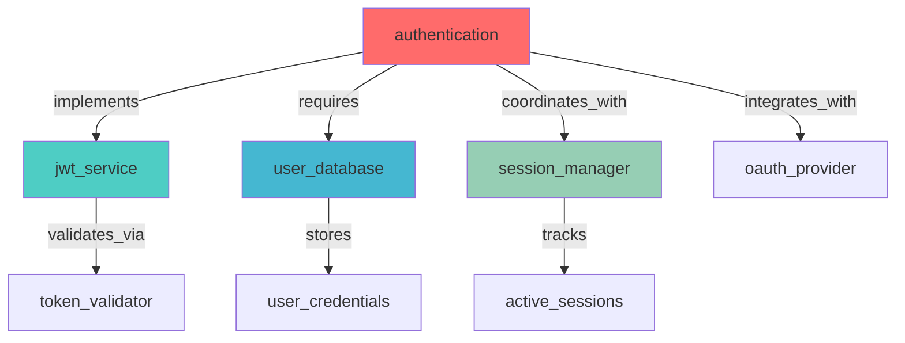

# /sh:memory - Memory Coordination Tracking - Full Documentation

> This is the complete reference loaded on-demand (Tier 2)

# /sh:memory - Memory Coordination Tracking

## Purpose

Track, analyze, and optimize memory coordination patterns, revealing how knowledge evolves and is utilized throughout Shannon operations for improved efficiency and insight generation.

**Core Objective**: Transform memory from passive storage into active intelligence by tracking usage patterns, identifying optimization opportunities, and measuring coordination effectiveness.

---

## Command Metadata

```yaml
command: /sh:memory
aliases: [shannon:mem, shannon:track]
category: Memory Management
sub_agent: MEMORY_CURATOR
mcp_servers:
  primary: Serena
  secondary: Sequential
tools:
  - mcp__memory__create_entities
  - mcp__memory__create_relations
  - mcp__memory__add_observations
  - mcp__memory__search_nodes
  - mcp__memory__read_graph
  - mcp__memory__open_nodes
outputs:
  - Memory evolution tracking
  - Pattern analysis reports
  - Graph visualizations
  - Optimization recommendations
  - Health metrics
```

---

## Usage Patterns

### Basic Usage
```bash
# Track specific entity
/sh:memory track authentication

# Analyze all patterns
/sh:memory pattern

# Visualize memory graph
/sh:memory visualize

# Get optimization suggestions
/sh:memory optimize

# Show statistics
/sh:memory stats
```

### Context-Aware Usage
```bash
# During development
User: "How is the authentication context evolving?"
Response: /sh:memory track authentication
→ Shows observation accumulation
→ Relationship formation over time
→ Access frequency patterns

# After wave completion
User: "What patterns emerged during implementation?"
Response: /sh:memory pattern
→ Entity clustering analysis
→ Relationship type distribution
→ Evolution trajectories

# Performance optimization
User: "Is memory being used efficiently?"
Response: /sh:memory optimize
→ Identifies redundant entities
→ Suggests relationship consolidation
→ Recommends observation pruning
```

---

## Memory Actions

### TRACK - Entity Evolution Tracking

**Purpose**: Monitor how specific entities evolve over time

**What It Monitors**:
```yaml
evolution_metrics:
  observation_accumulation:
    - Rate of new observations
    - Observation quality over time
    - Content diversity
  
  relationship_formation:
    - New relationships created
    - Relationship strength changes
    - Network position evolution
  
  context_building:
    - How entity contributes to understanding
    - Usage in different contexts
    - Cross-entity references
  
  access_frequency:
    - How often entity is accessed
    - Access patterns (when and why)
    - Usage efficiency
```

**Example**:
```bash
/sh:memory track authentication

# Output:
📊 ENTITY EVOLUTION: authentication
━━━━━━━━━━━━━━━━━━━━━━━━━━━━━━━━━━━━━━━━━━━━━━━━━━━━━━━━━

**Timeline**:
Day 1: Entity created with 3 observations
Day 2: +5 observations, 2 relationships added
Day 3: +12 observations, 4 relationships added (Current)

**Observations** (20 total):
- Early (1-5): Basic requirements and design decisions
- Middle (6-15): Implementation details and challenges
- Recent (16-20): Performance optimization, security hardening

**Relationships** (6 total):
- implements → jwt_service
- requires → user_database
- coordinates_with → session_manager
- validates_via → token_validator
- integrates_with → oauth_provider
- monitored_by → security_scanner

**Access Patterns**:
- Total accesses: 47
- Peak: Phase 2 implementation (23 accesses)
- Recent: 5 accesses this session
- Efficiency: 0.76 (good reuse)

**Health**: ✅ Healthy evolution (balanced growth)
```

### PATTERN - Memory Usage Analysis

**Purpose**: Analyze overall memory coordination patterns

**What It Analyzes**:
```yaml
pattern_dimensions:
  entity_clustering:
    - How entities group together
    - Community detection
    - Cluster strength
  
  relationship_distribution:
    - Types of relationships used
    - Relationship density
    - Network topology
  
  access_patterns:
    - Sequential access chains
    - Parallel access patterns
    - Hot/cold entity distribution
  
  evolution_trajectories:
    - Growth patterns over time
    - Maturation indicators
    - Stagnation detection
```

**Example**:
```bash
/sh:memory pattern

# Output:
📈 MEMORY PATTERN ANALYSIS
━━━━━━━━━━━━━━━━━━━━━━━━━━━━━━━━━━━━━━━━━━━━━━━━━━━━━━━━━

**Entity Clustering**:
Cluster 1: Authentication (8 entities) - Dense, well-connected
Cluster 2: Database (5 entities) - Moderate connectivity  
Cluster 3: UI Components (12 entities) - Sparse connections
Orphans: 3 entities with no relationships

**Relationship Distribution**:
- implements: 23 (32%)
- requires: 18 (25%)
- coordinates_with: 15 (21%)
- validates_via: 8 (11%)
- integrates_with: 8 (11%)

**Access Patterns**:
🔥 Hot entities (>20 accesses): authentication, user, database
❄️  Cold entities (<5 accesses): legacy_payment, old_session
📊 Access distribution: 80/20 rule (20% entities = 80% accesses)

**Evolution Trajectories**:
📈 Growing: authentication (+15 obs/day), api_gateway (+8/day)
➡️  Stable: database (±2 obs/day)
📉 Declining: legacy_session (-3 obs/day, candidate for pruning)

**Coordination Effectiveness**: 0.78 (Good)
```

### VISUALIZE - Graph Visualization

**Purpose**: Create visual representation of memory graph

**Output Formats**:
- Mermaid diagrams
- Network graphs
- Evolution timelines
- Access heatmaps

**Example**:
```bash
/sh:memory visualize

# Output:
🎨 MEMORY GRAPH VISUALIZATION
━━━━━━━━━━━━━━━━━━━━━━━━━━━━━━━━━━━━━━━━━━━━━━━━━━━━━━━━━



**Legend**:
🔴 Hot (>20 accesses) | 🟡 Warm (10-20) | 🟢 Cool (5-10) | ⚪ Cold (<5)

**Access Heatmap**:
authentication: ████████████████████░ 95%
user_database:  ████████████░░░░░░░░░ 60%
jwt_service:    ██████████░░░░░░░░░░░ 50%
legacy_payment: █░░░░░░░░░░░░░░░░░░░░  5%
```

### OPTIMIZE - Optimization Recommendations

**Purpose**: Identify and suggest memory improvements

**Optimization Types**:
```yaml
redundancy_elimination:
  - Merge similar entities
  - Consolidate duplicate observations
  - Remove unnecessary relationships

relationship_strengthening:
  - Add missing critical relationships
  - Improve relationship types
  - Create shortcuts for frequent paths

observation_pruning:
  - Remove stale observations
  - Archive historical data
  - Focus on recent/relevant

access_pattern_improvement:
  - Optimize frequent access paths
  - Pre-load commonly used clusters
  - Cache hot entities
```

**Example**:
```bash
/sh:memory optimize

# Output:
💡 MEMORY OPTIMIZATION RECOMMENDATIONS
━━━━━━━━━━━━━━━━━━━━━━━━━━━━━━━━━━━━━━━━━━━━━━━━━━━━━━━━━

**High Impact** 🔴:
1. **Merge Redundant Entities**
   - "user_auth" + "authentication" → Single "authentication" entity
   - Impact: Reduce confusion, improve access efficiency
   - Effort: Low (automated merge)

2. **Add Critical Relationship**
   - authentication →[validates_via]→ rate_limiter (MISSING)
   - Impact: Complete security context
   - Effort: Low (single relationship)

**Medium Impact** 🟡:
3. **Prune Stale Observations**
   - "legacy_payment" has 45 observations, 40 are >30 days old
   - Impact: Reduce noise, focus on relevant
   - Effort: Low (automated pruning with review)

4. **Create Access Shortcut**
   - Current: auth → user → profile → display (4 hops)
   - Optimize: auth → display (direct relationship)
   - Impact: Faster navigation, reduced token usage

**Low Impact** 🟢:
5. **Archive Cold Entities**
   - 3 entities with <2 accesses in 30 days
   - Impact: Cleaner graph, minimal performance gain

**Estimated Gains**:
- Coordination score: 0.78 → 0.88 (+13%)
- Access efficiency: 0.71 → 0.82 (+15%)
- Token usage: -10% (reduced graph traversal)
```

### STATS - Memory Statistics

**Purpose**: Display comprehensive memory metrics

**Example**:
```bash
/sh:memory stats

# Output:
📊 MEMORY STATISTICS
━━━━━━━━━━━━━━━━━━━━━━━━━━━━━━━━━━━━━━━━━━━━━━━━━━━━━━━━━

**Graph Size**:
- Total Entities: 42
- Total Relations: 78
- Total Observations: 247
- Avg Observations/Entity: 5.9

**Growth Metrics**:
- Entities added (7 days): +12 (1.7/day)
- Relations added (7 days): +23 (3.3/day)
- Observations added (7 days): +89 (12.7/day)

**Access Distribution**:
- Hot entities (>20 accesses): 4 (9.5%)
- Warm entities (10-20): 8 (19%)
- Cool entities (5-10): 12 (28.6%)
- Cold entities (<5): 18 (42.9%)

**Coordination Score**: 0.78
- Access efficiency: 0.81
- Pattern consistency: 0.76
- Evolution coherence: 0.77

**Health Status**: ✅ HEALTHY
- Entity/relation ratio: 0.54 (optimal: 0.4-0.6)
- Observation freshness: 87% within 7 days
- Access distribution: Following 80/20 rule
- Evolution consistency: Steady growth
```

---

## Execution Flow

### Step 1: Activate MEMORY_CURATOR

**Sub-Agent Activation**:
```python
# Activate memory analysis specialist
activate_agent("MEMORY_CURATOR")

# Agent characteristics:
# - Pattern recognition for memory usage
# - Evolution trajectory analysis
# - Optimization recommendation engine
# - Health metric calculation
```

### Step 2: Parse Action

**Action Routing**:
```python
action = parse_action(command)  # track, pattern, visualize, optimize, stats
params = parse_parameters(command)

if action == "track":
    execute_track_entity(params.get("entity"))
elif action == "pattern":
    execute_pattern_analysis()
elif action == "visualize":
    execute_visualization()
elif action == "optimize":
    execute_optimization_analysis()
elif action == "stats":
    execute_statistics()
```

### Step 3: Query Memory Graph

**Data Collection**:
```python
# Read complete memory graph
full_graph = read_graph()

# Extract components
entities = full_graph["entities"]
relations = full_graph["relations"]

# Build access log (from tracking)
access_log = load_access_history()

# Calculate metrics
metrics = calculate_memory_metrics(entities, relations, access_log)
```

### Step 4: Execute Analysis

**Pattern Recognition with Sequential Thinking**:
```python
# Use Sequential MCP for complex pattern analysis
pattern_analysis = sequentialthinking(
    thought="Analyzing memory usage patterns. Observation 1: Entity clustering shows...",
    thoughtNumber=1,
    totalThoughts=8,
    nextThoughtNeeded=True
)

# Identify patterns
clusters = identify_entity_clusters(entities, relations)
hot_paths = identify_frequent_traversals(access_log)
evolution = analyze_temporal_evolution(entities)
```

### Step 5: Generate Output

**Report Assembly**:
```python
# Build output based on action
if action == "track":
    output = generate_evolution_report(entity, timeline)
elif action == "pattern":
    output = generate_pattern_report(clusters, distribution, trajectories)
elif action == "visualize":
    output = generate_mermaid_diagram(entities, relations, access_log)
elif action == "optimize":
    output = generate_optimization_recommendations(analysis)
elif action == "stats":
    output = generate_statistics_dashboard(metrics)

# Display
display(output)
```

---

## Sub-Agent Integration

### MEMORY_CURATOR Role

**Specialization**: Memory pattern analysis and optimization

**Responsibilities**:
1. **Evolution Tracking**: Monitor entity and relationship development
2. **Pattern Recognition**: Identify usage patterns and trends
3. **Health Monitoring**: Calculate coordination effectiveness metrics
4. **Optimization**: Recommend improvements to memory structure
5. **Visualization**: Create clear graph representations

**Agent Characteristics**:
```yaml
personality: Analytical, optimization-focused, pattern-oriented
communication_style: Data-driven insights with visual aids
focus_areas:
  - Memory usage efficiency
  - Pattern evolution tracking
  - Coordination optimization
  - Health monitoring
strengths:
  - Complex graph analysis
  - Pattern recognition
  - Metric calculation
  - Optimization strategies
```

---

## Integration with Shannon Commands

### Related Commands

**Memory Consumers**:
- `/sh:wave` - Creates memory during execution
- `/sh:analyze` - Queries memory for context
- `/sh:checkpoint` - Includes memory snapshots

**Memory Management**:
- `/sh:memory` - Analyzes and optimizes
- `/sh:status` - Shows memory health

### Workflow Integration

```bash
# Memory-driven development
/sh:wave adaptive Build authentication
# [Wave creates entities during execution]
/sh:memory track authentication  # Track evolution
/sh:memory pattern               # Analyze patterns
/sh:memory optimize              # Get recommendations
# [Apply optimizations]
/sh:memory stats                 # Verify improvements
```

---

## Technical Implementation

### Coordination Score Calculation

```python
def calculate_coordination_score(access_log: list, entities: list, relations: list) -> float:
    """
    Calculate memory coordination effectiveness score
    
    Formula: (access_efficiency × pattern_consistency × evolution_coherence)
    Range: 0.0 to 1.0
    Target: >= 0.7
    """
    # Access efficiency: unique accesses vs total accesses
    unique_accesses = len(set([log["entity"] for log in access_log]))
    total_accesses = len(access_log)
    access_efficiency = unique_accesses / total_accesses if total_accesses > 0 else 0
    
    # Pattern consistency: predictability of access patterns
    pattern_consistency = analyze_pattern_predictability(access_log)
    
    # Evolution coherence: logical progression of entity development
    evolution_coherence = analyze_evolution_logic(entities)
    
    # Combined score
    coordination_score = (
        access_efficiency * 0.33 +
        pattern_consistency * 0.33 +
        evolution_coherence * 0.34
    )
    
    return round(coordination_score, 2)
```

### Memory Health Assessment

```python
def assess_memory_health(entities: list, relations: list, access_log: list) -> dict:
    """
    Calculate memory health indicators
    """
    # Entity/relation ratio (optimal: 0.4-0.6)
    entity_relation_ratio = len(relations) / len(entities) if len(entities) > 0 else 0
    
    # Observation freshness (% within 7 days)
    recent_observations = count_recent_observations(entities, days=7)
    total_observations = count_total_observations(entities)
    freshness = recent_observations / total_observations if total_observations > 0 else 0
    
    # Access distribution (should follow 80/20 rule)
    access_counts = calculate_access_distribution(access_log)
    follows_pareto = check_pareto_distribution(access_counts)
    
    # Evolution consistency (steady vs erratic growth)
    evolution_rate = calculate_evolution_rate(entities)
    is_consistent = check_consistency(evolution_rate)
    
    return {
        "entity_relation_ratio": entity_relation_ratio,
        "observation_freshness": freshness,
        "follows_pareto": follows_pareto,
        "evolution_consistent": is_consistent,
        "overall_health": calculate_overall_health(...)
    }
```

---

## Examples

### Example 1: Pattern Analysis

**Input**:
```bash
/sh:memory pattern
```

**Output**: (See comprehensive pattern output above)

### Example 2: Visualization

**Input**:
```bash
/sh:memory visualize
```

**Output**: (See Mermaid diagram above)

### Example 3: Tracking Specific Entity

**Input**:
```bash
/sh:memory track user_service
```

**Output**: (See evolution tracking output above)

---

## Success Criteria

**Memory operations succeed when**:
- ✅ All patterns accurately identified
- ✅ Metrics calculated correctly
- ✅ Visualizations clearly represent structure
- ✅ Optimization recommendations actionable
- ✅ Health assessment reflects true state
- ✅ Evolution tracking shows meaningful trends

**Memory operations fail if**:
- ❌ Pattern analysis incomplete
- ❌ Metrics calculation errors
- ❌ Visualizations misleading
- ❌ Recommendations not actionable
- ❌ Health metrics inaccurate

---

## Summary

`/sh:memory` provides deep memory intelligence through:

- **Track**: Monitor entity evolution and usage patterns
- **Pattern**: Analyze overall coordination effectiveness
- **Visualize**: Create graph representations  
- **Optimize**: Generate improvement recommendations
- **Stats**: Display comprehensive health metrics

**Key Principle**: Memory becomes intelligent when we track not just what is stored, but HOW it evolves and is utilized to build understanding.
