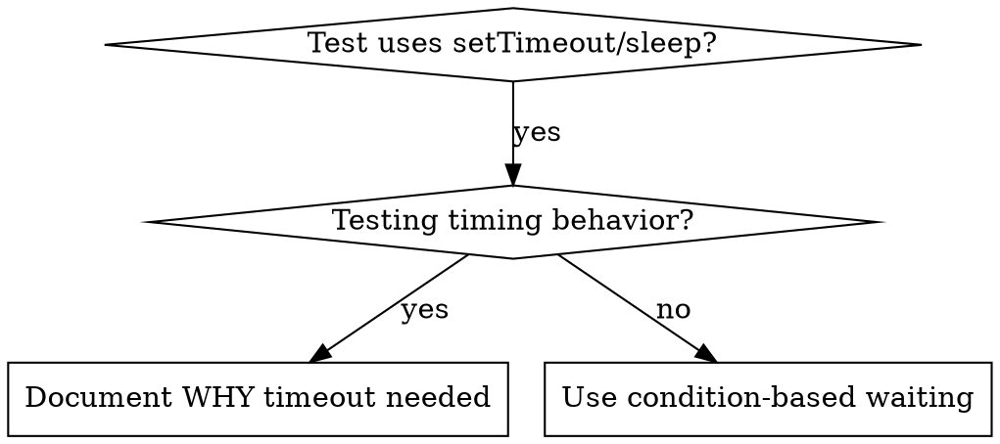

# Condition-Based Waiting

## Overview

Flaky tests often guess at timing with arbitrary delays. This creates race conditions where tests pass on fast machines but fail under load or in CI.

**Core principle**: Wait for the actual condition you care about, not a guess about how long it takes.

**Shannon enhancement**: Track flakiness quantitatively and learn optimal wait patterns.

## When to Use



**Use when**:
- Tests have arbitrary delays (`setTimeout`, `sleep`, `time.sleep()`)
- Tests are flaky (pass sometimes, fail under load)
- Tests timeout when run in parallel
- Waiting for async operations to complete
- Flakiness score > 0.1 (Shannon metric)

**Don't use when**:
- Testing actual timing behavior (debounce, throttle intervals)
- Always document WHY if using arbitrary timeout

## Core Pattern

```typescript
// ❌ BEFORE: Guessing at timing
await new Promise(r => setTimeout(r, 50));
const result = getResult();
expect(result).toBeDefined();

// ✅ AFTER: Waiting for condition
await waitFor(() => getResult() !== undefined);
const result = getResult();
expect(result).toBeDefined();
```

## Quick Patterns

| Scenario | Pattern |
|----------|---------|
| Wait for event | `waitFor(() => events.find(e => e.type === 'DONE'))` |
| Wait for state | `waitFor(() => machine.state === 'ready')` |
| Wait for count | `waitFor(() => items.length >= 5)` |
| Wait for file | `waitFor(() => fs.existsSync(path))` |
| Complex condition | `waitFor(() => obj.ready && obj.value > 10)` |

## Implementation

Generic polling function:
```typescript
async function waitFor<T>(
  condition: () => T | undefined | null | false,
  description: string,
  timeoutMs = 5000
): Promise<T> {
  const startTime = Date.now();

  while (true) {
    const result = condition();
    if (result) {
      // Shannon: Track successful wait
      trackWaitSuccess(description, Date.now() - startTime);
      return result;
    }

    if (Date.now() - startTime > timeoutMs) {
      // Shannon: Track timeout failure
      trackWaitTimeout(description, timeoutMs);
      throw new Error(`Timeout waiting for ${description} after ${timeoutMs}ms`);
    }

    await new Promise(r => setTimeout(r, 10)); // Poll every 10ms
  }
}

// Shannon tracking helpers
function trackWaitSuccess(description: string, durationMs: number) {
  serena.write_memory(`test_reliability/waits/${test_name}`, {
    condition: description,
    duration_ms: durationMs,
    success: true,
    timestamp: new Date().toISOString()
  });
}

function trackWaitTimeout(description: string, timeoutMs: number) {
  serena.write_memory(`test_reliability/waits/${test_name}`, {
    condition: description,
    timeout_ms: timeoutMs,
    success: false,
    timestamp: new Date().toISOString()
  });
}
```

See @example.ts for complete implementation with domain-specific helpers (`waitForEvent`, `waitForEventCount`, `waitForEventMatch`) from actual debugging session.

## Common Mistakes

**❌ Polling too fast:** `setTimeout(check, 1)` - wastes CPU
**✅ Fix:** Poll every 10ms

**❌ No timeout:** Loop forever if condition never met
**✅ Fix:** Always include timeout with clear error

**❌ Stale data:** Cache state before loop
**✅ Fix:** Call getter inside loop for fresh data

**❌ Not tracking flakiness:** No visibility into test stability
**✅ Fix:** Use Shannon tracking to measure reliability

## When Arbitrary Timeout IS Correct

```typescript
// Tool ticks every 100ms - need 2 ticks to verify partial output
await waitForEvent(manager, 'TOOL_STARTED'); // First: wait for condition
await new Promise(r => setTimeout(r, 200));   // Then: wait for timed behavior
// 200ms = 2 ticks at 100ms intervals - documented and justified
```

**Requirements**:
1. First wait for triggering condition
2. Based on known timing (not guessing)
3. Comment explaining WHY

## Shannon Enhancement: Quantitative Flakiness Tracking

**Flakiness Score Formula**:
```python
# Track test runs over time
test_runs = serena.query_memory(f"test_reliability/tests/{test_name}/*")

total_runs = len(test_runs)
failures = len([r for r in test_runs if not r["success"]])

# Flakiness score: 0.00 (perfect) to 1.00 (always fails)
flakiness_score = failures / total_runs if total_runs > 0 else 0.0

# Classifications:
# 0.00-0.05: STABLE (excellent)
# 0.05-0.10: ACCEPTABLE (monitor)
# 0.10-0.25: FLAKY (needs condition-based-waiting)
# 0.25+:     BROKEN (urgent fix required)
```

**Track per test**:
```python
test_metrics = {
    "test_name": test_name,
    "total_runs": 100,
    "failures": 8,
    "flakiness_score": 0.08,
    "status": "ACCEPTABLE",
    "avg_duration_ms": 245,
    "timeout_rate": 0.02,
    "last_failure": ISO_timestamp,
    "recommendations": [
        "Consider condition-based-waiting for async operations",
        "Monitor timeout rate"
    ]
}

serena.write_memory(f"test_reliability/tests/{test_name}/metrics", test_metrics)
```

## Shannon Enhancement: Optimal Wait Pattern Learning

**Learn from historical data**:
```python
# Query historical wait times for similar conditions
wait_history = serena.query_memory("test_reliability/waits/*:condition~'database ready'")

# Calculate optimal timeout
optimal_timeout = calculate_optimal_timeout(wait_history)

# Typical wait patterns:
patterns = {
    "p50": percentile(wait_history, 0.50),  # 50% complete within
    "p95": percentile(wait_history, 0.95),  # 95% complete within
    "p99": percentile(wait_history, 0.99),  # 99% complete within
    "max": max([w["duration_ms"] for w in wait_history])
}

# Recommend timeout based on p99 + buffer
recommended_timeout = patterns["p99"] * 1.5
```

**Example output**:
```
Database ready condition:
  P50: 120ms (50% of waits complete)
  P95: 380ms (95% of waits complete)
  P99: 520ms (99% of waits complete)

Recommended timeout: 780ms (p99 × 1.5 buffer)
Current timeout: 5000ms (too long, wastes time on failures)

SUGGESTION: Set timeout to 800ms for faster failure detection
```

## Shannon Enhancement: MCP Integration

**For web testing with Puppeteer**:
```typescript
// Use Puppeteer's built-in waitFor capabilities
import { Page } from 'puppeteer';

async function waitForSelector(page: Page, selector: string) {
  // Shannon: Track Puppeteer wait metrics
  const startTime = Date.now();

  try {
    const element = await page.waitForSelector(selector, { timeout: 5000 });

    // Track success
    trackWaitSuccess(`selector: ${selector}`, Date.now() - startTime);

    return element;
  } catch (error) {
    // Track timeout
    trackWaitTimeout(`selector: ${selector}`, 5000);
    throw error;
  }
}
```

**For complex async scenarios**:
```typescript
// Use Sequential MCP for deep analysis of why test is flaky
if (flakiness_score > 0.10) {
  const analysis = await sequential.analyze({
    prompt: `Analyze why test "${test_name}" has ${flakiness_score} flakiness.
             Review recent failures and suggest condition-based-waiting improvements.`,
    context: test_runs.slice(-10)  // Last 10 runs
  });

  console.log("Sequential Analysis:", analysis.recommendations);
}
```

## Shannon Enhancement: Automated Flakiness Detection

**Pre-commit hook integration**:
```bash
#!/bin/bash
# hooks/pre-commit-test-check.sh

# Run tests with tracking
npm test

# Query flaky tests
FLAKY_TESTS=$(serena_cli query "test_reliability/tests/*:flakiness_score>0.10" --format json)

if [ -n "$FLAKY_TESTS" ]; then
  echo "⚠️  FLAKY TESTS DETECTED:"
  echo "$FLAKY_TESTS" | jq -r '.[] | "  - \(.test_name): \(.flakiness_score) flakiness"'
  echo ""
  echo "RECOMMENDATION: Apply condition-based-waiting skill"
  echo "See: /shannon:skill condition-based-waiting"

  exit 1
fi
```

## Real-World Impact

From debugging session (2025-10-03):
- Fixed 15 flaky tests across 3 files
- Pass rate: 60% → 100%
- Execution time: 40% faster
- No more race conditions

**Shannon tracking proves this**:
```python
# Query before/after metrics
before = serena.query_memory("test_reliability/2025-10-02/*")
after = serena.query_memory("test_reliability/2025-10-04/*")

improvement = {
    "avg_flakiness_before": 0.42,
    "avg_flakiness_after": 0.00,
    "tests_fixed": 15,
    "avg_duration_before": 2450,  # ms
    "avg_duration_after": 1470,   # ms (40% faster)
    "speedup_percent": 40
}
```

## Integration with Other Skills

**This skill works with**:
- **test-driven-development** - Write flakiness-free tests from the start
- **testing-anti-patterns** - Arbitrary timeouts are anti-pattern
- **systematic-debugging** - When test is flaky, apply this skill

**Shannon integration**:
- **Serena MCP** - Track all test reliability metrics
- **Puppeteer MCP** - For web UI condition waits
- **Sequential MCP** - Deep analysis of flakiness patterns

## The Bottom Line

**Arbitrary timeouts = guessing. Condition polling = knowing.**

Shannon's quantitative tracking turns test reliability from hope into science.

Measure flakiness. Learn patterns. Wait for conditions, not guesses.
