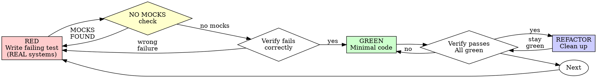

# Test-Driven Development (TDD)

## Overview

Write the test first using REAL systems. Watch it fail. Write minimal code to pass.

**Core principle**: If you didn't watch the test fail against a real system, you don't know if it tests the right thing.

**Violating the letter of the rules is violating the spirit of the rules.**

## Shannon Enhancement: NO MOCKS

**This is NOT optional**. Shannon TDD combines:
1. Superpowers TDD discipline (RED-GREEN-REFACTOR)
2. Shannon NO MOCKS philosophy (real systems only)

**Result**: Tests that actually prove software works in production.

## When to Use

**Always**:
- New features
- Bug fixes
- Refactoring
- Behavior changes

**Exceptions (ask your human partner)**:
- Throwaway prototypes
- Generated code
- Configuration files

Thinking "skip TDD just this once"? Stop. That's rationalization.

## The Iron Law

```
NO PRODUCTION CODE WITHOUT A FAILING TEST FIRST
NO MOCKS IN TESTS (Shannon requirement)
```

Write code before the test? Delete it. Start over.

Use mocks in tests? Delete them. Use real systems.

**No exceptions**:
- Don't keep it as "reference"
- Don't "adapt" it while writing tests
- Don't look at it
- Delete means delete

Implement fresh from tests. Period.

## Red-Green-Refactor



### RED - Write Failing Test (with REAL systems)

Write one minimal test showing what should happen using REAL systems.

<Good>
```typescript
// ✅ GOOD: Real browser, real DOM
test('user can submit contact form', async () => {
  const browser = await puppeteer.launch();
  const page = await browser.newPage();

  await page.goto('http://localhost:3000/contact');
  await page.type('#email', 'test@example.com');
  await page.type('#message', 'Hello');
  await page.click('button[type="submit"]');

  const successMsg = await page.$eval('.success', el => el.textContent);

  expect(successMsg).toBe('Message sent!');
  await browser.close();
});
```
Clear name, tests real browser, one thing
</Good>

<Bad>
```typescript
// ❌ BAD: Mocked DOM, not real browser
test('form submission works', async () => {
  const mockSubmit = jest.fn();
  const { getByRole } = render(<ContactForm onSubmit={mockSubmit} />);

  fireEvent.click(getByRole('button'));

  expect(mockSubmit).toHaveBeenCalled();
});
```
Uses mocking, tests mock not real system
</Bad>

**Shannon requirement: NO MOCKS**

**Real systems to use**:
- ✅ Puppeteer/Playwright for web (`await page.goto(...)`)
- ✅ iOS Simulator MCP for mobile (`ios_simulator.launch_app(...)`)
- ✅ Real database (`await db.connect(real_connection_string)`)
- ✅ Real HTTP (`await fetch(actual_url)`)
- ✅ Real file system (`fs.readFile(actual_path)`)

**NOT acceptable**:
- ❌ `jest.mock('puppeteer')`
- ❌ `@testing-library/react` with mocked DOM
- ❌ `unittest.mock.patch(...)`
- ❌ `sinon.stub(...)`
- ❌ In-memory fake database
- ❌ Mocked fetch/HTTP client

**Requirements**:
- One behavior per test
- Clear name describing behavior
- Real systems (browser, database, HTTP, filesystem)
- No mocks, stubs, or fakes

### Verify RED - Watch It Fail (Against Real System)

**MANDATORY. Never skip.**

```bash
npm test path/to/test.test.ts
```

Confirm:
- Test fails (not errors)
- Failure message is expected
- Fails because feature missing (not typos)
- **Fails against REAL system** (not mock)

**Test passes?** You're testing existing behavior. Fix test.

**Test errors?** Fix error, re-run until it fails correctly.

**Test uses mocks?** Delete mocks. Use real systems.

### NO MOCKS Verification

**Shannon checkpoint: Before proceeding to GREEN phase**

Scan test file for mock violations:
```bash
# Check for mock imports
grep -r "import.*mock\|from.*mock\|jest.mock" test/file.test.ts

# If violations found → DELETE MOCKS, rewrite with real systems
```

**Common violations and fixes**:

| Violation | Real System Alternative |
|-----------|------------------------|
| `jest.mock('database')` | Use real test database |
| `@testing-library/react` | Use Puppeteer against real browser |
| `fetch = jest.fn()` | Use real HTTP with test API |
| `fs = mockFs()` | Use real filesystem with temp directory |
| `sinon.stub(auth)` | Use real auth with test credentials |

**Can't use real system?** Ask your partner. Mocking is NEVER the answer in Shannon.

### GREEN - Minimal Code

Write simplest code to pass the test.

<Good>
```typescript
async function submitContactForm(email: string, message: string) {
  await db.query(
    'INSERT INTO contact_messages (email, message) VALUES ($1, $2)',
    [email, message]
  );
  return { success: true, message: 'Message sent!' };
}
```
Just enough to pass, uses real database
</Good>

<Bad>
```typescript
async function submitContactForm(
  email: string,
  message: string,
  options?: {
    retries?: number;
    timeout?: number;
    onSuccess?: (id: number) => void;
    onError?: (err: Error) => void;
  }
) {
  // YAGNI - over-engineered
}
```
Over-engineered, features not tested
</Bad>

Don't add features, refactor other code, or "improve" beyond the test.

### Verify GREEN - Watch It Pass (Against Real System)

**MANDATORY.**

```bash
npm test path/to/test.test.ts
```

Confirm:
- Test passes
- Other tests still pass
- Output pristine (no errors, warnings)
- **Uses real systems** (verified by reading test code)

**Test fails?** Fix code, not test.

**Other tests fail?** Fix now.

**Uses mocks?** You violated NO MOCKS. Start over.

### REFACTOR - Clean Up

After green only:
- Remove duplication
- Improve names
- Extract helpers

Keep tests green. Don't add behavior.

**Still NO MOCKS**: Refactoring cannot introduce mocking.

### Repeat

Next failing test for next feature.

## Good Tests (Shannon Style)

| Quality | Good | Bad |
|---------|------|-----|
| **Minimal** | One thing. "and" in name? Split it. | `test('validates email and domain and whitespace')` |
| **Clear** | Name describes behavior | `test('test1')` |
| **Real Systems** | Uses Puppeteer/actual DB/real HTTP | Uses mocks, stubs, fakes |
| **Shows intent** | Demonstrates desired API | Obscures what code should do |

## Shannon Integration: Validation Gates

**TDD is part of Shannon's 3-tier validation**:

### Tier 1: Flow Validation
TDD tests written, code compiles

### Tier 2: Artifact Validation
TDD tests pass (RED-GREEN cycle verified)

### Tier 3: Functional Validation
**TDD tests use REAL systems** (NO MOCKS)

**Reporting format**:
```markdown
## TDD Verification

✅ RED Phase: Test failed (feature missing)
   Real system used: Puppeteer (Chrome browser)
   Failure: Cannot find element '.success'

✅ GREEN Phase: Test passed (feature implemented)
   Real system used: Puppeteer (Chrome browser)
   Success: Message sent successfully

✅ NO MOCKS: Verified
   Scan result: 0 mock imports found
   Real systems: Puppeteer, PostgreSQL, Real HTTP

**TDD Cycle**: Complete
**Validation Tier**: 3/3 (Functional - Real Systems)
```

## Why Order Matters

**"I'll write tests after to verify it works"**

Tests written after code pass immediately. Passing immediately proves nothing:
- Might test wrong thing
- Might test implementation, not behavior
- Might miss edge cases you forgot
- You never saw it catch the bug

Test-first forces you to see the test fail, proving it actually tests something.

**"I already manually tested all the edge cases"**

Manual testing is ad-hoc. You think you tested everything but:
- No record of what you tested
- Can't re-run when code changes
- Easy to forget cases under pressure
- "It worked when I tried it" ≠ comprehensive

Automated tests with real systems are systematic. They run the same way every time.

**"Deleting X hours of work is wasteful"**

Sunk cost fallacy. The time is already gone. Your choice now:
- Delete and rewrite with TDD + real systems (X more hours, high confidence)
- Keep it and add tests after (30 min, low confidence, likely bugs, probably uses mocks)

The "waste" is keeping code you can't trust. Working code without real tests is technical debt.

## Shannon-Specific: Real System Patterns

### Web Testing (Puppeteer/Playwright)

**Required for**: Any web UI, forms, navigation, rendering

**Pattern**:
```typescript
describe('User Registration Flow', () => {
  let browser: Browser;
  let page: Page;

  beforeEach(async () => {
    browser = await puppeteer.launch();
    page = await browser.newPage();
  });

  afterEach(async () => {
    await browser.close();
  });

  test('user can register with valid email', async () => {
    await page.goto('http://localhost:3000/register');

    await page.type('#email', 'newuser@example.com');
    await page.type('#password', 'SecurePass123!');
    await page.click('button[type="submit"]');

    await page.waitForSelector('.welcome-message');
    const welcomeText = await page.$eval('.welcome-message', el => el.textContent);

    expect(welcomeText).toContain('Welcome, newuser@example.com');
  });
});
```

**MCP Integration**: Use Puppeteer MCP if available for better integration.

### Mobile Testing (iOS Simulator)

**Required for**: iOS/Android apps, mobile-specific behavior

**Pattern**:
```typescript
import { iosSimulator } from '@mcp/ios-simulator';

describe('Mobile App Launch', () => {
  test('app launches and shows home screen', async () => {
    const app = await iosSimulator.launch({
      appPath: './build/MyApp.app',
      device: 'iPhone 14'
    });

    const screenshot = await app.screenshot();
    const homeButton = await app.findElement({ id: 'home-tab' });

    expect(homeButton.isDisplayed()).toBe(true);

    await app.terminate();
  });
});
```

### Database Testing (Real Database)

**Required for**: Database queries, transactions, migrations

**Pattern**:
```typescript
import { Client } from 'pg';

describe('User Database Operations', () => {
  let db: Client;

  beforeEach(async () => {
    db = new Client({
      host: 'localhost',
      database: 'myapp_test',  // Real test database
      user: 'testuser',
      password: 'testpass'
    });
    await db.connect();

    // Clean test data
    await db.query('TRUNCATE users CASCADE');
  });

  afterEach(async () => {
    await db.end();
  });

  test('creates user with hashed password', async () => {
    const result = await db.query(
      'INSERT INTO users (email, password_hash) VALUES ($1, $2) RETURNING id',
      ['test@example.com', 'hashed_password_here']
    );

    expect(result.rows[0].id).toBeGreaterThan(0);

    const user = await db.query('SELECT * FROM users WHERE email = $1', ['test@example.com']);
    expect(user.rows[0].email).toBe('test@example.com');
  });
});
```

**NOT acceptable**: In-memory SQLite, mocked database, fake database.

### API Testing (Real HTTP)

**Required for**: API endpoints, HTTP clients, external integrations

**Pattern**:
```typescript
describe('API Endpoints', () => {
  const baseURL = 'http://localhost:3001';  // Real test server

  test('GET /users returns user list', async () => {
    const response = await fetch(`${baseURL}/users`);
    const data = await response.json();

    expect(response.status).toBe(200);
    expect(Array.isArray(data)).toBe(true);
  });

  test('POST /users creates new user', async () => {
    const response = await fetch(`${baseURL}/users`, {
      method: 'POST',
      headers: { 'Content-Type': 'application/json' },
      body: JSON.stringify({ email: 'new@example.com' })
    });

    const data = await response.json();

    expect(response.status).toBe(201);
    expect(data.email).toBe('new@example.com');
    expect(data.id).toBeDefined();
  });
});
```

**NOT acceptable**: `jest.mock('fetch')`, `nock()`, mocked HTTP client.

## Common Rationalizations

| Excuse | Reality |
|--------|---------|
| "Too simple to test" | Simple code breaks. Test takes 30 seconds. |
| "I'll test after" | Tests passing immediately prove nothing. |
| "Tests after achieve same goals" | Tests-after = "what does this do?" Tests-first = "what should this do?" |
| "Already manually tested" | Ad-hoc ≠ systematic. No record, can't re-run. |
| "Deleting X hours is wasteful" | Sunk cost fallacy. Keeping unverified code is technical debt. |
| "Keep as reference, write tests first" | You'll adapt it. That's testing after. Delete means delete. |
| "Need to explore first" | Fine. Throw away exploration, start with TDD. |
| "Test hard = design unclear" | Listen to test. Hard to test = hard to use. |
| "TDD will slow me down" | TDD faster than debugging. Pragmatic = test-first. |
| "Manual test faster" | Manual doesn't prove edge cases. You'll re-test every change. |
| "Existing code has no tests" | You're improving it. Add tests for existing code. |
| **"Real systems are too slow"** | **Slow tests > fast mocks that don't prove anything.** |
| **"Mocking is industry standard"** | **Shannon targets mission-critical domains. NO MOCKS.** |
| **"Can't test without mocks"** | **Wrong. Use test database, test browser, test API.** |

## Red Flags - STOP and Start Over

- Code before test
- Test after implementation
- Test passes immediately
- Can't explain why test failed
- Tests added "later"
- Rationalizing "just this once"
- "I already manually tested it"
- "Tests after achieve the same purpose"
- "It's about spirit not ritual"
- "Keep as reference" or "adapt existing code"
- "Already spent X hours, deleting is wasteful"
- "TDD is dogmatic, I'm being pragmatic"
- **"Mocking is faster/easier"**
- **"Industry uses mocks, why not us?"**
- **"Can't test real systems"**
- "This is different because..."

**ALL OF THESE MEAN**: Delete code. Start over with TDD using REAL systems.

## Example: Bug Fix with Real Systems

**Bug**: Empty email accepted in registration

**RED** (Real system test):
```typescript
test('rejects registration with empty email', async () => {
  const browser = await puppeteer.launch();
  const page = await browser.newPage();

  await page.goto('http://localhost:3000/register');

  // Leave email empty
  await page.type('#password', 'SecurePass123!');
  await page.click('button[type="submit"]');

  const errorMessage = await page.$eval('.error', el => el.textContent);

  expect(errorMessage).toBe('Email required');

  await browser.close();
});
```

**Verify RED**:
```bash
$ npm test
FAIL: expected 'Email required', got null (no error shown)
```

**GREEN**:
```typescript
// In registration form component
function handleSubmit() {
  if (!email?.trim()) {
    setError('Email required');
    return;
  }
  // ... rest of registration
}
```

**Verify GREEN**:
```bash
$ npm test
PASS: All tests passed (using real browser)
```

## Verification Checklist

Before marking work complete:

- [ ] Every new function/method has a test
- [ ] Watched each test fail before implementing
- [ ] Each test failed for expected reason (feature missing, not typo)
- [ ] Wrote minimal code to pass each test
- [ ] All tests pass
- [ ] Output pristine (no errors, warnings)
- [ ] **Tests use REAL systems (NO MOCKS)**
- [ ] **Verified NO mock imports in test files**
- [ ] Edge cases and errors covered
- [ ] **Real browser/database/HTTP used**

Can't check all boxes? You skipped TDD or used mocks. Start over.

## Integration with Other Skills

**This skill is prerequisite for**:
- **systematic-debugging** - Phase 4 requires writing failing test first
- **verification-before-completion** - TDD tests are part of Tier 2 validation
- **executing-plans** - Plans should specify TDD for each task

**This skill requires**:
- **NO MOCKS** - Shannon's foundational testing philosophy

**Complementary skills**:
- **defense-in-depth** - TDD at code level, defense-in-depth at validation level
- **root-cause-tracing** - Both enforce thoroughness

## The Bottom Line

```
Production code → test exists and failed first
Test → uses REAL systems (NO MOCKS)
Otherwise → not TDD, not Shannon-compliant
```

No exceptions without your human partner's permission.

**Shannon difference**: Other frameworks allow mocking. Shannon doesn't. Mission-critical domains (Finance, Healthcare, Legal, Security, Aerospace) cannot tolerate tests that don't prove real system behavior.

**Mocks don't fail in production. Real systems do. Test what fails.**

